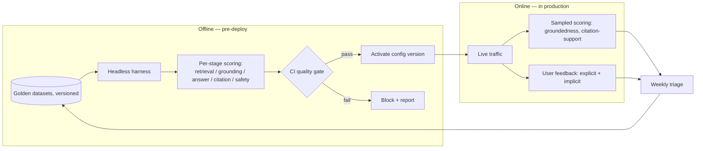
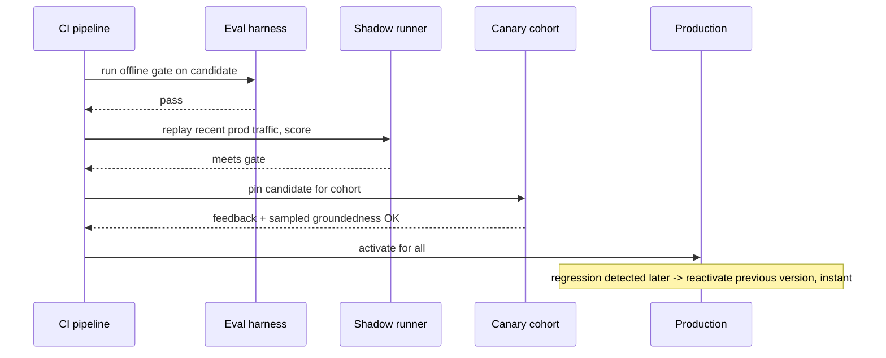
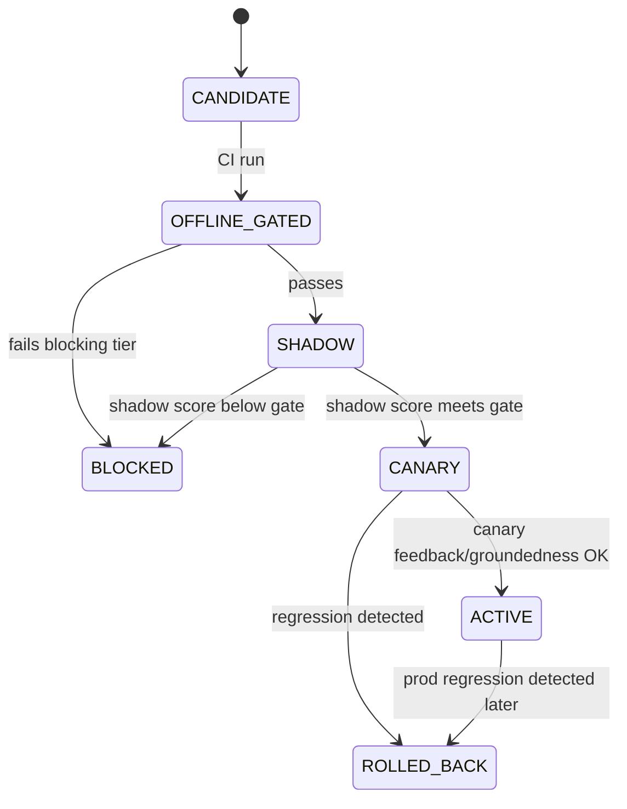

# 04 — The Agent Evaluation + Guardrail Platform

> [Deep-dive set](README.md) · file 4 of 10 · prev: [03 — Agentic Collections](03_agentic_collections.md) · next: [05 — Fraud & Anomaly Detection](05_fraud_anomaly_detection.md)

**Prompt:** *"You own eval for the whole AI platform. Design the system that decides whether a change is safe to ship and keeps catching regressions in production."*

---

## Part A — HLD (High-Level Design)

### 1. Clarify & scope

This has to work **offline** (pre-deploy gate) *and* **online** (in production), and it has to close the loop — production failures should make the offline gate stronger over time, not just get logged and forgotten. This is a generalization of the two-loop eval design I already built end-to-end for a real RAG platform — see [eval-proposal.md](../18_ragapp/eval-proposal.md) — to any agent on the platform.

### 2. Functional requirements

| # | Requirement |
| --- | --- |
| FR1 | Score a candidate config version against a versioned golden dataset before it ships. |
| FR2 | Block a merge/deploy if any blocking metric regresses past threshold. |
| FR3 | Sample production traffic for online quality scoring. |
| FR4 | Route production failures and low-rated turns into new golden rows. |
| FR5 | Support shadow → canary → activate rollout for a new config version, with instant rollback. |

### 3. Non-functional requirements

| NFR | Target | Why |
| --- | --- | --- |
| Gate reliability | 0 false-negative escapes on the blocking tier | A missed regression is the entire point of the gate failing. |
| Judge stability | Judge model/prompt version pinned, recalibrated on a cadence | An uncalibrated judge silently drifts as the underlying model updates. |
| Cost | Online scoring sampled, not 100% of traffic | Scoring cost must stay a fraction of inference cost. |
| Rollback | Instant, no redeploy | A regression in production must be reversible in minutes, not a release cycle. |

### 4. System context — the two-loop model



### 5. Component choices & why

| Component | Choice | Why this, not the obvious alternative |
| --- | --- | --- |
| Scoring granularity | Score **each stage** (retrieval, grounding, answer, citation, safety) independently | A final-answer-only score tells you *that* something broke, not *where* — per-stage scoring makes a regression attributable, not a mystery. |
| Rollout mechanism | Reuse the platform's existing **versioned prompt/config system** for shadow → canary → activate | Zero new infra, and rollback is just "reactivate the previous version" — instant, no deploy. Build-vs-buy answer where "buy" is "reuse what already exists." |
| Judge calibration | LLM-as-judge, calibrated against human labels, version-pinned | An uncalibrated judge drifts as the underlying model updates; pinning + periodic recalibration keeps the score meaningful over months. |
| Golden-set growth | Production failures + low-rated turns feed a **weekly triage → new golden rows** loop | A static golden set decays and stops representing what production actually throws at the system. |
| Safety suite | A **separate** adversarial dataset (injection, PII, jailbreak, abstention) with its own pass bar | Safety failures need a 100%-resisted bar, not an averaged score — folding it into a general metric lets a safety regression hide behind good average quality. |

### 6. Failure modes

- Judge-model drift → recalibrate against human labels on a fixed cadence, not only when someone notices.
- Golden-set staleness → the weekly-triage flywheel is the mitigation, not a one-time curation effort.
- Online-scoring cost blowup → sample (e.g. 5–20% + 100% of negative feedback), never score all traffic at full judge cost.

### 7. Capacity gut-check

At 2,000 QPS platform-wide, scoring even 10% of traffic with an LLM-judge (assume ~2x the cost of the original call) adds ~40% to the judge-model's own inference bill relative to the sampled fraction — small relative to total platform spend, which is exactly why sampling (not 100%) is the right call.

---

## Part B — LLD (Low-Level Design)

### 1. Data model

**`GoldenRow`:**
```json
{
  "id": "gold-0142",
  "namespace": "policies",
  "question": "What is the maximum reimbursable hotel rate under the 2024 policy?",
  "expected_facts": ["$180 per night", "5 nights", "pre-approval"],
  "must_cite": ["report.pdf#page=7"],
  "category": "factual_lookup",
  "unanswerable": false,
  "dataset_version": "goldens@v14"
}
```

**`EvalRun`:**
```json
{
  "run_id": "eval-99231",
  "config_version_candidate": 8,
  "dataset_version": "goldens@v14",
  "scores": {"faithfulness": 0.93, "geval_correctness": 0.86, "citation_support": 0.91, "pii_leakage": 0},
  "gate_result": "pass",
  "commit": "abc123f"
}
```

### 2. API contracts

```text
POST /v1/eval/run
  body: { config_version_candidate, dataset_version }
  -> 200 { run_id, scores, gate_result: "pass"|"block" }

POST /v1/eval/rollout/shadow
  body: { config_version_candidate }
  -> 200, replays recent prod traffic against candidate, no user exposure

POST /v1/eval/rollout/canary
  body: { config_version_candidate, cohort_filter }
  -> 200, pins candidate for the matching cohort

POST /v1/eval/rollout/activate | /rollback
  body: { config_version }
  -> 200, instant — no deploy
```

### 3. Core algorithm — tiered CI gate

```python
BLOCKING = {"faithfulness": 0.90, "geval_correctness": 0.80,
            "answer_relevancy": 0.85, "citation_support": 0.90, "pii_leakage": 0}
WARN = {"retrieval_recall_at_k": 0.85, "latency_p95_regression_pct": 15}

def gate(scores: dict) -> str:
    for metric, threshold in BLOCKING.items():
        if not _meets(scores[metric], threshold):
            return "block"
    for metric, threshold in WARN.items():
        if not _meets(scores[metric], threshold):
            log_warn(metric, scores[metric])   # report, don't block
    return "pass"
```

### 4. Sequence — shadow → canary → activate



### 5. State machine — config-version rollout



### 6. Edge cases

- A metric that's noisy by nature (LLM-judge variance) → require **repeat runs + aggregate**, never gate on a single run's score.
- A golden row becomes stale as the underlying corpus changes (the cited document was updated) → dataset hygiene step flags rows whose `must_cite` no longer resolves, before they silently fail every run.
- Two candidates in flight simultaneously → each gets its own shadow/canary lane; canary cohorts must not overlap, or feedback attribution breaks.

### 7. Extension points

| Change | Where it lands |
| --- | --- |
| New quality dimension | New scorer plugged into the per-stage scoring step; add to `WARN` first, promote to `BLOCKING` once stable. |
| New adversarial category | New rows in the dedicated safety dataset, own pass bar. |
| Per-category gates | Extend `gate()` to look up thresholds by `category` instead of one global set. |
