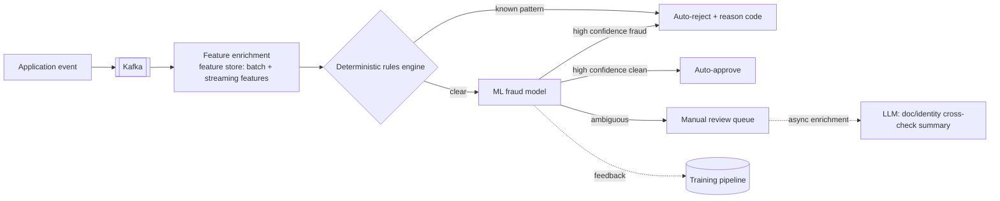
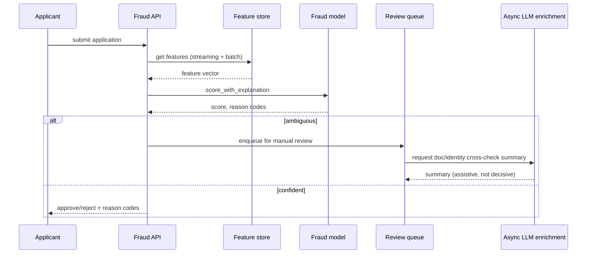
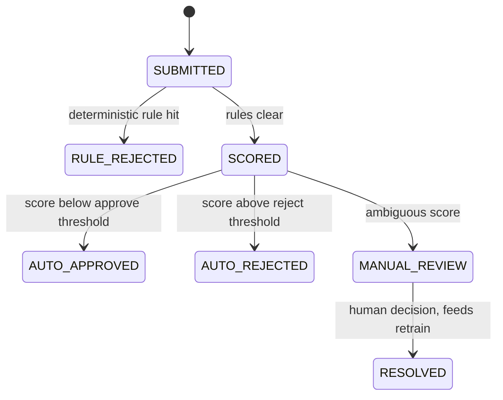

# 05 — Real-Time Fraud & Anomaly Detection for Loan Applications

> [Deep-dive set](README.md) · file 5 of 10 · prev: [04 — Agent Eval + Guardrail Platform](04_agent_eval_guardrail_platform.md) · next: [06 — Prompt-Injection Defense](06_prompt_injection_defense.md)
>
> *Different domain from files 1–4: streaming ML decisioning, not agentic — but still squarely an AI-role system.*

**Prompt:** *"Design a system that scores every incoming loan application for fraud in near-real-time, at scale, and can explain a rejection."*

---

## Part A — HLD (High-Level Design)

### 1. Clarify & scope

- SLA for the hot-path auto-decision: assume sub-2-second.
- Volume: assume peak 500 applications/sec.
- Because this is lending, every rejection needs an **explainable reason**, not just a score — a legal requirement (adverse-action notice), not a nice-to-have.

### 2. Functional requirements

| # | Requirement |
| --- | --- |
| FR1 | Score every application within the SLA. |
| FR2 | Auto-approve/auto-reject high-confidence cases; route ambiguous ones to a human queue. |
| FR3 | Every reject carries a machine-readable reason code. |
| FR4 | Feed labeled outcomes back into model retraining. |

### 3. Non-functional requirements

| NFR | Target | Why |
| --- | --- | --- |
| Latency | p99 < 2s for the hot-path decision | Applicant-facing UX; a stalled decision looks like a broken product. |
| Explainability | 100% of auto-rejects carry a reason code | Regulatory requirement, not optional. |
| Freshness | Streaming features < 1 min stale | Velocity-based fraud signals decay fast. |
| Feature reuse | Same feature definitions in training and serving | The #1 real-world bug class in these systems is training/serving skew. |

### 4. System context



### 5. Component choices & why

| Component | Choice | Why this, not the obvious alternative |
| --- | --- | --- |
| Rules-first | Deterministic rules run **before** the ML model | Rules are cheap, instant, and explainable by construction ("rejected: PAN matches blocklist") — regulation requires this. The ML model catches novel patterns rules haven't been written for yet; complement, not replacement. |
| Feature store | Shared store serving **batch** (30-day aggregates) and **streaming** (last-hour velocity) features | Decouples the hot path from slow feature computation, and the same definitions used in training/serving eliminate the dominant real-world bug class. Reused by [file 07](07_marketplace_matching_ranking.md) and [file 08](08_credit_risk_scoring_engine.md), not rebuilt per model. |
| LLM placement | Used **only** as async enrichment on the manual-review queue, never in the sync decision path | LLM latency/variance is incompatible with a sub-2-second hard SLA; assisting a human on already-ambiguous cases is where it adds value without risking the SLA. |
| Ambiguous handling | A manual review queue for borderline scores, not a hard threshold | Regulatory explainability and false-positive cost both favor escalating uncertainty to a human over forcing a binary machine decision. |

### 6. Failure modes

- Feature-store staleness → freshness SLA + alert on lag past threshold.
- Model drift as fraud patterns evolve → scheduled retrain + drift monitoring, not a fire-and-forget deployment.
- Adversarial/synthetic-identity fraud where no single application looks suspicious → this is exactly what [file 09](09_kyc_entity_resolution_graph.md)'s graph-based system exists to catch; cross-reference it explicitly in the answer.

### 7. Capacity gut-check

500 apps/sec × ~15 features/app from the feature store ≈ 7,500 feature lookups/sec — sized as a fast key-value read (Redis/DynamoDB-backed), not a database join, precisely because it's on the hot path.

---

## Part B — LLD (Low-Level Design)

### 1. Data model

**`FeatureVector`** (from the store, at scoring time):
```json
{
  "application_id": "app-88213",
  "features": {
    "borrower_velocity_1h": 3,
    "device_reuse_count_24h": 0,
    "address_change_count_90d": 1,
    "credit_bureau_score": 712
  },
  "computed_at": "2026-08-01T09:00:05Z",
  "feature_set_version": "v22"
}
```

**`FraudDecision`:**
```json
{
  "application_id": "app-88213",
  "decision": "auto_reject",
  "reason_codes": ["velocity_threshold_exceeded", "device_shared_with_flagged_account"],
  "model_version": "fraud-model@2026-07-15",
  "rule_hits": ["blocklist_pan"],
  "decided_at": "2026-08-01T09:00:06.2Z"
}
```

### 2. API contracts

```text
POST /v1/fraud/score
  body: { application_id, applicant_payload }
  -> 200 { decision: "auto_approve"|"auto_reject"|"manual_review", reason_codes }
  p99 < 2s

POST /v1/fraud/review/{application_id}/resolve
  body: { reviewer_id, decision, notes }
  -> 200, feeds RETRAIN pipeline as a labeled outcome
```

### 3. Core algorithm — rules-then-model cascade

```python
def score_application(app_id: str) -> FraudDecision:
    features = feature_store.get(app_id, feature_set_version=CURRENT_VERSION)

    rule_hit = rules_engine.evaluate(features)
    if rule_hit:
        return reject(app_id, reason_codes=[rule_hit.code], rule_hits=[rule_hit.code])

    score, shap_reasons = fraud_model.score_with_explanation(features)
    if score < APPROVE_THRESHOLD:
        return approve(app_id)
    if score > REJECT_THRESHOLD:
        return reject(app_id, reason_codes=shap_reasons[:3])
    return manual_review(app_id, reason_codes=shap_reasons[:3])
```

### 4. Sequence — hot path plus async enrichment



### 5. State machine — application decision lifecycle



### 6. Edge cases

- A feature the model expects is missing at scoring time (upstream data-source outage) → fail toward **manual review**, never silently impute a default that could mask fraud.
- A rule and the model disagree strongly → log the disagreement as a monitoring signal; a persistent pattern here means the rule set needs review, not that one should silently override the other.
- Retraining data poisoned by a mislabeled manual-review outcome → a review-audit sample on labels themselves, not just on model performance.

### 7. Extension points

| Change | Where it lands |
| --- | --- |
| New feature | Defined once in the feature store; consumed by scoring without a new pipeline. |
| New rule | Added to the rules engine's rule set; instantly effective, no retrain. |
| New fraud pattern class | New model version, shadow-scored against live traffic before cutover (same rollout pattern as [file 04](04_agent_eval_guardrail_platform.md)). |
