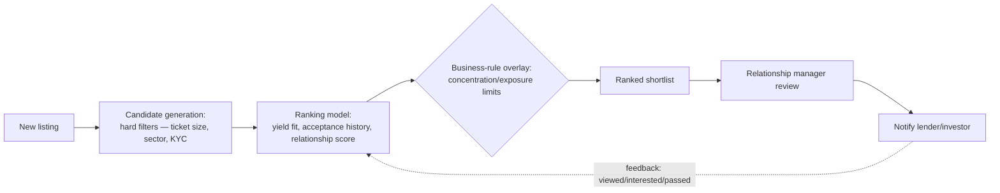
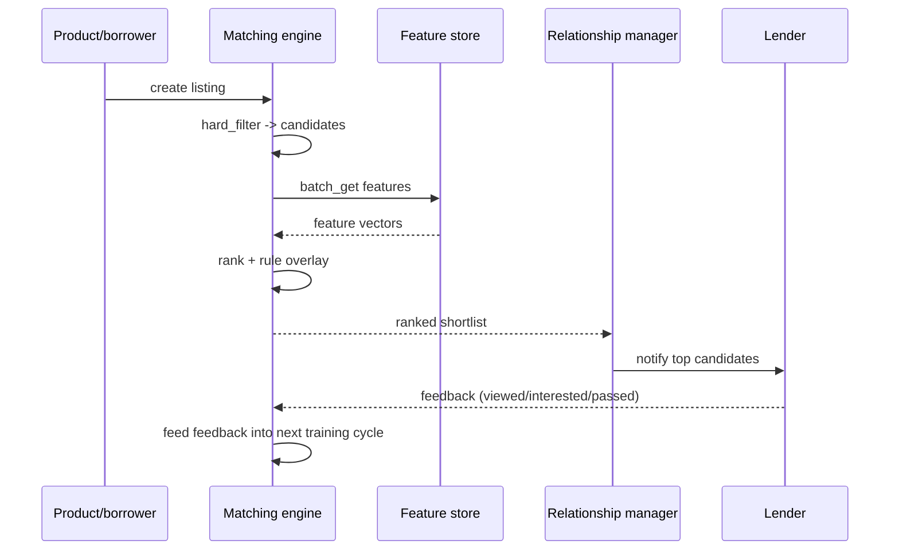
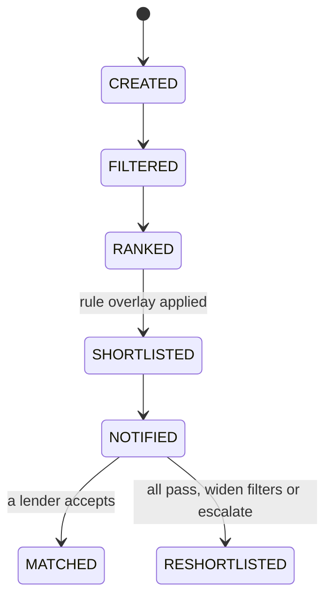

# 07 — Matching/Ranking Engine for the Institutional Debt Marketplace

> [Deep-dive set](README.md) · file 7 of 10 · prev: [06 — Prompt-Injection Defense](06_prompt_injection_defense.md) · next: [08 — Credit/Risk-Scoring Engine](08_credit_risk_scoring_engine.md)
>
> *Different domain: two-sided marketplace search & ranking — think Uber driver-matching or Airbnb search, adapted to debt. A classical ML ranking problem, deliberately not an LLM one.*

**Prompt:** *"Design the engine that matches a borrower/issuer's loan or bond listing to the right lenders/investors on the institutional marketplace."*

---

## Part A — HLD (High-Level Design)

### 1. Clarify & scope

Two-sided (both sides can also browse independently). Hard constraints exist alongside soft preferences, and deal sizes are large enough that a human relationship manager realistically closes the deal — automate the shortlist, not the close.

### 2. Functional requirements

| # | Requirement |
| --- | --- |
| FR1 | Given a new listing, produce a ranked shortlist of eligible lenders/investors. |
| FR2 | Hard-filter on ticket size, sector, KYC status before any ranking compute. |
| FR3 | Enforce regulatory concentration/exposure limits as a non-bypassable overlay. |
| FR4 | Learn from outcomes (viewed/interested/passed) to improve future ranking. |

### 3. Non-functional requirements

| NFR | Target | Why |
| --- | --- | --- |
| Freshness | Ranking reflects same-day listing/lender state | A stale shortlist wastes a relationship manager's time. |
| Auditability | Every exclusion by the rule overlay is logged with the rule that fired | Compliance must be able to show why a lender wasn't shown a listing. |
| Fairness/diversity | Exposure across the eligible lender pool is monitored, not just click-through | Prevents feedback-loop bias from calcifying the ranker. |

### 4. System context



### 5. Component choices & why

| Component | Choice | Why this, not the obvious alternative |
| --- | --- | --- |
| Two-stage design | **Candidate generation** (hard filters) then **ranking** (soft scoring) — not one model scoring the whole pool | Hard filters eliminate most of the pool cheaply before spending ranking-model compute on survivors — the same cheap-filter-then-expensive-step pattern as [file 02](02_document_intelligence_agent.md)'s VLM gating and [file 05](05_fraud_anomaly_detection.md)'s rules-before-ML. |
| Rule placement | Regulatory limits as a **deterministic overlay after** the ML ranking, not folded into the training objective | Compliance needs these limits instantly changeable and auditable without retraining a model — a rule engine compliance can edit directly is safer than a limit implicitly learned in model weights. |
| Human in the loop | Pipeline produces a **ranked shortlist**; a relationship manager makes the actual introduction | Institutional deal sizes are large and relationship-driven — full automation here is a business-fit risk as much as a technical one. |
| Why no LLM for the core match | Structured, feature-based ranking — closer to a recommender system than a language task | An LLM adds cost/latency/non-determinism without a quality gain over a gradient-boosted ranker on structured features. Reserve the LLM for adjacent tasks (summarizing a listing, drafting outreach), not the ranking decision. |
| Feature reuse | Draws from the **same feature store** as [file 05](05_fraud_anomaly_detection.md) and [file 08](08_credit_risk_scoring_engine.md) | Define a feature once, serve it everywhere it's needed, instead of every model recomputing and drifting from the others. |

### 6. Failure modes

- Cold-start lenders/borrowers with no history → fall back to rule-based/manual matching until enough signal accumulates.
- Feedback-loop bias (a lender never shown a sector never expresses interest in it) → monitor exposure/diversity of what's surfaced, not just click-through, or the ranker calcifies.

### 7. Capacity gut-check

Assume 200 new listings/day, ~5,000 eligible lenders pre-filter → hard filters typically cut the pool to a few hundred candidates before ranking; ranking a few hundred candidates per listing with a gradient-boosted model is sub-second, well within a same-day freshness bar.

---

## Part B — LLD (Low-Level Design)

### 1. Data model

**`Listing`:**
```json
{
  "listing_id": "lst-4021",
  "instrument_type": "term_loan",
  "sector": "renewable_energy",
  "ticket_size_range": [5000000, 25000000],
  "kyc_status": "verified",
  "created_at": "2026-08-01T00:00:00Z"
}
```

**`MatchCandidate`** (post-ranking, pre-overlay):
```json
{
  "listing_id": "lst-4021",
  "lender_id": "lnd-118",
  "rank_score": 0.81,
  "score_components": {"yield_fit": 0.9, "acceptance_history": 0.7, "relationship_score": 0.8},
  "rule_overlay_result": {"excluded": false, "checks": ["sector_concentration", "single_borrower_exposure"]}
}
```

### 2. API contracts

```text
POST /v1/marketplace/listings/{listing_id}/match
  -> 200 { shortlist: [ MatchCandidate, ... ] }   # already filtered + ranked + rule-checked

POST /v1/marketplace/feedback
  body: { listing_id, lender_id, action: "viewed"|"interested"|"passed" }
  -> 202, feeds ranking model retraining

GET /v1/marketplace/exposure/diversity-report
  -> 200 { sector_distribution_shown, sector_distribution_eligible }  # fairness monitoring
```

### 3. Core algorithm — filter then rank then overlay

```python
def match(listing: Listing) -> list[MatchCandidate]:
    eligible = lender_index.hard_filter(
        ticket_size_range=listing.ticket_size_range,
        sector_allowlist=listing.sector,
        kyc_status="verified",
    )                                              # cheap: cuts thousands to hundreds

    features = feature_store.batch_get(eligible, listing_context=listing)
    scored = ranking_model.score(features)         # expensive step, only on survivors

    overlaid = [
        candidate.with_overlay(rule_engine.check(candidate, listing))
        for candidate in scored
    ]
    return sorted(
        [c for c in overlaid if not c.rule_overlay_result.excluded],
        key=lambda c: c.rank_score, reverse=True,
    )[:SHORTLIST_SIZE]
```

### 4. Sequence — new listing to notified lenders



### 5. State machine — a listing's matching lifecycle



### 6. Edge cases

- A listing with no eligible lenders after hard filtering → explicit `RESHORTLISTED`/escalation state, not a silent empty result the relationship manager has to notice on their own.
- A lender's eligibility changes (KYC expires) mid-shortlist → re-validate hard filters at notify time, not only at match time — state can go stale between ranking and delivery.
- Two listings competing for the same lender's limited capacity in the same window → the rule overlay must account for *pending* exposure, not just historical exposure, to avoid over-committing a lender across simultaneous shortlists.

### 7. Extension points

| Change | Where it lands |
| --- | --- |
| New ranking feature | Added once to the shared feature store; consumed here and in [file 05](05_fraud_anomaly_detection.md)/[08](08_credit_risk_scoring_engine.md) without duplication. |
| New regulatory limit | New check in the rule engine's overlay; no model retrain. |
| New instrument type | Extend the `Listing` schema + hard-filter predicates. |
