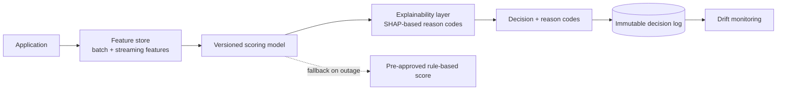
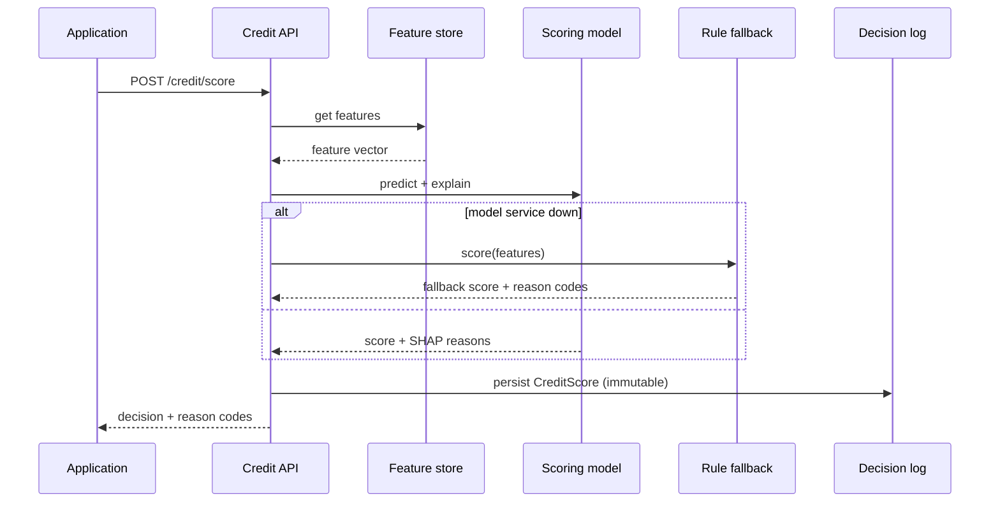
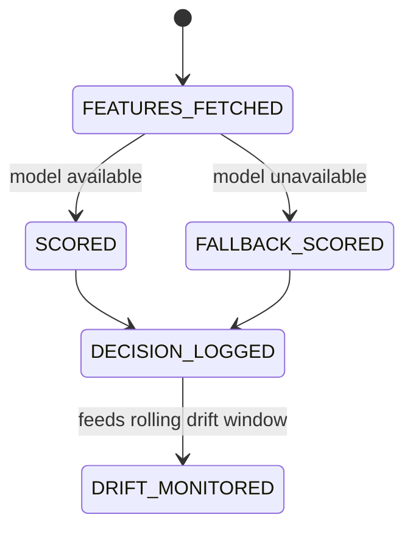

# 08 — Real-Time Credit/Risk-Scoring Decision Engine

> [Deep-dive set](README.md) · file 8 of 10 · prev: [07 — Marketplace Matching/Ranking](07_marketplace_matching_ranking.md) · next: [09 — KYC Entity Resolution & Graph](09_kyc_entity_resolution_graph.md)
>
> *Different-but-related domain: classical ML decisioning + a hard regulated-explainability requirement — not agentic.*

**Prompt:** *"Design the engine that scores a loan application for credit risk/pricing, in real time, in a way that satisfies a regulator asking 'why was this application declined?'"*

---

## Part A — HLD (High-Level Design)

### 1. Clarify & scope

An SLA for the scoring call (assume seconds, not the sub-2s hard-real-time bar of fraud), and the requirement that shapes the whole design: **every adverse decision needs a reason** — an adverse-action notice is a legal requirement in consumer lending, not a nice-to-have.

### 2. Functional requirements

| # | Requirement |
| --- | --- |
| FR1 | Score an application for credit risk and produce a pricing/decision recommendation. |
| FR2 | Attach human-readable reason codes to every score, especially adverse ones. |
| FR3 | Tag every score with the exact model version that produced it. |
| FR4 | Fail toward a safe, pre-approved fallback if the scoring service is down. |

### 3. Non-functional requirements

| NFR | Target | Why |
| --- | --- | --- |
| Explainability | 100% of adverse decisions carry faithful reason codes | Legal requirement, and the deciding design constraint. |
| Versioning | Every score traceable to a model version | A regulator or audit can ask "which model version scored this six months ago." |
| Availability | Fallback rule-based score under outage | Blocking all originations over a service blip is rarely the right trade. |
| Drift detection | Population/feature drift monitored continuously | The loan mix shifts over time; a model validated once can silently degrade. |

### 4. System context



### 5. Component choices & why

| Component | Choice | Why this, not the obvious alternative |
| --- | --- | --- |
| Feature platform | The **same shared feature store** as [file 05](05_fraud_anomaly_detection.md) and [file 07](07_marketplace_matching_ranking.md) | Training/serving feature skew is the single biggest real-world cause of "worked in training, broke in prod"; one store, one definition per feature, used everywhere, removes it by construction. |
| Explainability | A **first-class explainability layer** (SHAP-style reason codes), not bolted on after the fact | If explainability isn't designed in, a black-box model — however accurate — becomes legally unusable the moment a declined applicant asks why, because there's no way to retrofit a faithful explanation onto an opaque model's output. |
| Model serving | **Versioned** serving, every score tagged with the exact model version | Same immutable-decision-lineage requirement as the agentic platform's audit trail ([file 01](01_agentic_ai_platform.md)), applied to a classical ML model instead of an LLM. |
| Why not an LLM for the core score | Well-specified, tabular prediction problem | A calibrated gradient-boosted model beats an LLM here on cost, latency, and — the deciding factor — the clean, auditable explainability regulators expect. |
| Outage handling | A **pre-approved, simpler rule-based score** as fallback | The choice under an outage isn't "accurate score" vs. "no score" — it's "slightly worse but pre-approved score" vs. "block all originations." |

### 6. Failure modes

- Feature/training-serving skew → mitigated structurally by the shared feature store.
- Population drift as loan mix shifts → scheduled drift monitoring, not a one-time validation at launch.
- Explainability layer disagreeing with the model's actual reasoning on edge cases → periodic audit of SHAP faithfulness, not blind trust in the library.

### 7. Capacity gut-check

Assume 50,000 applications/day, each requiring a feature fetch + model inference + SHAP computation — SHAP is the most expensive step (tree-based SHAP is fast, but still non-trivial per call); budget it as the dominant cost driver and cache/precompute where the feature set allows it.

---

## Part B — LLD (Low-Level Design)

### 1. Data model

**`CreditScore`:**
```json
{
  "application_id": "app-88213",
  "model_version": "credit-model@2026-06-01",
  "score": 0.71,
  "decision": "approve_with_pricing_tier_2",
  "reason_codes": [
    {"code": "high_utilization_ratio", "shap_value": -0.12},
    {"code": "short_credit_history", "shap_value": -0.08}
  ],
  "fallback_used": false,
  "decided_at": "2026-08-01T09:05:00Z"
}
```

### 2. API contracts

```text
POST /v1/credit/score
  body: { application_id }
  -> 200 CreditScore
  -> on scoring-service outage: { ...CreditScore, fallback_used: true, model_version: "rule-fallback@1" }

GET /v1/credit/score/{application_id}
  -> 200 CreditScore    # replay for audit, keyed by application, immutable

GET /v1/credit/drift-report?window=7d
  -> 200 { feature_drift: {...}, population_shift_score: 0.03 }
```

### 3. Core algorithm — score, explain, fall back

```python
def score_application(app_id: str) -> CreditScore:
    features = feature_store.get(app_id, feature_set_version=CURRENT_VERSION)
    try:
        raw_score = credit_model.predict(features)
        reasons = shap_explainer.top_reasons(credit_model, features, n=3)
        return CreditScore(app_id, credit_model.version, raw_score, reasons, fallback_used=False)
    except ModelServiceUnavailable:
        raw_score = rule_fallback.score(features)   # pre-approved, simpler, always available
        return CreditScore(app_id, "rule-fallback@1", raw_score,
                            rule_fallback.reason_codes(features), fallback_used=True)
```

### 4. Sequence — a scoring call with the fallback path exercised



### 5. State machine — application scoring lifecycle



### 6. Edge cases

- SHAP reason codes technically correct but not human-readable (raw feature names) → maintain a **reason-code translation table** reviewed by compliance, not raw feature names surfaced to an applicant.
- A borderline score right at the approve/reject boundary → document the threshold explicitly in the decision log so a later audit can see it was a policy threshold, not an arbitrary cutoff.
- Fallback scoring used during an extended outage → flag `fallback_used: true` decisions for a **priority re-score** once the model service recovers, rather than letting them stand unreviewed indefinitely.

### 7. Extension points

| Change | Where it lands |
| --- | --- |
| New feature | Shared feature store, same as [files 05](05_fraud_anomaly_detection.md)/[07](07_marketplace_matching_ranking.md). |
| New model version | Shadow-scored against live applications before cutover — same rollout discipline as [file 04](04_agent_eval_guardrail_platform.md). |
| New regulatory reason-code requirement | Extend the reason-code translation table; no model change needed. |
