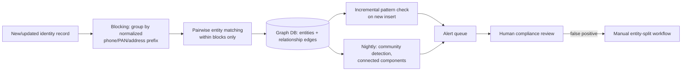
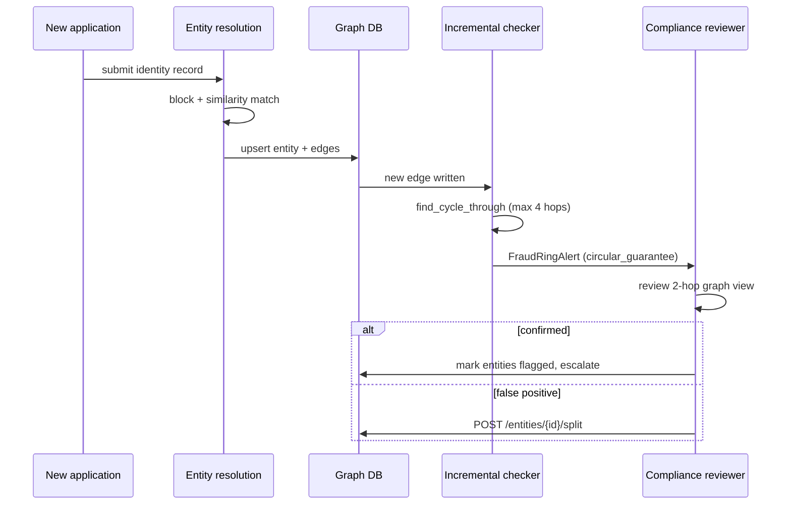
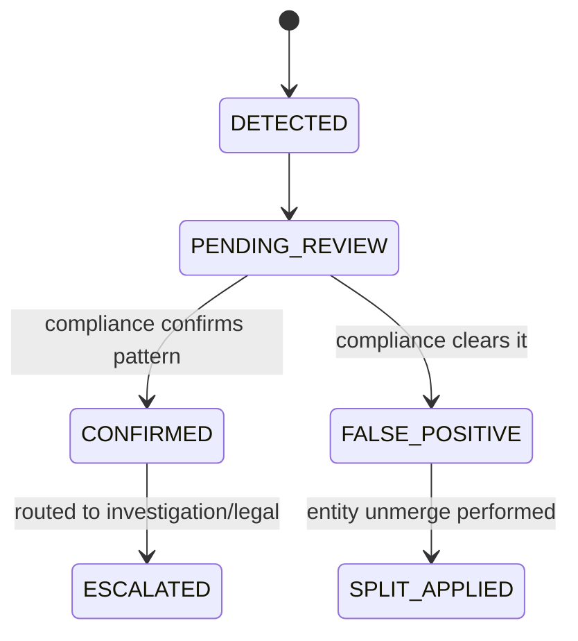

# 09 — KYC/AML Entity-Resolution & Fraud-Ring Detection

> [Deep-dive set](README.md) · file 9 of 10 · prev: [08 — Credit/Risk-Scoring Engine](08_credit_risk_scoring_engine.md) · next: [10 — Computer-Vision KYC/Liveness](10_cv_kyc_liveness.md)
>
> *Different domain: graph systems + near-real-time streaming — the most structurally different file in this set.*

**Prompt:** *"Design a system that resolves borrower/guarantor/director identities across messy records and detects fraud rings (circular guarantees, shell-company clusters) before they draw down significant capital."*

---

## Part A — HLD (High-Level Design)

### 1. Clarify & scope

Identity records are messy (name variants, shared phone/address/PAN across applications). The goal is catching a coordinated **cluster** of bad actors — something a single-application fraud check ([file 05](05_fraud_anomaly_detection.md)) structurally cannot see, because no individual application looks suspicious on its own.

### 2. Functional requirements

| # | Requirement |
| --- | --- |
| FR1 | Resolve messy identity records into canonical entities. |
| FR2 | Maintain a graph of relationship edges (shared guarantor, shared address, shared director). |
| FR3 | Detect suspicious cluster patterns (cycles, shared-attribute rings, fan-outs) near-real-time on new inserts. |
| FR4 | Support human correction of a wrongly-merged entity (unmerge). |

### 3. Non-functional requirements

| NFR | Target | Why |
| --- | --- | --- |
| Detection latency | New-entity pattern check same-day | A ring actively drawing down capital needs same-day intervention. |
| Matching cost | Sub-quadratic in record count | All-pairs comparison is infeasible at scale. |
| Correctability | Human-reviewable, reversible merges | Entity resolution has real false positives (common names, shared family addresses). |

### 4. System context



### 5. Component choices & why

| Component | Choice | Why this, not the obvious alternative |
| --- | --- | --- |
| Storage model | A **graph database** (Neptune/Neo4j-class), not relational joins | Fraud rings are inherently multi-hop relationship questions; these are natural graph traversals, while the SQL equivalent is a chain of self-joins that gets worse with every extra hop. |
| Matching cost control | **Blocking** (group by normalized phone/PAN/address prefix) *before* pairwise matching | All-pairs comparison is O(n²) and infeasible at scale; blocking cuts the comparison set by orders of magnitude before the expensive matcher runs — the same cheap-filter-before-expensive-step principle as [files 02](02_document_intelligence_agent.md), [05](05_fraud_anomaly_detection.md), and [07](07_marketplace_matching_ranking.md). |
| Matching model | **Embedding-based similarity** over blocked candidate pairs, not exact-string rules alone | Name/address variants (transliteration, typos, formatting) don't match on exact strings; a learned similarity model over normalized fields catches near-duplicates a rule set misses — this is where "AI" (not just graph theory) does real work in the pipeline. |
| Detection cadence | Lightweight **incremental check on every insert**, plus a heavier **nightly batch** (community detection) | A ring drawing down capital needs same-day intervention; full graph algorithms are too expensive to run on every insert, so the split gets both speed and completeness. |
| Human gate | Every alert routes to **compliance review**; nothing auto-rejects on a graph signal alone | Entity resolution has real false positives — auto-rejecting risks wrongly blocking legitimate borrowers, its own compliance and business risk. |
| Correcting mistakes | An explicit **entity-split workflow** | Entity resolution is probabilistic by nature — the system needs a first-class "undo a merge" path, not a "flag and hope someone remembers" process. |

### 6. Failure modes

- False-positive merges → the split workflow above.
- Poor input data quality producing garbage clusters → data-quality monitoring upstream, not just downstream alerting.
- Adversarial identity fragmentation (fraudsters deliberately varying details to dodge blocking) → periodic review and tightening of blocking rules; this is an arms race, not a solved problem.

### 7. Capacity gut-check

Assume 50,000 new/updated identity records/day. Blocking on normalized phone+PAN prefix typically reduces comparison candidates by 2–3 orders of magnitude versus all-pairs — turning an infeasible O(n²) ≈ 2.5B comparisons/day into a few million, which a similarity model can score same-day.

---

## Part B — LLD (Low-Level Design)

### 1. Data model

**`EntityNode`** (graph):
```json
{
  "entity_id": "ent-33920",
  "canonical_name": "Ravi Kumar",
  "attributes": {"pan_hash": "...", "phone_hash": "...", "address_normalized": "..."},
  "resolved_from_records": ["rec-1", "rec-2"],
  "confidence": 0.94
}
```

**`RelationshipEdge`:**
```json
{
  "from": "ent-33920", "to": "ent-44012",
  "type": "shares_guarantor",
  "evidence": ["app-88213", "app-88240"],
  "detected_at": "2026-08-01T02:00:00Z"
}
```

**`FraudRingAlert`:**
```json
{
  "alert_id": "ring-991",
  "entities": ["ent-33920", "ent-44012", "ent-51002"],
  "pattern": "circular_guarantee",
  "detection_method": "incremental",
  "status": "pending_review"
}
```

### 2. API contracts

```text
POST /v1/identity/records
  body: { record }
  -> 202, triggers blocking -> matching -> graph upsert -> incremental pattern check

GET /v1/identity/entities/{entity_id}/graph?hops=2
  -> 200 { nodes, edges }   # for a compliance reviewer's investigation view

POST /v1/identity/entities/{entity_id}/split
  body: { reviewer_id, records_to_detach: [...] }
  -> 200, creates a new entity_id for the detached records, preserves audit trail

GET /v1/identity/alerts?status=pending_review
  -> 200 [ FraudRingAlert, ... ]
```

### 3. Core algorithm — blocking then similarity matching

```python
def resolve_record(record: IdentityRecord) -> EntityNode:
    block_key = normalize(record.phone), normalize(record.pan)[:6], normalize(record.address)[:20]
    candidates = graph_db.get_block(block_key)          # orders of magnitude smaller than all entities

    best_match, score = None, 0.0
    for candidate in candidates:
        s = similarity_model.score(record, candidate)    # embedding-based, handles variants
        if s > best_match_score(best_match, score):
            best_match, score = candidate, s

    if best_match and score > MERGE_THRESHOLD:
        return graph_db.merge_into(best_match, record, confidence=score)
    return graph_db.create_entity(record)
```

**Incremental pattern check** (runs on every new edge write):
```python
def incremental_check(new_edge: RelationshipEdge):
    cycle = graph_db.find_cycle_through(new_edge.from_, new_edge.to, max_hops=4)
    if cycle:
        raise_alert(pattern="circular_guarantee", entities=cycle)
```

### 4. Sequence — a new application triggers a same-day alert



### 5. State machine — an alert's lifecycle



### 6. Edge cases

- Two genuinely different people sharing a family address and phone → the similarity model's score alone shouldn't auto-merge above a conservative threshold; borderline scores route to human confirmation before merge, not after.
- A ring detected only by the nightly batch (missed by the incremental 4-hop check, e.g. a longer chain) → the batch pass exists precisely for this; don't treat the incremental check as complete coverage.
- An entity split that itself needs to propagate through already-detected alerts referencing the old entity_id → alerts must reference immutable record IDs, not just entity IDs, so a later split doesn't orphan historical alerts.

### 7. Extension points

| Change | Where it lands |
| --- | --- |
| New relationship type | New edge type in the graph schema; existing pattern checks can be extended to consider it. |
| New pattern class (e.g., shell-company web) | New nightly batch algorithm (community detection variant); doesn't require touching the incremental path. |
| New identity attribute (e.g., a new ID type) | Extend blocking keys + the similarity model's feature set. |
