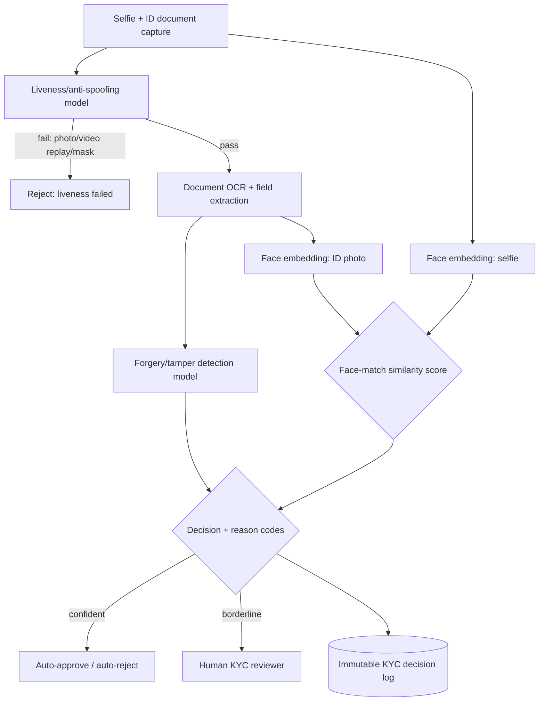
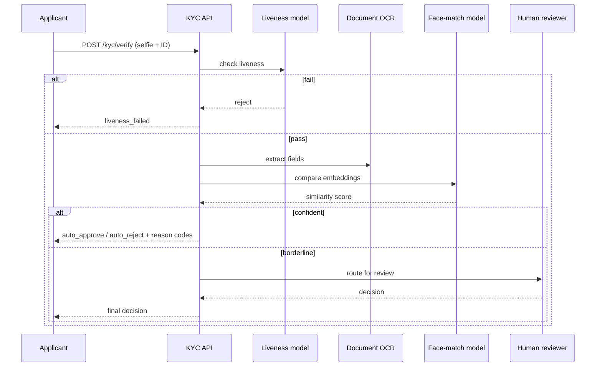
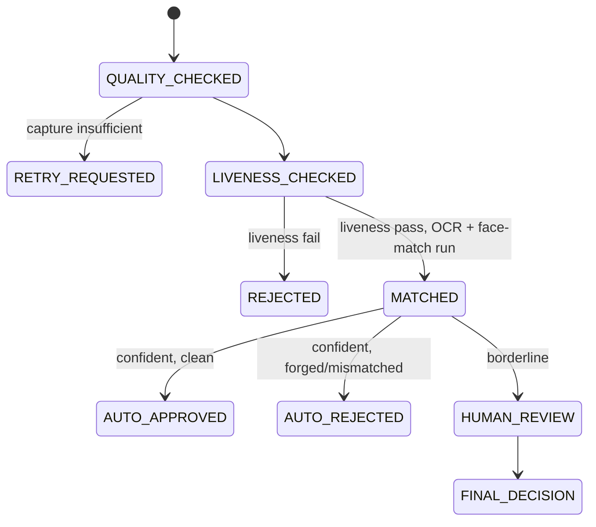

# 10 — Computer-Vision KYC / Identity-Verification Pipeline

> [Deep-dive set](README.md) · file 10 of 10 · prev: [09 — KYC Entity Resolution & Graph](09_kyc_entity_resolution_graph.md) · back to: [README](README.md)
>
> *Different domain: computer vision + biometrics — a classic AI-role systems question that's a poor fit for an LLM at its core.*

**Prompt:** *"Design the system that verifies a borrower's identity during onboarding — liveness check, face match against their ID document, and detecting a forged or tampered document — in real time, at scale, and defensibly for a regulator."*

---

## Part A — HLD (High-Level Design)

### 1. Clarify & scope

Real-time during onboarding (seconds, not batch). Must handle a wide range of ID document types and camera/lighting quality. Must resist spoofing (a photo of a photo, a video replay, a 3D mask). Every decision needs a reason code for KYC/AML audit — a biometrics + fraud problem with a hard explainability requirement layered on top, same as [file 08](08_credit_risk_scoring_engine.md)'s.

### 2. Functional requirements

| # | Requirement |
| --- | --- |
| FR1 | Verify the user is a live person, not a photo/video/mask presentation attack. |
| FR2 | Match the live selfie against the face on the submitted ID document. |
| FR3 | Detect a forged or tampered ID document. |
| FR4 | Attach a reason code to every decision; route uncertain cases to a human. |
| FR5 | Audit fairness across demographic groups on a schedule. |

### 3. Non-functional requirements

| NFR | Target | Why |
| --- | --- | --- |
| Latency | End-to-end under ~10s during onboarding | Onboarding drop-off rises sharply with wait time. |
| Spoof resistance | Meets an industry PAD/anti-spoofing standard (e.g. iBeta Level 2-equivalent) | The baseline bar for a production liveness system. |
| Fairness | Equal false-reject rate across demographic slices, audited pre/post every model update | A biometric system with uneven accuracy is both a fairness and regulatory problem. |
| Explainability | Every reject carries a reason code | Same adverse-action requirement as credit scoring. |

### 4. System context



### 5. Component choices & why

| Component | Choice | Why this, not the obvious alternative |
| --- | --- | --- |
| Liveness as a first gate | A dedicated liveness model runs **before** face-match and OCR; a fail short-circuits the pipeline | Photo-of-a-photo and video-replay are the cheapest, most common attacks; failing liveness first avoids running the more expensive models on an attack that was never going to pass — same cheap-filter-first pattern as [files 02](02_document_intelligence_agent.md), [05](05_fraud_anomaly_detection.md), [07](07_marketplace_matching_ranking.md), [09](09_kyc_entity_resolution_graph.md). |
| Model decomposition | **Separate specialized models** for liveness, face-match, and forgery detection, not one end-to-end model | Each is a distinct, well-studied problem with different training data, failure modes, and update cadence; a monolithic model conflates them and is harder to debug or improve independently. |
| Face match | **Embedding similarity** (selfie vs. ID photo), not a per-person classifier | Embeddings generalize to a borrower never seen in training; a classifier would need a trained class per individual, a non-starter for onboarding new users. |
| Explainability | Structured reason codes + an **immutable KYC decision log**, not a bare similarity score | Same adverse-action-explainability requirement as [file 08](08_credit_risk_scoring_engine.md) — "the model said 0.62" is not an answer; "liveness passed, face-match below threshold, document OCR consistent" is. |
| Borderline handling | Uncertain scores route to a **human KYC reviewer**, never an automatic reject | A hard auto-reject on a borderline biometric score risks locking out legitimate borrowers with unusual lighting/camera quality/appearance changes — the same "no auto-reject on one uncertain signal" principle as [files 05](05_fraud_anomaly_detection.md) and [09](09_kyc_entity_resolution_graph.md), with an added fairness dimension here. |

### 6. Failure modes

- An adversarial deepfake or high-quality mask bypassing liveness → an ongoing arms race; continuous red-teaming and model refresh, not a one-time certification.
- Poor capture quality causing spurious rejects → a capture-quality gate that asks the user to retry **before** running the expensive models, not a silent fail.
- Demographic bias in face-match accuracy → mandatory, scheduled fairness audits across skin tone/gender/age groups, before and after every model update — non-negotiable, not optional.

### 7. Capacity gut-check

Assume 20,000 onboarding attempts/day. Liveness-first gating means the expensive face-match/forgery models only run on the subset that passes liveness (typically the large majority of legitimate traffic, a small minority of attacks filtered out cheaply) — sized so the GPU budget scales with legitimate volume, not with attack volume.

---

## Part B — LLD (Low-Level Design)

### 1. Data model

**`VerificationAttempt`:**
```json
{
  "attempt_id": "kyc-77102",
  "applicant_id": "app-88213",
  "liveness": {"result": "pass", "score": 0.97, "model_version": "liveness@4"},
  "document": {"type": "passport", "ocr_fields": {"name": "...", "dob": "..."}},
  "forgery_check": {"result": "clean", "score": 0.05},
  "face_match": {"similarity": 0.89, "threshold": 0.80},
  "decision": "auto_approve",
  "reason_codes": ["liveness_pass", "face_match_above_threshold", "document_consistent"],
  "decided_at": "2026-08-01T09:10:00Z"
}
```

### 2. API contracts

```text
POST /v1/kyc/verify
  multipart: selfie_video, id_document_image
  -> 200 VerificationAttempt
  -> 422 { reason: "capture_quality_insufficient" }  # ask user to retry before expensive models run

GET /v1/kyc/verify/{attempt_id}
  -> 200 VerificationAttempt   # immutable, for audit replay

POST /v1/kyc/fairness-audit/run
  -> 202, kicks off a scheduled slice-wise accuracy report across demographic groups
```

### 3. Core algorithm — liveness-gated pipeline

```python
def verify(selfie_video, id_document_image) -> VerificationAttempt:
    quality = capture_quality_check(selfie_video, id_document_image)
    if not quality.sufficient:
        return retry_requested(quality.reason)          # cheapest possible early exit

    liveness = liveness_model.check(selfie_video)
    if liveness.result != "pass":
        return reject("liveness_failed", liveness)        # short-circuit before OCR/match

    ocr_fields = document_ocr.extract(id_document_image)
    forgery = forgery_model.check(id_document_image, ocr_fields)
    face_match = face_embedding_model.compare(
        selfie_embedding=face_embedding_model.embed(selfie_video.best_frame()),
        id_embedding=face_embedding_model.embed(id_document_image.face_region()),
    )

    if forgery.result == "suspicious" or face_match.similarity < LOWER_THRESHOLD:
        return reject_with_reasons(forgery, face_match)
    if face_match.similarity >= UPPER_THRESHOLD and forgery.result == "clean":
        return auto_approve(liveness, forgery, face_match, ocr_fields)
    return route_to_human(liveness, forgery, face_match, ocr_fields)   # borderline band
```

### 4. Sequence — an onboarding verification



### 5. State machine — verification attempt lifecycle



### 6. Edge cases

- A legitimate applicant with an ID photo taken years ago (natural appearance change) → the borderline band and human review exist precisely for this; the fairness audit should also track false-reject rate by document age, not just demographic slice.
- A damaged or low-quality physical ID document → the forgery model must distinguish "genuinely forged" from "poor scan quality" — conflating them causes legitimate rejects; route ambiguous forgery signals to human review rather than auto-reject.
- A retry loop where an applicant fails capture-quality repeatedly → cap retries and route to an assisted/manual verification path rather than an infinite retry UX.

### 7. Extension points

| Change | Where it lands |
| --- | --- |
| New ID document type/country | Extend document OCR templates + forgery-model training data; liveness and face-match paths are unchanged. |
| New spoof attack class discovered | Retrain/refresh the liveness model; add the attack sample to a growing adversarial test set (same red-team-flywheel principle as [file 06](06_prompt_injection_defense.md)). |
| New fairness dimension to audit | Extend the fairness-audit slice definitions; no pipeline change needed. |
