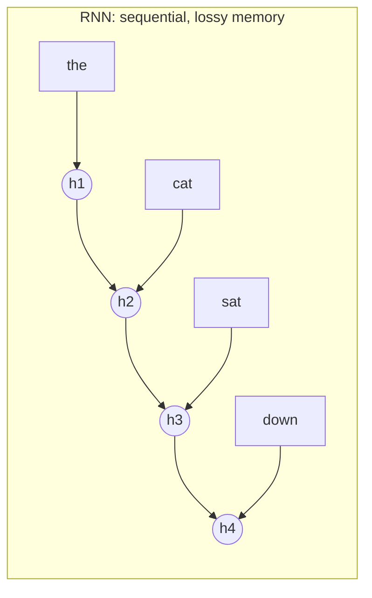
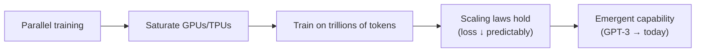

# 1 · Why Transformers

*Transformer & GPT module · Lesson 1 of 10 · [next → Tokenization & Embeddings](02-tokenization-and-embeddings.md)*

> **One-liner:** Transformers replaced recurrence with attention so that every token can look at every other token *simultaneously* — trading O(n) sequential steps for O(1) parallel ones, which is exactly what GPUs are good at.

## 🎯 TL;DR

- Before 2017, sequence models were **RNNs/LSTMs**: read tokens one at a time, squeeze history into a fixed-size hidden state.
- Two fatal flaws: **sequential training** (can't parallelize across the sequence) and a **long-range memory bottleneck** (information decays over distance).
- *Attention Is All You Need* (Vaswani et al., 2017) deleted the recurrence entirely: attention connects any two positions in **one step**, and the whole sequence trains **in parallel**.
- The consequence wasn't just speed — it made **scaling** feasible, and scaling is the whole GPT story ([Lesson 8](08-gpt-training-and-scaling.md)).

---

## 1.1 The RNN world and its two bottlenecks

| Bottleneck | Why it hurts |
|------------|--------------|
| **Sequential compute** | `h4` needs `h3` needs `h2`… — you cannot compute timestep 400 before 399. Training a long sequence = a long chain of dependent steps; GPUs sit idle. |
| **Fixed-size memory** | Everything the model knows about the past is crammed into one hidden vector. By token 500, token 3 is a rumor. Gradients across that chain vanish/explode. |

LSTMs/GRUs softened the memory problem with gates; attention-*augmented* RNNs (Bahdanau 2014, for translation) let a decoder peek back at encoder states. The 2017 insight: **the peeking mechanism is the model — drop the RNN.**

---

## 1.2 The transformer trade

| | RNN | Transformer |
|---|-----|------------|
| Path between token *i* and *j* | O(\|i−j\|) steps | **O(1)** — direct attention edge |
| Training parallelism over sequence | None | **Full** (one big matmul) |
| Cost per layer | O(n · d²) | O(n² · d) — attention is **quadratic in sequence length** |
| Inherent order sense | Built in (recurrence) | **None** — must inject positions ([Lesson 2](02-tokenization-and-embeddings.md)) |

The transformer isn't free: it *pays* quadratic cost in sequence length to *buy* constant-length gradient paths and total parallelism. For a decade that trade has been overwhelmingly worth it — and the quadratic bill is what [Lesson 9](09-inference-and-kv-cache.md)'s KV cache and [Lesson 10](10-modern-architecture-variants.md)'s long-context tricks try to manage.

---

## 1.3 Why parallelism → scale → everything else

RNNs weren't just slower — they were **unscalable** in practice. The transformer's real contribution is being the first sequence architecture that lets you convert money into capability at predictable exchange rates. That's why the same block from 2017, only lightly modified ([Lesson 10](10-modern-architecture-variants.md)), still underlies every frontier model.

---

## 1.4 The original 2017 shape (preview)

The paper's model was an **encoder-decoder** built for translation: an encoder reads the source sentence (all tokens see each other), a decoder writes the target one token at a time (each token sees only its past + the encoder output). GPT keeps **only the decoder half** — that split is [Lesson 6](06-encoder-vs-decoder-families.md)'s topic; the decoder's anatomy in full is [Lesson 7](07-gpt-architecture-in-detail.md).

---

## Key terms

| Term | Meaning |
|------|---------|
| **Recurrence** | Computing each timestep's state from the previous one — inherently sequential |
| **Hidden-state bottleneck** | RNN's whole past compressed into one fixed-size vector |
| **Attention** | A mechanism letting a position directly read from any other position, weighted by relevance |
| **Quadratic attention** | O(n²) pairwise token interactions per layer — the transformer's main cost |
| **Path length** | Number of computation steps a signal travels between two positions; transformers make it 1 |

## ✍️ Notes / follow-ups

- The "parallelism → scale" causality is the single most interview-quotable takeaway from this lesson.
- The quadratic cost resurfaces twice later: at training (context length limits) and at inference ([KV cache, Lesson 9](09-inference-and-kv-cache.md)).
- Serving-side consequences of these design choices: [`../04_llm-serving-and-inference-optimization/`](../04_llm-serving-and-inference-optimization/README.md).
- **Next:** before any attention can happen, text must become vectors → [Tokenization & Embeddings](02-tokenization-and-embeddings.md).
