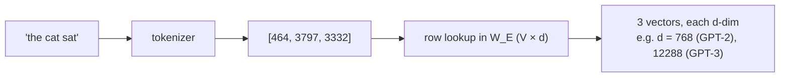

# 2 · Tokenization & Embeddings

*Transformer & GPT module · Lesson 2 of 10 · [← Why Transformers](01-why-transformers.md) · [next → Self-Attention](03-self-attention.md)*

> **One-liner:** Text becomes model input in two hops — a tokenizer maps strings to integer IDs from a fixed vocabulary (BPE), and an embedding table maps each ID to a learned vector — plus a positional signal, because attention alone is order-blind.

## 🎯 TL;DR

- **Tokens ≠ words.** GPT-family models use **Byte-Pair Encoding (BPE)**: start from bytes, greedily merge the most frequent pairs until you hit a target vocab (~50k for GPT-2, ~100k for GPT-4-era).
- Each token ID indexes a row of a learned **embedding matrix** `W_E ∈ R^{V×d}` — that row *is* the token's starting vector.
- Attention is a **set operation** — permute the tokens and nothing changes — so order must be injected: sinusoidal or learned **positional embeddings** (original/GPT), later **RoPE** ([Lesson 10](10-modern-architecture-variants.md)).
- Model input = `token_embedding + positional_embedding`, one `d`-dim vector per position.

---

## 2.1 BPE in one worked example

Training BPE on a toy corpus: `low, low, low, lower, newest, newest, widest`

| Step | Most frequent pair | Merge → new token | Vocab grows |
|------|-------------------|-------------------|-------------|
| 1 | `l`+`o` (5×) | `lo` | chars + `lo` |
| 2 | `lo`+`w` (5×) | `low` | + `low` |
| 3 | `e`+`s` (3×) | `es` | + `es` |
| 4 | `es`+`t` (3×) | `est` | + `est` |
| … | … | … | until vocab budget |

At inference the tokenizer just replays the learned merges greedily. Result: common words = 1 token, rare words split into meaningful chunks (`unhappiness` → `un` + `happiness`), and **nothing is ever out-of-vocabulary** because the fallback is raw bytes.

```python
# tiktoken, GPT-4 vocab
enc.encode("transformer")     # → [1 token — common word]
enc.encode("detokenization")  # → ['det', 'oken', 'ization'] — rarer, 3 tokens
```

> ⚖️ **Vocab-size tradeoff:** bigger vocab → shorter sequences (cheaper attention) but a bigger embedding matrix and rarer, worse-trained tail tokens. ~50k–150k is the equilibrium the industry settled on. Tokenization is also why models are bad at character-level tasks (counting letters, reversing strings) — they literally don't see characters.

---

## 2.2 The embedding table



- `W_E` is **learned like any other weight** — no word2vec pretraining, it just absorbs gradient from the language-modeling loss.
- GPT ties this same matrix to the **output head** (logits = `h · W_Eᵀ`) — weight tying, covered in [Lesson 7](07-gpt-architecture-in-detail.md).
- Scale check, GPT-2 small: `50257 × 768 ≈ 38.6M` params — a third of the whole 124M model is the embedding table.

---

## 2.3 Positional information — three generations

Attention over a *set* of vectors can't tell "dog bites man" from "man bites dog." Fixes, in historical order:

| Generation | Mechanism | Used by | Property |
|-----------|-----------|---------|----------|
| **Sinusoidal** | Fixed sin/cos waves of geometric frequencies, *added* to embeddings | Original 2017 | No params; in principle extrapolates |
| **Learned absolute** | A trainable vector per position index, *added* | GPT-1/2/3, BERT | Simple; hard cap at trained context length |
| **RoPE (rotary)** | *Rotate* Q and K by a position-dependent angle inside attention | Llama, most modern | Encodes **relative** offsets; extends better → [Lesson 10](10-modern-architecture-variants.md) |

The sinusoidal trick's elegance: for a fixed offset k, `PE(pos+k)` is a linear function of `PE(pos)` — relative position is linearly recoverable, which is what attention needs.

---

## 2.4 What actually enters the transformer

```text
x_i = W_E[token_i] + W_P[i]          # (d,) per position — GPT-2 style
X   = stack(x_0 … x_{n-1})           # (n, d) — this matrix flows through every block
```

Everything after this point — all of [Lessons 3–7](03-self-attention.md) — is transformations of this one `(n, d)` matrix.

---

## Key terms

| Term | Meaning |
|------|---------|
| **BPE** | Byte-Pair Encoding — greedy frequency-based subword merging; GPT's tokenizer family |
| **Vocab (V)** | Fixed set of tokens the model knows; ~50k–150k in practice |
| **Embedding matrix W_E** | Learned `V×d` lookup table: token ID → vector |
| **Positional embedding** | The injected order signal — sinusoidal, learned, or rotary |
| **d_model** | The model's working vector width (768 in GPT-2 small, 12288 in GPT-3) |

## ✍️ Notes / follow-ups

- Tokenizer choice silently shapes cost: the *same* text can be 30% more tokens in a different tokenizer — that's real money at API prices ([`../../Shared/03_llmops/`](../../Shared/03_llmops/README.md) cost lesson).
- Tokenization pathologies (numbers split oddly, non-English inflation) explain many "dumb" model behaviors — worth remembering when debugging prompts ([`../01_prompt-engineering/`](../01_prompt-engineering/README.md)).
- **Next:** the `(n, d)` matrix meets the mechanism that made all this worthwhile → [Self-Attention](03-self-attention.md).
