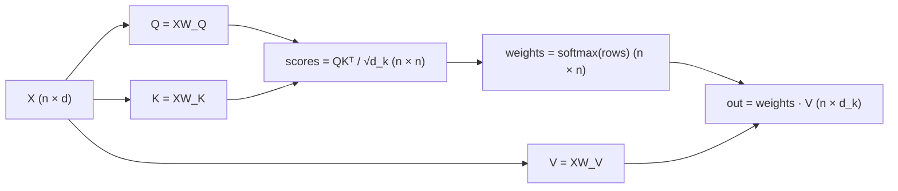

# 3 · Self-Attention

*Transformer & GPT module · Lesson 3 of 10 · [← Tokenization & Embeddings](02-tokenization-and-embeddings.md) · [next → Multi-Head Attention](04-multi-head-attention.md)*

> **One-liner:** Each token asks a question (query), every token advertises what it has (key) and what it would contribute (value); attention scores = query·key similarity, softmaxed into weights, and the token's new representation is the weighted sum of values.

## 🎯 TL;DR

- Three learned projections of the same input: **Q = XW_Q, K = XW_K, V = XW_V**.
- Core formula: **Attention(Q,K,V) = softmax(QKᵀ / √d_k) V** — one line, the whole revolution.
- **√d_k scaling** stops dot products from growing with dimension and saturating the softmax (killing gradients).
- It's a **soft, differentiable dictionary lookup**: query ≈ search term, keys ≈ index, values ≈ stored content.

---

## 3.1 The Q/K/V intuition

| Role | Question it answers | Analogy |
|------|--------------------|---------|
| **Query (q_i)** | "What am *I* looking for?" | Your search string |
| **Key (k_j)** | "What do *I* contain, findably?" | A document's index entry |
| **Value (v_j)** | "What do I *give* if selected?" | The document's content |

Why three separate projections instead of comparing raw embeddings? Because *matching* and *content* are different jobs: the word "bank" should **match** a query about rivers via one subspace, but **contribute** its river-bank meaning via another. Separate W_Q, W_K, W_V let the model learn each role independently.

---

## 3.2 The computation, step by step



The `(n × n)` matrix is the famous **attention map**: entry (i, j) = how much token i draws from token j. This is also where the quadratic cost from [Lesson 1](01-why-transformers.md) lives.

---

## 3.3 A worked example you can trace by hand

Sentence: `the cat sat` — 3 tokens, toy dimension d_k = 2. Suppose after projection:

```text
q_sat = [1, 0]      k_the = [0.2, 1]    v_the = [1, 0]
                    k_cat = [1, 0.1]    v_cat = [0, 1]
                    k_sat = [0.3, 0.3]  v_sat = [0.5, 0.5]
```

Scores for `sat` (dot products, ÷ √2 ≈ 1.41):

| pair | q·k | scaled |
|------|-----|--------|
| sat→the | 0.2 | 0.14 |
| sat→cat | 1.0 | **0.71** |
| sat→sat | 0.3 | 0.21 |

softmax([0.14, 0.71, 0.21]) ≈ **[0.26, 0.46, 0.28]** → `sat` attends most to `cat` (who is doing the sitting).

New representation: `0.26·v_the + 0.46·v_cat + 0.28·v_sat ≈ [0.40, 0.60]` — `sat`'s vector now *contains* information about its subject. Stack 12–96 layers of this and representations become deeply contextual.

---

## 3.4 Why divide by √d_k

If q, k have unit-variance components, `q·k` has variance **d_k** — at d_k = 64 the raw scores are huge, softmax becomes a hard one-hot, and gradients through it vanish. Dividing by √d_k restores unit variance, keeping the softmax in its soft, trainable regime. (Same reason careful init matters everywhere — this is init-thinking applied to an activation.)

---

## 3.5 Self vs cross attention

| Variant | Q from | K/V from | Where |
|---------|--------|----------|-------|
| **Self**-attention | the sequence | the *same* sequence | GPT, BERT, everywhere |
| **Cross**-attention | decoder | *encoder's* output | Original 2017 decoder ([Lesson 5](05-the-transformer-block.md)); today: multimodal (text Q over image K/V) |

GPT uses only **masked self-attention** — each token's row of the attention map is truncated to positions ≤ itself. The mask's mechanics: [Lesson 7](07-gpt-architecture-in-detail.md).

---

## Key terms

| Term | Meaning |
|------|---------|
| **Q / K / V** | Query, Key, Value — three learned linear views of the same input |
| **Attention map** | The n×n softmaxed weight matrix; row i = where token i looks |
| **Scaled dot-product** | `QKᵀ/√d_k` — the similarity + variance-control combo |
| **Soft lookup** | Attention as a differentiable dictionary: weighted read from all entries |
| **Cross-attention** | Q from one sequence, K/V from another |

## ✍️ Notes / follow-ups

- Interpretability work reads attention maps to find induction heads and copying circuits — attention is the most inspectable part of the model.
- One attention layer captures *one* relation pattern per position — the fix is running many in parallel → **Next:** [Multi-Head Attention](04-multi-head-attention.md).
- K and V matrices are exactly what gets cached at inference ([Lesson 9](09-inference-and-kv-cache.md)) — remember their shapes.
