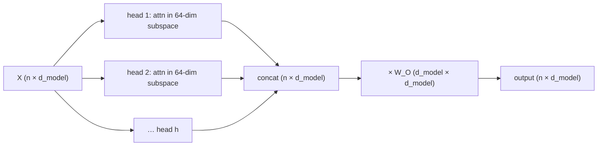

# 4 · Multi-Head Attention

*Transformer & GPT module · Lesson 4 of 10 · [← Self-Attention](03-self-attention.md) · [next → The Transformer Block](05-the-transformer-block.md)*

> **One-liner:** Instead of one attention over the full d_model dimensions, split into h smaller heads that each attend in their own learned subspace, then concatenate and re-project — same total compute, h independent "relationship channels."

## 🎯 TL;DR

- **h heads**, each with its own W_Q/W_K/W_V projecting to **d_k = d_model / h** dims (GPT-2: 12 heads × 64 dims = 768).
- Each head computes scaled dot-product attention independently → outputs are **concatenated** → mixed by an output projection **W_O**.
- Why: a single softmax produces *one* weighting per token — but "sat" simultaneously needs its **subject** (syntax head), nearby **adjectives** (proximity head), and **coreference** (which "it"?). Heads = parallel views.
- Compute cost ≈ same as one full-width attention; the win is **representational**, not computational.

---

## 4.1 The mechanics



```python
# shapes, GPT-2 small: n tokens, d=768, h=12, d_k=64
Q = X @ W_Q          # (n, 768) — computed once, then reshaped to (12, n, 64)
scores = Q @ K.transpose(-1, -2) / sqrt(64)   # (12, n, n) — 12 attention maps
out = softmax(scores) @ V                     # (12, n, 64)
out = out.reshape(n, 768) @ W_O               # concat heads + mix
```

In real implementations the h heads are **one big matmul reshaped** — "multi-head" is a view over tensors, not h separate modules.

---

## 4.2 Why many small heads beat one big one

| One full-width attention | h subspace heads |
|--------------------------|------------------|
| One n×n weight pattern per layer | **h different** n×n patterns per layer |
| "sat" must average its needs into a single lookup | subject-head finds `cat`, position-head finds neighbors, each cleanly |
| Softmax forces competition — attending here means not there | competition only *within* each head |

Empirically, trained heads specialize into recognizable roles: previous-token heads, syntactic-dependency heads, rare-token heads, **induction heads** (find the last time this pattern occurred and copy what followed — the mechanism behind in-context learning). Also empirically: after training, *many heads are prunable* — specialization is redundant, which is part of why GQA ([Lesson 10](10-modern-architecture-variants.md)) can share K/V across heads cheaply.

---

## 4.3 The output projection W_O

Concatenation alone just stacks subspaces side by side — head 3's output would only ever occupy dims 128–191. **W_O mixes information across heads** back into a shared d_model space, so the next layer sees one integrated representation. It's also, with W_V, where much of attention's "writing" behavior lives (the attention map chooses *where to read*; V and W_O decide *what gets written*).

---

## 4.4 Parameter & compute accounting (GPT-2 small layer)

| Piece | Shape | Params |
|-------|-------|--------|
| W_Q, W_K, W_V | 3 × (768 × 768) | 1.77M |
| W_O | 768 × 768 | 0.59M |
| **Attention total** | | **≈ 2.36M** |
| FFN (next lesson) | 2 × (768 × 3072) | **≈ 4.72M** |

Note the ratio: attention is only **~1/3** of a block's parameters — the FFN is twice as big. Attention *routes* information; the FFN *processes* it. That division of labor is [Lesson 5](05-the-transformer-block.md).

---

## Key terms

| Term | Meaning |
|------|---------|
| **Head** | One independent attention operating in a d_model/h-dim subspace |
| **d_k** | Per-head dimension (typically 64–128, remarkably stable across model scales) |
| **W_O** | Output projection that mixes concatenated head outputs |
| **Induction head** | A learned head pattern that copies continuations of repeated prefixes — key to in-context learning |
| **Head specialization** | Trained heads developing distinct, interpretable roles |

## ✍️ Notes / follow-ups

- The stable d_k ≈ 64–128 across all model sizes is a good interview nugget: models scale by adding *heads and layers*, not by widening heads.
- MQA/GQA (share K/V across heads) exploit head redundancy to shrink the KV cache — the "why" lands in [Lesson 9](09-inference-and-kv-cache.md), the mechanism in [Lesson 10](10-modern-architecture-variants.md).
- **Next:** wrap attention with the FFN, residuals, and LayerNorm to get the repeating unit of every LLM → [The Transformer Block](05-the-transformer-block.md).
