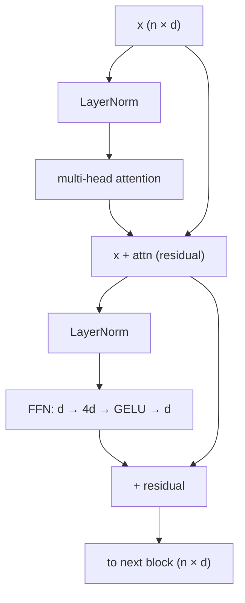
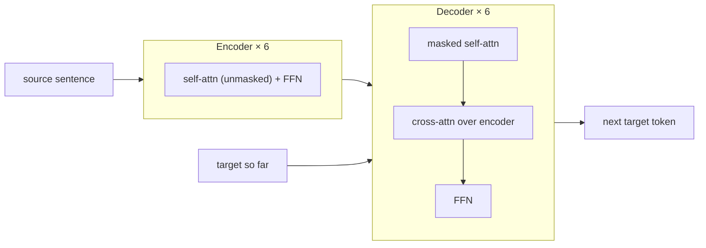

# 5 · The Transformer Block

*Transformer & GPT module · Lesson 5 of 10 · [← Multi-Head Attention](04-multi-head-attention.md) · [next → Encoder vs Decoder Families](06-encoder-vs-decoder-families.md)*

> **One-liner:** The repeating unit of every LLM is attention + a per-token MLP, each wrapped in a residual connection and a LayerNorm — attention moves information *between* tokens, the FFN transforms information *within* each token, and the residual stream carries everything forward.

## 🎯 TL;DR

- Block = **two sublayers**: multi-head attention, then a **feed-forward network** (FFN) — each as `x + sublayer(norm(x))` (pre-LN, the modern arrangement).
- The FFN is a 2-layer MLP applied **identically and independently to every token**: expand d → 4d, nonlinearity, project back. It holds **~2/3 of the model's parameters** and much of its factual "knowledge."
- **Residual connections** turn the network into a "residual stream" that layers *edit* rather than replace — this is what makes 100-layer models trainable.
- The original 2017 model arranged these blocks into an **encoder-decoder**; GPT keeps only the decoder stack.

---

## 5.1 The block, drawn



```python
def block(x):
    x = x + attn(ln1(x))   # tokens talk to each other
    x = x + ffn(ln2(x))    # each token thinks alone
    return x
```

Two lines. GPT-3 is this, 96 times.

---

## 5.2 The FFN — the forgotten majority

```text
FFN(x) = GELU(x·W_1 + b_1)·W_2 + b_2      # W_1: d×4d, W_2: 4d×d
```

| Property | Consequence |
|----------|-------------|
| **Position-wise** — same weights, each token separately | No token mixing here; that's attention's job |
| **4× expansion** | 2 × d × 4d params ≈ **2/3 of the model** |
| Acts like key-value memory (research framing) | W_1 rows ≈ pattern detectors, W_2 columns ≈ what to write when a pattern fires — where facts like "Paris → France" measurably live |

The clean mental model: **attention = communication, FFN = computation.** A block lets tokens exchange messages, then each token updates its own state.

---

## 5.3 Residuals: the stream, not the pipeline

Without residuals, 96 stacked layers = a 96-deep function composition — gradients die, training diverges. With them:

- **Gradient highway:** the identity path gives every layer a direct route to the loss.
- **Iterative refinement:** each block adds a small *delta* to a persistent `(n, d)` stream; early-layer information (like positions) remains available at layer 90.
- **Interpretability frame:** heads and FFNs "read from" and "write to" the shared stream — the working memory of the whole model.

---

## 5.4 Pre-LN vs post-LN (the quiet but crucial change)

| | Post-LN (2017 original) | Pre-LN (GPT-2 onward, universal) |
|---|------------------------|----------------------------------|
| Form | `LN(x + sub(x))` | `x + sub(LN(x))` |
| Residual path | interrupted by LN | **clean identity** end to end |
| Training | needs LR warmup, unstable when deep | stable at great depth |

Pre-LN is arguably the most important *silent* fix between the 2017 paper and modern LLMs: it's what made very deep stacks train reliably. Modern models also swap LayerNorm for **RMSNorm** (same role, cheaper — [Lesson 10](10-modern-architecture-variants.md)).

---

## 5.5 The original 2017 assembly (for completeness)



The decoder block has a **third sublayer** — cross-attention into the encoder. Delete the encoder and that sublayer, and what remains — masked self-attn + FFN — is exactly a **GPT block**. That deletion is the story of [Lesson 6](06-encoder-vs-decoder-families.md).

---

## Key terms

| Term | Meaning |
|------|---------|
| **FFN / MLP sublayer** | Per-token 2-layer network, d → 4d → d; most of the parameters |
| **Residual stream** | The running `(n,d)` vector that every sublayer additively edits |
| **Pre-LN** | Norm *inside* the residual branch — the stability fix that enabled depth |
| **GELU** | Smooth ReLU variant used in GPT FFNs |
| **Cross-attention sublayer** | The decoder→encoder bridge GPT deleted |

## ✍️ Notes / follow-ups

- "Attention = communication, FFN = computation" is the single best one-liner for explaining a block in an interview.
- Fine-tuning connection: LoRA ([`../../Shared/01_lora-qlora/`](../../Shared/01_lora-qlora/README.md)) injects low-rank deltas into exactly these W_Q/W_V/FFN matrices.
- **Next:** which halves of the 2017 model survived, and who uses what → [Encoder vs Decoder Families](06-encoder-vs-decoder-families.md).
