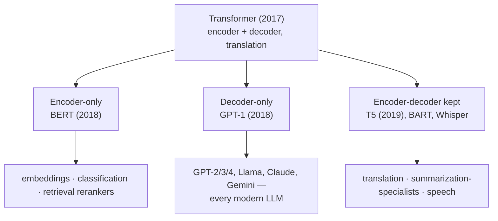

# 6 · Encoder vs Decoder Families

*Transformer & GPT module · Lesson 6 of 10 · [← The Transformer Block](05-the-transformer-block.md) · [next → GPT Architecture in Detail](07-gpt-architecture-in-detail.md)*

> **One-liner:** The 2017 encoder-decoder split into three lineages — encoder-only (BERT: understand), decoder-only (GPT: generate), encoder-decoder (T5: transform) — and decoder-only won the LLM era because one simple objective scales further than clever ones.

## 🎯 TL;DR

- **Encoder-only (BERT):** bidirectional attention, masked-word training → embeddings & classification, can't generate.
- **Decoder-only (GPT):** causal attention, next-token training → generation; understanding *emerges*.
- **Encoder-decoder (T5, translation, Whisper):** read fully, then generate — still best when input and output are clearly different sequences.
- Why decoder-only won: **every token is a training signal**, the objective needs no labels or corruption scheme, and generation *subsumes* understanding at scale.

---

## 6.1 The family tree



---

## 6.2 The three, compared

| | Encoder-only (BERT) | Decoder-only (GPT) | Encoder-decoder (T5) |
|---|--------------------|--------------------|---------------------|
| Attention | **Bidirectional** — every token sees all | **Causal** — only past | Bidirectional in, causal out + cross |
| Pretraining | Masked LM: hide 15%, predict them | **Next token, every position** | Span corruption (mask spans, regenerate) |
| Signal per pass | ~15% of tokens | **100% of tokens** | corrupted spans |
| Can generate? | No (no autoregressive path) | **Yes — it's the whole design** | Yes |
| Today's role | Embedding models, rerankers ([`../06_vector-databases/`](../06_vector-databases/README.md)) | **The LLM** | Translation, Whisper-style speech |

---

## 6.3 Why decoder-only won the scaling race

1. **Training efficiency:** predicting *every* next token means every position of every sequence contributes loss — BERT wastes 85% of positions per pass.
2. **Objective simplicity:** no masking-rate choices, no span-corruption schemes, no `[MASK]` train/inference mismatch. Raw text in, loss out — and simple objectives are what scaling laws ([Lesson 8](08-gpt-training-and-scaling.md)) reward.
3. **Generation subsumes understanding:** to predict the next token of a legal contract you must implicitly *understand* it — so classification/QA/summarization all collapse into "continue this text" (the GPT-2 insight) and later "follow this instruction."
4. **One deployment target:** a single autoregressive engine serves every task — massive infra leverage vs. per-task heads.

> The honest caveat: for *pure embedding* tasks, bidirectional encoders are still stronger per-parameter — a token that sees its full context makes a better representation. Which is why the embedding models behind RAG ([`../12_rag/`](../12_rag/README.md)) are mostly encoder-style even in the decoder-only era.

---

## 6.4 Attention masks are the whole difference

Strip away branding and the three families differ in **one matrix** — the attention mask:

```text
Encoder (BERT)          Decoder (GPT)           Enc-Dec (T5)
■ ■ ■ ■                 ■ · · ·                 encoder: full ■
■ ■ ■ ■                 ■ ■ · ·                 decoder: causal
■ ■ ■ ■                 ■ ■ ■ ·                 + cross-attn to encoder
■ ■ ■ ■                 ■ ■ ■ ■
(sees everything)       (sees only past)
```

Same blocks, same FFNs, same embeddings — the mask decides the family. The causal mask's exact mechanics open the next lesson.

---

## Key terms

| Term | Meaning |
|------|---------|
| **Bidirectional attention** | Every token attends to the full sequence (BERT) |
| **Causal / autoregressive attention** | Tokens attend only to positions ≤ themselves (GPT) |
| **Masked LM (MLM)** | BERT's objective — predict artificially hidden tokens |
| **Span corruption** | T5's objective — regenerate masked-out spans |
| **Autoregressive** | Generating one token at a time, each conditioned on all previous |

## ✍️ Notes / follow-ups

- Interview framing that lands: "the three families are one architecture with three masks."
- Embedding/reranker models in the RAG stack are the encoder lineage's surviving stronghold — connect to [`../06_vector-databases/`](../06_vector-databases/README.md).
- **Next:** inside the winning branch, layer by layer → [GPT Architecture in Detail](07-gpt-architecture-in-detail.md).
