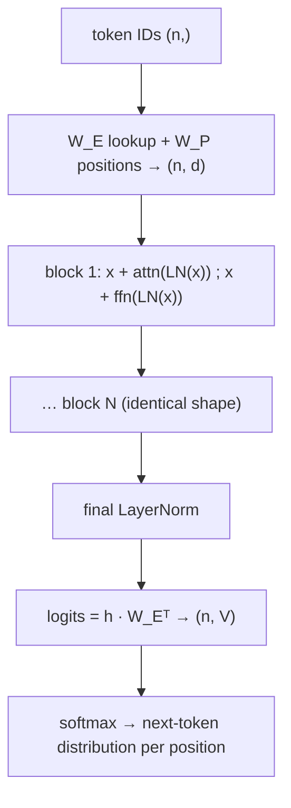

# 7 · GPT Architecture in Detail

*Transformer & GPT module · Lesson 7 of 10 · [← Encoder vs Decoder Families](06-encoder-vs-decoder-families.md) · [next → GPT Training & Scaling](08-gpt-training-and-scaling.md)*

> **One-liner:** GPT is embeddings → N identical pre-LN decoder blocks (masked self-attention + FFN) → final LayerNorm → a tied unembedding that turns the last hidden state into a probability over the whole vocabulary — nothing else.

## 🎯 TL;DR

- Full forward pass in five lines: **embed + positions → blocks × N → final LN → logits = h·W_Eᵀ → softmax.**
- The **causal mask** adds −∞ above the diagonal of the score matrix *before* softmax → future weights become exactly 0 → every position trains as an independent next-token problem **in parallel**.
- **Weight tying**: the output projection reuses the embedding matrix transposed — saves ~38M params in GPT-2 and enforces input/output semantic symmetry.
- GPT-1 → 2 → 3 changed *almost nothing* architecturally — pre-LN placement and sheer scale (117M → 175B) are the whole diff. The lesson: the recipe was right; capability was a function of size.

---

## 7.1 The complete anatomy



```python
def gpt(ids):
    x = W_E[ids] + W_P[:len(ids)]          # (n, d)
    for block in blocks:                    # N × (masked attn + FFN), pre-LN
        x = block(x)
    x = ln_f(x)
    return x @ W_E.T                        # (n, V) — weight-tied logits
```

Every row of the output is a full distribution over V tokens: row i answers *"given tokens 0…i, what comes next?"*

---

## 7.2 The causal mask, mechanically

Apply to the score matrix **before** softmax:

```text
scores = Q·Kᵀ/√d_k                     mask (n=4)              after softmax
[s00 s01 s02 s03]                 [  0  -∞  -∞  -∞ ]        [ 1   0   0   0 ]
[s10 s11 s12 s13]      +          [  0   0  -∞  -∞ ]   →    [ w  w   0   0 ]
[s20 s21 s22 s23]                 [  0   0   0  -∞ ]        [ w  w   w   0 ]
[s30 s31 s32 s33]                 [  0   0   0   0 ]        [ w  w   w   w ]
```

−∞ → softmax weight of exactly **0**: the future is not "discouraged," it is *unreachable*. Two payoffs:

1. **Parallel training:** one forward pass over an n-token sequence yields **n** next-token training examples simultaneously — position 3 predicts token 4 while position 500 predicts token 501, no leakage.
2. **Train/inference consistency:** generation-time (where the future genuinely doesn't exist) matches training-time exactly.

---

## 7.3 Weight tying & the unembedding

The final projection `(d → V)` is the embedding matrix transposed. Logit for token t = **dot product of the hidden state with t's embedding** — "which token's vector does my prediction point at?" Benefits: ~V×d params saved (38.6M in GPT-2 small — a third of the model), a shared semantic space for reading and writing tokens, and slightly better perplexity in practice.

---

## 7.4 GPT-1 → GPT-2 → GPT-3: the scaling ladder

| | GPT-1 (2018) | GPT-2 (2019) | GPT-3 (2020) |
|---|-------------|--------------|--------------|
| Params | 117M | 1.5B | **175B** |
| Layers / d_model / heads | 12 / 768 / 12 | 48 / 1600 / 25 | **96 / 12288 / 96** |
| Context | 512 | 1024 | 2048 |
| Data | ~5GB books | 40GB WebText | ~570GB filtered CommonCrawl+ |
| Architecture change | (baseline, post-LN) | **pre-LN**, vocab 50257 | sparse/dense attn alternation; else same |
| Headline finding | pretrain→finetune works | **zero-shot task transfer** | **in-context / few-shot learning** |

The through-line for interviews: **the architecture froze in 2019** — GPT-3 is GPT-2 with ~100× more parameters. Every capability jump (zero-shot → few-shot) came from scale, not structure. What scale bought and how it was measured → [Lesson 8](08-gpt-training-and-scaling.md).

---

## 7.5 Where the parameters live (GPT-2 small, 124M)

| Component | Params | % |
|-----------|--------|---|
| Embeddings W_E + W_P | ~39M | 31% |
| Attention (12 layers) | ~28M | 23% |
| FFNs (12 layers) | ~57M | **46%** |

At GPT-3 scale the embedding share shrinks (~1%) and FFNs dominate (~65%) — big models are mostly MLP.

---

## Key terms

| Term | Meaning |
|------|---------|
| **Causal mask** | −∞ above the score-matrix diagonal → zero attention to the future |
| **Unembedding** | Final d→V projection producing logits; tied to W_E in GPT |
| **Weight tying** | Sharing the embedding matrix between input lookup and output projection |
| **Logits** | Pre-softmax scores over the vocabulary |
| **Context window** | Max sequence length attention spans (512 → 2048 → 100k+ era) |

## ✍️ Notes / follow-ups

- Karpathy's **nanoGPT** is this lesson in ~300 lines of PyTorch — the single best way to make it stick; worth a build session.
- Fine-tuning targets exactly these matrices ([`../02_fine-tuning-and-alignment/`](../02_fine-tuning-and-alignment/README.md)); LoRA typically hooks W_Q/W_V.
- **Next:** the objective, the data, and the laws that turned this frozen architecture into a capability ladder → [GPT Training & Scaling](08-gpt-training-and-scaling.md).
