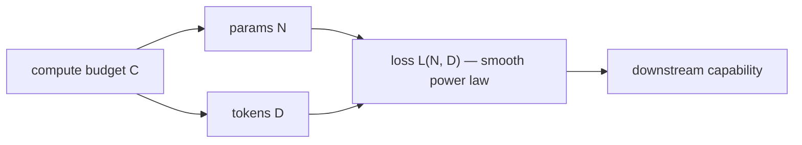
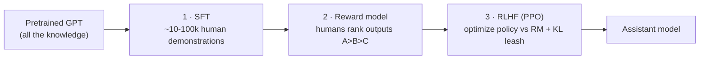

# 8 · GPT Training & Scaling

*Transformer & GPT module · Lesson 8 of 10 · [← GPT Architecture in Detail](07-gpt-architecture-in-detail.md) · [next → Inference & the KV Cache](09-inference-and-kv-cache.md)*

> **One-liner:** GPT training is cross-entropy on next-token prediction over web-scale text, governed by scaling laws that make loss a predictable function of compute — then a comparatively tiny alignment phase (SFT + RLHF) turns the raw text-continuer into an assistant.

## 🎯 TL;DR

- **One loss:** `−log P(token_{i+1} | tokens_{≤i})`, averaged over every position of every sequence. That's the entire pretraining recipe.
- **Scaling laws (Kaplan 2020):** loss falls as a smooth power law in params/data/compute — capability became *plannable*.
- **Chinchilla correction (2022):** for a fixed compute budget, params and data should scale **together** (~20 tokens/param) — GPT-3 was significantly *undertrained*, not undersized.
- **Alignment (InstructGPT recipe):** SFT → reward model → RLHF/PPO. Uses ~0.001% of pretraining compute but transforms usability — it changes *behavior*, not *knowledge*.

---

## 8.1 The pretraining objective

```text
Text: "the cat sat on the mat"
Position 0 predicts "cat" · 1 predicts "sat" · 2 predicts "on" · … 
Loss = mean cross-entropy over ALL positions (causal mask makes them independent — Lesson 7)
```

Why this trains *understanding*: predicting the next token of arbitrary internet text at low loss requires grammar, facts, style, sentiment, arithmetic-ish patterns, and reasoning-shaped structure — **the objective is simple; satisfying it is not.** Compression = intelligence, operationalized.

Training-run mechanics (GPT-3 class): sequences packed to full context length, batch sizes in the millions of tokens, Adam + cosine LR decay + warmup, weeks on thousands of GPUs, one epoch or less over deduplicated data (repeating data hurts at this scale).

---

## 8.2 Scaling laws — capability as an exchange rate



| Finding | Statement | Consequence |
|---------|-----------|-------------|
| **Kaplan 2020** | L falls as a power law in N, D, C over 7 orders of magnitude | You can *forecast* a bigger model's loss before spending — justified GPT-3 |
| Kaplan's slope | favors params over data | led to huge-but-undertrained models (GPT-3: 175B params, 300B tokens) |
| **Chinchilla 2022** | compute-optimal: **D ≈ 20·N** | Chinchilla (70B/1.4T) beat Gopher (280B/300B) with the same compute |
| Post-Chinchilla practice | "overtrain" small models beyond 20:1 | Llama-class: smaller N, far more D → cheaper *inference* forever after |

The Chinchilla nuance worth saying out loud: 20:1 optimizes **training** compute only. Since inference cost scales with N and is paid for the model's whole life, production models deliberately overtrain smaller N — a training-vs-serving trade, not a violation of the law.

---

## 8.3 From text-continuer to assistant: the alignment pipeline

Raw GPT-3 completes text — ask it a question, it may continue with *more questions* (that's a plausible continuation of a question list). The InstructGPT/ChatGPT recipe:



| Stage | What it teaches | Scale vs pretraining |
|-------|----------------|---------------------|
| **SFT** | the assistant *format* — answer, don't continue | tiny (thousands of examples) |
| **Reward model** | a scalar proxy for human preference | trained on rankings, not gold answers |
| **RLHF/PPO** | push outputs toward preferred; **KL penalty** stops it drifting from the base model (reward hacking guard) | ~days, not months |

Key mental model: **pretraining = capability, alignment = behavior.** The 13k SFT examples don't add knowledge; they select a persona already latent in the base model. (DPO and successors simplify stage 3 — details live in [`../02_fine-tuning-and-alignment/`](../02_fine-tuning-and-alignment/README.md).)

---

## 8.4 Emergence and in-context learning

GPT-3's headline wasn't its loss — it was **few-shot prompting**: show k examples *in the prompt*, and the frozen model performs the task with **no gradient updates**. Mechanistically linked to induction heads ([Lesson 4](04-multi-head-attention.md)); practically, it birthed prompt engineering ([`../01_prompt-engineering/`](../01_prompt-engineering/README.md)). "Emergent abilities" (sharp capability jumps at scale) remain partly contested — some sharpness is a metric artifact — but the practical point stands: **scale unlocked task-generality that small models simply don't have.**

---

## Key terms

| Term | Meaning |
|------|---------|
| **Next-token / autoregressive LM loss** | Cross-entropy of predicting each token from its prefix |
| **Scaling laws** | Power-law fits of loss vs N/D/C (Kaplan; corrected by Chinchilla) |
| **Chinchilla-optimal** | ~20 tokens per parameter for fixed training compute |
| **SFT** | Supervised fine-tuning on demonstration data — teaches format |
| **RLHF** | RL (PPO) against a learned human-preference reward model, KL-leashed |
| **In-context learning** | Task adaptation from prompt examples alone, no weight updates |

## ✍️ Notes / follow-ups

- The three-way link to remember: *causal mask → every token is a training example → scaling laws hold → GPT-3.* Each lesson feeds the next.
- Deep dive on SFT/RLHF/DPO mechanics: [`../02_fine-tuning-and-alignment/`](../02_fine-tuning-and-alignment/README.md); eval of aligned behavior: [`../16_evals/`](../16_evals/README.md).
- **Next:** training is parallel, but generation is one token at a time — how inference actually runs → [Inference & the KV Cache](09-inference-and-kv-cache.md).
