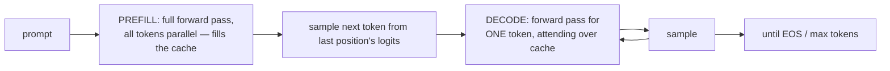

# 9 · Inference & the KV Cache

*Transformer & GPT module · Lesson 9 of 10 · [← GPT Training & Scaling](08-gpt-training-and-scaling.md) · [next → Modern Variants](10-modern-architecture-variants.md)*

> **One-liner:** Generation is a loop — predict, sample, append, repeat — and the KV cache makes each iteration cheap by storing every past token's keys and values, turning per-token cost from O(n²) to O(n) at the price of a large, growing memory footprint.

## 🎯 TL;DR

- Inference has **two phases**: **prefill** (process the whole prompt in parallel — compute-bound) and **decode** (one token at a time — **memory-bandwidth-bound**).
- **KV cache:** past tokens' K and V never change (causal mask ⇒ they can't see new tokens), so cache them; each new token computes only *its own* q/k/v and attends over the cache.
- Cache size is the serving bottleneck: `2 · layers · n · d · bytes` per sequence — **~1.2 GB for a single 2048-token GPT-3 sequence** at fp16.
- The **sampling knobs** — temperature, top-k, top-p — all reshape the same softmax distribution; greedy = argmax, creativity = flatter.

---

## 9.1 The generation loop



Why the phases feel different in products: **time-to-first-token** = prefill (long prompt → long wait), then **tokens/sec** = decode speed. Two different bottlenecks, two different SLOs.

---

## 9.2 The KV cache, derived

Without caching, generating token n+1 means re-running attention for all n+1 tokens — total work for an m-token generation is O(m³)-ish. The fix falls out of the causal mask:

> Token j's key and value depend only on token j and the weights. New tokens **can't change the past's K/V.** So compute them once, keep them.

```python
# decode step for ONE new token x_new, per layer:
q = x_new @ W_Q                       # (1, d) — only the new token
k = x_new @ W_K ; v = x_new @ W_V
K_cache = concat(K_cache, k)          # grows by one row
V_cache = concat(V_cache, v)
out = softmax(q @ K_cache.T / sqrt(d_k)) @ V_cache   # (1, n) weights — O(n), not O(n²)
```

| | No cache | With cache |
|---|---------|-----------|
| Work per new token | O(n²·d) | **O(n·d)** |
| Extra memory | none | 2·L·n·d per sequence, growing |
| What's recomputed | everything | only the new token's path |

---

## 9.3 The memory bill (and why GQA exists)

GPT-3-class math: 96 layers × 2 (K and V) × 2048 tokens × 12288 dims × 2 bytes ≈ **9.7 GB… per sequence** at full context — before batching. (GPT-2 small: a friendlier ~36 MB.) Consequences:

- **Batch size is capped by cache memory, not compute** — GPUs sit half-idle while VRAM is full of cache.
- Decode reads the *entire cache* from VRAM per token → **memory-bandwidth-bound**, which is why tokens/sec barely improves with more FLOPs.
- Direct causes of: **MQA/GQA** (share K/V across heads → cache ÷ 8–12, [Lesson 10](10-modern-architecture-variants.md)), **PagedAttention/vLLM** (allocate cache in pages, no fragmentation), **prefix caching** (share the system prompt's cache across requests), quantized caches.

Serving-stack detail lives in [`../04_llm-serving-and-inference-optimization/`](../04_llm-serving-and-inference-optimization/README.md) — this lesson is the *why* under all of it.

---

## 9.4 Sampling: shaping one distribution

Every knob operates on the final softmax over V tokens:

| Knob | Mechanism | Effect |
|------|-----------|--------|
| **Greedy** | argmax | deterministic, repetitive loops |
| **Temperature T** | `softmax(logits / T)` | T<1 sharpen (safer), T>1 flatten (wilder), T→0 = greedy |
| **Top-k** | keep k highest, renormalize | hard cap on candidates (crude when distribution is flat) |
| **Top-p (nucleus)** | keep smallest set with cumulative prob ≥ p | **adaptive** candidate count — the sane default |
| Repetition/frequency penalty | down-weight already-used tokens | fights loops |

Practical pairing: `temperature ≈ 0.7 + top_p ≈ 0.9` for chat; `temperature ≈ 0` for extraction/tool-calling where determinism matters (connects to structured output in [`../01_prompt-engineering/`](../01_prompt-engineering/README.md)).

> **Speculative decoding** (preview): a small draft model proposes k tokens, the big model verifies them in *one* parallel pass — exploits the fact that verification is parallel even though generation isn't. It's the decode-phase counterpart of prefill's parallelism.

---

## Key terms

| Term | Meaning |
|------|---------|
| **Prefill** | Parallel forward pass over the prompt; fills the KV cache; compute-bound |
| **Decode** | Sequential one-token-at-a-time generation; memory-bandwidth-bound |
| **KV cache** | Stored keys/values of all past tokens, per layer per head |
| **TTFT** | Time-to-first-token — the prefill latency users feel |
| **Nucleus (top-p) sampling** | Sample from the smallest set of tokens covering probability p |
| **Speculative decoding** | Draft-then-verify to parallelize decode |

## ✍️ Notes / follow-ups

- The one-sentence interview answer for "why is LLM inference expensive?": *decode is memory-bandwidth-bound on a per-sequence cache that grows with context — not FLOP-bound.*
- vLLM/PagedAttention, continuous batching, quantization: [`../04_llm-serving-and-inference-optimization/`](../04_llm-serving-and-inference-optimization/README.md).
- **Next:** the architecture changes (RoPE, GQA, MoE…) that modern models made largely *because* of these inference economics → [Modern Variants](10-modern-architecture-variants.md).
