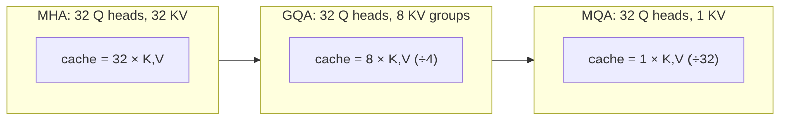

# 10 · Modern Architecture Variants

*Transformer & GPT module · Lesson 10 of 10 · [← Inference & the KV Cache](09-inference-and-kv-cache.md) · [module README](README.md)*

> **One-liner:** The GPT-2 recipe survived, but every ingredient got swapped for a leaner version — RoPE for positions, RMSNorm for LayerNorm, SwiGLU for GELU-FFN, GQA for full multi-head KV, and MoE to grow parameters without growing per-token compute.

## 🎯 TL;DR

- The "modern default" (Llama-style) block: **RMSNorm → attention with RoPE + GQA → RMSNorm → SwiGLU FFN**, no biases. Same skeleton as [Lesson 5](05-the-transformer-block.md), every part upgraded.
- **RoPE** rotates Q/K by position-dependent angles → attention scores depend on **relative** offsets; basis of most long-context extension tricks.
- **GQA** shares K/V across groups of query heads → KV cache shrinks ~8× with negligible quality loss (directly solving [Lesson 9](09-inference-and-kv-cache.md)'s bottleneck).
- **MoE** replaces each FFN with N experts + a router activating the top-2 → a model can have huge *total* params but small *active* params per token.

---

## 10.1 GPT-2 (2019) vs the modern default, side by side

| Ingredient | GPT-2/3 | Modern (Llama-class) | Why it changed |
|-----------|---------|---------------------|----------------|
| Positions | learned absolute, added once | **RoPE** in every attn layer | relative offsets; length extrapolation |
| Norm | LayerNorm (mean+var, bias) | **RMSNorm** (scale only) | ~same quality, cheaper, more stable |
| FFN activation | GELU, 4× expand | **SwiGLU**, ~2.7× expand (gated) | consistent quality win at same params |
| Attention heads | full multi-head (h sets of K/V) | **GQA** (h queries, few K/V groups) | KV cache ÷ 4–12 at serving |
| Biases | everywhere | **removed** | no measurable loss, fewer params |
| Vocab | 50k | 100k–256k | multilingual + cheaper sequences |
| Context | 1k–2k | 128k–1M+ | RoPE scaling + efficient attention kernels |

The punchline: **nothing structural changed** — it's the same residual-stream, attention+FFN machine from 2017, with a decade of ablation-driven part swaps.

---

## 10.2 RoPE — positions as rotation

Instead of *adding* a position vector once at the bottom, RoPE **rotates** each Q/K pair-of-dims by angle `pos·θ_i` inside every attention:

```text
q_m·k_n after rotation depends only on (m − n)   ← the relative offset
```

| Property | Payoff |
|----------|--------|
| Relative by construction | "3 tokens apart" means the same thing at position 10 or 10,000 |
| Applied per layer, not once | position info never washes out of the residual stream |
| Frequency spectrum (like sinusoidal, but multiplicative) | low-freq dims see far, high-freq dims see near |
| **Scalable** | position interpolation / NTK / YaRN stretch a 4k-trained model to 128k+ with light finetuning — the entire long-context era rides on this |

---

## 10.3 MQA → GQA — paying down the KV cache



MQA (one shared K/V) maximizes savings but costs quality; **GQA is the accepted sweet spot** — groups of queries share a K/V head, exploiting the head redundancy observed back in [Lesson 4](04-multi-head-attention.md). This is an *inference-economics* change wearing an architecture costume: it exists because decode is memory-bound ([Lesson 9](09-inference-and-kv-cache.md)).

---

## 10.4 MoE — sparse capacity

Replace each dense FFN with **N expert FFNs + a learned router**; each token is sent to its top-k (usually 2) experts:

| | Dense 70B | MoE, 8×22B-style |
|---|----------|------------------|
| Total params | 70B | ~140B+ |
| **Active** per token | 70B | ~39B |
| Training compute / token | ∝ total | ∝ **active** |
| Serving cost | ∝ params in VRAM | all experts in VRAM, but per-token FLOPs low |

Why the FFN and not attention? Because FFNs are 2/3 of parameters ([Lesson 5](05-the-transformer-block.md)) and act like key-value knowledge memories — sharding *knowledge* across experts is natural. Costs: router load-balancing losses, higher VRAM floor, trickier distributed serving. Mixtral, and (per credible reporting) GPT-4-class frontier models, are MoE.

---

## 10.5 The frontier beyond the block

| Direction | Idea | Status |
|-----------|------|--------|
| **FlashAttention** | exact attention, IO-aware kernel — never materialize the n×n matrix in HBM | universal; a *kernel*, not an architecture change |
| Sliding-window / hybrid attention | most layers see a local window, some see global | Mistral, Gemma-class; linear-ish cost |
| **State-space models (Mamba)** | recurrence returns with trainable-parallel scan — O(n), constant memory | promising; hybrids (attention + SSM layers) are the pragmatic form |
| Multimodality | vision encoder → projector → tokens in the same decoder stream | standard (GPT-4V/Gemini pattern); the decoder-only stream absorbed images |
| Reasoning via inference-time compute | spend tokens thinking (CoT/RL-trained reasoning) instead of only scaling params | the post-2024 scaling axis — architecture unchanged |

---

## Key terms

| Term | Meaning |
|------|---------|
| **RoPE** | Rotary position embedding — rotate Q/K so scores encode relative offsets |
| **RMSNorm** | LayerNorm minus mean-centering and bias; scale-only normalization |
| **SwiGLU** | Gated FFN activation: `(xW_g · swish(xW_1))W_2` |
| **MQA / GQA** | One / few shared K-V head(s) serving many query heads — KV-cache compression |
| **MoE** | Mixture-of-Experts — routed sparse FFNs; total ≫ active params |
| **FlashAttention** | Tiled, IO-aware exact-attention kernel |

## ✍️ Notes / follow-ups

- Best mental summary of the decade: *2017 gave the skeleton, 2019 froze it, everything since is metabolism — cheaper positions, cheaper norm, cheaper KV, sparser FFNs.*
- Serving implications of GQA/FlashAttention/PagedAttention: [`../04_llm-serving-and-inference-optimization/`](../04_llm-serving-and-inference-optimization/README.md); fine-tuning interplay (LoRA on GQA models): [`../../Shared/01_lora-qlora/`](../../Shared/01_lora-qlora/README.md).
- Module complete — loop back to the [README cheat sheet](README.md) and try reciting the whole forward pass (tokens → embeddings → blocks → logits → sample → cache) from memory.
