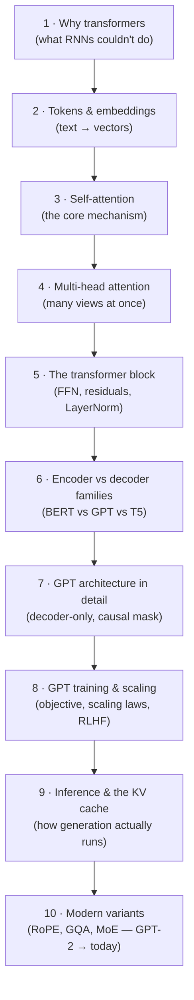

# 🧠 Transformer & GPT Architecture

> How the transformer actually works — attention, blocks, and positional encoding — and how GPT turns a stack of decoder blocks into a text-generating machine: training objective, scaling, inference, and everything modern LLMs changed since.

These notes are a **reference module** (concept + math intuition + diagrams), the architectural foundation under everything else in this repo: prompting ([`../01_prompt-engineering/`](../01_prompt-engineering/README.md)) manipulates the model's *input*, fine-tuning ([`../02_fine-tuning-and-alignment/`](../02_fine-tuning-and-alignment/README.md)) its *weights*, serving ([`../04_llm-serving-and-inference-optimization/`](../04_llm-serving-and-inference-optimization/README.md)) its *runtime* — this module is the model itself.

---

## 🗺️ The arc of this module

---

## 📓 Lessons

| # | Lesson | What you'll learn |
|---|--------|-------------------|
| 1 | [Why Transformers](01-why-transformers.md) | The RNN bottleneck, "Attention Is All You Need," why parallelism won |
| 2 | [Tokenization & Embeddings](02-tokenization-and-embeddings.md) | BPE, token embeddings, positional encoding — text → vectors |
| 3 | [Self-Attention](03-self-attention.md) | Q/K/V, scaled dot-product, a worked example you can trace by hand |
| 4 | [Multi-Head Attention](04-multi-head-attention.md) | Head projections, why many small heads beat one big one |
| 5 | [The Transformer Block](05-the-transformer-block.md) | FFN, residual streams, pre- vs post-LayerNorm, the full 2017 encoder-decoder |
| 6 | [Encoder vs Decoder Families](06-encoder-vs-decoder-families.md) | BERT (encoder), GPT (decoder), T5 (both) — which for what |
| 7 | [GPT Architecture in Detail](07-gpt-architecture-in-detail.md) | Decoder-only anatomy, causal masking, GPT-1 → 2 → 3 evolution |
| 8 | [GPT Training & Scaling](08-gpt-training-and-scaling.md) | Next-token objective, scaling laws, Chinchilla, the RLHF pipeline |
| 9 | [Inference & the KV Cache](09-inference-and-kv-cache.md) | Autoregressive decoding, prefill vs decode, sampling knobs |
| 10 | [Modern Variants](10-modern-architecture-variants.md) | RoPE, RMSNorm, SwiGLU, GQA/MQA, MoE, long context — what changed since GPT-3 |

---

## ⚡ The whole module in one cheat sheet

| Concept | One-line essence |
|---------|-----------------|
| **Self-attention** | Every token computes a weighted average of every other token's value, weights = query·key similarity |
| **Multi-head** | Run attention h times in parallel subspaces, concat — different heads learn different relations |
| **FFN** | Per-token 2-layer MLP (~2/3 of parameters) — where "knowledge" largely lives |
| **Residual stream** | Each sublayer *adds* to a running vector; the block is `x + f(x)`, twice |
| **Causal mask** | GPT tokens can only attend backward — enables next-token training and generation |
| **Next-token prediction** | The entire pretraining objective; everything else emerges from it at scale |
| **KV cache** | Store past keys/values so each new token is O(n), not O(n²) — the memory cost of fast inference |
| **Scaling laws** | Loss falls predictably with compute; Chinchilla: scale data ~equally with parameters |
| **RoPE / GQA / MoE** | The three biggest post-GPT-3 architecture shifts: better positions, cheaper KV, sparse capacity |

---

## 📚 How each page is structured

Each lesson: a **one-liner**, a **TL;DR**, numbered sections mixing **tables + Mermaid diagrams** (and small worked numeric examples where the math matters), a **Key terms** table, and **Notes / follow-ups** cross-linking siblings and other modules.

*Reference notes for personal study, synthesized from the original papers (Vaswani et al. 2017; Radford et al. 2018/2019; Brown et al. 2020; Kaplan et al. 2020; Hoffmann et al. 2022; Ouyang et al. 2022; Su et al. 2021) and standard explainers (The Illustrated Transformer, Karpathy's nanoGPT/Zero-to-Hero). Verify exact model numbers against the papers — they're cited from memory of public sources.*
