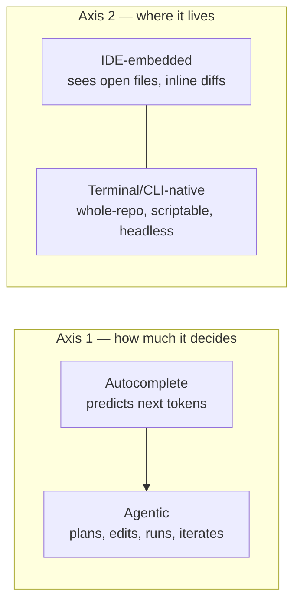
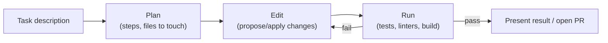

# 1 · The AI Coding-Agent Landscape

*AI Coding Agents & Code Eval module · Lesson 1 of 3 · [next → Evaluating AI-Generated Code](02-evaluating-ai-generated-code.md)*

> **One-liner:** The tools split along two independent axes — *autocomplete vs. agentic* (does it just predict, or plan-edit-run-iterate?) and *where it lives* (IDE-embedded vs. terminal/CLI-native) — and most confusion about "which tool is best" is really "best for which axis."

## 🎯 TL;DR

- **Autocomplete tools** predict the next few tokens/lines inline as you type — fast, low-friction, but you drive every decision.
- **Agentic tools** take a task description, form a plan, edit multiple files, run commands/tests, and iterate on failures **without you approving every keystroke**.
- **IDE-embedded** tools live inside your editor and see what's open; **terminal/CLI-native** agents operate on the whole repo/filesystem and are easier to script, chain, and run headless (CI, batch jobs).
- No tool is strictly "better" — they're optimized for different loops, and a real evaluator/contractor needs working fluency across several.

---

## 1.1 The two axes

| Tool (2026-era, generalized) | Primary axis-1 position | Primary axis-2 position | Notable trait |
|---|---|---|---|
| GitHub Copilot | autocomplete-first, agent mode added | IDE-embedded | Widest IDE integration footprint |
| Cursor | agentic, IDE-native | IDE-embedded (own editor) | Multi-file agentic edits inside a familiar VS Code-like UI |
| Claude Code | agentic | terminal/CLI-native | Deep repo-wide context, custom commands/subagents/hooks — see [Module 17](../17_claude-code/README.md) |
| OpenAI Codex / Codex CLI | agentic | terminal/CLI-native | Sandboxed execution, task-oriented (assign a ticket, get a PR) |
| Gemini CLI | agentic | terminal/CLI-native | Free/open tier, scriptable automation focus |

> These positions shift fast — every vendor is racing toward "agentic + both surfaces." Treat this table as a **framework for asking the right questions about any tool**, not a permanent scoreboard.

---

## 1.2 Why the distinction matters for evaluation work

If you're comparing tools (the actual deliverable in an agent-evaluation contract), **holding the axis-2 variable constant matters as much as the task**:

| Bad comparison | Why it's invalid | Fair comparison |
|---|---|---|
| "Copilot's inline suggestion" vs. "Claude Code's full-repo refactor" | Different scope of work entirely — one edits a line, one edits a codebase | Give both tools the **same** multi-file refactor task and the **same** acceptance criteria |
| Judging an agentic tool by its first draft | Agentic tools are built to **iterate** — a first draft failing tests isn't a verdict | Let it run its full loop (edit → test → fix) before grading the *final* output |
| Testing headless-CLI tools only inside an IDE chat window | Ignores their actual strength (scriptability, CI integration) | Test each tool in the environment it's designed for |

---

## 1.3 The agent loop, generically

Every agentic coding tool — regardless of vendor — implements some version of this loop, which is the thing you're actually evaluating, not just the final diff:

Where tools genuinely differ: how good the **plan** is (does it identify the right files before touching anything?), how it handles a **failing run** (does it actually read the error and fix the right thing, or thrash?), and how transparently it **shows its reasoning** (can you review the plan before it executes, or only the final diff?). Those three questions are the backbone of [Lesson 2](02-evaluating-ai-generated-code.md)'s rubric.

---

## 1.4 Context, permissions, and the trust boundary

| Concern | What to check per tool |
|---|---|
| **Context scope** | Does it see the whole repo, or just open files? Under-scoped context is the #1 cause of a plausible-but-wrong edit. |
| **Execution permissions** | Can it run arbitrary shell commands? Sandboxed? Does it ask before anything destructive? |
| **Approval granularity** | Per-file diff review, per-command approval, or "trust it and check the PR after"? |
| **Persistent memory** | Does it reuse project conventions across sessions (e.g. a `CLAUDE.md`-style file, [Module 17 Lesson 6](../17_claude-code/06-claude-md-the-most-important-file.md)), or start cold every time? |

These aren't just usability details — they're exactly the "feedback on agentic development environments" a reviewer is asked to produce in this kind of contract role.

---

## Key terms

| Term | Meaning |
|------|---------|
| **Autocomplete tool** | Predicts short completions inline; the developer stays in the driver's seat |
| **Agentic tool** | Plans, edits, executes, and iterates toward a task with reduced step-by-step approval |
| **Agent loop** | Plan → edit → run → (iterate on failure) → present — the generic shape underlying every agentic tool |
| **Headless / CLI-native** | Runs from the terminal, scriptable, no IDE dependency — fits CI and batch use |
| **Trust boundary** | The line between what the agent can do autonomously vs. what needs human approval |

## ✍️ Notes / follow-ups

- Deep, hands-on daily workflow for one terminal-native agent: [`17_claude-code`](../17_claude-code/README.md).
- How to instruct any of these tools well (applies across all of them): [`01_prompt-engineering`](../01_prompt-engineering/README.md).
- **Next:** now that you can place a tool on the map, the actual paid skill — judging what it produced → [Evaluating AI-Generated Code](02-evaluating-ai-generated-code.md).
