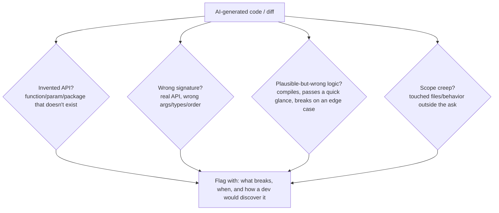

# 2 · Evaluating AI-Generated Code

*AI Coding Agents & Code Eval module · Lesson 2 of 3 · [← The AI Coding-Agent Landscape](01-the-ai-coding-agent-landscape.md) · [next → The Agentic-Coding Review Workflow](03-agentic-coding-review-workflow.md)*

> **One-liner:** Code hallucinations are a distinct failure mode from prose hallucinations — invented APIs, wrong signatures, and logic that's subtly wrong but still compiles — so evaluating generated code needs its own checklist, not just the general LLM-eval methods from [Module 16](../16_evals/README.md).

## 🎯 TL;DR

- The general eval methods still apply — **programmatic, human, and LLM-as-judge** ([Module 16 Lesson 5](../16_evals/05-eval-methods-llm-as-judge.md)) — but code has a uniquely strong *programmatic* channel: **it can run.**
- **Four code-specific hallucination patterns** to actively hunt for: invented APIs, wrong signatures/params, plausible-but-wrong logic, and silent scope creep (touching files it wasn't asked to).
- A **rubric with independently-checkable line items** (not "is this good?") is what makes grading consistent across reviewers and auditable to a client — the same discipline as [SME grading](../00_jobs/14_domain-sme-ai-data-contributor-contract/README.md), applied to diffs.
- Comparing two agents means running the **identical task** through both and grading both against the **identical rubric**.

---

## 2.1 Code hallucinations are a different animal

| Prose hallucination | Code hallucination |
|---|---|
| A confidently wrong *fact* | A confidently wrong *API call, signature, or behavior* |
| Caught by fact-checking against a source | Caught by **running it** — the code either works or it doesn't |
| Sounds authoritative regardless of truth | **Looks correct** to a skim-reader; syntax highlighting doesn't care if `requests.get(url, retries=3)` isn't a real parameter |

The practical upshot: for code, **execution is a cheap, high-signal check that prose evaluation doesn't get** — always run it before trusting a read-through.

---

## 2.2 The four patterns to hunt for



**Worked example — pattern 1 (invented API):**
```python
# Agent's generated code:
import pandas as pd
df.drop_duplicates(subset=["id"], keep_latest=True)   # looks plausible...
```
`keep_latest` is not a real `drop_duplicates` parameter (the real options are `first`/`last`/`False`). This is the single most common and most dangerous pattern — it **passes a visual review** by anyone not checking docs, and fails only at runtime with an error that doesn't obviously point back to "the parameter doesn't exist."

**Worked example — pattern 3 (plausible-but-wrong logic):**
```python
# Task: "return True if the list has any duplicate values"
def has_duplicates(items):
    return len(items) == len(set(items))   # BUG: this is backwards
```
Reads as reasonable, runs without error, **passes on inputs with no duplicates**, and is simply wrong (should be `len(items) != len(set(items))`). This is why "it ran without an error" is not the same as "it's correct" — you need a test with an actual duplicate in it.

---

## 2.3 A review rubric (reusable across tasks)

| Criterion | Points | How to check |
|---|---|---|
| Solves the stated task, not a nearby variant | 3 | Re-read the original ask; compare literally |
| No invented APIs — every call verified against real docs/signatures | 3 | Grep for unfamiliar-looking calls; check the actual library reference |
| Passes existing tests **and** a new edge-case test you write yourself | 3 | Run the suite; add one adversarial case (empty input, duplicate, boundary value) |
| Change is scoped to what was asked (no silent unrelated edits) | 2 | Diff review — every touched file should map to the task |
| Explanation/PR description accurately reflects what the diff actually does | 1 | Cross-check the agent's own summary against the real diff |

This is the same **point-weighted, independently-checkable rubric pattern** used for any SME grading task ([Module 00_jobs, Lesson 14](../00_jobs/14_domain-sme-ai-data-contributor-contract/README.md)) — just with code-specific criteria. A rubric like this is exactly the deliverable format expert-network platforms expect, because it lets a second reviewer audit *your* grading, not just the agent's code.

---

## 2.4 Comparing multiple agents fairly

```text
1. Write ONE task spec (goal + acceptance criteria) — reused verbatim for every tool.
2. Run it through each agent with equivalent prompting (same instructions, same constraints).
3. Let each agent complete its FULL loop (plan -> edit -> test -> fix) before grading.
4. Grade every output against the SAME rubric (section 2.3).
5. Record not just the score, but HOW each tool failed/succeeded — the qualitative
   trace (did it self-correct after a failing test? did it ask a clarifying question?)
   is often more useful to a client than the numeric score alone.
```

The comparison's value comes from **holding everything constant except the tool** — same task, same rubric, same acceptance bar. A comparison where one tool got an easier task or a friendlier prompt is not a comparison, it's an anecdote.

---

## Key terms

| Term | Meaning |
|------|---------|
| **Code hallucination** | Generated code referencing a non-existent API, or containing logic that's confidently wrong |
| **Invented API** | A plausible but fabricated function/parameter/package name |
| **Plausible-but-wrong logic** | Code that runs and reads fine but fails on an edge case the happy path didn't test |
| **Scope creep (agent)** | An agent touching files/behavior beyond what the task asked for |
| **Reusable rubric** | A fixed, point-weighted checklist applied identically across tasks/tools for auditable, consistent grading |

## ✍️ Notes / follow-ups

- General eval-method vocabulary (programmatic/human/LLM-judge, reference-based/free) this lesson specializes: [`16_evals` Lesson 5](../16_evals/05-eval-methods-llm-as-judge.md).
- The rubric-grading discipline itself, in a non-code domain for contrast: [`00_jobs` Lesson 14 project](../00_jobs/14_domain-sme-ai-data-contributor-contract/project.md).
- **Next:** turning this into a repeatable, documentable workflow — the actual day-to-day of the role → [The Agentic-Coding Review Workflow](03-agentic-coding-review-workflow.md).
