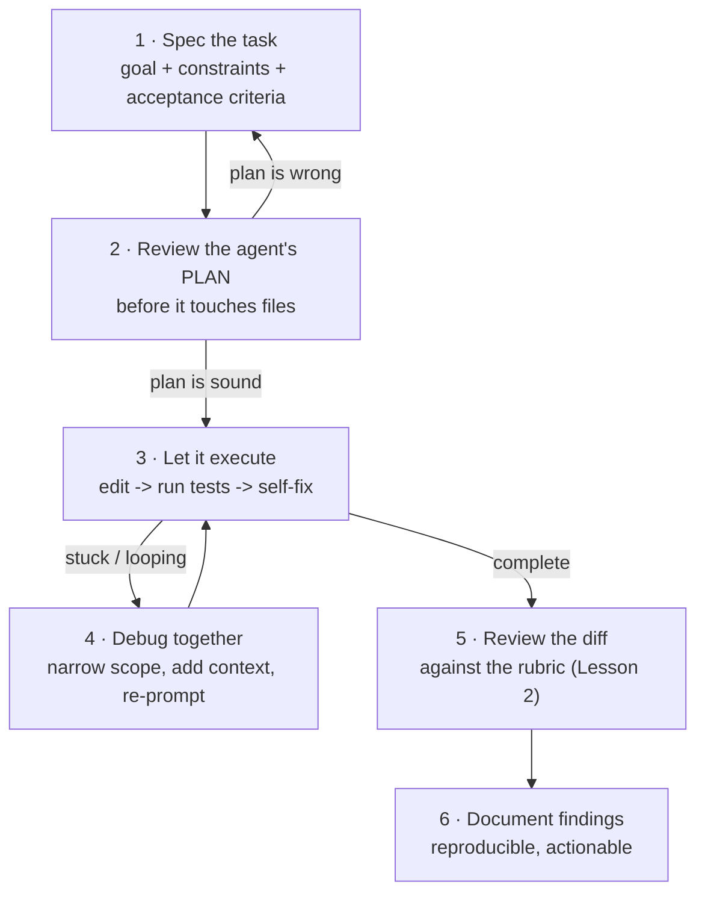

# 3 · The Agentic-Coding Review Workflow

*AI Coding Agents & Code Eval module · Lesson 3 of 3 · [← Evaluating AI-Generated Code](02-evaluating-ai-generated-code.md) · [module README](README.md)*

> **One-liner:** The day-to-day of working *with* a coding agent — planning the task, reviewing the plan before the diff, debugging collaboratively when it gets stuck, and writing up findings someone else can act on — is a repeatable process, not an improvised chat.

## 🎯 TL;DR

- **Review the plan, not just the diff** — catching a wrong approach before 200 lines get written is cheaper than catching it after.
- When an agent gets stuck, the fix is usually **narrowing the task or supplying missing context**, not writing the code yourself and giving up on the loop.
- A finding is only useful if it's **reproducible and actionable** — "it hallucinated" is not a report; "given task X, it invented parameter Y, here's the diff and the failing test" is.
- Best-practice documentation for agent workflows should read like a **runbook**, not a diary — someone else should be able to follow it and get the same result.

---

## 3.1 The end-to-end loop you actually run



---

## 3.2 Step 1–2: spec and plan review

A task spec worth giving an agent has three parts, always:

```markdown
Goal: Refactor `OrderProcessor.calculate_total()` to apply discounts before tax, not after.
Constraints: Don't change the public method signature; existing callers must keep working.
Acceptance criteria: `test_discount_before_tax` passes; no other test in the suite regresses.
```

Vague specs ("clean this up," "make it better") are the single biggest cause of an agent producing correct-but-unwanted work — it isn't hallucinating, it's answering an underspecified question. If the tool exposes a **plan step before execution** (most agentic tools do, in some form — see [Lesson 1](01-the-ai-coding-agent-landscape.md)), read it. Catching "it's about to refactor the wrong function" at the plan stage costs seconds; catching it after a 15-file edit costs a revert.

---

## 3.3 Step 3–4: execution and collaborative debugging

When an agent loops or produces a failing fix repeatedly, the instinct to "just write it yourself" defeats the point of the exercise (and, in an evaluation contract, that's not the deliverable anyway — the deliverable is the *finding* that it got stuck). Instead:

| Symptom | Likely cause | Fix |
|---|---|---|
| Keeps re-trying the same failing approach | Missing context (doesn't know a helper function exists, or a constraint) | Point it at the specific file/function; add the constraint explicitly |
| Fixes the reported error but breaks something else | Under-scoped understanding of the codebase | Ask it to run the *full* test suite, not just the failing test, before declaring done |
| Produces a working fix but touches unrelated files | Task was ambiguous about scope | Re-spec with an explicit "only touch X" constraint |
| Confidently explains a fix that doesn't match the actual diff | Its own summary is unreliable — treat as informational, not verification | Always verify against the real diff, per [Lesson 2 §2.3](02-evaluating-ai-generated-code.md) |

This table *is* the "plan, implement, debug, and refactor in collaboration with AI agents, providing clear rationale" skill — it's diagnostic thinking about **why the agent is stuck**, not just re-prompting randomly until it works.

---

## 3.4 Step 5–6: review and write-up that holds up to a second reader

A useful finding has four parts — skip any one and it stops being actionable:

```markdown
## Finding: Codex CLI invents a pandas kwarg under time pressure

**Task given:** "Deduplicate the orders dataframe, keeping the most recent per order_id."
**What it produced:** `df.drop_duplicates(subset=["order_id"], keep_latest=True)`
**Why it's wrong:** `keep_latest` is not a real drop_duplicates parameter (real options:
  first/last/False). Running this raises a TypeError — it never actually executes.
**Reproduction:** [task spec + exact prompt + the generated diff, attached]
```

Compare this to "the model hallucinated a pandas function" — technically true, useless to anyone trying to act on it, improve the tool, or verify the claim.

### A best-practices doc, in miniature

```markdown
# Runbook: Reviewing an agentic PR before merge
1. Read the agent's plan/summary FIRST — does it match the actual diff? (Lesson 2 §2.3)
2. Run the full test suite locally, not just what the agent reports.
3. Grep the diff for library calls you don't immediately recognize; verify against docs.
4. Check the diff's file list against the task's stated scope — flag anything extra.
5. Write the finding using the 4-part template above, even for a clean pass
   ("no issues found, verified X/Y/Z") — a null result is still a data point.
```

That's what "draft best practices and process documentation for effective AI agent workflows" actually looks like as a deliverable: something a teammate (or a client's reviewer) could follow without you in the room.

---

## Key terms

| Term | Meaning |
|------|---------|
| **Plan review** | Checking an agent's stated approach before it executes, not only the resulting diff |
| **Collaborative debugging** | Diagnosing *why* an agent is stuck and adjusting scope/context, rather than taking over the task |
| **Reproducible finding** | A report that includes the exact task, prompt, and artifact needed for someone else to see the same result |
| **Runbook** | Documentation written so a second person gets the same outcome by following it |

## ✍️ Notes / follow-ups

- This lesson closes the loop opened in [Lesson 1](01-the-ai-coding-agent-landscape.md) (the landscape) and [Lesson 2](02-evaluating-ai-generated-code.md) (the rubric) — together they're the full skill set behind [the contract-role job path](../00_jobs/15_agentic-coding-evaluator-contract/README.md).
- Deep daily-workflow reference for one specific tool once you're fluent in the general process: [`17_claude-code`](../17_claude-code/README.md).
- Module complete. Try the [sample project](../00_jobs/15_agentic-coding-evaluator-contract/project.md) to produce a real graded comparison end to end.
