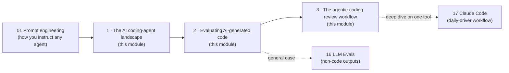

# 🧑‍💻 AI Coding Agents & Code Evaluation

> The landscape of autonomous/AI coding tools (terminal-native agents, IDE-embedded assistants, and CLI agents), and — the harder skill — how to actually **evaluate what they produce**: spotting hallucinated code, grading against a rubric, and comparing multiple tools on the same task.

This is a **reference module** (concept + worked examples), not a video-playlist transcript like [`17_claude-code`](../17_claude-code/README.md) or [`16_evals`](../16_evals/README.md) — those are complete, locked to their source playlists. This module fills the gap between them: general LLM evals ([`16_evals`](../16_evals/README.md)) meets code specifically, and one tool's daily workflow ([`17_claude-code`](../17_claude-code/README.md)) meets the multi-tool landscape.

---

## 🗺️ Where this sits

---

## 📓 Lessons

| # | Lesson | What you'll learn |
|---|--------|-------------------|
| 1 | [The AI Coding-Agent Landscape](01-the-ai-coding-agent-landscape.md) | Autocomplete vs. agentic, IDE-embedded vs. terminal/CLI-native, how the major tools differ and when each wins |
| 2 | [Evaluating AI-Generated Code](02-evaluating-ai-generated-code.md) | Code-specific hallucination patterns, a review rubric, comparing two agents' outputs on the same task |
| 3 | [The Agentic-Coding Review Workflow](03-agentic-coding-review-workflow.md) | Planning a task for an agent, reviewing a diff (not just the final answer), documenting findings so someone else can act on them |

---

## ⚡ The whole module in one cheat sheet

| Question | Answer |
|----------|--------|
| Autocomplete vs. agentic tool — what's the real difference? | Autocomplete predicts the next few tokens inline; an **agentic** tool plans, edits multiple files, runs commands, and iterates on the result — it has a *loop*, not just a *completion*. |
| What's the #1 code-specific hallucination? | **Invented APIs** — a plausible-sounding function/parameter/package that doesn't exist. Second: silently wrong logic that still *compiles*. |
| Best single check before trusting generated code? | Does it **run and pass tests** — a code hallucination often survives a read-through but not execution. |
| How to compare two coding agents fairly? | Same task, same prompt, same acceptance criteria, graded against the **same rubric** — never eyeball two different tasks and call it a comparison. |
| What actually makes a review useful to someone else? | Not "this is wrong" but **why it's wrong and what a developer trusting it would do next** — the same "consequence, not just verdict" principle from [SME grading](../00_jobs/14_domain-sme-ai-data-contributor-contract/README.md). |

---

## 📚 How each page is structured

A **one-liner**, a **TL;DR**, numbered sections with comparison tables and worked examples (real-feeling code diffs, not abstractions), a **Key terms** table, and **Notes / follow-ups** cross-linking to [`01_prompt-engineering`](../01_prompt-engineering/README.md), [`16_evals`](../16_evals/README.md), [`17_claude-code`](../17_claude-code/README.md), and the [contract-role job path](../00_jobs/15_agentic-coding-evaluator-contract/README.md) this module was built to support.

*Reference notes for personal study, synthesized from public documentation/behavior of the major tools (Claude Code, GitHub Copilot, Cursor, OpenAI Codex/Codex CLI, Gemini CLI) as of 2026 and standard code-review practice. Tool capabilities move fast — verify specifics against current docs before quoting them in an interview.*
