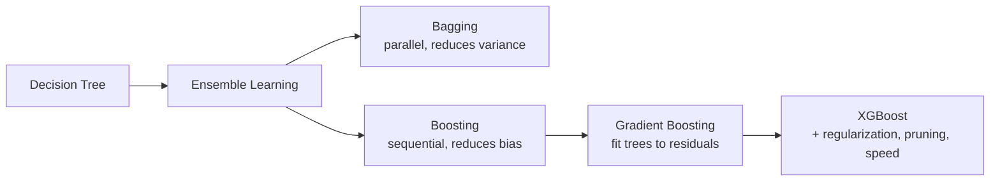
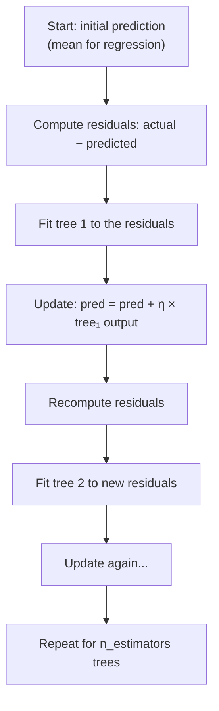
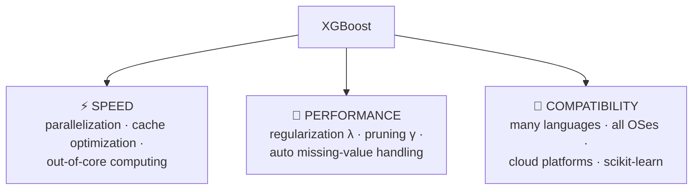

# Lesson 1 — Why XGBoost? (And the Prerequisites You Actually Need)

> **Source:** Session 1 — *Session 1 on XgBoost* (opening ~15 min) · [video](https://www.youtube.com/watch?v=BTLB-ppqBZc&list=PLKnIA16_RmvbXJbBW4zCy4Xbr81GRyaC4&index=1)
> **What this lesson gives you:** the decision-tree → ensemble → boosting → gradient-boosting chain that XGBoost sits on top of, then exactly what XGBoost adds and why it dominated tabular ML for a decade.

---

## 🎯 TL;DR

**XGBoost** stands for **eXtreme Gradient Boosting**. It is *not* a new algorithm — it is gradient boosting with a large set of engineering and mathematical improvements layered on. The video's framing is that XGBoost wins on **three axes: speed, performance, and compatibility.** That framing is correct and worth keeping. But the videos assume you already know decision trees, ensembles, and gradient boosting — so this lesson builds that foundation first, because *every* formula in Lesson 2 is meaningless without it.

---

## 1. Prerequisite chain — read this in order



### 1.1 Decision tree (the building block)

**What.** A model that repeatedly splits data on a feature threshold, forming a tree. Each internal node asks a yes/no question (`Age < 24?`); each **leaf** holds a prediction.

**Why it matters here.** XGBoost is nothing but *a large collection of small decision trees added together*. Every concept in this module — splits, gain, leaves, pruning, depth — is a decision-tree concept.

**How a normal decision tree picks a split.** It tries candidate thresholds and keeps the one that most improves a purity/error criterion — Gini impurity or entropy for classification, variance/MSE reduction for regression.

> **This is the single most important thing to carry into Lesson 2:** XGBoost replaces Gini/entropy/MSE with its *own* split criterion, derived from its objective function. That criterion is the "similarity score" and "gain" the videos teach.

**Key terms:**

| Term | Meaning |
|---|---|
| **Root node** | The top node, holding all data before any split |
| **Internal node** | A node that asks a question and splits further |
| **Leaf / terminal node** | A node that stops and emits a prediction |
| **Depth** | Longest root-to-leaf path. More depth = more complex = more overfitting risk |
| **Split / threshold** | The `feature < value` test at a node |
| **Pruning** | Removing branches after the tree is grown, to simplify it |

### 1.2 Ensemble learning — bagging vs. boosting

**What.** Combining many weak models into one strong model.

**Why.** A single deep tree overfits badly (memorizes noise); a single shallow tree underfits (too simple). Ensembles let you build many *simple* models and combine them into something both flexible and stable.

The two families differ fundamentally:

| | **Bagging** (e.g. Random Forest) | **Boosting** (e.g. XGBoost) |
|---|---|---|
| **Training order** | All trees **independent** — trainable in parallel | Trees **sequential** — each depends on the previous |
| **What each tree sees** | A random bootstrap sample of rows (+ random feature subsets) | The **errors** left over by all previous trees |
| **Trees are** | Deep, fully grown, individually strong | Shallow, weak learners |
| **Primarily reduces** | **Variance** (overfitting) | **Bias** (underfitting) |
| **Combination rule** | Average (regression) / majority vote (classification) | Weighted sum of all tree outputs |
| **Overfits if** | Rarely, from more trees | **Yes** — more trees eventually overfits |
| **Parallelism** | Trivially parallel across trees | Cannot parallelize *across* trees (XGBoost parallelizes *within* a tree instead) |

> **Mental model.** Bagging is asking 100 independent experts and averaging their answers — disagreements cancel out. Boosting is one student taking an exam 100 times, each time studying only the questions they got wrong.
>
> *Where the analogy breaks:* boosting's later "attempts" don't replace earlier ones — all trees stay in the final model and their outputs are summed. And in bagging, the experts aren't truly independent; they see overlapping data.

### 1.3 Gradient boosting (XGBoost's direct parent)

**What.** Build trees sequentially, where each new tree is trained to predict the **residuals** (errors) of the current ensemble.

**How, concretely:**



The final prediction is an additive sum:

```
prediction = initial_prediction
           + η × output(tree₁)
           + η × output(tree₂)
           + ... 
           + η × output(tree_n)
```

where **η (eta)** is the **learning rate** — a shrinkage factor that stops any single tree from dominating.

**Why residuals?** Because a residual is the direction you need to move to reduce error. Fitting a tree to residuals is **gradient descent performed in function space** — instead of nudging *parameters*, each step adds a whole new *function* (tree) pointing downhill on the loss. This is why it's called *gradient* boosting, and it's the bridge to Lesson 2's math.

> **⚠️ Important nuance the videos skip:** "fit to residuals" is only exactly right for **squared-error loss**. In general, gradient boosting fits each tree to the **negative gradient** of whatever loss you chose. For squared error the negative gradient *equals* the residual, which is why the simplification works and why it's taught that way. For log-loss (classification) the gradient is also `actual − predicted_probability`, which is why classification looks so similar. Lesson 2 makes this precise.

---

## 2. What XGBoost adds — the three pillars

> **Source:** Session 1, opening segment.

The video organizes XGBoost's advantages into **speed, performance, and compatibility.** Here is each, with the mechanisms named.



### 2.1 Pillar 1 — Speed

Three named mechanisms (all covered in depth in [Lesson 6](06-speed-and-system-design.md)):

| Mechanism | What it does |
|---|---|
| **Parallelization** | Splits the work of finding the best split across CPU cores. Note: it parallelizes **within** a tree (evaluating candidate splits/features), **not across** trees — boosting is inherently sequential. Also supports distributed training across machines. |
| **Cache optimization** | Deliberately arranges data access so the values it needs sit in **CPU cache** (memory physically inside the processor, far faster than RAM). |
| **Out-of-core computing** | If your dataset (say 12 GB) exceeds RAM (say 8 GB), XGBoost splits it into blocks on disk and streams them through memory, instead of crashing. |

**Measured in the video** (a small dataset, same machine, no tuning):

| Algorithm | Time |
|---|---|
| **XGBoost** | ~0.6 s |
| Gradient Boosting (sklearn) | ~1.35 s |
| Random Forest | ~3.5 s |

> **⚠️ Read these numbers correctly.** The instructor explicitly cautions that on a *small* dataset the difference barely matters — the gap becomes decisive on large data, where a job that takes gradient boosting an hour may take XGBoost a fraction of that. Treat this table as a **directional** result on one small dataset, not a benchmark. Timings depend heavily on data size, feature count, hardware, thread count, and hyperparameters (a 1000-tree XGBoost will lose to a 10-tree Random Forest).

### 2.2 Pillar 2 — Performance

| Feature | What it gives you |
|---|---|
| **λ (lambda) — L2 regularization** | Penalizes large leaf outputs, shrinking predictions toward zero. Directly reduces overfitting. Covered in [Lesson 5](05-hyperparameters-regularization-and-pruning.md). |
| **γ (gamma) — pruning threshold** | Removes splits that don't improve the objective by at least γ, producing smaller trees. |
| **Automatic missing-value handling** | You do not have to impute. XGBoost *learns* a default direction for missing values at each split. Mechanism explained in [Lesson 6](06-speed-and-system-design.md). |

Plus several the video doesn't mention but which matter in practice: **α (alpha)** L1 regularization, **`min_child_weight`**, row/column **subsampling**, and **early stopping**.

### 2.3 Pillar 3 — Compatibility

| Axis | Coverage |
|---|---|
| **Languages** | Python, R, Java, Scala, C++, Julia, Ruby, Swift, PHP and others |
| **Operating systems** | Windows, Linux, macOS |
| **Cloud** | Runs on AWS, Google Cloud, Azure; integrates with distributed frameworks (Spark, Dask, Ray) |
| **scikit-learn** | First-class `XGBRegressor` / `XGBClassifier` wrappers that behave like any sklearn estimator — so `Pipeline`, `GridSearchCV`, `cross_val_score` all just work |

That last row is the one that matters most day to day, and it's why [Lesson 7](07-practical-implementation.md) can drop XGBoost straight into an sklearn `Pipeline`.

---

## 3. The 7 facets — XGBoost as a modelling choice

| Facet | Answer |
|---|---|
| **What** | A regularized, highly optimized implementation of gradient-boosted decision trees. |
| **Why** | Plain gradient boosting is slow and overfits easily; it has no built-in regularization, no principled pruning, no missing-value handling, and no systems-level speed work. |
| **How** | Sequentially adds shallow trees, each fit to the gradient of the loss, with an objective that *explicitly includes* a complexity penalty — so regularization is part of the split criterion itself, not bolted on. |
| **When to use** | **Tabular / structured data** (rows and columns) — this is XGBoost's home turf and it is still extremely competitive. Medium data (thousands to tens of millions of rows). Mixed numeric + categorical features. When you need strong accuracy without deep-learning infrastructure. When feature importances / explanations matter. |
| **When NOT to use** | **Images, audio, raw text, video** — use deep learning; XGBoost has no notion of spatial or sequential structure. **Very small datasets** (dozens of rows) — it will overfit; use regularized linear models. **When you need a simple, auditable model** — one logistic regression beats 500 trees for explainability to a regulator. **Extrapolation beyond the training range** — trees output constants per leaf and cannot extrapolate trends (a linear model can). **Ultra-low-latency single-row inference** on tight budgets, where a linear model's single dot product wins. **Streaming/online learning** — XGBoost is fundamentally batch. |
| **Trade-offs** | You give up: interpretability (vs. a single tree), extrapolation ability, training simplicity (many hyperparameters to tune), and the risk that with bad settings it overfits *harder* than Random Forest. You gain: accuracy, speed, regularization control, and missing-value robustness. |
| **Example** | Predicting loan default from 40 columns of application data and 2 million historical rows — a canonical XGBoost problem. |

### Why XGBoost beat plain gradient boosting

| Concern | Gradient Boosting (classic) | XGBoost |
|---|---|---|
| Regularization in the objective | ❌ None | ✅ L1 (α) + L2 (λ) on leaf weights |
| Pruning | Pre-set depth only | ✅ γ-based, computed post-split, bottom-up |
| Missing values | Must impute yourself | ✅ Learned default direction per split |
| Parallelism | Minimal | ✅ Within-tree, multi-core, distributed |
| Cache/memory engineering | ❌ | ✅ Cache-aware blocks, out-of-core |
| Split finding on big data | Exact only (slow) | ✅ Approximate/histogram method |
| Sparse data | Poorly handled | ✅ Sparsity-aware split finding |
| Early stopping | Limited | ✅ Built-in on a validation set |

---

## 4. An honest note on where XGBoost sits today

The videos are from **2021**, and at that time XGBoost was the default answer for tabular problems. That's still *largely* true, with three updates worth knowing:

> **Modern Approach:** **LightGBM** and **CatBoost** are now equally credible defaults. LightGBM is often faster on large datasets (leaf-wise growth, histogram binning); CatBoost usually handles high-cardinality categorical features better out of the box and has stronger defaults. Benchmarks between the three are frequently within noise of one another — the practical differentiators are categorical handling, training speed, and how much tuning you're willing to do. See [Lesson 9](09-production-and-comparisons.md).

> **Modern Approach:** XGBoost gained **native categorical feature support** (`enable_categorical=True`), so the manual one-hot encoding shown in Session 2 is no longer always necessary — and for high-cardinality columns, one-hot encoding is actively harmful.

> **Common Misconception:** "Deep learning has replaced XGBoost." For *tabular* data it largely has not. Multiple independent benchmark studies continue to find gradient-boosted trees competitive with or better than tabular neural networks, at a small fraction of the compute and tuning effort.

---

## 5. Common Mistakes

> - **Mistake:** Treating XGBoost as a fundamentally different algorithm from gradient boosting → **Why it's wrong:** it obscures that all the core intuition (sequential trees fit to errors, additive prediction, learning rate) transfers directly, so you end up memorizing formulas instead of understanding them → **Do instead:** learn gradient boosting properly first; then XGBoost is "gradient boosting + a regularized objective + engineering."
> - **Mistake:** Believing boosting parallelizes across trees → **Why it's wrong:** tree *n* needs tree *n−1*'s residuals, so it is inherently sequential; expecting linear speedup from more cores leads to wrong capacity planning → **Do instead:** understand that `n_jobs` parallelizes split-finding *within* each tree.
> - **Mistake:** Reaching for XGBoost on images or raw text → **Why it's wrong:** trees split on individual feature values and have no mechanism for spatial or sequential structure, so you discard the very signal that matters → **Do instead:** use CNNs/transformers, or extract structured features first and *then* use XGBoost.
> - **Mistake:** Concluding from the video's timing table that XGBoost is "3× faster than everything" → **Why it's wrong:** it was one small dataset with untuned defaults; tree count dominates runtime → **Do instead:** benchmark on your own data at your own settings.

---

## 6. Exercises

**Beginner.** In one sentence each, state what bagging reduces and what boosting reduces, and why that difference makes boosting more prone to overfitting.
*Success criterion:* you mention variance vs. bias, and note that boosting keeps fitting residuals so it can eventually fit noise.

**Intermediate.** Train a `DecisionTreeRegressor` at `max_depth` 1, 3, and 20 on any regression dataset. Plot train vs. test error for each.
*Success criterion:* you can point to the depth where train error keeps falling while test error rises, and name that phenomenon.

**Advanced.** Implement gradient boosting for squared-error loss from scratch in ~30 lines, using `DecisionTreeRegressor(max_depth=2)` as the weak learner: start from the mean, loop fitting trees to residuals, and accumulate `pred += lr * tree.predict(X)`.
*Success criterion:* your test RMSE curve decreases as trees are added, and your predictions approximately match `sklearn.ensemble.GradientBoostingRegressor` with the same depth/learning rate/number of trees.

**Challenge.** You have 500 rows, 300 columns, and a binary target. Argue whether XGBoost is the right choice, and specify what you would do differently from the defaults. Justify each decision.
*Success criterion:* you identify the p ≫ n overfitting risk and propose concrete mitigations (heavy regularization, shallow trees, `colsample_bytree`, cross-validated early stopping) or a principled argument for a regularized linear model instead.

---

## ✍️ Next

Now that the chain **tree → ensemble → boosting → gradient boosting** is in place, [Lesson 2 — The Math Behind XGBoost](02-the-math-behind-xgboost.md) derives where the "similarity score," "gain," and "output value" formulas actually come from. The videos present them as rules to memorize; deriving them takes about two pages and makes every hyperparameter obvious.
