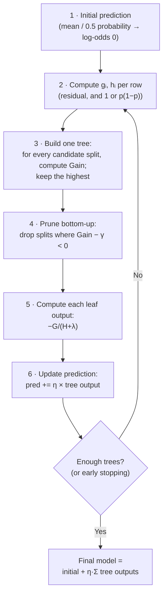

# Lesson 2 — The Math Behind XGBoost (Where the Formulas Come From)

> **Source:** Sessions 1 & 2 present the similarity-score, gain, and output-value formulas as rules to apply. The **derivation** below is added material — the videos explicitly defer the deeper math ("we will see it in the next class"), and the playlist ends before that class.
> **What this lesson gives you:** why those three formulas look the way they do. Once you've seen the derivation, every hyperparameter in Lesson 5 becomes self-explanatory instead of arbitrary.

---

## 🎯 TL;DR

XGBoost's three magic formulas are not arbitrary. They fall out of one idea: **write down an objective = loss + complexity penalty, approximate it with a second-order Taylor expansion, and solve for the leaf value that minimizes it.** Doing that yields:

| Quantity | General form | With squared-error loss (regression) | With log-loss (classification) |
|---|---|---|---|
| **Leaf output** (optimal weight) | `−G / (H + λ)` | `Σresiduals / (count + λ)` | `Σresiduals / (Σ p(1−p) + λ)` |
| **Similarity score** | `G² / (H + λ)` | `(Σresiduals)² / (count + λ)` | `(Σresiduals)² / (Σ p(1−p) + λ)` |
| **Gain of a split** | `½[Sim_L + Sim_R − Sim_parent] − γ` | same shape | same shape |

`G` = sum of gradients in the leaf, `H` = sum of Hessians. **The whole reason regression and classification differ only in the denominator is that the denominator is the Hessian**, and the Hessian of squared error is 1 per row while the Hessian of log-loss is `p(1−p)` per row. That single sentence explains a symmetry the videos present as a coincidence to memorize.

---

## 1. Step 1 — Write the objective

Every supervised model minimizes some objective. XGBoost's has **two** parts:

```
Objective = Σ Loss(actualᵢ, predictedᵢ)  +  Σ Ω(treeₖ)
            └──────── how wrong ────────┘   └─ how complex ─┘
```

The complexity penalty for a single tree is:

```
Ω(tree) = γ·T + ½·λ·Σ wⱼ²
          └─ γ per leaf ─┘  └─ L2 on leaf weights ─┘
```

| Symbol | Meaning |
|---|---|
| `T` | number of leaves in the tree |
| `wⱼ` | the **output value** ("weight") of leaf *j* |
| `γ` (gamma) | cost charged **per leaf** — makes extra leaves expensive |
| `λ` (lambda) | **L2 penalty** on leaf weights — makes large outputs expensive |

> **This is XGBoost's central design decision, and the thing plain gradient boosting lacks.** Regularization is inside the objective the tree is *built* from, so it influences which splits get chosen — not applied afterwards as a separate cleanup step.

**Why penalize leaves and weights at all?** A tree with one leaf per row can drive training loss to zero and generalize terribly. `γ·T` says "each new leaf must pay for itself"; `½λΣwⱼ²` says "and don't make confident, extreme predictions from thin evidence."

---

## 2. Step 2 — Approximate the loss (the Taylor trick)

Boosting is **additive**: at round *t*, the prediction is last round's prediction plus the new tree.

```
predictionᵢ⁽ᵗ⁾ = predictionᵢ⁽ᵗ⁻¹⁾ + treeₜ(xᵢ)
```

Substituting into the loss gives `Loss(actualᵢ, prev_predᵢ + treeₜ(xᵢ))` — awkward, because the thing we're solving for sits inside an arbitrary loss function. So XGBoost approximates the loss around the current prediction with a **second-order Taylor expansion**:

```
Loss(y, prev + f)  ≈  Loss(y, prev)  +  g·f  +  ½·h·f²
```

where, per row *i*:

| Symbol | Name | Definition | Meaning in plain terms |
|---|---|---|---|
| `gᵢ` | **gradient** | first derivative of the loss w.r.t. the prediction | *which direction* and how strongly to move |
| `hᵢ` | **Hessian** | second derivative of the loss w.r.t. the prediction | *how confident* / how curved the loss is here — effectively the row's **weight** |

> **Mental model.** A Taylor expansion approximates any curve locally with a parabola. XGBoost says: "I don't care about your exact loss function; near my current prediction it looks like a parabola, and I can minimize a parabola exactly." Then it only ever needs two numbers per row — slope (`g`) and curvature (`h`).
>
> *Where the analogy breaks:* the approximation is only good **locally**. That's part of why the learning rate exists — small steps keep you in the region where the parabola is a decent stand-in for the real loss.

Dropping the constant `Loss(y, prev)` term (it doesn't depend on the new tree), the objective for round *t* becomes:

```
Obj⁽ᵗ⁾ ≈ Σᵢ [ gᵢ·f(xᵢ) + ½·hᵢ·f(xᵢ)² ]  +  γ·T + ½·λ·Σⱼ wⱼ²
```

---

## 3. Step 3 — Solve for the best leaf value

Here's the key structural insight: **a tree assigns the same output to every row that lands in the same leaf.** So instead of summing over rows, sum over leaves, grouping each leaf's rows together. For leaf *j*, define:

```
Gⱼ = Σ gᵢ   (sum of gradients of rows in leaf j)
Hⱼ = Σ hᵢ   (sum of Hessians of rows in leaf j)
```

The objective becomes, per leaf, a simple quadratic in `wⱼ`:

```
Obj = Σⱼ [ Gⱼ·wⱼ + ½·(Hⱼ + λ)·wⱼ² ]  +  γ·T
```

Minimize by differentiating with respect to `wⱼ` and setting to zero:

```
d/dwⱼ:   Gⱼ + (Hⱼ + λ)·wⱼ = 0
```

### 🎯 Result 1 — the optimal leaf output

```
wⱼ* = − Gⱼ / (Hⱼ + λ)
```

Substituting `wⱼ*` back in gives the best achievable objective value for that leaf:

### 🎯 Result 2 — the similarity score

```
Sim(leaf j) = Gⱼ² / (Hⱼ + λ)
```

*(The full expression carries a `−½` factor; XGBoost's convention drops the sign and constant, since only relative comparisons between splits matter.)*

This is exactly the video's **"similarity score."** It measures how much a leaf reduces the objective — high when the gradients in the leaf all point the same way (they sum to something large) and low when they cancel out.

> **This is why the videos' root node scored ≈ 0.** At the root, residuals are measured from the mean, so they sum to ~0. Positive and negative gradients cancel, `G² ≈ 0`, similarity ≈ 0 — the root is maximally "mixed" and explains nothing. Splitting is the act of separating rows so that each side's gradients agree.

### 🎯 Result 3 — the gain of a split

Splitting one leaf into two is worth doing only if the children jointly beat the parent, after paying γ for the extra leaf:

```
Gain = ½ [ Sim_left + Sim_right − Sim_parent ] − γ
```

The videos drop the `½` and fold γ into a separate pruning step — arithmetically equivalent for choosing between splits, since a constant factor doesn't change which split ranks highest.

**XGBoost tries every candidate split on every feature and keeps the one with the highest gain.** That's the entire tree-building rule.

---

## 4. Step 4 — Plug in a real loss and watch the videos' formulas appear

This is where everything clicks.

### Regression: squared-error loss

```
Loss = ½(y − pred)²
  g = d/d(pred) = −(y − pred) = −residual
  h = d²/d(pred)² = 1
```

So for a leaf containing *n* rows:
- `G = −Σ residuals`
- `H = Σ 1 = n` ← **the count of rows**

Substituting:

| Formula | Becomes |
|---|---|
| Leaf output `= −G/(H+λ)` | **`Σresiduals / (n + λ)`** |
| Similarity `= G²/(H+λ)` | **`(Σresiduals)² / (n + λ)`** |

✅ **Exactly the regression formulas from Session 1.** "Number of residuals" in the denominator was never a special rule — it's `Σh` where every `h = 1`.

### Classification: log-loss (binary cross-entropy)

Working in **log-odds** space with `p = sigmoid(log-odds)`:

```
  g = −(y − p) = −residual          ← same shape as regression!
  h = p(1 − p)
```

So for a leaf:
- `G = −Σ residuals` (where residual = actual − predicted *probability*)
- `H = Σ p(1−p)`

| Formula | Becomes |
|---|---|
| Leaf output | **`Σresiduals / (Σ p(1−p) + λ)`** |
| Similarity | **`(Σresiduals)² / (Σ p(1−p) + λ)`** |

✅ **Exactly the classification formulas from Session 2.**

### The payoff

> Session 2 observes that classification is "clearly similar to regression, just with `p(1−p)` instead of the count." **Now you know why:** the numerator is the gradient (identical in shape for both losses — `actual − predicted`), and the denominator is the Hessian. Squared error has constant curvature (`h = 1`), so it counts rows. Log-loss has curvature `p(1−p)`, which peaks at `p = 0.5` (maximum uncertainty) and vanishes near `p = 0` or `1` (confident predictions).
>
> **Practical consequence:** confidently-classified rows contribute almost nothing to `H`, so they carry almost no weight in future splits. XGBoost automatically concentrates on the rows it's still unsure about. Nobody programmed that behaviour — it emerges from the Hessian.

---

## 5. Why work in log-odds for classification?

Probabilities live in `[0, 1]`. But boosting **adds** tree outputs together, and adding unbounded numbers to a probability would immediately escape the valid range (`0.9 + 0.5 = 1.4` is not a probability).

**Log-odds** solve this:

```
log-odds = log( p / (1 − p) )        range: (−∞, +∞)   ← safe to add to
p        = e^log-odds / (1 + e^log-odds)   = sigmoid(log-odds)
```

So the classification loop is:


| Term | Meaning | Why it matters |
|---|---|---|
| **Odds** | `p / (1−p)` — ratio of success to failure | Maps `[0,1]` to `[0, ∞)` |
| **Log-odds (logit)** | `log(p/(1−p))` | Maps `[0,1]` to `(−∞, ∞)` — the space boosting can safely add in |
| **Sigmoid (logistic)** | `1/(1+e^−x)` | The inverse — converts back to a probability |

**Worth internalizing:** `p = 0.5` ⟺ `log-odds = 0`. This is why Session 2's initial prediction of 0.5 probability corresponds to an initial log-odds of exactly **0** — the instructor notes the starting value "becomes zero," and this is the reason.

---

## 6. The complete algorithm



---

## 7. The 7 facets — second-order optimization

| Facet | Answer |
|---|---|
| **What** | Using both the gradient (slope) and Hessian (curvature) of the loss to choose splits and leaf values, via a local quadratic approximation. |
| **Why** | First-order-only methods know which way to step but not how far. Curvature turns each leaf into a quadratic with a **closed-form exact minimum**, so no line search or iterative solving is needed. |
| **How** | Second-order Taylor expansion → per-leaf quadratic → differentiate → `w* = −G/(H+λ)`. |
| **When to use** | Any loss that's twice differentiable (squared error, log-loss, Poisson, ranking objectives). This is what makes XGBoost's *custom objective* support work: supply `g` and `h` and everything else is unchanged. |
| **When NOT to use** | Losses that aren't twice differentiable, or where the Hessian is zero/negative (e.g. **MAE / absolute error**, whose second derivative is 0 almost everywhere — XGBoost needs workarounds like `reg:absoluteerror` with adjusted leaf estimation). |
| **Trade-offs** | Extra memory and compute per row (two statistics, not one), and the approximation is only locally valid — mitigated by a small learning rate. |
| **Example** | Ranking search results with a pairwise objective: you supply gradients/Hessians for that objective, and the identical tree-building machinery applies. |

---

## 8. Notation reference

| Symbol | Name | Regression (squared error) | Classification (log-loss) |
|---|---|---|---|
| `y` | actual value | the target | 0 or 1 |
| `pred` | current prediction | a number | a probability (from log-odds) |
| `residual` | `y − pred` | error | `y − probability` |
| `g` | gradient | `−residual` | `−residual` |
| `h` | Hessian | `1` | `p(1−p)` |
| `G` | Σ gradients in leaf | `−Σresiduals` | `−Σresiduals` |
| `H` | Σ Hessians in leaf | `n` (row count) | `Σ p(1−p)` |
| `λ` | L2 regularization | shrinks leaf outputs | same |
| `γ` | per-leaf cost | prunes splits | same |
| `η` | learning rate | scales each tree | same |
| `w` | leaf output/weight | `Σresiduals/(n+λ)` | `Σresiduals/(Σp(1−p)+λ)` |

---

## 9. Common Mistakes

> - **Mistake:** Memorizing `(Σresiduals)²/(count + λ)` as the similarity formula → **Why it's wrong:** it only holds for squared-error loss; you'll be stuck the moment you meet classification, Poisson, or a custom objective, and you'll wrongly think classification uses a "different algorithm" → **Do instead:** learn it as `G²/(H+λ)` and remember that `H` is the Hessian sum, which happens to equal the row count for squared error.
> - **Mistake:** Thinking gradient boosting "fits residuals" universally → **Why it's wrong:** it fits negative gradients; residuals are just what those happen to be for squared error → **Do instead:** say "fits the negative gradient," which stays true for every loss.
> - **Mistake:** Adding tree outputs directly to probabilities in classification → **Why it's wrong:** probabilities are bounded, sums are not, so you'd produce invalid values → **Do instead:** accumulate in log-odds space, apply sigmoid only at the end when you need a probability.
> - **Mistake:** Assuming a larger similarity score means a better split → **Why it's wrong:** similarity is a property of a single **node**; a split's value is `Sim_L + Sim_R − Sim_parent`, so a high-similarity child is worthless if the parent was already just as high → **Do instead:** always compare gain, never raw similarity.

---

## 10. Exercises

**Beginner.** Explain in two sentences why the root node's similarity score is approximately zero when the initial prediction is the mean.
*Success criterion:* you reference residuals summing to ~0, and `G²` therefore being ~0.

**Intermediate.** Derive `h = p(1−p)` for log-loss. Start from `Loss = −[y·log(p) + (1−y)·log(1−p)]` with `p = sigmoid(z)`, and differentiate twice with respect to `z`.
*Success criterion:* you obtain `g = p − y` and `h = p(1−p)`, and can state why `h` is largest at `p = 0.5`.

**Advanced.** Set λ = 0, take a leaf with residuals `{4, 6, 8}` under squared-error loss, and verify by direct computation that `w* = Σr/n = 6` minimizes `Σ[g·w + ½h·w²]`. Then recompute with λ = 10 and explain the change.
*Success criterion:* you get 6 and then `18/13 ≈ 1.38`, and can explain that λ shrinks outputs toward zero.

**Challenge.** Define a custom asymmetric loss that penalizes under-prediction three times more than over-prediction, derive its `g` and `h`, and implement it as an XGBoost custom objective. Verify predictions skew upward relative to squared error.
*Success criterion:* a working `obj` function returning `(grad, hess)`, and demonstrated upward-biased predictions on held-out data.

---

## ✍️ Next

With `G²/(H+λ)` and `Gain = Sim_L + Sim_R − Sim_parent − γ` derived, the videos' worked examples become straightforward arithmetic. [Lesson 3 — Regression Walkthrough](03-regression-walkthrough.md) works through Session 1's four-row example number by number.
