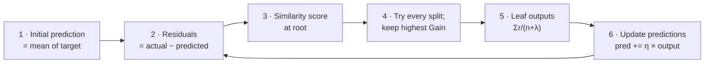
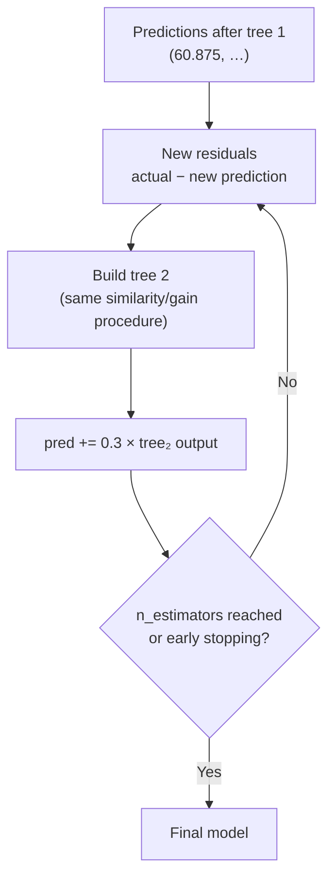

# Lesson 3 — XGBoost for Regression: A Full Numeric Walkthrough

> **Source:** Session 1 — *Session 1 on XgBoost*, main teaching segment · [video](https://www.youtube.com/watch?v=BTLB-ppqBZc&list=PLKnIA16_RmvbXJbBW4zCy4Xbr81GRyaC4&index=1)
> **What this lesson gives you:** every step of building the first XGBoost tree on a 4-row Age → Salary dataset, with the arithmetic shown. This is the video's core example, verified and completed.

---

## 🎯 TL;DR

Six steps, repeated per tree:



---

## 1. The setup

The video uses a small dataset: **four people, one feature (Age), one target (Salary)**. Salaries are in thousands.

**Step 1 — the initial prediction is the mean of the target.** The video uses **77.75**.

> **⚠️ Note on the video's numbers.** From the mean, the four residuals in the video are:
>
> `−56.25`, `+42.25`, `+12.25`, `+2.25`
>
> These sum to **+0.5**, not exactly 0. Residuals measured from the true mean must sum to zero, so there's a small rounding/transcription slip in the original example. It has no effect on the method, and it explains why the root similarity comes out as a small non-zero number rather than exactly 0. **I keep the video's residuals throughout** so the arithmetic matches what was taught, and flag where it matters.

| Row | Residual (Salary − 77.75) |
|---|---|
| Youngest person | **−56.25** |
| | **+42.25** |
| | **+12.25** |
| | **+2.25** |

**Why start at the mean?** With squared-error loss, the mean is the single constant that minimizes error. It's the best possible zero-knowledge guess, so the trees only ever have to learn the *deviation* from it.

---

## 2. Step 3 — Similarity score at the root

Using the regression formula from [Lesson 2](02-the-math-behind-xgboost.md), with **λ = 0** (the video sets λ = 0 initially to keep arithmetic clean):

```
Similarity = (Σ residuals)² / (count + λ)
```

At the root, all four residuals are together:

```
Σ residuals = −56.25 + 42.25 + 12.25 + 2.25 = 0.5

Similarity  = (0.5)² / (4 + 0)
            = 0.25 / 4
            = 0.0625
```

✅ **Matches the video** (it reports ≈ 0.0625, describing it as essentially zero).

> **The conceptual point, which matters more than the number:** the root score is near zero **because positive and negative residuals cancel each other out**. A node holding a mix of over- and under-predictions explains nothing. Splitting is precisely the act of separating rows so that each side's residuals *agree in sign* — which makes `(Σr)²` large. **Similarity measures agreement, not magnitude.**

---

## 3. Step 4 — Try every split and compute Gain

Candidate thresholds are the midpoints between consecutive sorted Age values. With 4 rows there are 3 candidates. The video walks through two of them.

### Candidate A — split that isolates the youngest person

Left gets `{−56.25}`; right gets `{+42.25, +12.25, +2.25}`.

```
Sim_left  = (−56.25)² / (1 + 0) = 3164.0625 / 1  = 3164.06

Σ right   = 42.25 + 12.25 + 2.25 = 56.75
Sim_right = (56.75)²  / (3 + 0)  = 3220.5625 / 3 = 1073.52

Gain = Sim_left + Sim_right − Sim_parent
     = 3164.06 + 1073.52 − 0.0625
     = 4237.52
```

✅ **Matches the video** (~3164 left, ~1073 right, gain "4000-something").

### Candidate B — a split that puts `−56.25` and `+2.25` together

Left gets `{−56.25, +2.25}`; right gets `{+42.25, +12.25}`.

```
Σ left    = −56.25 + 2.25 = −54.00
Sim_left  = (−54.00)² / (2 + 0) = 2916.00 / 2 = 1458.00

Σ right   = 42.25 + 12.25 = 54.50
Sim_right = (54.50)²  / (2 + 0) = 2970.25 / 2 = 1485.13

Gain = 1458.00 + 1485.13 − 0.0625 = 2943.06
```

### The comparison

| Candidate | Gain |
|---|---|
| **A — isolate the youngest** | **4237.52** ✅ chosen |
| B — mixed grouping | 2943.06 |

**Candidate A wins**, so it becomes the root split.

> **Why A wins is the whole lesson.** Candidate A puts the one large negative residual **alone**, so nothing cancels it — `(−56.25)²` survives intact and produces a huge similarity. Candidate B mixes `−56.25` with `+2.25`, and they partially cancel (`−54.00`), throwing away signal. **Gain rewards splits that group residuals of the same sign together.** That's the mechanism by which XGBoost discovers structure.

---

## 4. Step 5 — Compute the leaf output values

Once the tree stops growing, every leaf needs a single output value. From [Lesson 2](02-the-math-behind-xgboost.md):

```
Leaf output = Σ residuals / (count + λ)
```

For the tree above (still λ = 0):

| Leaf | Residuals | Output |
|---|---|---|
| Left | `{−56.25}` | `−56.25 / 1 = −56.25` |
| Right | `{+42.25, +12.25, +2.25}` | `56.75 / 3 = 18.92` |

> **Notice with λ = 0 the leaf output is just the mean of the residuals in that leaf.** That's not a coincidence — it's the same "mean minimizes squared error" fact from Step 1, applied within the leaf. λ's entire job is to pull this value *toward zero*, making the tree less confident. Set λ = 10 on the right leaf and you'd get `56.75/13 = 4.37` instead of `18.92` — a much more cautious prediction from the same data.

---

## 5. Step 6 — Update the predictions

The additive update, with the video's learning rate **η = 0.3** (XGBoost's historical default):

```
new prediction = previous prediction + η × (leaf output)
```

For the youngest person, who lands in the left leaf:

```
new prediction = 77.75 + 0.3 × (−56.25)
               = 77.75 − 16.875
               = 60.875
```

✅ **Matches the video** (reports ~60).

**Is this an improvement?** Their residual was `−56.25`, meaning their actual salary is `77.75 − 56.25 = 21.5`. So:

| | Prediction | Distance from actual (21.5) |
|---|---|---|
| Before (mean) | 77.75 | 56.25 |
| After tree 1 | 60.875 | 39.375 |

The error shrank by 30%. **One tree does not finish the job — it takes a step in the right direction.** That is the essence of boosting, and it's why the learning rate is deliberately small.

> **Why not use η = 1 and jump straight to 21.5?** Because that single tree would be fitting *this* dataset's noise as eagerly as its signal. Small steps mean many trees each contribute a little, and errors made by one tree get corrected by later ones. Shrinkage is a regularizer.

---

## 6. Repeat



Crucially, **tree 2 sees different residuals than tree 1**, so it will generally choose different splits. Each tree specializes in what remains unexplained.

Final prediction for any new row:

```
prediction = 77.75 + 0.3·output(tree₁) + 0.3·output(tree₂) + … + 0.3·output(tree_n)
```

---

## 7. Making a prediction for a new person

The video does this explicitly, and it's worth being precise because it's easy to get wrong.

To predict for a new age:

1. Start with the **initial prediction** (77.75).
2. Send the row down **tree 1** to whichever leaf its age selects; take that leaf's output.
3. Do the same for **every** subsequent tree.
4. Sum: `77.75 + η × (all leaf outputs)`.

> **⚠️ A trap the video calls out.** When a row lands in a leaf, you use the leaf's **output value** — `Σr/(n+λ)` — **not** the raw residual sitting in it. With λ = 0 and a single-row leaf these happen to be the same number, which is exactly why it's easy to conflate them. The moment λ > 0, or the leaf holds multiple rows, they differ. Always apply the formula.

---

## 8. Full worked summary

| Step | Operation | Result in this example |
|---|---|---|
| 1 | Initial prediction = mean | 77.75 |
| 2 | Residuals | −56.25, +42.25, +12.25, +2.25 |
| 3 | Root similarity `(Σr)²/(n+λ)` | 0.0625 |
| 4a | Split A similarity (L, R) | 3164.06, 1073.52 |
| 4b | Split A gain | **4237.52** ✅ |
| 4c | Split B gain | 2943.06 |
| 5 | Leaf outputs `Σr/(n+λ)` | −56.25 and 18.92 |
| 6 | Update, η = 0.3 | youngest: 77.75 → 60.875 |

---

## 9. Common Mistakes

> - **Mistake:** Confusing similarity score with gain → **Why it's wrong:** similarity describes one node; a split is only valuable relative to its parent, so a high-similarity child can still represent zero improvement → **Do instead:** always compute `Sim_L + Sim_R − Sim_parent` before comparing splits.
> - **Mistake:** Using the raw residual in a leaf as the prediction contribution → **Why it's wrong:** it silently ignores λ and multi-row leaves, so your predictions won't match the library's → **Do instead:** always use `Σresiduals/(count + λ)`.
> - **Mistake:** Forgetting to multiply the leaf output by the learning rate → **Why it's wrong:** you take a full-size step per tree, which massively overfits and often diverges → **Do instead:** `pred += η × output`, every tree, always.
> - **Mistake:** Expecting one tree to fix the prediction → **Why it's wrong:** with η = 0.3 each tree closes only a fraction of the gap; judging the model after one tree looks like failure → **Do instead:** evaluate the ensemble, and use early stopping to find the right number of trees.
> - **Mistake:** Assuming residuals must sum to exactly zero, then panicking when the root similarity isn't 0 → **Why it's wrong:** it's true only when the initial prediction is exactly the mean; rounding, or a `base_score` that isn't the mean, makes it slightly non-zero → **Do instead:** treat a near-zero root similarity as the expected sanity check, not an exact identity.

---

## 10. Exercises

**Beginner.** Given residuals `{10, 10, 10}` and λ = 0, compute the leaf similarity score and the leaf output.
*Success criterion:* similarity `= 900/3 = 300`; output `= 30/3 = 10`.

**Intermediate.** For residuals `{−8, −6, 5, 9}`, compute the gain for all three possible splits (assume they're already in feature order, λ = 0) and identify the winner.
*Success criterion:* you compute the parent similarity first, evaluate all three, and find the split separating negatives from positives has the highest gain.

**Advanced.** Redo this lesson's Candidate A gain with λ = 10 instead of 0. Report the new similarities, the new gain, and the new leaf outputs — then explain in one sentence what λ did.
*Success criterion:* every quantity shrinks, gain drops well below 4237, and you can state that λ shrank both similarity and leaf confidence.

**Challenge.** Implement this whole lesson from scratch in NumPy: initial prediction, residuals, exhaustive split search by gain, leaf outputs with λ, and a learning-rate update loop for `n` trees on a single feature. Compare against `XGBRegressor(max_depth=1, learning_rate=0.3, reg_lambda=0, n_estimators=n, base_score=<mean>)`.
*Success criterion:* your predictions match XGBoost's to within a small tolerance; if not, the mismatch is itself the lesson — investigate `base_score`, `min_child_weight` (default 1), and γ.

---

## ✍️ Next

The regression case is the easier half. [Lesson 4 — Classification Walkthrough](04-classification-walkthrough.md) works through Session 2's Titanic-subset example, where the denominator changes to `Σp(1−p)` and predictions must round-trip through log-odds and the sigmoid.
