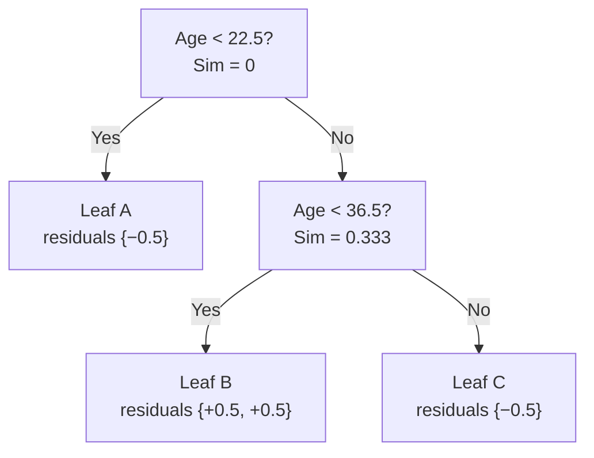
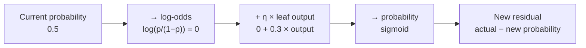

# Lesson 4 — XGBoost for Classification: A Full Numeric Walkthrough

> **Source:** Session 2 — *Session 2 on XgBoost*, first half · [video](https://www.youtube.com/watch?v=7G540ZGQubc&list=PLKnIA16_RmvbXJbBW4zCy4Xbr81GRyaC4&index=2)
> **What this lesson gives you:** the same six-step loop as regression, on a 4-row Titanic subset — but with the Hessian denominator `Σp(1−p)` and the log-odds ↔ probability round trip. Every number below is verified arithmetic.

---

## 🎯 TL;DR

Classification is regression with **three changes**:

| | Regression | Classification |
|---|---|---|
| **Initial prediction** | mean of target | probability **0.5** (= log-odds **0**) |
| **Similarity denominator** | `count + λ` | **`Σ p(1−p) + λ`** |
| **Prediction update** | add directly | add in **log-odds**, convert back with **sigmoid** |

Everything else — residuals, gain, split selection, γ pruning, learning rate — is identical.

---

## 1. The setup

Session 2 uses a deliberately tiny slice of the Titanic dataset: **one feature (Age), one target (Survived)**, four rows.

| Age | Survived |
|---|---|
| 17 | 0 |
| 28 | 1 |
| 34 | 1 |
| 39 | 0 |

> **How these were recovered.** The auto-captions garble the raw values, but the video states every similarity and gain it computes. Only one assignment of survival labels to ages reproduces **all five** of those numbers exactly (the three root-level gains 1.333 / 0 / 1.333, and the two second-level gains 0.667 / 2.667). The table above is that assignment, cross-checked below. Note the pattern is deliberately non-monotonic — Age alone does not cleanly separate survivors, which is what makes the example interesting.

**Step 1 — the initial prediction is probability 0.5 for every row.**

**Why 0.5?** It means "I have no information — everyone is equally likely to survive or not." In log-odds terms:

```
log-odds = log(0.5 / 0.5) = log(1) = 0
```

A starting point of exactly **zero** in the space we do arithmetic in. Clean.

> The video notes some people start from 0 and some from 0.5 and it "doesn't make much difference" — this is why: 0.5 *probability* **is** 0 *log-odds*. They're the same starting point expressed in different units, not two different choices.

**Step 2 — residuals = actual − predicted probability:**

| Age | Survived | Predicted prob | Residual |
|---|---|---|---|
| 17 | 0 | 0.5 | **−0.5** |
| 28 | 1 | 0.5 | **+0.5** |
| 34 | 1 | 0.5 | **+0.5** |
| 39 | 0 | 0.5 | **−0.5** |

These sum to exactly 0 ✅ (unlike Lesson 3's example, no rounding slip here).

---

## 2. The classification similarity score

From [Lesson 2](02-the-math-behind-xgboost.md):

```
Similarity = (Σ residuals)² / (Σ [p(1−p)] + λ)
```

Since every row currently has `p = 0.5`:

```
p(1 − p) = 0.5 × 0.5 = 0.25   per row
```

So a leaf holding *k* rows contributes `0.25k` to the denominator — **at this first tree only.** From tree 2 onward the probabilities differ per row, so this stops being a simple count. (We'll see that happen in §7.)

We use **λ = 0** throughout, as the video does.

### Root similarity

```
Σ residuals = −0.5 + 0.5 + 0.5 − 0.5 = 0
Denominator = 4 × 0.25 = 1.0

Similarity  = 0² / 1.0 = 0
```

✅ Matches the video. Again, everything cancels — the root explains nothing.

---

## 3. Step 4 — Try every split

Candidate thresholds are midpoints of consecutive ages:

| Between | Threshold |
|---|---|
| 17 and 28 | **22.5** |
| 28 and 34 | **31** |
| 34 and 39 | **36.5** |

### Candidate 1 — Age < 22.5

Left `{−0.5}` · Right `{+0.5, +0.5, −0.5}`

```
Sim_left  = (−0.5)² / (1×0.25) = 0.25 / 0.25 = 1.000
Σ right   = 0.5 + 0.5 − 0.5 = 0.5
Sim_right = (0.5)²  / (3×0.25) = 0.25 / 0.75 = 0.333

Gain = 1.000 + 0.333 − 0 = 1.333
```

✅ Matches the video (reports 1 and 0.33, gain ≈ 1.33).

### Candidate 2 — Age < 31

Left `{−0.5, +0.5}` · Right `{+0.5, −0.5}`

```
Σ left    = 0    →  Sim_left  = 0 / 0.5 = 0
Σ right   = 0    →  Sim_right = 0 / 0.5 = 0

Gain = 0 + 0 − 0 = 0
```

✅ Matches the video ("both of yours are zero, so in this case it came out zero").

> **This is the most instructive split in the whole example.** It's a *perfectly reasonable-looking* threshold that carries **zero** information, because each side ends up with one survivor and one non-survivor — total cancellation. Gain correctly scores it at 0. A split that separates rows without separating *outcomes* is worthless, and the formula knows it.

### Candidate 3 — Age < 36.5

Left `{−0.5, +0.5, +0.5}` · Right `{−0.5}`

```
Σ left    = 0.5  →  Sim_left  = 0.25 / 0.75 = 0.333
Σ right   = −0.5 →  Sim_right = 0.25 / 0.25 = 1.000

Gain = 0.333 + 1.000 − 0 = 1.333
```

✅ Matches the video, which notes candidates 1 and 3 **tie**.

### Choosing

| Candidate | Gain |
|---|---|
| Age < 22.5 | **1.333** ← tie |
| Age < 31 | 0.000 |
| Age < 36.5 | **1.333** ← tie |

The video picks **Age < 22.5**. With a genuine tie either is defensible; real XGBoost breaks ties deterministically by feature/threshold order.

---

## 4. Growing the second level

The root split sends `{+0.5, +0.5, −0.5}` (ages 28, 34, 39) to the right child. Its similarity is **0.333** — that becomes the new parent value.

### Sub-candidate — Age < 31

Left `{+0.5}` · Right `{+0.5, −0.5}`

```
Sim_left  = 0.25 / 0.25 = 1.000
Sim_right = 0²   / 0.50 = 0

Gain = 1.000 + 0 − 0.333 = 0.667
```

✅ Matches the video ("1 plus 0 minus 0.33 → 0.67").

### Sub-candidate — Age < 36.5

Left `{+0.5, +0.5}` · Right `{−0.5}`

```
Σ left    = 1.0  →  Sim_left  = 1.0 / 0.5  = 2.000
Sim_right = 0.25 / 0.25 = 1.000

Gain = 2.000 + 1.000 − 0.333 = 2.667
```

✅ Matches the video ("2 plus 1 minus 0.33 → 2.67").

**Age < 36.5 wins** (2.667 vs 0.667) — it cleanly isolates the two survivors from the non-survivor.

### The resulting tree



---

## 5. Step 5 — Leaf output values

```
Leaf output = Σ residuals / (Σ [p(1−p)] + λ)
```

| Leaf | Residuals | Calculation | Output |
|---|---|---|---|
| **A** (age < 22.5) | `{−0.5}` | `−0.5 / 0.25` | **−2** |
| **B** (22.5–36.5) | `{+0.5, +0.5}` | `1.0 / 0.50` | **+2** |
| **C** (age ≥ 36.5) | `{−0.5}` | `−0.5 / 0.25` | **−2** |

✅ Matches the video (−2, +2, −2).

> **Units matter here.** These outputs are in **log-odds**, not probabilities. An output of `+2` does not mean "probability 2" — it means "shift the log-odds up by 2," which is a large but perfectly valid move.

---

## 6. Step 6 — Update predictions (the log-odds round trip)

This is the step with no regression counterpart, so take it slowly.



With **η = 0.3**:

### Age 17 (Leaf A, output −2)

```
new log-odds = 0 + 0.3 × (−2) = −0.6

p = e^(−0.6) / (1 + e^(−0.6))
  = 0.5488 / 1.5488
  = 0.354
```

✅ Matches the video (~0.35).

### Ages 28 and 34 (Leaf B, output +2)

```
new log-odds = 0 + 0.3 × (+2) = +0.6

p = e^(0.6) / (1 + e^(0.6))
  = 1.8221 / 2.8221
  = 0.646
```

✅ Matches the video (~0.65).

### Age 39 (Leaf C, output −2)

Same as Age 17 → **0.354**.

### Did it improve?

| Age | Survived | Was | Now | Moving toward correct? |
|---|---|---|---|---|
| 17 | 0 | 0.500 | **0.354** | ✅ toward 0 |
| 28 | 1 | 0.500 | **0.646** | ✅ toward 1 |
| 34 | 1 | 0.500 | **0.646** | ✅ toward 1 |
| 39 | 0 | 0.500 | **0.354** | ✅ toward 0 |

All four moved the right way. ✅ Matches the video's observation that predictions are "improving."

**New residuals:**

| Age | Residual |
|---|---|
| 17 | `0 − 0.354 = −0.354` |
| 28 | `1 − 0.646 = +0.354` |
| 34 | `1 − 0.646 = +0.354` |
| 39 | `0 − 0.354 = −0.354` |

Every magnitude fell from 0.5 to 0.354 — **less left to explain**, which is exactly what boosting is supposed to do.

---

## 7. The subtlety for tree 2

The video flags this and it's worth emphasizing, because it's where the "denominator = 0.25 × count" shortcut dies:

```
p = 0.354  →  p(1−p) = 0.354 × 0.646 = 0.229
p = 0.646  →  p(1−p) = 0.646 × 0.354 = 0.229
```

So tree 2's denominators use **0.229 per row**, not 0.25 — and in general each row contributes a *different* amount.

> **Why this matters conceptually.** `p(1−p)` is the Hessian: it peaks at 0.5 (maximum uncertainty) and shrinks toward 0 as predictions grow confident. So **as XGBoost becomes confident about a row, that row's influence on future splits fades automatically.** The model progressively concentrates on rows it still gets wrong. Nobody coded that behaviour — it's a direct consequence of using second-order information.

---

## 8. The final prediction formula

```
log-odds = 0 + η·output(tree₁) + η·output(tree₂) + … + η·output(tree_n)

probability = sigmoid(log-odds) = e^logodds / (1 + e^logodds)
```

Then threshold (commonly at 0.5) if you need a hard class label.

> **⚠️ Where to use log-odds vs. probability — the thing the video says you must simply remember, now with the reason:**
>
> | Use | Space |
> |---|---|
> | **Accumulating tree outputs** | log-odds (unbounded — safe to add) |
> | **Computing residuals** | probability (`actual − p`, both in [0,1]) |
> | **Computing `p(1−p)`** | probability |
> | **Reporting a prediction** | probability |
>
> Adding in probability space would produce invalid values; computing residuals in log-odds space would compare a 0/1 label against an unbounded number. Each space is used where it's valid.

---

## 9. Side-by-side: regression vs. classification

| Step | Regression | Classification |
|---|---|---|
| 1 · Initial prediction | mean of target | 0.5 probability (log-odds 0) |
| 2 · Residual | `y − pred` | `y − p` |
| 3 · Similarity | `(Σr)²/(n+λ)` | `(Σr)²/(Σp(1−p)+λ)` |
| 4 · Gain | `Sim_L + Sim_R − Sim_parent` | **identical** |
| 5 · Leaf output | `Σr/(n+λ)` | `Σr/(Σp(1−p)+λ)` |
| 6 · Update | `pred += η·output` | `logodds += η·output`, then sigmoid |
| γ pruning | identical | identical |
| λ effect | identical | identical |

**Only the denominator and the output space differ.** That's the entire delta — and [Lesson 2](02-the-math-behind-xgboost.md) explains why: the denominator is the Hessian of the chosen loss.

---

## 10. Modern API notes

> **⚠️ Important Note — `base_score` is no longer fixed at 0.5.** The video's clean "start at 0.5" assumes a fixed base score. Modern XGBoost (1.7+) **estimates `base_score` from the training data** by default, so on an imbalanced dataset the starting probability will be the observed positive rate, not 0.5. This is a better default (fewer wasted trees just shifting the intercept), but it means hand-verifying against the library requires setting `base_score=0.5` explicitly.

> **⚠️ Important Note — multiclass works differently.** This lesson covers **binary** classification. For multiclass with `objective='multi:softmax'`, XGBoost builds **one tree per class per round** (so 3 classes × 100 rounds = 300 trees) and applies **softmax** instead of sigmoid. The per-tree math is unchanged; the bookkeeping is not.

> **Modern Approach — for imbalanced data**, use `scale_pos_weight` (typically `negatives/positives`) rather than resampling, and evaluate with **AUC-PR** or a metric matched to your cost structure rather than accuracy. On a 99:1 dataset, predicting the majority class always yields 99% accuracy and a useless model.

---

## 11. Common Mistakes

> - **Mistake:** Adding leaf outputs directly to probabilities → **Why it's wrong:** probabilities are bounded and sums aren't, so you produce values outside [0,1] → **Do instead:** accumulate in log-odds, apply sigmoid at the end.
> - **Mistake:** Assuming the classification denominator is always `0.25 × count` → **Why it's wrong:** that's only true on the *first* tree while every `p = 0.5`; afterwards each row has its own `p(1−p)` → **Do instead:** recompute `Σp(1−p)` per leaf per tree.
> - **Mistake:** Reading a leaf output of `+2` as a probability → **Why it's wrong:** leaf outputs are log-odds contributions → **Do instead:** convert only after summing all trees.
> - **Mistake:** Hand-verifying against `XGBClassifier` and concluding the math is wrong → **Why it's wrong:** modern defaults (`base_score` estimated from data, `min_child_weight=1`, γ=0, λ=1) differ from the tutorial's assumptions → **Do instead:** set `base_score=0.5, reg_lambda=0, min_child_weight=0, gamma=0` before comparing.
> - **Mistake:** Using accuracy on imbalanced classification → **Why it's wrong:** the majority-class baseline can score extremely well while catching none of the cases you care about → **Do instead:** AUC-PR, recall at a fixed precision, or a cost-weighted metric.

---

## 12. Exercises

**Beginner.** A leaf holds a single row with `p = 0.5` and residual `+0.5`. Compute the leaf output with λ = 0.
*Success criterion:* `0.5 / 0.25 = +2`.

**Intermediate.** Convert log-odds `−1.2` to a probability, and probability `0.8` to log-odds.
*Success criterion:* ≈ 0.231 and ≈ 1.386.

**Advanced.** Continue this lesson by hand: using the new residuals (`∓0.354`) and new `p(1−p) = 0.229`, compute the root similarity and the gain for all three age thresholds for **tree 2**. Which split wins now, and did it change?
*Success criterion:* correct use of 0.229 in denominators; you can explain why the relative ranking is stable even though absolute values shrank.

**Challenge.** Implement binary XGBoost classification from scratch (log-odds init, residuals, `Σp(1−p)` denominators, gain-based splits, sigmoid updates) and reproduce this lesson's numbers exactly. Then extend it to `scale_pos_weight` and verify behaviour on a 95:5 imbalanced dataset.
*Success criterion:* your first tree reproduces outputs −2/+2/−2 and probabilities 0.354/0.646, and weighting visibly shifts the decision threshold.

---

## ✍️ Next

You now have both walkthroughs. [Lesson 5 — Hyperparameters, Regularization & Pruning](05-hyperparameters-regularization-and-pruning.md) covers γ and λ properly (including the bottom-up pruning rule the video demonstrates), plus the parameters the videos never mention but that you'll actually tune.
