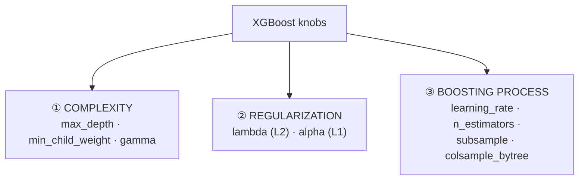
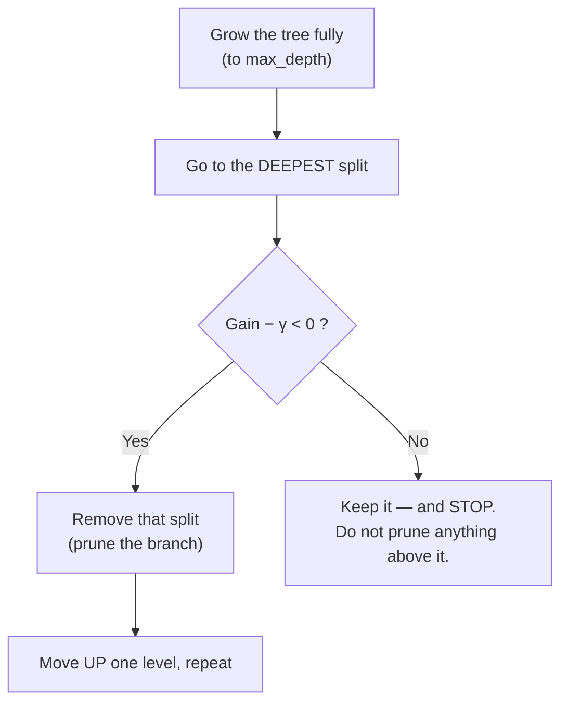
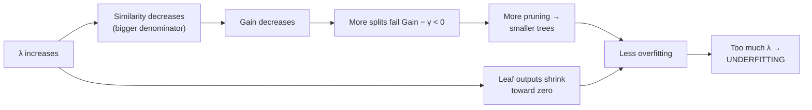
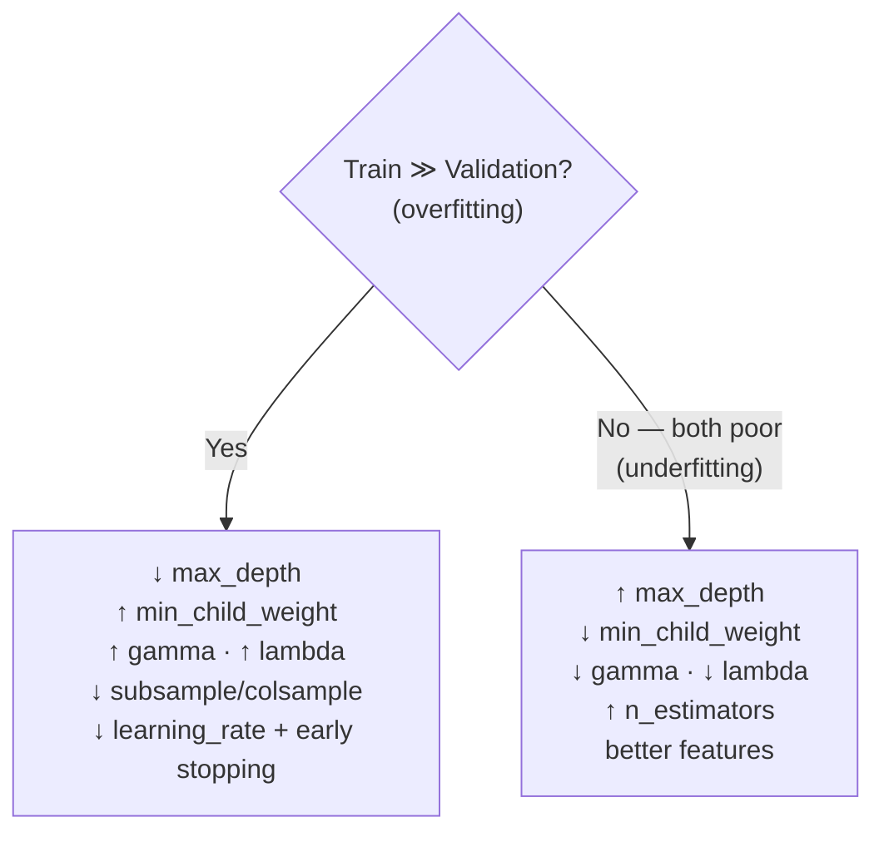

# Lesson 5 — Hyperparameters, Regularization & Pruning

> **Source:** Sessions 1 & 2 both cover **γ (gamma)**, **λ (lambda)** and the **learning rate**, including a worked bottom-up pruning demonstration in Session 2. The remaining parameters below are added — they're the ones you actually reach for in practice, and the videos' promised tuning class isn't in this playlist.
> **What this lesson gives you:** what every important knob does mechanically, which direction it pushes the bias/variance trade-off, and a sane tuning order.

---

## 🎯 TL;DR

XGBoost has dozens of parameters; roughly **eight** matter most of the time. They fall into three groups:



Every one of them trades the same thing: **more constraint = less overfitting but more underfitting.** The videos' repeated warning is exactly right — push γ or λ too far and you go from over- to *under*-fitting.

---

## 1. γ (gamma) — the pruning threshold

> **Source:** Session 1 and Session 2 (Session 2 has the clearer worked example).

**What.** A minimum gain a split must produce to be kept. Also exposed as `min_split_loss`.

**How it works — post-pruning, bottom-up.** γ is applied *after* the tree is grown, not during:



**The critical rule the video states explicitly:** *if you do not remove the child, you do not remove the parent.* Pruning stops at the first branch it decides to keep — it never removes a split that sits above a surviving split. That's what makes it bottom-up rather than a global sweep.

**Worked example** using Lesson 4's tree (root gain 1.333, deeper split gain 2.667):

| γ | Deepest split (2.667) | Root (1.333) | Result |
|---|---|---|---|
| **3** | `2.667 − 3 = −0.333` → prune | now evaluated: `1.333 − 3 = −1.667` → prune | **Whole tree removed** — only the initial prediction remains |
| **2** | `2.667 − 2 = +0.667` → **keep** | not evaluated (child survived) | **Whole tree kept** |

✅ Matches the video's demonstration, including the γ = 3 case collapsing the tree entirely.

> **The γ = 3 case is worth pausing on.** If γ is large enough, *every* tree gets pruned to nothing, and the model degenerates to just its initial prediction — the mean, or 0.5 probability. The video calls this out: predictions all collapse to the base value. That's a real failure mode, and a useful debugging signal: **if all your XGBoost predictions are identical, suspect γ (or a λ so large all leaf outputs vanish).**

| Facet | γ |
|---|---|
| **What** | Minimum gain required to keep a split |
| **Why** | Removes splits that "look" helpful on training data but barely improve the objective — the ones most likely to be fitting noise |
| **How** | Bottom-up post-pruning on `Gain − γ` |
| **When to use** | When trees are deep and overfitting, and you want *data-driven* simplification rather than a blunt depth cap |
| **When NOT to use** | When you're already underfitting, or on small/noisy data where any positive γ may erase whole trees. Leave at 0 until you've established a baseline |
| **Trade-offs** | Effective but hard to reason about — the right value depends entirely on your loss scale, so a γ that's mild for one dataset destroys another. Depth and `min_child_weight` are usually easier to tune first |
| **Typical range** | `0` (default) to ~5; scale-dependent, so always tune relative to observed gains |

> **⚠️ Important Note.** Session 1's explanation of pruning is garbled between "similarity − γ" and "gain − γ". The correct criterion, and the one Session 2 uses, is **`Gain − γ`**. Similarity is a property of a single node; only gain measures a split's worth.

---

## 2. λ (lambda) — L2 regularization

> **Source:** Sessions 1 & 2, `reg_lambda` in the API.

**What.** An L2 penalty on leaf output values. It appears in the **denominator** of both formulas:

```
Similarity  = (Σr)² / (H + λ)        ← λ shrinks similarity
Leaf output =  Σr   / (H + λ)        ← λ shrinks predictions
```

**The chain of effects** — this is the reasoning the videos walk through as a question to the class:



So λ attacks overfitting through **two independent routes at once**: it makes splits harder to justify, *and* it makes surviving leaves less confident.

**Concrete illustration.** A leaf with residuals `{42.25, 12.25, 2.25}`, `H = 3`:

| λ | Leaf output | Interpretation |
|---|---|---|
| 0 | `56.75/3 = 18.92` | full-confidence prediction |
| 1 | `56.75/4 = 14.19` | −25% |
| 10 | `56.75/13 = 4.37` | −77%, very cautious |
| 100 | `56.75/103 = 0.55` | essentially no prediction |

| Facet | λ |
|---|---|
| **What** | L2 penalty on leaf weights |
| **Why** | Stops leaves — especially those backed by few rows — making large confident predictions |
| **How** | Enters the denominator of similarity and leaf output |
| **When to use** | Almost always keep some. Increase when train/validation gap is wide |
| **When NOT to use** | Don't crank it while underfitting; and it's the wrong tool for *feature* selection (that's α) |
| **Trade-offs** | Very smooth, predictable control — but shrinks all leaves rather than targeting the problematic ones |
| **Default / range** | **`reg_lambda=1`** by default; tune roughly `0`–`10`, log-scale |

> **⚠️ Note on the walkthroughs.** Lessons 3 and 4 use λ = 0 for clean arithmetic, as the videos do. **The library default is `reg_lambda=1`** — so hand calculations won't match `XGBRegressor()` out of the box unless you set `reg_lambda=0`.

---

## 3. α (alpha) — L1 regularization

> Never mentioned in the videos; included because it's the natural counterpart to λ.

**What.** An L1 penalty on leaf weights (`reg_alpha`).

**How it differs from λ.** L2 shrinks values *proportionally* toward zero but rarely to exactly zero; L1 can push them to **exactly zero**, effectively removing a leaf's contribution.

| | λ (L2) | α (L1) |
|---|---|---|
| Effect | Proportional shrinkage | Can zero out entirely |
| Produces | Small but non-zero outputs | Genuinely sparse outputs |
| Use when | General regularization (default choice) | Very high-dimensional/sparse data; you want aggressive simplification |
| Default | 1 | 0 |

**Practical guidance:** start with λ only. Reach for α when you have many features, most of them useless, and you want the model to ignore them harder.

---

## 4. learning_rate (η, `eta`) — shrinkage

> **Source:** Sessions 1 & 2. **This is where the videos' advice is outdated — see the correction below.**

**What.** A multiplier applied to every tree's output before adding it (`pred += η × output`).

**Why.** Small steps mean no single tree dominates, and later trees can correct earlier mistakes. It is the single most effective regularizer in boosting.

**The fundamental relationship:**

```
learning_rate ↓  ⟹  n_estimators ↑   (they trade off directly)
```

Halve the learning rate and you need roughly twice the trees for equivalent fit — but you usually get **better generalization**.

> **⚠️ Modern Approach — the videos' advice here should be updated.** Session 2 advises leaving the learning rate near the 0.3 default and not changing it much. **Current practice is the opposite:** 0.3 is a fast-but-coarse default, and standard tuning uses **0.01–0.1 with many more trees plus early stopping**. The reason is exactly the Taylor-approximation argument from [Lesson 2](02-the-math-behind-xgboost.md) — the quadratic approximation is only valid *locally*, so smaller steps stay in the region where it holds. The videos' advice is reasonable for a quick demo; it is not competitive tuning.

| Setting | Trees needed | Character |
|---|---|---|
| 0.3 (default) | ~100 | Fast, coarse — fine for prototyping |
| 0.1 | ~300–500 | Good general-purpose choice |
| 0.05 | ~1000+ | Strong accuracy, slower |
| 0.01 | ~5000+ | Diminishing returns; use with early stopping |

| Facet | learning_rate |
|---|---|
| **What** | Per-tree shrinkage factor |
| **Why** | Prevents any tree from over-committing; keeps steps inside the valid approximation region |
| **When to use** | Always. Lower it when you have compute budget and want accuracy |
| **When NOT to use** | Don't lower it without raising `n_estimators` — you'll just underfit |
| **Trade-offs** | Directly trades training time for generalization |
| **Range** | 0.01–0.3 |

---

## 5. n_estimators — the number of trees

**What.** How many boosting rounds (trees) to build.

**The key asymmetry vs. Random Forest:**

> **Common Misconception:** "more trees is always safe." **True for Random Forest, false for XGBoost.** In bagging, extra trees just refine an average and eventually plateau. In boosting, every extra tree actively fits remaining residuals — including *noise* — so past some point validation error rises. Boosting **can and does overfit with too many trees.**

**The correct way to set it:** don't. Set it high and let **early stopping** find the number for you:

```python
model = XGBClassifier(n_estimators=5000, learning_rate=0.05, early_stopping_rounds=50)
model.fit(X_train, y_train, eval_set=[(X_val, y_val)], verbose=False)
print(model.best_iteration)   # the number you'd have wanted
```

> **⚠️ API change.** In older XGBoost, `early_stopping_rounds` was passed to `.fit()`. In current versions (2.x+) it belongs in the **constructor**. Code from 2021-era tutorials will raise errors or warnings.

---

## 6. max_depth — tree complexity

**What.** Maximum depth of each tree. Default **6**.

**Why it's the highest-leverage complexity knob:** depth controls **interaction order**. A depth-1 tree (a "stump") can only use one feature per prediction path — no interactions. Depth 2 captures pairwise interactions, depth 3 three-way, and so on. Meanwhile the number of leaves grows as `2^depth`, so cost and overfitting risk grow exponentially.

| Depth | Interactions captured | Risk |
|---|---|---|
| 1–2 | none / pairwise | Likely underfits |
| **3–6** | up to 6-way | **Sweet spot for most tabular problems** |
| 7–10 | deep | Overfits without strong regularization |
| >10 | very deep | Almost always overfitting; also slow |

**Practical guidance:** tune this **first**. It usually moves validation score more than anything except the learning rate.

---

## 7. min_child_weight — minimum evidence per leaf

**What.** The minimum **sum of Hessians** (`H`) required in a child for a split to be allowed. Default **1**.

**Why this parameter is subtler than it looks — and why it matters that it's Hessian-based, not a row count:**

- For **regression** (squared error, `h = 1` per row), `min_child_weight` **is** effectively a minimum row count.
- For **classification** (`h = p(1−p)`), it is a minimum *confidence-weighted* count. Since confident rows contribute nearly 0, a leaf could hold 50 confidently-classified rows and still fail `min_child_weight=1`.

> That's a genuinely useful behaviour: it means "don't split unless there's enough *uncertain* data here to justify it," which is a better criterion than raw row count.

| Facet | min_child_weight |
|---|---|
| **What** | Minimum Hessian sum per child node |
| **Why** | Blocks splits justified by too little effective evidence |
| **When to use** | Increase it when trees are creating tiny leaves / overfitting; very effective on noisy data |
| **When NOT to use** | Keep low for genuinely imbalanced problems where the minority class is legitimately rare and you *need* small leaves |
| **Range** | 1 (default) to ~10; higher for noisy data |

---

## 8. subsample & colsample_bytree — stochastic boosting

Two forms of randomness borrowed from bagging:

| Parameter | What it samples | Typical value |
|---|---|---|
| **`subsample`** | Fraction of **rows** used per tree | 0.5–1.0 (try 0.8) |
| **`colsample_bytree`** | Fraction of **columns** used per tree | 0.5–1.0 (try 0.8) |
| `colsample_bylevel` / `colsample_bynode` | Columns sampled per level / per split | Rarely needed |

**Why they help.** Each tree sees a slightly different problem, so trees decorrelate and the ensemble generalizes better — **stochastic gradient boosting**. `colsample_bytree` additionally stops one dominant feature being used in every single tree, giving weaker-but-real features a chance to contribute.

**Bonus:** both also speed up training, since each tree processes less data.

---

## 9. The complete reference table

| Parameter | Default | Range | ↑ increases | Group |
|---|---|---|---|---|
| `learning_rate` (η) | 0.3 | 0.01–0.3 | fit per tree (↑ overfit) | Process |
| `n_estimators` | 100 | 100–5000 | model capacity (↑ overfit) | Process |
| `max_depth` | 6 | 3–10 | complexity (↑ overfit) | Complexity |
| `min_child_weight` | 1 | 1–10 | constraint (↓ overfit) | Complexity |
| `gamma` (γ) | 0 | 0–5 | pruning (↓ overfit) | Complexity |
| `reg_lambda` (λ) | 1 | 0–10 | L2 shrinkage (↓ overfit) | Regularization |
| `reg_alpha` (α) | 0 | 0–10 | L1 sparsity (↓ overfit) | Regularization |
| `subsample` | 1 | 0.5–1 | (↓ value ⇒ ↓ overfit) | Process |
| `colsample_bytree` | 1 | 0.5–1 | (↓ value ⇒ ↓ overfit) | Process |
| `scale_pos_weight` | 1 | — | minority-class weight | Imbalance |

### Which direction do I move?



---

## 10. A sane tuning order

Tuning all ten at once is hopeless. Work in stages, holding earlier choices fixed:

1. **Fix `learning_rate = 0.1`** and use early stopping so `n_estimators` handles itself.
2. **Tune `max_depth`** (try 3, 4, 5, 6, 8) — biggest single lever.
3. **Tune `min_child_weight`** (1, 3, 5, 7).
4. **Tune `subsample` and `colsample_bytree`** (0.6, 0.8, 1.0).
5. **Tune `reg_lambda`, and `reg_alpha` if sparse** (log scale: 0, 0.1, 1, 10).
6. **Tune `gamma`** only if still overfitting.
7. **Finally, lower `learning_rate` to 0.01–0.05** and raise `n_estimators`, with early stopping. This is usually a free accuracy gain for extra compute.

> Use **randomized search** or **Bayesian optimization** (Optuna) rather than exhaustive grid search — the space is far too large for grids, and most parameters have broad flat optima where precise values don't matter.

---

## 11. Common Mistakes

> - **Mistake:** Cranking γ or λ to "add regularization" without checking validation score → **Why it's wrong:** both can silently prune trees to nothing, collapsing every prediction to the base value → **Do instead:** change one at a time and watch validation; if all predictions are identical, suspect these two.
> - **Mistake:** Lowering `learning_rate` without raising `n_estimators` → **Why it's wrong:** you've shortened every step but kept the same number of steps, so you stop short of a good fit → **Do instead:** always pair them, ideally via early stopping.
> - **Mistake:** Treating "more trees" as free, as in Random Forest → **Why it's wrong:** boosting keeps fitting residuals, eventually fitting noise → **Do instead:** early stopping on a validation set, always.
> - **Mistake:** Tuning against the test set → **Why it's wrong:** the test score stops being an unbiased estimate; you'll ship a model that's worse than you think → **Do instead:** train/validation/test, or nested cross-validation.
> - **Mistake:** Reading `min_child_weight` as a row count in classification → **Why it's wrong:** it's a Hessian sum, so confident rows barely count and the effective threshold is much stricter than you expect → **Do instead:** remember it's confidence-weighted; lower it for imbalanced problems.
> - **Mistake:** Grid-searching all parameters simultaneously → **Why it's wrong:** combinatorial explosion, and most of the grid is wasted on regions that don't matter → **Do instead:** staged tuning, then randomized/Bayesian search.

---

## 12. Exercises

**Beginner.** A leaf has residuals summing to 30 with `H = 5`. Compute the leaf output for λ = 0, 1, and 10.
*Success criterion:* 6, 5, and 2 — and you can state that λ shrinks confidence.

**Intermediate.** On any tabular dataset, train XGBoost at `max_depth` ∈ {2, 4, 6, 10, 15} and plot train vs. validation score.
*Success criterion:* you can identify the depth where validation peaks and train keeps improving, and name it as the overfitting point.

**Advanced.** Reproduce the γ demonstration: build a small tree, record each split's gain, then verify by hand which splits survive at γ = 0, 2, and 3 — including the rule that a surviving child protects its parent.
*Success criterion:* your predicted surviving structure matches what `gamma=` produces in the library.

**Challenge.** Write a tuning script using Optuna that respects the staged order above, with early stopping inside each trial and proper train/validation/test separation. Report the improvement over defaults and the total trials needed.
*Success criterion:* a reproducible study with a seed, a documented search space, and an honest test score reported **once**, at the end.

---

## ✍️ Next

You know what the knobs do. [Lesson 6 — Speed & System Design](06-speed-and-system-design.md) explains *how* XGBoost is fast — parallelization, cache-awareness, out-of-core computing, histogram-based splitting — and how it handles missing values automatically, which the videos mention but never explain mechanically.
