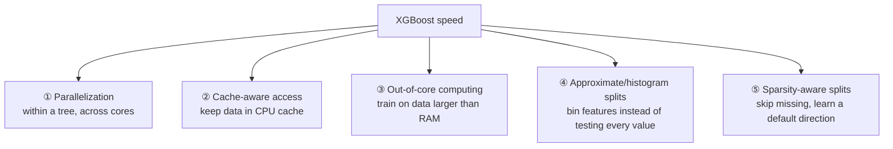
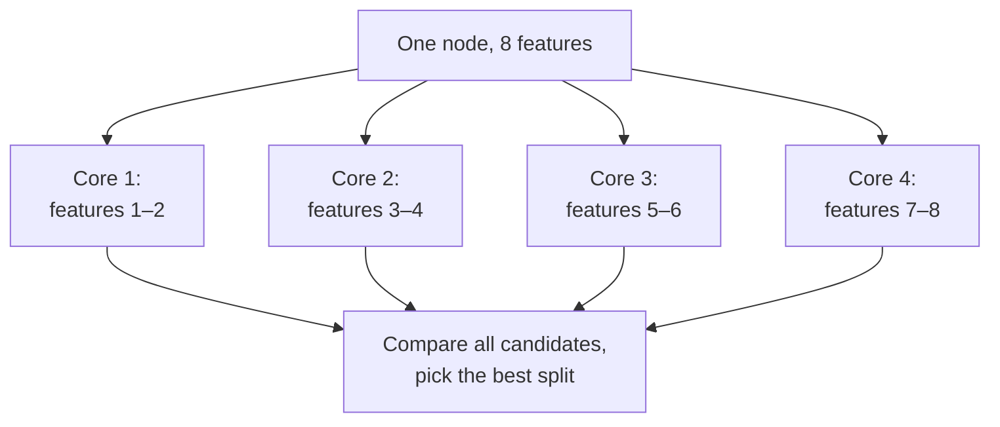
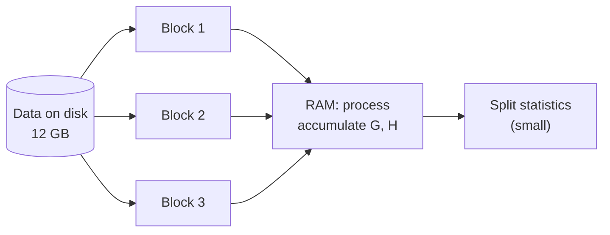
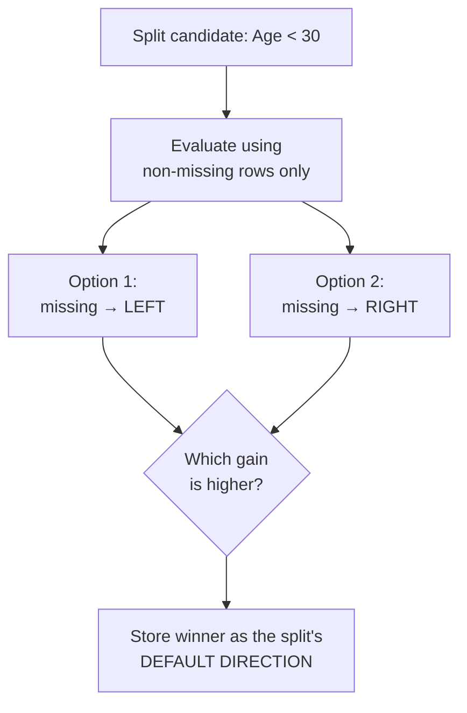

# Lesson 6 — Speed & System Design (Why XGBoost Is Fast)

> **Source:** Session 1 names three speed mechanisms — **parallelization**, **cache optimization**, **out-of-core computing** — and mentions automatic missing-value handling. The *mechanisms* behind each are expanded here, since the videos state them without explaining how they work.
> **What this lesson gives you:** why XGBoost is fast, what "automatic missing value handling" actually does, and which knobs affect training speed.

---

## 🎯 TL;DR

XGBoost's speed comes from **systems engineering, not a cleverer algorithm.** The mathematical core (Lesson 2) would be just as accurate implemented naively — and far slower. Five ideas do the work:



---

## 1. The bottleneck: what actually costs time

To understand the optimizations you need to know what they're optimizing. Building one tree means, at **every node**:

> For every feature → for every candidate threshold → compute `G` and `H` on each side → compute gain → keep the best.

With `n` rows and `m` features, exact split-finding costs roughly **O(n × m)** per level, plus sorting. Do that for every node, every level, every tree, and you see the problem: **finding splits is essentially the entire cost of training.** Every optimization below attacks that one loop.

---

## 2. Parallelization

> **Source:** Session 1.

**The apparent paradox.** Boosting is *sequential* — tree *n* needs tree *n−1*'s residuals. So what is there to parallelize?

**Answer: the split search inside a single tree.**



Each core independently evaluates candidate splits for its subset of features; results are compared at the end. This is **embarrassingly parallel** — the cores never need to talk to each other mid-computation.

> **⚠️ Important distinction, since it's a common interview trap.** XGBoost parallelizes **within** a tree (across features/candidate splits), **never across** trees. Random Forest does the opposite — trees are independent, so it parallelizes across trees. Claiming "XGBoost trains trees in parallel" is wrong and reveals a misunderstanding of boosting.

**Enabling it:** `n_jobs=-1` uses all cores. Note that returns diminish — beyond ~8–16 threads, coordination overhead and memory bandwidth become the limit, not CPU.

**The `sorted block` structure that makes it possible.** Sorting is the expensive part of split-finding, and a naive implementation re-sorts at every node. XGBoost instead pre-sorts each feature **once** into a compressed column-block structure, then reuses it throughout training. Each block can be handed to a different core — which is precisely what makes parallel split-finding practical.

---

## 3. Cache-aware access

> **Source:** Session 1 mentions cache optimization; the mechanism is expanded here.

**Prerequisite — the memory hierarchy.** Not all memory is equally fast:

| Level | Approx. latency | Size |
|---|---|---|
| CPU registers | ~1 cycle | bytes |
| **L1/L2/L3 cache** | ~1–40 cycles | KB–MB |
| RAM | ~200+ cycles | GB |
| Disk / SSD | ~100,000+ cycles | TB |

Reading from RAM can be **hundreds of times** slower than from cache. So for a loop that touches data billions of times, *where the data sits* matters more than how many operations you perform.

**The problem.** Feature values are stored pre-sorted by feature value, but the gradient/Hessian statistics are indexed by **row**. So walking through a sorted feature means jumping around the gradient array in effectively random order — **non-contiguous access**, which defeats cache prefetching and causes a cache miss almost every read.

**The fix — cache-aware prefetching.** XGBoost allocates a small internal buffer per thread, fetches gradient/Hessian values into it in a cache-friendly pattern, and accumulates there. This converts scattered random reads into predictable sequential ones.

> **Mental model.** Imagine collecting 1,000 books scattered across a huge library, one trip per book. Cache-aware access is loading a cart with the next 50 books you'll need, in shelf order, and wheeling it back once.
>
> *Where the analogy breaks:* the CPU also *predicts* what you'll need next (hardware prefetching), which has no real library equivalent — and the win comes as much from making that prediction possible as from batching.

---

## 4. Out-of-core computing

> **Source:** Session 1 — the 12 GB data / 8 GB RAM example.

**The problem.** Your dataset doesn't fit in RAM. Naively, the process crashes or the OS starts swapping (catastrophically slow).

**The solution.** Split the data into **blocks** on disk, then stream them through memory:



This works because the split-finding loop only needs **running sums** of `G` and `H`. Those sums are tiny regardless of how much data produced them, so data can be processed in chunks and discarded.

Two techniques make it fast rather than merely possible:

| Technique | What it does |
|---|---|
| **Block compression** | Compresses blocks on disk; decompression on the fly is cheaper than the extra disk I/O it saves — trading spare CPU for scarce disk bandwidth |
| **Block sharding** | Spreads blocks across multiple disks so reads happen in parallel |

**In practice today:** for genuinely large data you'd more often use `QuantileDMatrix`, external-memory mode, or distributed training via Spark/Dask/Ray. But the principle is unchanged.

---

## 5. Approximate / histogram-based split finding

> Not covered in the videos; this is the single biggest speed feature in modern XGBoost.

**Exact greedy split finding** tests *every* distinct feature value as a candidate threshold. With a million distinct values, that's a million evaluations per feature per node — accurate but expensive.

**The histogram approach:** bucket each feature into a fixed number of **bins** (default `max_bin=256`) and test only bin boundaries. A million candidates become 255.


**Why accuracy barely suffers.** Adjacent candidate thresholds produce nearly identical splits; the gain function is smooth in the threshold. Losing the ability to split at exactly 3.14159 rather than 3.14 costs almost nothing — and the resulting regularization can even *help* generalization.

**Weighted quantile sketch.** Bins aren't equal-width. XGBoost places boundaries so each bin carries roughly equal **Hessian mass** — meaning bins are finer where the model is still uncertain (large `h`) and coarser where it's confident. It's an approximation weighted by *where accuracy actually matters*.

> **Modern Approach:** `tree_method='hist'` is now the **default** in XGBoost 2.x (older versions defaulted to `exact`/`auto`). If you're reading 2021-era material that says "set `tree_method='hist'` for speed," that's now automatic. `tree_method='gpu_hist'` has likewise been replaced by `device='cuda'` with `tree_method='hist'`.

| tree_method | Speed | Accuracy | Use when |
|---|---|---|---|
| `exact` | Slowest | Highest | Small data; you need exact reproducibility of split points |
| **`hist`** | **Fast** | **Near-identical** | **Default — almost always right** |
| `approx` | Fast | Near-identical | Legacy distributed setting |
| `hist` + `device='cuda'` | Fastest | Near-identical | Large data with a GPU |

---

## 6. Sparsity-aware split finding — how missing values *actually* work

> **Source:** Session 1 states XGBoost "automatically handles missing values." This section explains the mechanism, which the videos don't.

**What most libraries do:** crash, or require you to impute first.

**What XGBoost does:** treats "missing" as a first-class case and **learns** where missing values belong.

At each split, XGBoost:
1. Considers **only non-missing rows** when evaluating candidate thresholds (so missing values never distort the threshold choice).
2. Then tries sending **all missing rows left**, computes the gain; tries sending them **all right**, computes the gain.
3. Stores the better option as that split's **default direction**.



At prediction time, a row with a missing value simply follows the stored default direction.

**Why this is genuinely better than imputation:**

| Imputation | XGBoost's learned default |
|---|---|
| Invents a value (mean/median) that was never observed | Invents nothing |
| Assumes missingness is uninformative | **Exploits** missingness if it's predictive |
| Same treatment at every split | A *different* direction can be learned per split |
| Distorts the feature's distribution | Distribution untouched |

> **This matters because missingness is often signal, not noise.** If income is missing more often for defaulters, that pattern is predictive — and mean-imputation destroys it while XGBoost's learned direction captures it. This is called **MNAR** (Missing Not At Random), and it's extremely common in real data.

**The speed benefit too:** skipping missing entries means sparse data (lots of zeros/missing, e.g. after one-hot encoding) is processed proportionally to the number of *non-missing* entries, not total cells.

> **⚠️ Two practical cautions.**
> 1. **This only works if missing values are actually missing.** If you've already imputed with `-999` or `0`, XGBoost sees a real value and the mechanism never engages. Pass `np.nan` and let XGBoost handle it.
> 2. **If a feature had no missing values in training**, XGBoost still assigns a default direction, but it was never validated against real missing data — so behaviour on missing values at inference time is essentially arbitrary. If you expect missingness in production, make sure it appears in training.

---

## 7. GPU training

Modern XGBoost has strong GPU support:

```python
model = XGBRegressor(tree_method="hist", device="cuda")
```

**Why GPUs suit histogram building:** it's a massively parallel accumulation of statistics into bins — thousands of threads each handling rows independently. Typical speedups are **5–20×** on large datasets.

**When it's *not* worth it:** small datasets (transfer overhead exceeds compute), or very few features. GPU memory is also the binding constraint — you may need `max_bin` reduced or external memory.

---

## 8. What actually controls your training time

| Factor | Effect | Notes |
|---|---|---|
| **`n_estimators`** | **Linear** | 1000 trees ≈ 10× the time of 100 |
| **`max_depth`** | Roughly exponential in nodes | Depth 10 has ~16× the nodes of depth 6 |
| Rows (n) | Near-linear | Sub-linear with `hist` |
| Features (m) | Near-linear | Reduce with `colsample_bytree` |
| `subsample`/`colsample` | Proportional reduction | 0.5 ≈ half the work per tree |
| `max_bin` | Linear in bins | 256 → 64 is noticeably faster, slightly less accurate |
| `n_jobs` | Sub-linear speedup | Diminishing past ~8–16 threads |
| `tree_method` | Large | `hist` ≫ `exact` on big data |
| `device='cuda'` | Large | 5–20× on large data |

> **The practical lesson:** if training is too slow, the first two rows dominate. Lower `n_estimators` (with a higher learning rate for prototyping), or reduce `max_depth`. Fiddling with `n_jobs` is usually noise by comparison.

---

## 9. The 7 facets — histogram-based split finding

| Facet | Answer |
|---|---|
| **What** | Bucketing continuous features into ~256 bins and only testing bin boundaries as split candidates. |
| **Why** | Exact split-finding scales with the number of *distinct values*, which is the dominant training cost on large data. |
| **How** | Weighted quantile sketch places bin boundaries at roughly equal Hessian mass; gradient statistics are accumulated per bin. |
| **When to use** | Essentially always — it's the modern default. Mandatory above ~10k rows. |
| **When NOT to use** | When you need exact reproducibility of split thresholds (regulatory/audit), or on tiny datasets where the approximation loses real precision and there's no speed problem to solve. |
| **Trade-offs** | Slightly coarser thresholds (usually immaterial, sometimes beneficial as regularization); an extra hyperparameter (`max_bin`); binning itself costs a one-off pass. |
| **Example** | 5M rows × 200 features: `exact` may take hours, `hist` minutes, with validation AUC differing in the third decimal. |

---

## 10. Common Mistakes

> - **Mistake:** Saying XGBoost trains trees in parallel → **Why it's wrong:** boosting is sequential by construction; parallelism is within-tree over features/splits → **Do instead:** say "it parallelizes split-finding within each tree."
> - **Mistake:** Imputing with sentinel values like `-999` or `0` before training → **Why it's wrong:** XGBoost then treats them as genuine values, disabling sparsity-aware split finding and injecting a fake cluster of extreme values → **Do instead:** pass `np.nan` and let XGBoost learn the direction.
> - **Mistake:** Expecting linear speedup from more cores → **Why it's wrong:** memory bandwidth and thread coordination cap the benefit around 8–16 threads → **Do instead:** measure; reduce `n_estimators`/`max_depth` if you need real speedups.
> - **Mistake:** Using `tree_method='exact'` on large data for "better accuracy" → **Why it's wrong:** the accuracy difference is usually within noise while the time difference is orders of magnitude → **Do instead:** keep `hist` and spend the saved time on tuning or more trees.
> - **Mistake:** Assuming no missing values in training means production missingness is handled → **Why it's wrong:** the default direction was never validated against real missing data → **Do instead:** ensure training data reflects production missingness, or impute explicitly and document it.

---

## 11. Exercises

**Beginner.** Explain in two sentences why boosting can't parallelize across trees but can within one.
*Success criterion:* you note the residual dependency between trees, and that candidate splits within a node are independent.

**Intermediate.** Time XGBoost on a dataset ≥100k rows with `tree_method='exact'` vs `'hist'`, and compare both runtime and validation score.
*Success criterion:* `hist` is substantially faster with a score difference far smaller than the runtime difference.

**Advanced.** Construct a dataset where missingness is predictive (e.g. a feature missing 80% of the time for the positive class). Compare XGBoost with `np.nan` preserved vs. mean-imputed.
*Success criterion:* the `np.nan` version scores meaningfully better, and you can explain that imputation destroyed the MNAR signal.

**Challenge.** Profile training and attribute time across `n_estimators`, `max_depth`, `max_bin`, and `n_jobs` by varying one at a time. Produce a table of marginal time cost per unit and identify where speedup effort is best spent.
*Success criterion:* your table shows the near-linear `n_estimators` relationship and the sub-linear `n_jobs` scaling, with a defensible recommendation.

---

## ✍️ Next

Theory is complete. [Lesson 7 — Practical Implementation](07-practical-implementation.md) writes real code: installation, the scikit-learn API, and Session 2's `ColumnTransformer` + `Pipeline` walkthrough on the Titanic dataset — with the progressive simple → realistic → production ladder.
