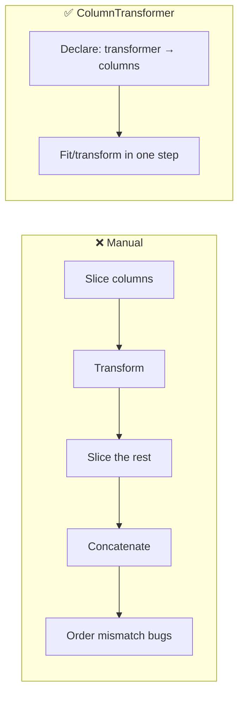
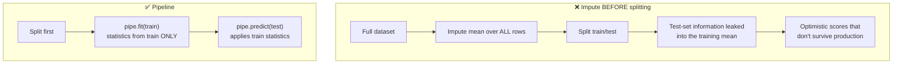

# Lesson 7 — Practical Implementation (Code, ColumnTransformer & Pipelines)

> **Source:** Session 1 (install + CV comparison) and Session 2 (Titanic project, `ColumnTransformer`, `Pipeline`, `pickle`) · [Session 1](https://www.youtube.com/watch?v=BTLB-ppqBZc&list=PLKnIA16_RmvbXJbBW4zCy4Xbr81GRyaC4&index=1) · [Session 2](https://www.youtube.com/watch?v=7G540ZGQubc&list=PLKnIA16_RmvbXJbBW4zCy4Xbr81GRyaC4&index=2)
> **What this lesson gives you:** working code from install to saved artifact, following the videos' Titanic example, with modern API corrections and the three-rung simple → realistic → production ladder.

---

## 🎯 TL;DR

XGBoost is not bundled with scikit-learn — install it separately. Once installed, `XGBRegressor`/`XGBClassifier` behave like any sklearn estimator, which means the real skill is **assembling a clean preprocessing + model pipeline**. Session 2's central practical lesson is that `ColumnTransformer` + `Pipeline` replace the error-prone manual routine of slicing columns out, transforming them, and stitching them back — and that pickling the **whole pipeline** (not just the model) is what makes deployment sane.

---

## 1. Installation

```bash
pip install xgboost
```

> **Source:** Session 1 explicitly notes XGBoost is **not** available by default and must be installed separately — a genuine stumbling block for beginners expecting it inside sklearn.

```python
import xgboost as xgb
print(xgb.__version__)   # confirm; API differs meaningfully between 1.x and 2.x/3.x
```

**Two APIs exist.** Know which you're reading:

| API | Entry point | Character |
|---|---|---|
| **scikit-learn API** | `XGBRegressor`, `XGBClassifier` | `.fit()`/`.predict()`, works with `Pipeline`, `GridSearchCV`. **Use this.** |
| **Native/learning API** | `xgb.train()`, `xgb.DMatrix` | More control, some advanced features appear here first |

This lesson uses the sklearn API throughout.

---

## 2. Example 1 — Simplest (minimum to see it work)

**Goal:** demonstrate the idea with nothing defensive.

```python
from sklearn.datasets import fetch_california_housing
from sklearn.model_selection import train_test_split
from xgboost import XGBRegressor

X, y = fetch_california_housing(return_X_y=True)
X_train, X_test, y_train, y_test = train_test_split(X, y, test_size=0.2, random_state=42)

model = XGBRegressor()
model.fit(X_train, y_train)
print("R²:", model.score(X_test, y_test))
```

**Dependencies:** `xgboost`, `scikit-learn`.
**Expected output:** an R² around 0.83–0.85.
**Why it works:** all features are numeric with no missing values, so no preprocessing is needed and defaults are adequate.

**What's wrong with it:** no validation set, no early stopping, `n_estimators` fixed at an arbitrary 100, and no reproducibility beyond the split seed.

---

## 3. Session 1's model comparison

> **Source:** Session 1, code demo.

The video benchmarks three untuned models with 10-fold cross-validation:

```python
from sklearn.model_selection import cross_val_score
from sklearn.ensemble import RandomForestRegressor, GradientBoostingRegressor
from xgboost import XGBRegressor
import numpy as np

models = {
    "RandomForest":     RandomForestRegressor(random_state=42),
    "GradientBoosting": GradientBoostingRegressor(random_state=42),
    "XGBoost":          XGBRegressor(random_state=42),
}

for name, m in models.items():
    scores = cross_val_score(m, X, y, cv=10, scoring="r2", n_jobs=-1)
    print(f"{name:18s} {scores.mean():.4f} ± {scores.std():.4f}")
```

**The video's finding:** out of the box, **Random Forest scored best**; XGBoost beat GradientBoosting. The instructor then began tuning XGBoost (learning rate, gamma, lambda) to try to overtake it.

> **⚠️ Don't over-generalize this result.** It is a real, honest observation — and it's genuinely useful because it contradicts the assumption that XGBoost always wins. But it reflects **untuned defaults on one dataset**. Two things explain it:
>
> 1. **Random Forest's defaults are close to optimal** (deep trees, all features, averaging) whereas **XGBoost's defaults are not** — `learning_rate=0.3` with only `n_estimators=100` is a coarse, deliberately fast configuration.
> 2. Boosting's advantage appears **after tuning**. Comparing tuned RF against untuned XGBoost is not a fair fight in either direction.
>
> **The correct takeaway:** always benchmark a Random Forest baseline (cheap, robust, few knobs), and only prefer XGBoost once you've actually tuned it.

---

## 4. Session 2's Titanic project

> **Source:** Session 2, second half.

### The strategy from the video

| Step | Decision |
|---|---|
| **Drop columns** | `PassengerId`, `Name`, `Ticket`, `Cabin` |
| **Impute `Age`** | `SimpleImputer(strategy='mean')` |
| **Impute `Embarked`** | `SimpleImputer(strategy='most_frequent')` |
| **Encode `Sex`, `Embarked`** | `OneHotEncoder` |
| **Model** | `XGBClassifier` with defaults |
| **Assemble** | `ColumnTransformer` → `Pipeline` |
| **Save** | `pickle` the whole pipeline |

Fitted values the video reports: mean `Age` ≈ **29**, most frequent `Embarked` = **S** (Southampton).

> **⚠️ Two notes on the video's choices.**
> 1. **Imputing `Age` is unnecessary for XGBoost** — as [Lesson 6](06-speed-and-system-design.md) explains, it handles `np.nan` natively and often *better* than mean imputation. The instructor acknowledges this directly, and gives the right reason to do it anyway: you'll usually compare against other algorithms (logistic regression, SVM) that *cannot* handle missing values, so a shared pipeline needs imputation. That's sound engineering, not a modelling requirement.
> 2. **Dropping `Cabin` entirely discards signal** — the deck letter (`C123` → `C`) correlates with class and survival. Fine for a demo; leave it on your feature-engineering list.

### The problem ColumnTransformer solves

Before `ColumnTransformer`, encoding a few columns meant: slice them out → transform → slice the untouched columns → concatenate → hope the column order still matches. Session 2 notes this was repeated in project after project, and it is genuinely error-prone.



### The code

```python
import numpy as np
import pandas as pd
from sklearn.model_selection import train_test_split
from sklearn.compose import ColumnTransformer
from sklearn.impute import SimpleImputer
from sklearn.preprocessing import OneHotEncoder
from sklearn.pipeline import Pipeline
from xgboost import XGBClassifier

df = pd.read_csv("train.csv")
df = df.drop(columns=["PassengerId", "Name", "Ticket", "Cabin"])

X = df.drop(columns=["Survived"])
y = df["Survived"]

X_train, X_test, y_train, y_test = train_test_split(
    X, y, test_size=0.2, random_state=42, stratify=y      # stratify: preserve class balance
)
```

Now the transformers. **Use column *names*, not positional indices:**

```python
# Step 1 — imputation
trf1 = ColumnTransformer([
    ("impute_age",      SimpleImputer(strategy="mean"),          ["Age"]),
    ("impute_embarked", SimpleImputer(strategy="most_frequent"), ["Embarked"]),
], remainder="passthrough")

# Step 2 — one-hot encoding
trf2 = ColumnTransformer([
    ("onehot", OneHotEncoder(
        sparse_output=False,      # dense array
        handle_unknown="ignore",  # unseen categories at predict time → all zeros
        drop="first",             # drop one level to avoid the dummy trap
    ), ["Sex", "Embarked"]),
], remainder="passthrough")

# Step 3 — model
model = XGBClassifier(
    n_estimators=200, learning_rate=0.1, max_depth=4,
    random_state=42, eval_metric="logloss",
)

pipe = Pipeline([("impute", trf1), ("encode", trf2), ("model", model)])
pipe.fit(X_train, y_train)
print("Accuracy:", pipe.score(X_test, y_test))
```

### ⚠️ Four corrections to the video's code

> **1. `sparse=False` is now `sparse_output=False`.** Renamed in scikit-learn 1.2; the old name was removed in 1.4. 2021-era code raises `TypeError`.

> **2. Use column names, not indices.** Session 2 uses positional indices, correctly explaining why: `ColumnTransformer` outputs a **NumPy array**, which has no column names, so a *second* transformer can't refer to names. But the better fix is to avoid the problem: pass a DataFrame and use names, or set `pipe.set_output(transform="pandas")` so DataFrames flow through the whole pipeline. Positional indices silently break the moment upstream column order changes — a nasty class of production bug.
>
> ```python
> pipe.set_output(transform="pandas")   # names survive between steps
> ```

> **3. `remainder='passthrough'` must be spelled exactly.** The video hits this live: a misspelling caused columns to be silently dropped and produced a wrong output shape. There's a real lesson here — **`remainder` defaults to `'drop'`**, so any typo or omission silently discards every column you didn't explicitly list. Always assert the shape:
>
> ```python
> assert trf1.fit_transform(X_train).shape[1] == X_train.shape[1]
> ```

> **4. `handle_unknown='ignore'` is essential, and the video is right about why.** If a category appears in test but not train (its example: only Delhi and Mumbai in training, Kolkata appears in testing), the default raises an error. With `'ignore'`, unseen categories encode as all-zeros. In production, unseen categories are inevitable.

### Inspecting a fitted ColumnTransformer

> **Source:** Session 2 demonstrates this, and it's a genuinely useful debugging habit.

```python
fitted = pipe.named_steps["impute"]
print(fitted.transformers_)                                    # the three sub-transformers
print(fitted.named_transformers_["impute_age"].statistics_)     # learned mean Age ≈ 29
print(fitted.named_transformers_["impute_embarked"].statistics_)# learned mode ≈ 'S'
```

**Why bother:** it confirms the transformer learned what you expected. A mean age of 29 is plausible; a mean age of 0.5 would reveal you'd fed it a scaled column by mistake.

---

## 5. Why Pipeline matters — the leakage argument

The video presents `Pipeline` mainly as convenience: instead of exporting several transformer objects and re-applying them in order at inference, you export one object. That's true and valuable. **But the deeper reason is data leakage.**



Inside a `Pipeline`, `fit` computes statistics on training data only, and `predict` reuses them. During cross-validation this happens **per fold, automatically** — which is nearly impossible to get right by hand.

> **This is the single strongest reason to use pipelines**, and it's worth adding to the video's framing: convenience is the benefit you notice, leakage prevention is the benefit that saves you.

---

## 6. Example 2 — Realistic (validation, early stopping, error handling)

```python
import numpy as np, pandas as pd
from sklearn.model_selection import train_test_split, StratifiedKFold, cross_val_score
from sklearn.compose import ColumnTransformer
from sklearn.impute import SimpleImputer
from sklearn.preprocessing import OneHotEncoder
from sklearn.pipeline import Pipeline
from sklearn.metrics import classification_report, roc_auc_score
from xgboost import XGBClassifier

RANDOM_STATE = 42
NUMERIC     = ["Age", "Fare", "SibSp", "Parch"]
CATEGORICAL = ["Sex", "Embarked", "Pclass"]

def load(path: str) -> pd.DataFrame:
    df = pd.read_csv(path)
    required = set(NUMERIC + CATEGORICAL + ["Survived"])
    missing = required - set(df.columns)
    if missing:
        raise ValueError(f"Missing required columns: {sorted(missing)}")
    return df

df = load("train.csv")
X, y = df[NUMERIC + CATEGORICAL], df["Survived"]

# Three-way split: train / validation (early stopping) / test (final, untouched)
X_tmp, X_test, y_tmp, y_test = train_test_split(
    X, y, test_size=0.2, random_state=RANDOM_STATE, stratify=y)
X_train, X_val, y_train, y_val = train_test_split(
    X_tmp, y_tmp, test_size=0.2, random_state=RANDOM_STATE, stratify=y_tmp)

preprocess = ColumnTransformer([
    ("num", SimpleImputer(strategy="median"), NUMERIC),
    ("cat", Pipeline([
        ("impute", SimpleImputer(strategy="most_frequent")),
        ("onehot", OneHotEncoder(sparse_output=False, handle_unknown="ignore", drop="first")),
    ]), CATEGORICAL),
], remainder="drop")

model = XGBClassifier(
    n_estimators=2000,          # high — early stopping decides the real number
    learning_rate=0.05,
    max_depth=4,
    min_child_weight=3,
    subsample=0.8,
    colsample_bytree=0.8,
    reg_lambda=1.0,
    random_state=RANDOM_STATE,
    eval_metric="auc",
    early_stopping_rounds=50,   # constructor, not .fit() — XGBoost 2.x+
    n_jobs=-1,
)

# Early stopping needs *preprocessed* validation data, so fit the preprocessor first
X_train_p = preprocess.fit_transform(X_train)
X_val_p   = preprocess.transform(X_val)

model.fit(X_train_p, y_train, eval_set=[(X_val_p, y_val)], verbose=False)
print("Best iteration:", model.best_iteration)

X_test_p = preprocess.transform(X_test)
proba = model.predict_proba(X_test_p)[:, 1]
print("Test AUC:", roc_auc_score(y_test, proba))
print(classification_report(y_test, (proba >= 0.5).astype(int)))
```

**Deltas from Example 1:**
- **Median** not mean imputation (robust to `Fare` outliers)
- **Three-way split** so the test set is never used for any decision
- **Early stopping** replaces guessing `n_estimators`
- **AUC** rather than accuracy (class-imbalance-aware)
- Explicit **schema validation** on load
- Nested pipeline for categoricals (impute → encode in the right order)
- `random_state` everywhere for reproducibility

> **⚠️ The early-stopping/pipeline tension.** Early stopping needs *transformed* validation data, but a `Pipeline` transforms internally — so `pipe.fit(X, y, model__eval_set=...)` requires the eval set to already be transformed, which is awkward. The pragmatic pattern above keeps the preprocessor separate during training. For final deployment, refit as a single pipeline with `n_estimators=model.best_iteration` so you still ship one artifact.

---

## 7. Example 3 — Production

```python
"""Production-style training with artifact versioning and validation."""
from __future__ import annotations
import json, logging, hashlib
from dataclasses import dataclass, asdict
from pathlib import Path

import joblib, numpy as np, pandas as pd
from sklearn.compose import ColumnTransformer
from sklearn.impute import SimpleImputer
from sklearn.metrics import roc_auc_score, average_precision_score
from sklearn.model_selection import StratifiedKFold, train_test_split
from sklearn.pipeline import Pipeline
from sklearn.preprocessing import OneHotEncoder
from xgboost import XGBClassifier

logging.basicConfig(level=logging.INFO, format="%(asctime)s %(levelname)s %(message)s")
log = logging.getLogger(__name__)

@dataclass(frozen=True)
class Config:
    numeric: tuple[str, ...] = ("Age", "Fare", "SibSp", "Parch")
    categorical: tuple[str, ...] = ("Sex", "Embarked", "Pclass")
    target: str = "Survived"
    random_state: int = 42
    n_splits: int = 5
    min_auc: float = 0.80          # release gate

CFG = Config()

def data_fingerprint(df: pd.DataFrame) -> str:
    """Hash of the data, so a model artifact is traceable to its training set."""
    return hashlib.sha256(pd.util.hash_pandas_object(df, index=True).values).hexdigest()[:16]

def validate(df: pd.DataFrame) -> None:
    cols = set(CFG.numeric + CFG.categorical) | {CFG.target}
    if missing := cols - set(df.columns):
        raise ValueError(f"Missing columns: {sorted(missing)}")
    if df[CFG.target].isna().any():
        raise ValueError("Target contains nulls")
    if not set(df[CFG.target].unique()) <= {0, 1}:
        raise ValueError("Target must be binary 0/1")
    rate = df[CFG.target].mean()
    if not 0.01 < rate < 0.99:
        raise ValueError(f"Degenerate class balance: {rate:.3f}")
    log.info("Validation OK — %d rows, positive rate %.3f", len(df), rate)

def build_pipeline(n_estimators: int, scale_pos_weight: float) -> Pipeline:
    pre = ColumnTransformer([
        ("num", SimpleImputer(strategy="median"), list(CFG.numeric)),
        ("cat", Pipeline([
            ("impute", SimpleImputer(strategy="most_frequent")),
            ("onehot", OneHotEncoder(sparse_output=False, handle_unknown="ignore", drop="first")),
        ]), list(CFG.categorical)),
    ], remainder="drop")

    clf = XGBClassifier(
        n_estimators=n_estimators, learning_rate=0.05, max_depth=4,
        min_child_weight=3, subsample=0.8, colsample_bytree=0.8,
        reg_lambda=1.0, scale_pos_weight=scale_pos_weight,
        random_state=CFG.random_state, eval_metric="aucpr", n_jobs=-1, tree_method="hist",
    )
    return Pipeline([("pre", pre), ("clf", clf)])

def main(csv: str, out_dir: str = "artifacts") -> None:
    df = pd.read_csv(csv)
    validate(df)
    fingerprint = data_fingerprint(df)

    X = df[list(CFG.numeric + CFG.categorical)]
    y = df[CFG.target]
    X_tr, X_te, y_tr, y_te = train_test_split(
        X, y, test_size=0.2, random_state=CFG.random_state, stratify=y)

    neg, pos = (y_tr == 0).sum(), (y_tr == 1).sum()
    spw = neg / max(pos, 1)

    # Cross-validated estimate of the right number of trees
    cv = StratifiedKFold(CFG.n_splits, shuffle=True, random_state=CFG.random_state)
    best_iters, fold_scores = [], []
    for k, (tr, va) in enumerate(cv.split(X_tr, y_tr), 1):
        pipe = build_pipeline(2000, spw)
        pipe.named_steps["clf"].set_params(early_stopping_rounds=50)
        Xtr_p = pipe.named_steps["pre"].fit_transform(X_tr.iloc[tr])
        Xva_p = pipe.named_steps["pre"].transform(X_tr.iloc[va])
        pipe.named_steps["clf"].fit(Xtr_p, y_tr.iloc[tr],
                                    eval_set=[(Xva_p, y_tr.iloc[va])], verbose=False)
        best_iters.append(pipe.named_steps["clf"].best_iteration)
        fold_scores.append(roc_auc_score(
            y_tr.iloc[va], pipe.named_steps["clf"].predict_proba(Xva_p)[:, 1]))
        log.info("Fold %d — AUC %.4f, best_iter %d", k, fold_scores[-1], best_iters[-1])

    n_final = int(np.mean(best_iters))
    log.info("CV AUC %.4f ± %.4f | n_estimators → %d",
             np.mean(fold_scores), np.std(fold_scores), n_final)

    # Refit a single deployable artifact
    final = build_pipeline(n_final, spw)
    final.fit(X_tr, y_tr)

    proba = final.predict_proba(X_te)[:, 1]
    metrics = {
        "test_auc": float(roc_auc_score(y_te, proba)),
        "test_aucpr": float(average_precision_score(y_te, proba)),
        "cv_auc_mean": float(np.mean(fold_scores)),
        "cv_auc_std": float(np.std(fold_scores)),
        "n_estimators": n_final,
        "data_fingerprint": fingerprint,
        "xgboost_version": __import__("xgboost").__version__,
        "config": asdict(CFG),
    }

    if metrics["test_auc"] < CFG.min_auc:                 # release gate
        raise RuntimeError(f"AUC {metrics['test_auc']:.4f} below gate {CFG.min_auc}")

    out = Path(out_dir); out.mkdir(parents=True, exist_ok=True)
    joblib.dump(final, out / f"model_{fingerprint}.joblib")
    (out / f"metrics_{fingerprint}.json").write_text(json.dumps(metrics, indent=2))
    log.info("Saved artifacts for %s — test AUC %.4f", fingerprint, metrics["test_auc"])

if __name__ == "__main__":
    main("train.csv")
```

**Deltas from Example 2, and why each exists:**

| Addition | Why |
|---|---|
| `@dataclass` config | One place for all settings; serialized into metrics for traceability |
| **Data fingerprint** | Ties an artifact to the exact data that produced it — the reproducibility question from MLOps |
| **Schema + distribution validation** | Fails fast and loudly on bad input rather than training a garbage model |
| **Cross-validated `best_iteration`** | A single validation split gives a noisy tree count; averaging folds is far more stable |
| **`scale_pos_weight`** | Handles class imbalance without resampling |
| **AUC-PR alongside AUC** | More informative than ROC-AUC under imbalance |
| **Release gate** | Refuses to ship a model below an agreed bar — CI/CD-friendly |
| **`joblib`, not `pickle`** | Better with large NumPy arrays |
| **Version + metrics recorded** | You can answer "what changed?" six months later |
| **Structured logging** | Observable in a scheduler/CI, not just a terminal |

---

## 8. Saving and loading

> **Source:** Session 2 pickles the whole pipeline and reloads it for a single prediction.

```python
import joblib
joblib.dump(pipe, "pipeline.joblib")

pipe = joblib.load("pipeline.joblib")
row = pd.DataFrame([{"Age": 29, "Fare": 7.25, "SibSp": 1, "Parch": 0,
                     "Sex": "male", "Embarked": "S", "Pclass": 3}])
print(pipe.predict(row), pipe.predict_proba(row)[:, 1])
```

**The video's key point stands:** because the pipeline contains preprocessing *and* model, a raw input row can go straight in — no manual re-application of transformers. This is what makes it deployable.

> **⚠️ Pickle caveats for production.** Pickle/joblib artifacts are **not** portable across library versions and are **not** safe to load from untrusted sources (arbitrary code execution). For long-lived deployments also export the booster in XGBoost's own stable format:
>
> ```python
> pipe.named_steps["clf"].save_model("model.json")   # version-stable, language-portable
> ```
>
> Keep the joblib pipeline for convenience *and* the JSON booster for durability, and always pin your library versions alongside the artifact.

> **⚠️ One subtle input bug the video encounters.** Passing a bare Python list/array can trip dtype inference. Always predict from a **DataFrame with the same column names and dtypes as training** — which is another argument for pipelines with named columns.

---

## 9. Common Mistakes

> - **Mistake:** Preprocessing the full dataset before splitting → **Why it's wrong:** imputation/scaling statistics absorb test-set information, producing optimistic scores that vanish in production → **Do instead:** split first and put all preprocessing inside a `Pipeline`.
> - **Mistake:** Pickling only the model → **Why it's wrong:** inference then requires manually recreating every transform in the right order, and any drift between training and serving code is silent → **Do instead:** serialize the entire pipeline.
> - **Mistake:** Omitting `handle_unknown='ignore'` on `OneHotEncoder` → **Why it's wrong:** the first unseen category in production raises an exception mid-request → **Do instead:** set it explicitly.
> - **Mistake:** Relying on `remainder`'s default → **Why it's wrong:** it defaults to `'drop'`, so unlisted columns disappear silently → **Do instead:** state `remainder` explicitly and assert the output shape.
> - **Mistake:** Using positional column indices in chained `ColumnTransformer`s → **Why it's wrong:** they break silently when upstream column order changes → **Do instead:** `set_output(transform='pandas')` and use names.
> - **Mistake:** Mean-imputing then feeding XGBoost → **Why it's wrong:** you discard XGBoost's learned missing-value directions and any MNAR signal → **Do instead:** pass `np.nan` when XGBoost is the only model; impute only when sharing a pipeline with algorithms that require it (and say so in a comment, as the video does).
> - **Mistake:** Using `sparse=False` on `OneHotEncoder` → **Why it's wrong:** renamed to `sparse_output` in sklearn 1.2 and removed in 1.4 → **Do instead:** use `sparse_output=False`.

---

## 10. Exercises

**Beginner.** Install XGBoost and train `XGBClassifier` on Titanic using only numeric columns, with no preprocessing. Report accuracy.
*Success criterion:* it runs despite missing `Age` values — and you can explain why (native `np.nan` handling).

**Intermediate.** Build the full `ColumnTransformer` + `Pipeline` from §4, then verify no leakage by confirming `cross_val_score` on the pipeline gives a slightly *lower* score than preprocessing-then-CV.
*Success criterion:* you observe the gap and can explain that the higher number was leakage-inflated.

**Advanced.** Extend the pipeline with engineered features (`FamilySize = SibSp + Parch + 1`, title extracted from `Name`, deck letter from `Cabin`) using a custom `FunctionTransformer`, and measure the AUC change.
*Success criterion:* features are created **inside** the pipeline (so they apply identically at inference), and you report an honest before/after AUC.

**Challenge.** Take Example 3 and add: an Optuna tuning stage, MLflow experiment logging, a FastAPI `/predict` endpoint loading the artifact, and a pytest suite covering schema validation, the leakage check, and prediction shape/range.
*Success criterion:* `pytest` passes, the endpoint returns calibrated probabilities for a raw JSON row, and every run is reproducible from the logged config + fingerprint.

---

## ✍️ Next

[Lesson 8 — Tuning, Evaluation & Interpretation](08-tuning-evaluation-and-interpretation.md) covers choosing metrics, cross-validation strategy, search methods, and reading feature importance and SHAP values without fooling yourself.
