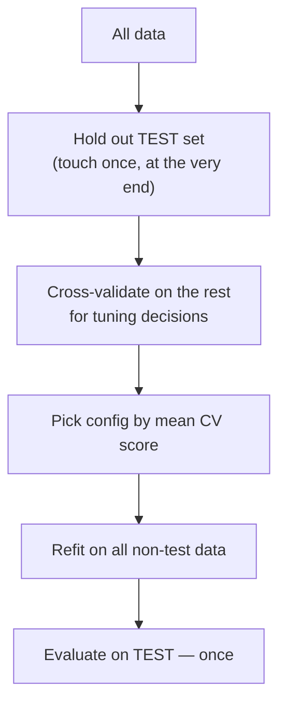

# Lesson 8 — Tuning, Evaluation & Interpretation

> **Source:** Session 1 demonstrates 10-fold `cross_val_score` and begins manual hyperparameter tuning; Session 2 closes by recommending ensembling XGBoost with other models. The videos promised a dedicated tuning class that isn't in this playlist, so most of this lesson is added material.
> **What this lesson gives you:** how to pick a metric, validate honestly, search efficiently, and read feature importance without deceiving yourself.

---

## 🎯 TL;DR

Three things separate a tuned model from a lucky one:

1. **Pick the metric before you tune.** Optimizing accuracy on imbalanced data produces a useless model that looks excellent.
2. **Use early stopping with cross-validation**, not a fixed `n_estimators` and a single split.
3. **Distrust default feature importance.** XGBoost's built-in `gain` importance is biased toward high-cardinality features; use **permutation importance** or **SHAP** for decisions that matter.

---

## 1. Choosing a metric

The metric defines what "better" means. Get it wrong and every subsequent decision is wrong.

### Classification

| Metric | What it measures | Use when | Avoid when |
|---|---|---|---|
| **Accuracy** | Fraction correct | Balanced classes, symmetric costs | **Imbalanced data** — 99:1 gives 99% for predicting one class |
| **Precision** | Of predicted positives, how many are right | False positives are costly (spam filter) | You care about missing cases |
| **Recall / Sensitivity** | Of actual positives, how many you caught | False negatives are costly (cancer screening) | False alarms are expensive |
| **F1** | Harmonic mean of precision & recall | You need one number balancing both | Costs are genuinely asymmetric — weight them instead |
| **ROC-AUC** | Ranking quality across all thresholds | General-purpose; threshold-independent | Severe imbalance — can look good while precision is terrible |
| **AUC-PR** *(average precision)* | Precision/recall trade-off across thresholds | **Imbalanced data — usually the right default** | Balanced data (ROC-AUC is more interpretable) |
| **Log-loss** | Quality of predicted *probabilities* | You need calibrated probabilities, not just rankings | You only need a ranking |

> **The imbalance rule.** ROC-AUC is computed from true-positive and false-positive *rates*. On a 99:1 dataset, a large absolute number of false positives is still a small *rate*, so ROC-AUC stays flattering while your positive predictions are mostly wrong. **AUC-PR uses precision, which has the small positive class in its denominator, so it exposes exactly that failure.**

### Regression

| Metric | Character | Use when |
|---|---|---|
| **RMSE** | Penalizes large errors quadratically | Big misses are disproportionately bad; matches squared-error training |
| **MAE** | Penalizes linearly | Outliers exist and you don't want them dominating |
| **MAPE** | Percentage error | Relative error matters across different scales. **Breaks near zero** |
| **R²** | Variance explained | Reporting to non-specialists |
| **Quantile loss** | Asymmetric | Over- and under-prediction cost differently (inventory) |

> **Match your eval metric to your training objective where possible.** Training with squared error but selecting on MAE creates a mismatch: the model optimizes one thing while you judge it by another. XGBoost supports `reg:absoluteerror`, `reg:quantileerror`, and others for this reason.

---

## 2. Validation strategy

> **Source:** Session 1 uses `cross_val_score(..., cv=10)`.

**What cross-validation is.** Split data into *k* folds; train on *k−1*, validate on the held-out one; rotate; average. You get a mean **and a standard deviation** — the latter tells you whether an improvement is real or noise.



**Which CV variant:**

| Variant | When |
|---|---|
| `KFold` | Regression, i.i.d. data |
| **`StratifiedKFold`** | **Classification — always.** Preserves class ratios per fold |
| `GroupKFold` | Repeated entities (multiple rows per patient/customer) — prevents the same entity in train *and* validation |
| **`TimeSeriesSplit`** | **Any temporal data.** Trains on past, validates on future |
| `RepeatedStratifiedKFold` | Small data — repeats with different seeds for a tighter estimate |

> **⚠️ The two validation errors that silently invalidate results:**
>
> 1. **Random CV on time-series data.** Random folds let the model train on the future and predict the past. Scores look wonderful and collapse in production. Use `TimeSeriesSplit`.
> 2. **Ignoring groups.** If one customer has 50 rows and they're spread across folds, the model memorizes that customer and you measure memorization, not generalization. Use `GroupKFold`.

**Is a difference real?** If model A scores 0.842 ± 0.030 and model B scores 0.851 ± 0.028, the gap (0.009) is far inside the noise. Prefer the simpler/faster model. **Always report the standard deviation** — a mean alone invites over-interpretation.

---

## 3. Early stopping

The most valuable single technique in this lesson.

```python
model = XGBClassifier(
    n_estimators=5000,           # deliberately high
    learning_rate=0.05,
    eval_metric="aucpr",
    early_stopping_rounds=50,    # stop after 50 rounds with no improvement
)
model.fit(X_train, y_train, eval_set=[(X_val, y_val)], verbose=False)
print(model.best_iteration, model.best_score)
```

**How it works.** After each tree, evaluate on the validation set. Track the best score. If `early_stopping_rounds` pass with no improvement, stop and keep the best iteration.

**Why `early_stopping_rounds` shouldn't be tiny:** boosting improvement is noisy — a few rounds can stall before improving again. 50 (or ~10% of `n_estimators`) is a reasonable patience. Too small and you stop prematurely; too large and you waste compute.

> **⚠️ Never early-stop on your test set.** The stopping point becomes a fitted decision, so the test score is no longer unbiased. Use a dedicated validation set (or CV, as in [Lesson 7](07-practical-implementation.md)'s Example 3).

---

## 4. Search methods

| Method | How | Cost | Use when |
|---|---|---|---|
| **Grid search** | Every combination | Exponential | ≤3 parameters, small discrete sets |
| **Random search** | Random samples | You choose | Good default; beats grid at equal budget |
| **Bayesian / TPE** (Optuna, Hyperopt) | Models the objective, samples promisingly | Efficient | **Best choice for XGBoost** — many parameters, expensive evaluations |
| **Successive halving** | Many configs briefly, promote survivors | Very efficient | Large search spaces, cheap partial training |

> **Why random beats grid, which is counter-intuitive:** with 6 parameters at 5 values each, a grid is 15,625 fits. Worse, most parameters have **broad flat optima** — `subsample` at 0.79 vs 0.81 is irrelevant. Grid search spends its budget resolving differences that don't matter, while random search covers more of each dimension for the same cost.

**Optuna, with the staged order from [Lesson 5](05-hyperparameters-regularization-and-pruning.md):**

```python
import optuna
from sklearn.model_selection import StratifiedKFold, cross_val_score

def objective(trial):
    params = {
        "max_depth":        trial.suggest_int("max_depth", 3, 10),
        "min_child_weight": trial.suggest_int("min_child_weight", 1, 10),
        "subsample":        trial.suggest_float("subsample", 0.5, 1.0),
        "colsample_bytree": trial.suggest_float("colsample_bytree", 0.5, 1.0),
        "reg_lambda":       trial.suggest_float("reg_lambda", 1e-3, 10.0, log=True),
        "reg_alpha":        trial.suggest_float("reg_alpha", 1e-3, 10.0, log=True),
        "gamma":            trial.suggest_float("gamma", 0.0, 5.0),
        "learning_rate":    0.05,
        "n_estimators":     500,
        "eval_metric":      "aucpr",
        "tree_method":      "hist",
        "random_state":     42,
        "n_jobs":           -1,
    }
    cv = StratifiedKFold(5, shuffle=True, random_state=42)
    return cross_val_score(XGBClassifier(**params), X_train, y_train,
                           cv=cv, scoring="average_precision").mean()

study = optuna.create_study(direction="maximize",
                            sampler=optuna.samplers.TPESampler(seed=42))
study.optimize(objective, n_trials=100)
print(study.best_params, study.best_value)
```

Note `log=True` for `reg_lambda`/`reg_alpha` — regularization strength matters multiplicatively (0.01 → 0.1 is as significant as 1 → 10), so a log scale samples it properly.

---

## 5. Feature importance — and why the default misleads

XGBoost offers three built-in importance types:

| Type | Definition | Problem |
|---|---|---|
| **`weight`** (default in `plot_importance`) | How many times a feature is used in a split | **Strongly biased toward high-cardinality features** — a continuous feature offers thousands of split points, a binary one offers one |
| **`gain`** (default in `.feature_importances_`) | Average gain contributed by the feature's splits | Better, but still favors high-cardinality features and splits gain arbitrarily among correlated features |
| **`cover`** | Average number of rows affected | Rarely the most useful |

```python
import xgboost as xgb
for t in ("weight", "gain", "cover"):
    print(t, model.get_booster().get_score(importance_type=t))
```

> **⚠️ Common Misconception:** "feature importance tells me which features matter." It tells you **which features the model used**, which is not the same thing. Three specific failure modes:
>
> 1. **Correlated features split their credit.** Two nearly-identical features may each show half the importance, so both look unimportant — and dropping either barely changes performance while dropping both is catastrophic.
> 2. **High-cardinality bias.** An ID-like column can dominate `weight` importance purely by offering more split points.
> 3. **No direction.** Importance says a feature was used, not whether it pushes predictions up or down, or for whom.

### The alternatives

**Permutation importance** — shuffle one feature's values and measure the performance drop. Model-agnostic and measured against real performance:

```python
from sklearn.inspection import permutation_importance
r = permutation_importance(model, X_val, y_val, n_repeats=10,
                           random_state=42, scoring="average_precision")
```
*Caveat:* still splits credit among correlated features, and shuffling can create unrealistic inputs.

**SHAP** — per-prediction attributions with a solid game-theoretic grounding:

```python
import shap
explainer = shap.TreeExplainer(model)
sv = explainer.shap_values(X_val)
shap.summary_plot(sv, X_val)          # global: importance + direction
shap.waterfall_plot(sv[0])            # local: why THIS prediction
```

**Why SHAP is usually the right answer for trees:** it gives **per-row** explanations with **sign and magnitude**, its values sum exactly to the prediction, and `TreeExplainer` computes them exactly and fast for tree ensembles. That's what you need to answer "why was *this* application declined?"

| Method | Global | Per-row | Direction | Cost |
|---|---|---|---|---|
| `weight`/`gain` | ✅ | ❌ | ❌ | Free |
| Permutation | ✅ | ❌ | ❌ | Moderate |
| **SHAP** | ✅ | ✅ | ✅ | Higher (fast for trees) |

---

## 6. Probability calibration

XGBoost's `predict_proba` outputs are **rankings first, calibrated probabilities second.** If you need "0.7 means it happens ~70% of the time" — for expected-value decisions, pricing, or triage thresholds — check calibration:

```python
from sklearn.calibration import CalibratedClassifierCV, calibration_curve
prob_true, prob_pred = calibration_curve(y_val, proba, n_bins=10)
# If the curve deviates from the diagonal, wrap it:
calibrated = CalibratedClassifierCV(model, method="isotonic", cv="prefit")
```

Training with `scale_pos_weight` or aggressive regularization distorts calibration in particular — the model's ranking can be excellent while its absolute probabilities are systematically off.

---

## 7. Ensembling

> **Source:** Session 2 closes by recommending combining XGBoost with Random Forest and Gradient Boosting via a voting classifier, and mentions bagging.

That advice is sound. Two standard approaches:

```python
from sklearn.ensemble import (VotingClassifier, StackingClassifier,
                              RandomForestClassifier, GradientBoostingClassifier)
from sklearn.linear_model import LogisticRegression

# Soft voting — average predicted probabilities
voting = VotingClassifier([
    ("xgb", XGBClassifier(**best_params)),
    ("rf",  RandomForestClassifier(n_estimators=300, random_state=42)),
    ("gb",  GradientBoostingClassifier(random_state=42)),
], voting="soft")

# Stacking — a meta-model learns how to combine base predictions
stacked = StackingClassifier(
    estimators=[("xgb", XGBClassifier(**best_params)),
                ("rf",  RandomForestClassifier(n_estimators=300, random_state=42))],
    final_estimator=LogisticRegression(),
    cv=5,                       # out-of-fold predictions — prevents leakage
)
```

> **Use `voting='soft'`, not `'hard'`, when models expose probabilities** — averaging probabilities retains confidence information that majority voting discards.
>
> **Ensembles help most when base models are *diverse* and *comparably strong*.** Averaging XGBoost with a much weaker model usually *hurts*. And stacking without `cv` leaks: the meta-model must train on out-of-fold predictions, which `StackingClassifier` handles for you.

**Honest cost/benefit:** ensembles typically buy small single-digit-percent gains for multiplied training time, inference latency, and operational complexity. Worth it for competitions; often not worth it in production. Tune one good model first.

---

## 8. Common Mistakes

> - **Mistake:** Tuning on the test set → **Why it's wrong:** the test score stops being an unbiased estimate, so you ship something worse than you believe → **Do instead:** train/validation/test, and touch test exactly once.
> - **Mistake:** Optimizing accuracy on imbalanced data → **Why it's wrong:** the majority-class baseline scores highly while catching none of the cases you care about → **Do instead:** AUC-PR, recall at fixed precision, or a cost-weighted metric.
> - **Mistake:** Random CV on time-series data → **Why it's wrong:** the model trains on the future to predict the past — pure leakage → **Do instead:** `TimeSeriesSplit`.
> - **Mistake:** Trusting default feature importance for decisions → **Why it's wrong:** `weight` importance is biased by cardinality and correlated features split credit → **Do instead:** SHAP for decisions, permutation importance as a cross-check.
> - **Mistake:** Reporting a CV mean without its standard deviation → **Why it's wrong:** you'll chase differences well inside the noise → **Do instead:** report mean ± std and require a gap larger than the spread.
> - **Mistake:** Treating `predict_proba` as calibrated → **Why it's wrong:** boosting with imbalance handling or heavy regularization can be badly miscalibrated despite good ranking → **Do instead:** plot a calibration curve; wrap with isotonic/Platt scaling if you need real probabilities.
> - **Mistake:** Grid-searching everything at once → **Why it's wrong:** combinatorial cost spent resolving irrelevant precision → **Do instead:** staged tuning, then Optuna/random search.

---

## 9. Exercises

**Beginner.** On a 95:5 imbalanced dataset, compute both accuracy and AUC-PR for a model that always predicts the majority class. Explain the gap.
*Success criterion:* accuracy ≈ 0.95, AUC-PR ≈ 0.05, and you can articulate why accuracy is meaningless here.

**Intermediate.** Compare `cross_val_score` with `KFold` vs `StratifiedKFold` on an imbalanced classification task and report the standard deviations.
*Success criterion:* stratified folds show noticeably lower variance, and you can explain why.

**Advanced.** Tune XGBoost with Optuna (≥50 trials) using proper CV, then compare the top 5 trials' scores. Decide whether the best is *meaningfully* better than the fifth, using the CV standard deviation.
*Success criterion:* a defensible choice — often "the simpler config, since the difference is within noise."

**Challenge.** Build a full interpretation report for a tuned model: `gain` importance, permutation importance, SHAP summary, and SHAP waterfalls for one true positive and one false positive. Identify at least one case where `gain` importance and SHAP disagree, and explain the cause.
*Success criterion:* you find a disagreement and correctly attribute it to correlated features or cardinality bias.

---

## ✍️ Next

[Lesson 9 — Production & Comparisons](09-production-and-comparisons.md) covers deploying and monitoring XGBoost, plus honest comparisons against LightGBM, CatBoost, Random Forest, and neural networks — including when *not* to use XGBoost.
