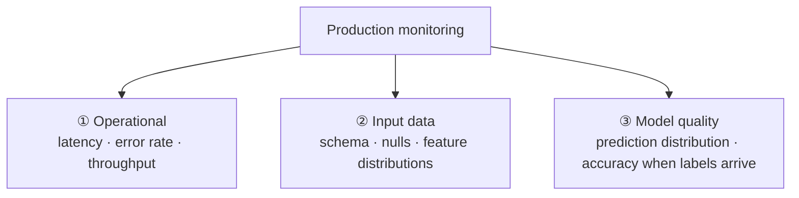
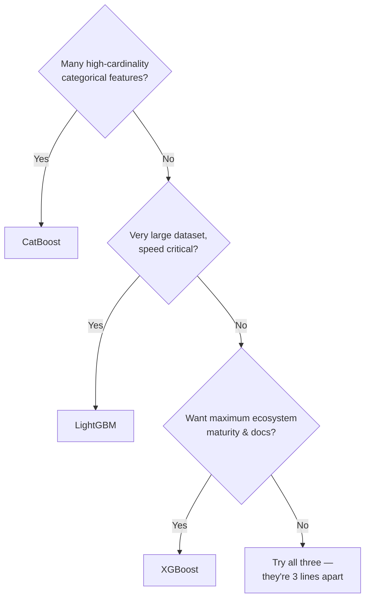

# Lesson 9 — Production Considerations & Honest Comparisons

> **Source:** Session 1 covers cloud/platform compatibility and the speed comparison; Session 2 recommends ensembling. Everything about deployment, monitoring, and the LightGBM/CatBoost comparison is added material — the videos are from 2021 and predate much of it.
> **What this lesson gives you:** what changes when a model leaves your laptop, and a straight answer to "should I use XGBoost or something else?"

---

## 🎯 TL;DR

Training a good model is roughly half the work. In production you also have to answer: how is the artifact **versioned**, how fast is **inference**, what happens when input data **drifts**, and how do you know the model has **degraded**? On the algorithm choice: XGBoost, LightGBM, and CatBoost are all strong and usually within noise of each other on accuracy — pick based on **categorical handling, training speed, and default quality**, not on benchmark leaderboards.

---

## 1. Serialization and versioning

Two formats, two purposes:

| Format | Command | Use for |
|---|---|---|
| **joblib** (pickle) | `joblib.dump(pipeline, "p.joblib")` | Whole sklearn pipeline including preprocessing — convenient |
| **XGBoost JSON/UBJ** | `booster.save_model("model.json")` | Version-stable, language-portable — durable |

```python
import joblib
joblib.dump(pipeline, "pipeline.joblib")                       # convenience
pipeline.named_steps["clf"].save_model("booster.json")         # durability
```

> **⚠️ Pickle's two production hazards.**
> 1. **Not version-portable.** A joblib artifact saved under sklearn 1.3 / XGBoost 1.7 may fail to load — or silently behave differently — under different versions. **Pin exact versions alongside the artifact.**
> 2. **Not safe from untrusted sources.** Unpickling can execute arbitrary code. Never load a pickle you didn't produce.

**What to store with every model** — the minimum for reproducibility:

| Artifact | Why |
|---|---|
| Model + preprocessing pipeline | The thing that serves |
| Library versions (`xgboost`, `sklearn`, `numpy`, Python) | Loadability and behaviour |
| Training data fingerprint/version | Answers "what data made this?" |
| Hyperparameters | Reproduce the run |
| Metrics (CV + test) | Compare against the next candidate |
| Feature schema (names, dtypes, order) | Detect input contract violations |
| Training timestamp + code commit | Audit trail |

This is exactly the versioning discipline from the MLOps module — see [`../../Shared/02_mlops/`](../../Shared/02_mlops/README.md), where "code + data + model" versioning is the core argument.

---

## 2. Inference latency and throughput

XGBoost inference is fast, but the numbers matter for capacity planning:

| Factor | Effect on latency |
|---|---|
| `n_estimators` | **Linear** — 1000 trees is ~10× the work of 100 |
| `max_depth` | Linear in traversal depth per tree |
| Batch size | Large batches are **far** more efficient per row |
| Single-row calls | Dominated by Python/framework overhead, not tree traversal |

**Rough orders of magnitude** (500 trees, depth 6, modest CPU):

| Mode | Throughput |
|---|---|
| Batch (10k rows at once) | ~100k+ rows/sec |
| Single row, in-process | sub-millisecond to low-ms |
| Single row over HTTP | dominated by network + serialization |

> **The practical insight:** for single-row serving, your latency budget is usually spent on **HTTP, serialization, and feature lookup — not the model.** Optimizing tree count from 500 to 300 rarely matters if a feature-store round trip costs 20 ms. Profile before optimizing.

**Reducing inference cost when it does matter:**
- Lower `n_estimators` (retune the learning rate upward to compensate)
- Save with `save_model` and serve via the C++/native API rather than Python
- Convert to an optimized format (Treelite, ONNX) for compiled inference
- Batch requests where latency budget permits

---

## 3. Monitoring in production

A deployed XGBoost model degrades silently. Three layers to watch — the same structure as the MLOps module's monitoring section:



| Layer | Watch | Why |
|---|---|---|
| **Operational** | p50/p95 latency, error rate, QPS, cost | Standard service health |
| **Input data** | Schema conformance, null rates, feature distributions vs. training baseline | **Catches drift and upstream breakage early** |
| **Model quality** | Prediction distribution shift, average predicted probability, accuracy once ground truth arrives | Catches genuine degradation |

**The tree-specific drift hazard worth naming:** trees split on **thresholds**. If a feature's distribution shifts so that nearly all incoming rows fall on one side of the learned thresholds, the model effectively stops discriminating — it keeps returning valid-looking predictions clustered in a narrow band. **Monitoring the spread of predicted values catches this**, often before labels arrive.

**And the extrapolation hazard:** trees output a constant per leaf, so they **cannot extrapolate**. Feed a value beyond the training range and you get the boundary leaf's value, not a continued trend. A model trained on prices from ₹10–1000 will predict the same thing for ₹5000 as for ₹1001. **Monitor for out-of-range inputs explicitly** — this is a failure mode a linear model wouldn't have.

**Ground-truth delay.** Labels often arrive much later than predictions (a loan default takes months). Input-drift monitoring is your **leading indicator** — observable now, and the best early warning that accuracy is about to fall.

---

## 4. Retraining

| Trigger | Approach |
|---|---|
| **Scheduled** | Retrain weekly/monthly regardless — simple, predictable |
| **Drift-triggered** | Retrain when input distributions or prediction distributions cross a threshold |
| **Performance-triggered** | Retrain when measured accuracy drops below a gate (requires labels) |

**Always validate a retrained model against the incumbent before promoting it.** A candidate that scores worse should not ship just because it's newer — the champion/challenger pattern. Combine with the release gate from [Lesson 7](07-practical-implementation.md)'s Example 3.

> **XGBoost has no true online learning.** It's a batch algorithm. `xgb_model=` lets you continue training from an existing booster with more trees, but that **appends** trees rather than updating existing ones, and can't unlearn stale patterns. For genuinely streaming problems, retrain on a rolling window instead.

---

## 5. Reproducibility

```python
model = XGBClassifier(random_state=42, n_jobs=1, tree_method="hist")
```

> **⚠️ `n_jobs=-1` can make results non-deterministic.** Parallel floating-point accumulation happens in non-guaranteed order, and floating-point addition isn't associative — so identical inputs can produce microscopically different sums, occasionally flipping a split. Usually irrelevant; sometimes it matters for audits or debugging. **For bit-exact reproducibility use `n_jobs=1`** and accept the slowdown. Also pin `tree_method`, since `exact` and `hist` choose different thresholds.

---

## 6. Security and compliance

| Concern | Consideration |
|---|---|
| **Untrusted pickles** | Never load artifacts you didn't create |
| **Model inversion / membership inference** | Tree ensembles can leak training-data information; be cautious exposing raw confidence scores on sensitive data |
| **Explainability requirements** | Regulated decisions (credit, hiring, insurance) may legally require an explanation — **SHAP per prediction**, retained as an audit record |
| **Fairness** | Check performance parity across protected groups; aggregate accuracy can hide serious per-group regressions |
| **PII in features** | Feature values persist inside the model structure (thresholds); treat artifacts as sensitive |

---

## 7. XGBoost vs. LightGBM vs. CatBoost

The three modern gradient-boosting libraries. **They are much more similar than different.**

| | **XGBoost** | **LightGBM** | **CatBoost** |
|---|---|---|---|
| **Tree growth** | Level-wise (depth-first balanced) | **Leaf-wise** (splits the highest-gain leaf) | Symmetric/oblivious (same split per level) |
| **Speed on large data** | Fast | **Usually fastest** | Moderate |
| **Categorical features** | Native support (newer versions), else one-hot | Native (integer-encoded) | **Best — ordered target statistics** |
| **Default quality** | Needs tuning (`lr=0.3` is coarse) | Needs tuning | **Best out of the box** |
| **Small-data overfitting** | Moderate risk | **Higher risk** (leaf-wise grows deep) | **Lowest — ordered boosting** |
| **Memory** | Moderate | Low | Higher |
| **Inference speed** | Fast | Fast | **Very fast** (oblivious trees vectorize well) |
| **Maturity/ecosystem** | **Largest** | Large | Smaller but solid |
| **Best at** | The dependable default | Large datasets, speed | High-cardinality categoricals, minimal tuning |

**How to choose, practically:**



> **The honest bottom line:** on a tuned, well-featured problem, the three are typically within **noise** of one another. Published benchmarks disagree about the winner because the winner depends on the dataset. **Feature engineering and honest validation will improve your score far more than switching libraries.** Try all three — the code difference is a few lines — but don't expect a revolution.

**Leaf-wise vs. level-wise, since it's LightGBM's headline difference:**

| Growth | Mechanism | Consequence |
|---|---|---|
| **Level-wise** (XGBoost) | Complete each depth level before descending | Balanced trees; more predictable; more robust on small data |
| **Leaf-wise** (LightGBM) | Always split whichever leaf offers the most gain | Reaches lower loss with fewer leaves; **faster**; but grows unbalanced deep branches → **overfits small data more readily** (control with `num_leaves`, `min_data_in_leaf`) |

---

## 8. XGBoost vs. Random Forest

> **Source:** Session 1's comparison, where Random Forest won out of the box.

| | Random Forest | XGBoost |
|---|---|---|
| **Training** | Parallel, independent trees | Sequential |
| **Reduces** | Variance | Bias |
| **Defaults** | **Close to optimal** | Coarse — needs tuning |
| **Tuning effort** | Minimal | Substantial |
| **Overfits with more trees** | Practically no | **Yes** |
| **Typical tuned accuracy** | Good | **Usually better** |
| **Robustness to bad settings** | High | Low |
| **Interpretability** | Similar | Similar |

**Use Random Forest when:** you want a strong baseline in five minutes, you have little tuning time, the data is small/noisy, or you need robustness over peak accuracy.

**Use XGBoost when:** you'll invest in tuning, the dataset is large, and the last few percent of accuracy has real value.

> **Always fit a Random Forest baseline first.** It's cheap, hard to get wrong, and it tells you whether your XGBoost tuning is actually buying anything. Session 1's result — RF beating untuned XGBoost — is a genuinely useful reminder that "XGBoost is better" is a statement about *tuned* models.

---

## 9. XGBoost vs. neural networks on tabular data

| | Gradient-boosted trees | Tabular neural nets |
|---|---|---|
| **Typical accuracy on tabular** | **Competitive or better** | Comparable at best, usually after much more work |
| **Training cost** | Minutes on CPU | Often GPU hours |
| **Tuning burden** | Moderate | High (architecture + optimizer + schedule) |
| **Handles mixed types** | Natively | Needs embeddings/encoding |
| **Missing values** | Natively | Must impute |
| **Small data** | Robust | Poor |
| **Unstructured data** | ✗ | **✓ (their real domain)** |
| **Multi-modal / transfer learning** | ✗ | **✓** |

> **Common Misconception:** "deep learning has superseded XGBoost." For **tabular** data it largely has not — multiple independent benchmark studies continue to find gradient-boosted trees competitive with or better than tabular-specific neural architectures, at a fraction of the compute and tuning effort. Neural networks win decisively on **images, audio, text, and video**, and whenever you want pretraining/transfer learning. Choose by data modality, not by fashion.

---

## 10. When NOT to use XGBoost

Worth stating plainly:

| Situation | Use instead | Why |
|---|---|---|
| Images, audio, raw text, video | CNNs / transformers | Trees can't model spatial or sequential structure |
| Very small data (tens of rows) | Regularized linear models | XGBoost will overfit |
| Need extrapolation beyond training range | Linear/parametric models | Trees output constants — they cannot extend a trend |
| Strict interpretability/audit requirement | Logistic regression, single tree, GAMs | One equation beats 500 trees + SHAP for a regulator |
| True online/streaming learning | SGD-based models, river | XGBoost is batch |
| Strictly monotonic relationship required | Linear, or XGBoost with `monotone_constraints` | Trees can produce non-monotonic artifacts |
| Ultra-low-latency at extreme scale | Linear models | A single dot product beats hundreds of tree traversals |

*(That last row has a real fix: XGBoost supports `monotone_constraints` to force a feature's effect to be monotonic — valuable in pricing and credit, where "more income must never reduce approval odds" is a business requirement.)*

---

## 11. Common Mistakes

> - **Mistake:** Shipping a pickle without pinned library versions → **Why it's wrong:** the artifact may fail to load or behave differently after a dependency bump → **Do instead:** pin versions and also export `save_model()` JSON.
> - **Mistake:** Monitoring only latency and error rate → **Why it's wrong:** an ML model returns 200 OK while being quietly, increasingly wrong → **Do instead:** monitor input distributions and prediction distributions too.
> - **Mistake:** Assuming trees extrapolate → **Why it's wrong:** out-of-range inputs return the boundary leaf's constant, which can be badly wrong and looks plausible → **Do instead:** monitor for out-of-range inputs and consider a linear model where extrapolation is required.
> - **Mistake:** Auto-promoting a retrained model → **Why it's wrong:** the new model may be worse; recency isn't quality → **Do instead:** champion/challenger comparison plus a release gate.
> - **Mistake:** Switching libraries to chase accuracy → **Why it's wrong:** XGBoost/LightGBM/CatBoost usually differ within noise; you spend time for nothing → **Do instead:** invest in features, validation, and tuning first.
> - **Mistake:** Expecting `random_state` alone to guarantee identical results → **Why it's wrong:** multithreaded floating-point accumulation order varies → **Do instead:** `n_jobs=1` and a pinned `tree_method` when you need bit-exactness.

---

## 12. Exercises

**Beginner.** Save a trained pipeline with joblib, reload it in a fresh process, and predict a single row. Then record the exact `xgboost` and `scikit-learn` versions alongside the artifact.
*Success criterion:* the reloaded pipeline reproduces the original prediction exactly, and versions are recorded.

**Intermediate.** Measure inference latency at batch sizes 1, 10, 100, 1000, 10000. Plot per-row latency against batch size.
*Success criterion:* per-row cost falls sharply with batch size, and you can explain that fixed overhead is amortized.

**Advanced.** Simulate drift: train on one period, then shift a key feature's distribution in the "production" set. Show that operational metrics stay healthy while prediction distribution and accuracy degrade, and build a detector that fires on the input shift alone.
*Success criterion:* your detector triggers *before* label-based accuracy would have revealed the problem.

**Challenge.** Benchmark XGBoost, LightGBM, and CatBoost on the same dataset with equal tuning budgets (e.g. 50 Optuna trials each). Report tuned score ± CV std, training time, and inference latency — then state which you'd deploy and why, being explicit about whether score differences exceed the noise.
*Success criterion:* a defensible recommendation that weighs speed and operational factors, and honestly acknowledges when accuracy differences are within noise.

---

## ✍️ Next

[Lesson 10 — Exercises, Projects & Interview Prep](10-exercises-projects-and-interview.md) consolidates everything into hands-on projects and the questions you'll actually be asked about XGBoost.
