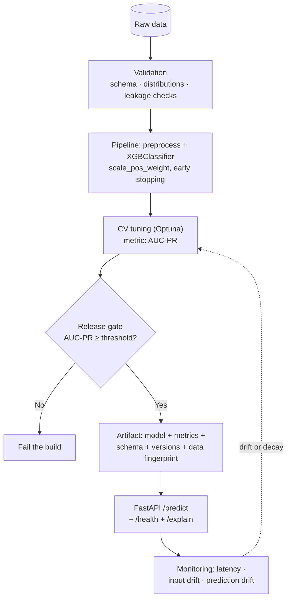

# Lesson 10 — Projects & Interview Preparation

> **What this lesson gives you:** three end-to-end projects with definitions of done, and 35 interview questions with accurate answers. Per-topic exercises live at the end of Lessons 1–9; this lesson is about assembling everything.

---

## 1. Projects

### 🟢 Beginner — Titanic survival, done properly

**Goal.** Reproduce Session 2's project, but with the corrections from [Lesson 7](07-practical-implementation.md) applied.

**Concepts required.** `XGBClassifier`, `ColumnTransformer`, `Pipeline`, train/test split, accuracy + AUC.

**Steps.**
1. Load the Titanic data; drop `PassengerId`, `Name`, `Ticket`.
2. Build a `ColumnTransformer`: median-impute numerics, mode-impute + one-hot encode categoricals (`sparse_output=False`, `handle_unknown='ignore'`).
3. Wrap it with `XGBClassifier` in a `Pipeline`.
4. Split **before** any fitting; report accuracy and ROC-AUC.
5. Compare against a `RandomForestClassifier` baseline and a `DummyClassifier`.
6. Pickle the pipeline; reload it in a fresh process and predict one raw row.

**Definition of done.**
- Pipeline beats the `DummyClassifier` decisively and is within a few points of Random Forest.
- No preprocessing happens outside the pipeline (verify: `cross_val_score` on the pipeline runs without leakage).
- The reloaded artifact reproduces predictions exactly.
- You can state which features mattered and how you know.

---

### 🟡 Intermediate — House-price regression with feature engineering

**Goal.** A tuned regression model where **feature engineering** does most of the work.

**Concepts required.** `XGBRegressor`, early stopping, custom transformers, Optuna, SHAP, RMSE vs MAE.

**Steps.**
1. Use the Ames Housing dataset (~80 features, plenty of missing values).
2. **Deliberately pass `np.nan` through** rather than imputing — let XGBoost learn directions ([Lesson 6](06-speed-and-system-design.md)).
3. Engineer features inside the pipeline via `FunctionTransformer`: total square footage, house age at sale, bath count, ratios.
4. Establish a baseline with defaults, then tune with Optuna in the staged order from [Lesson 5](05-hyperparameters-regularization-and-pruning.md).
5. Use early stopping on a validation split; report CV RMSE ± std.
6. Produce a SHAP summary plot plus waterfalls for the two worst predictions.
7. Ablation: quantify the gain from feature engineering vs. from tuning.

**Definition of done.**
- Tuned CV RMSE beats the default baseline by more than one CV standard deviation.
- Your ablation table shows the split between feature engineering and tuning gains (feature engineering usually wins — that's the lesson).
- You can explain the two worst predictions using SHAP.
- Everything reproducible from a seed.

---

### 🔴 Advanced — Production credit-risk service

**Goal.** A deployable, monitored, explainable classification service on imbalanced data.

**Concepts required.** Everything from Lessons 1–9, plus FastAPI, joblib, logging, testing, drift detection.

**Architecture.**

**Steps.**
1. **Data contract.** Explicit feature schema (names, dtypes, allowed ranges). Reject non-conforming input with a clear error.
2. **Leakage audit.** For each feature, confirm it would genuinely be available *at decision time*. Document the check — this is where real projects fail.
3. **Imbalance.** `scale_pos_weight = negatives/positives`; select on **AUC-PR**, not accuracy.
4. **Temporal validation.** If the data has time structure, use `TimeSeriesSplit`, not random folds.
5. **Tune** with Optuna + CV-based early stopping.
6. **Calibrate** probabilities and verify with a calibration curve — credit decisions need real probabilities, not just rankings.
7. **Threshold selection** from an explicit cost matrix (cost of a false approval vs. a false decline), not a default 0.5.
8. **Serve** via FastAPI: `/predict` (probability + decision), `/explain` (SHAP contributions), `/health` (model version + schema).
9. **Monitor**: log every request's feature values and prediction; compute PSI or KS against the training baseline per feature; alert on drift.
10. **Test** with pytest: schema rejection, leakage guard, prediction range `[0,1]`, artifact round-trip, and a golden-prediction regression test.
11. **Fairness**: report AUC-PR per protected group; flag disparities.

**Definition of done.**
- `pytest` green, including a golden-prediction test that fails if the model silently changes.
- `/predict` returns a calibrated probability **and** a decision derived from the documented cost matrix.
- `/explain` returns per-feature SHAP contributions summing to the prediction.
- Drift monitor demonstrably fires on a synthetically shifted feature.
- A model card documents: data source and fingerprint, metrics (overall + per group), known limitations, intended use, and retraining policy.
- You can articulate why XGBoost was the right choice here — and one scenario where you'd have chosen differently.

---

## 2. Interview questions

### Basic (10)

**1. What does XGBoost stand for, and what is it?**
eXtreme Gradient Boosting — an optimized, regularized implementation of gradient-boosted decision trees. Not a new algorithm; gradient boosting plus a regularized objective and substantial systems engineering.

**2. Bagging vs. boosting?**
Bagging trains independent trees in parallel on bootstrap samples and averages them, primarily reducing **variance**. Boosting trains trees sequentially, each fitting the errors of its predecessors, primarily reducing **bias**. Bagging rarely overfits with more trees; boosting can.

**3. Why is it called "gradient" boosting?**
Each tree is fit to the **negative gradient** of the loss with respect to the current prediction — gradient descent performed in function space, where each step adds a function (tree) rather than updating parameters. For squared error the negative gradient equals the residual, which is why it's often taught as "fitting residuals."

**4. What is the initial prediction?**
Regression: the mean of the target (the constant minimizing squared error). Binary classification: 0.5 probability, equivalently 0 log-odds. Modern XGBoost estimates `base_score` from the data by default rather than fixing it at 0.5.

**5. What does the learning rate do?**
Scales each tree's contribution (`pred += η × output`). Smaller values need more trees but generalize better, because no single tree can over-commit and later trees can correct earlier ones. Default 0.3; tuned values are typically 0.01–0.1.

**6. Can XGBoost handle missing values?**
Yes, natively. At each split it evaluates thresholds using non-missing rows only, then tests sending missing rows left vs. right and stores the better option as that split's **default direction**. Often better than imputation, because it can exploit informative missingness.

**7. What is γ (gamma)?**
A minimum-gain threshold for keeping a split. After growing, XGBoost prunes bottom-up: if `Gain − γ < 0`, the split is removed. Larger γ → smaller trees → less overfitting, but too large causes underfitting and can prune trees away entirely.

**8. What is λ (lambda)?**
L2 regularization on leaf weights. It sits in the denominator of both the similarity score and the leaf output, so it shrinks leaf predictions toward zero *and* reduces gain (causing more pruning). Default `reg_lambda=1`.

**9. Does XGBoost overfit with more trees?**
Yes — unlike Random Forest. Each additional tree fits remaining residuals, eventually fitting noise. Control with early stopping on a validation set.

**10. When would you not use XGBoost?**
Unstructured data (images/audio/text — use deep learning); very small datasets; when extrapolation beyond the training range is needed (trees output constants); strict interpretability requirements; true online learning.

---

### Intermediate (10)

**11. Derive the optimal leaf value.**
Write the objective with a second-order Taylor expansion: `Σ[g·w + ½h·w²] + ½λw²` per leaf. Differentiate w.r.t. `w`, set to zero: `G + (H + λ)w = 0`, giving **`w* = −G/(H+λ)`**. Substituting back yields the similarity score `G²/(H+λ)`.

**12. Why does the classification denominator use `Σp(1−p)`?**
Because the denominator is the **Hessian** sum. For squared error, `h = 1` per row, so it reduces to the row count. For log-loss, `h = p(1−p)`. Same formula, different loss.

**13. What is the practical consequence of `h = p(1−p)`?**
It peaks at `p = 0.5` and vanishes near 0 or 1, so confidently-predicted rows contribute almost nothing to future splits. XGBoost automatically focuses on rows it's still uncertain about — emergent behaviour from second-order information, not explicit code.

**14. Why accumulate in log-odds for classification?**
Probabilities are bounded to [0,1] but boosting **adds** unbounded tree outputs. Accumulating in log-odds (range −∞ to ∞) is safe; sigmoid converts back only when a probability is needed.

**15. Similarity score vs. gain?**
Similarity describes a **single node** (`G²/(H+λ)`). Gain evaluates a **split**: `Sim_left + Sim_right − Sim_parent − γ`. A high-similarity child is worthless if the parent was already equally high — always compare gain.

**16. Why is the root node's similarity ≈ 0?**
With the initial prediction at the mean, residuals sum to ~0, so `G² ≈ 0`. Positive and negative residuals cancel. Similarity measures **agreement** among residuals; splitting is the act of separating rows so each side's residuals agree in sign.

**17. How does XGBoost parallelize if boosting is sequential?**
It parallelizes **within** a tree — candidate splits and features at a node are evaluated independently across cores, using pre-sorted column blocks. It never parallelizes across trees, since tree *n* needs tree *n−1*'s residuals.

**18. What does `min_child_weight` actually constrain?**
The minimum **sum of Hessians** in a child. For regression that's effectively a row count; for classification it's a *confidence-weighted* count, so many confidently-classified rows may still fail the threshold. Effectively "don't split without enough uncertain evidence."

**19. `subsample` vs. `colsample_bytree`?**
`subsample` is the row fraction per tree; `colsample_bytree` the column fraction. Both decorrelate trees (stochastic gradient boosting) and speed training. `colsample_bytree` additionally prevents one dominant feature appearing in every tree.

**20. Why is default feature importance misleading?**
`weight` importance counts split usage, biasing toward high-cardinality features that offer more thresholds. Correlated features split credit, so both can look unimportant. And importance carries no direction. Use SHAP for decisions, permutation importance as a cross-check.

---

### Advanced (10)

**21. Why second-order (Hessian) rather than first-order only?**
Curvature turns each leaf's objective into a quadratic with a **closed-form exact minimum** — no line search needed. It also weights rows by how uncertain the model is, and makes custom objectives trivial: supply `g` and `h` and the rest of the machinery is unchanged.

**22. Where does the Taylor approximation break down, and how is that mitigated?**
It's only accurate **locally**, near the current prediction. Large steps leave the region where the quadratic approximates the true loss. The **learning rate** is the mitigation — small steps keep each update inside the valid neighbourhood.

**23. Explain histogram-based split finding and the weighted quantile sketch.**
Instead of testing every distinct value, bucket features into ~256 bins and test only bin boundaries — orders of magnitude fewer evaluations at negligible accuracy cost, since gain is smooth in the threshold. The weighted quantile sketch places boundaries at roughly equal **Hessian mass**, so bins are finer where the model is uncertain.

**24. Level-wise vs. leaf-wise growth?**
XGBoost grows **level-wise** (complete each depth before descending) producing balanced, more robust trees. LightGBM grows **leaf-wise** (always split the highest-gain leaf), reaching lower loss with fewer leaves and training faster, but producing unbalanced deep branches that overfit small data more readily.

**25. How would you implement a custom asymmetric loss?**
Derive `g` and `h` analytically, then supply an `obj(y_pred, dtrain)` returning `(grad, hess)`. Verify with a finite-difference check. Ensure `h > 0` everywhere — a zero or negative Hessian breaks `w* = −G/(H+λ)` (this is why MAE needs special handling: its second derivative is 0 almost everywhere).

**26. Diagnose: training AUC 0.99, validation AUC 0.65.**
Severe overfitting. Check first for **leakage** (a feature encoding the target, or unavailable at decision time) — 0.99 is suspicious. If genuine: reduce `max_depth`, raise `min_child_weight`, add `reg_lambda`/`gamma`, lower `subsample`/`colsample_bytree`, lower the learning rate with early stopping. Also verify the validation split respects time and group structure.

**27. All predictions are identical. Why?**
Most likely γ or λ so large that every split is pruned or every leaf output shrinks to ~0, collapsing the model to its base score. Also possible: `n_estimators=0`, a constant target, or all features constant after preprocessing (e.g. `remainder='drop'` silently dropping everything).

**28. How do you get calibrated probabilities?**
Check with a calibration curve. If miscalibrated — common after `scale_pos_weight` or heavy regularization — wrap with `CalibratedClassifierCV` (isotonic or Platt scaling) fitted on held-out data. Note that ranking quality (AUC) can be excellent while absolute probabilities are systematically off.

**29. Ensure reproducibility?**
Set `random_state`, pin `tree_method`, and use `n_jobs=1` — multithreaded floating-point accumulation order varies and addition isn't associative, so parallel runs can differ in the last bits and occasionally flip a split. Also pin library versions and record the data fingerprint.

**30. Trees can't extrapolate — what are the consequences and mitigations?**
Each leaf emits a constant, so inputs beyond the training range return the boundary leaf's value rather than continuing a trend. Consequences: systematic error on out-of-range inputs, silently plausible-looking. Mitigations: monitor for out-of-range inputs; model a residual with a linear model; use `monotone_constraints` where direction is known; or choose a parametric model when extrapolation is essential.

---

### System design (7)

**31. Design a real-time fraud detection system using XGBoost.**
Key points: features must be computable **within the latency budget** (a feature store with precomputed aggregates, since "transactions in last hour" can't be computed from scratch per request); extreme imbalance → `scale_pos_weight` and AUC-PR; threshold from an explicit cost matrix (a missed fraud vs. a blocked legitimate customer); **concept drift is adversarial** (fraudsters adapt), so frequent retraining plus drift monitoring; explanations for analyst review; and a fallback rules engine for when the model service is down.

**32. Design a training pipeline retraining daily on 500M rows.**
Distributed training (Spark/Dask/Ray XGBoost) or GPU with external memory; `tree_method='hist'`; incremental data ingestion with a validated schema contract; **time-based** validation splits; champion/challenger with an automated release gate; artifact versioning with data fingerprints; and cost controls — 500M rows daily is expensive, so consider sampling or training on a rolling window.

**33. How would you serve 10,000 predictions/second?**
Batch requests where the latency budget allows; serve via the native/compiled API (or Treelite/ONNX) rather than Python; horizontally scale stateless replicas behind a load balancer; cache features (usually the real bottleneck, not the model); reduce `n_estimators` if profiling justifies it; and measure p99, not the mean.

**34. Migrate from a legacy logistic regression to XGBoost. What's your plan?**
Shadow-deploy first (XGBoost scores live traffic, outputs unused) and compare offline; verify the feature pipeline is identical to avoid confounding; run an A/B test on a business metric, not just AUC; keep the linear model as a fallback; be explicit about lost extrapolation ability and reduced interpretability; and ensure explanation tooling (SHAP) is in place *before* cutover if decisions are regulated.

**35. Your model degraded three months after deployment. Diagnose.**
Distinguish the drift types: **data drift** (input distributions moved — retrain), **concept drift** (the input→output relationship moved — retrain, possibly re-engineer features), **upstream/schema drift** (a column silently changed units or started arriving null — fix the pipeline, not the model), and **training-serving skew** (features computed differently in serving). Check input distributions first — it's observable immediately, whereas labels lag. Confirm whether the *serving* feature code changed.

**36. Design monitoring for an XGBoost service.**
Three layers: operational (p50/p95/p99 latency, error rate, throughput, cost); input data (schema conformance, null rates, per-feature PSI/KS vs. training baseline, out-of-range counts); model quality (prediction distribution spread, average predicted probability, accuracy/AUC-PR once labels arrive). Alert on input drift as the **leading indicator** because ground truth is delayed. Add the tree-specific check: **prediction-spread collapse**, which signals features drifting to one side of learned thresholds.

**37. When would you argue *against* XGBoost to a stakeholder?**
When the data is unstructured; when a regulator requires a directly auditable model; when extrapolation is essential; when the dataset is tiny; when true online learning is required; or when a simpler model is within noise of XGBoost — in which case the operational simplicity of logistic regression is worth more than a fraction of a point of AUC. The honest framing: model complexity should be justified by measured value, not defaulted to.

---

## 3. Self-assessment checklist

You've understood this module if you can:

- [ ] Explain bagging vs. boosting and why boosting overfits with more trees
- [ ] Derive `w* = −G/(H+λ)` from the objective
- [ ] Explain why the classification denominator is `Σp(1−p)` — and why that's the *same* formula as regression
- [ ] Compute a similarity score and gain by hand
- [ ] Explain why the root's similarity is ≈ 0
- [ ] Apply γ pruning bottom-up, including the "surviving child protects the parent" rule
- [ ] Predict which way λ, γ, `max_depth`, and `min_child_weight` move the bias/variance trade-off
- [ ] Explain the log-odds ↔ sigmoid round trip and where each space is valid
- [ ] Explain how missing values are handled and why it beats imputation
- [ ] Explain within-tree parallelization and why cross-tree is impossible
- [ ] Build a leak-free `ColumnTransformer` + `Pipeline`
- [ ] Choose an appropriate metric for imbalanced data and justify it
- [ ] Set up early stopping without contaminating the test set
- [ ] Explain why default feature importance misleads, and what to use instead
- [ ] State three concrete situations where XGBoost is the wrong choice

---

## ✍️ Where to go next

| To learn | Go to |
|---|---|
| Operating models in production (versioning, drift, retraining) | [`../../Shared/02_mlops/`](../../Shared/02_mlops/README.md) |
| Deploying and serving at scale | [`../../Shared/03_llmops/`](../../Shared/03_llmops/README.md) |
| Cloud training/hosting (SageMaker, Vertex) | [`../../Shared/04_cloud-ai-platforms/`](../../Shared/04_cloud-ai-platforms/README.md) |
| Evaluation discipline generally | [`../16_evals/`](../16_evals/README.md) |

**Beyond this module:** LightGBM and CatBoost (a few lines of code away — see [Lesson 9](09-production-and-comparisons.md)), the original XGBoost paper for the systems detail, SHAP for interpretation, and Optuna for tuning at scale.
