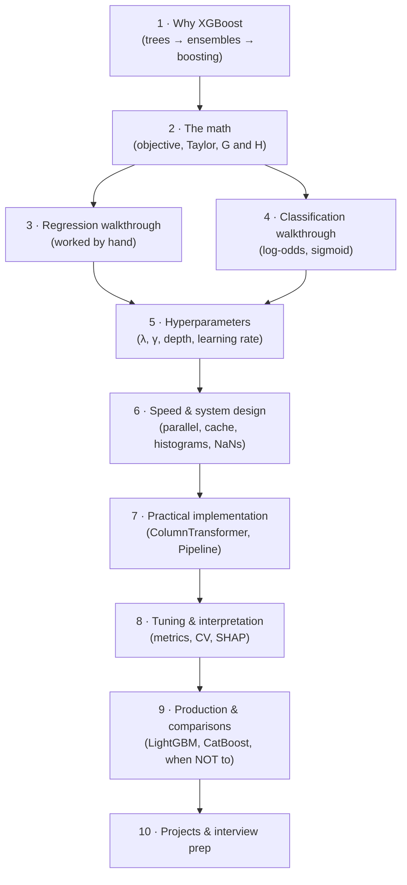
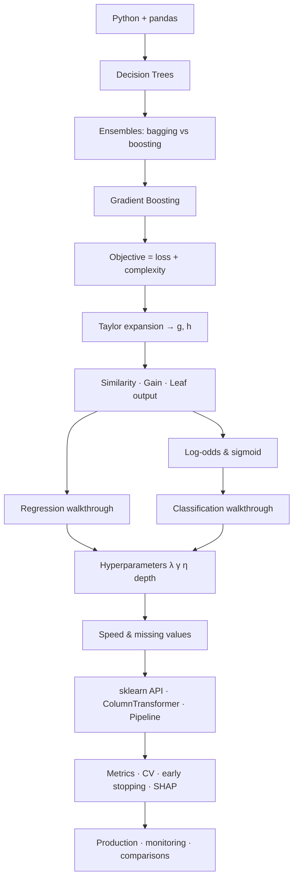

# 🌲 XGBoost — Complete Technical Tutorial

> **Source:** CampusX *XgBoost* playlist · 2 videos (~2h 3m) · [playlist](https://www.youtube.com/playlist?list=PLKnIA16_RmvbXJbBW4zCy4Xbr81GRyaC4)
> **What you'll be able to do:** derive XGBoost's split criterion from first principles, compute a tree by hand for both regression and classification, tune it deliberately rather than by trial and error, ship it in a leak-free pipeline, and argue for or against it in a design review.

**This is a course, not video notes.** The playlist is the backbone; the prerequisites it assumes, the math it defers, and everything after 2021 are filled in. You should never need to open the videos.

---

## 🗺️ The arc of this module

---

## 📓 Lessons

| # | Lesson | What you'll learn |
|---|--------|-------------------|
| 1 | [Why XGBoost & Prerequisites](01-why-xgboost-and-prerequisites.md) | Decision trees, bagging vs. boosting, gradient boosting, the three pillars (speed/performance/compatibility), when *not* to use it |
| 2 | [The Math Behind XGBoost](02-the-math-behind-xgboost.md) | The objective function, second-order Taylor expansion, gradients & Hessians, **deriving** similarity/gain/leaf-output |
| 3 | [Regression Walkthrough](03-regression-walkthrough.md) | The 4-row Age→Salary example computed step by step, with verified arithmetic |
| 4 | [Classification Walkthrough](04-classification-walkthrough.md) | The Titanic subset example, `Σp(1−p)` denominators, log-odds ↔ sigmoid round trip |
| 5 | [Hyperparameters, Regularization & Pruning](05-hyperparameters-regularization-and-pruning.md) | γ pruning bottom-up, λ and α, learning rate, depth, `min_child_weight`, subsampling, a staged tuning order |
| 6 | [Speed & System Design](06-speed-and-system-design.md) | Parallelization, cache-awareness, out-of-core, histogram splits, **how missing values actually work** |
| 7 | [Practical Implementation](07-practical-implementation.md) | Install, sklearn API, `ColumnTransformer`, `Pipeline`, leakage, serialization — simple → realistic → production |
| 8 | [Tuning, Evaluation & Interpretation](08-tuning-evaluation-and-interpretation.md) | Metric selection, CV strategy, early stopping, Optuna, feature importance traps, SHAP, calibration |
| 9 | [Production & Comparisons](09-production-and-comparisons.md) | Versioning, latency, drift monitoring, retraining, vs. LightGBM/CatBoost/RF/neural nets |
| 10 | [Projects & Interview Prep](10-exercises-projects-and-interview.md) | 3 projects with definitions of done · 37 interview questions with answers |

*Per-topic exercises (4 difficulty levels) are at the end of Lessons 1–9.*

---

## 🎬 Source videos

| # | Video | Length | Covers |
|---|---|:---:|---|
| 1 | [Session 1 on XgBoost](https://www.youtube.com/watch?v=BTLB-ppqBZc&list=PLKnIA16_RmvbXJbBW4zCy4Xbr81GRyaC4&index=1) | 58:25 | Introduction, three pillars, regression walkthrough, γ and λ, code demo + timing comparison |
| 2 | [Session 2 on XgBoost](https://www.youtube.com/watch?v=7G540ZGQubc&list=PLKnIA16_RmvbXJbBW4zCy4Xbr81GRyaC4&index=2) | 1:04:23 | Classification walkthrough, γ/λ revisited, Titanic project, `ColumnTransformer`, `Pipeline`, pickling |

The instructor mentions a third session on hyperparameter tuning and a project. **It isn't in this playlist** — Lessons 5 and 8 cover that material.

---

## ⚡ Core cheat-sheet

| Concept | In one line |
|---|---|
| **XGBoost** | eXtreme Gradient Boosting — regularized, engineered gradient-boosted trees |
| **Similarity score** | `G²/(H+λ)` — how much a node reduces the objective; measures residual **agreement** |
| **Gain** | `Sim_L + Sim_R − Sim_parent − γ` — the value of a split; **always compare this, never raw similarity** |
| **Leaf output** | `−G/(H+λ)` — the optimal constant for a leaf |
| **G, H** | Sum of gradients / Hessians in a leaf |
| **Regression** | `H = row count` (Hessian of squared error is 1) |
| **Classification** | `H = Σp(1−p)` (Hessian of log-loss) — **same formula, different loss** |
| **Root similarity ≈ 0** | Residuals from the mean cancel out; splitting separates them by sign |
| **λ (`reg_lambda`)** | L2 on leaf weights — shrinks outputs *and* reduces gain → more pruning |
| **γ (`gamma`)** | Minimum gain to keep a split; pruned bottom-up, and a surviving child protects its parent |
| **η (`learning_rate`)** | Per-tree shrinkage; trades off directly against `n_estimators` |
| **Log-odds** | The unbounded space classification accumulates in; sigmoid converts back |
| **Missing values** | Learned **default direction** per split — no imputation needed, and exploits informative missingness |
| **Parallelism** | **Within** a tree (features/splits), never across trees |
| **More trees** | Random Forest: safe. **XGBoost: can overfit** → use early stopping |

---

## 🔢 Real measured numbers from the videos

Preserved because they're among the most valuable things a live session offers:

| Measurement | Value |
|---|---|
| Timing on a small dataset | XGBoost ~**0.6 s** · GradientBoosting ~**1.35 s** · RandomForest ~**3.5 s** |
| Untuned 10-fold CV winner | **Random Forest** — XGBoost beat GradientBoosting but not RF *before tuning* |
| Regression example residuals | −56.25, +42.25, +12.25, +2.25 (initial prediction 77.75) |
| Regression split similarities | 3164.06 (left) · 1073.52 (right) · gain **4237.52** vs. 2943.06 for the alternative |
| Classification example | Ages 17/28/34/39 · residuals ∓0.5 · gains **1.333 / 0 / 1.333**, then **0.667 / 2.667** |
| Classification leaf outputs | −2, +2, −2 → probabilities **0.354, 0.646, 0.646, 0.354** |
| Titanic fitted stats | mean `Age` ≈ **29** · `Embarked` mode = **S** |

---

## ⚠️ Where these notes correct or update the videos

| Topic | Correction |
|---|---|
| **Learning rate advice** | Session 2 says leave it near 0.3. Modern practice: **0.01–0.1 with more trees + early stopping** ([L5](05-hyperparameters-regularization-and-pruning.md)) |
| **Pruning criterion** | Session 1's explanation drifts between "similarity − γ" and "gain − γ". Correct is **`Gain − γ`** (Session 2 gets it right) |
| **`sparse=False`** | Renamed `sparse_output=False` in scikit-learn 1.2, removed in 1.4 ([L7](07-practical-implementation.md)) |
| **`early_stopping_rounds`** | Moved from `.fit()` to the **constructor** in XGBoost 2.x |
| **`base_score`** | No longer fixed at 0.5 — modern XGBoost estimates it from the data ([L4](04-classification-walkthrough.md)) |
| **`tree_method='hist'`** | Now the **default**; `gpu_hist` replaced by `device='cuda'` ([L6](06-speed-and-system-design.md)) |
| **Positional column indices** | Fragile in chained transformers — use `set_output(transform='pandas')` and names ([L7](07-practical-implementation.md)) |
| **RF-beats-XGBoost result** | Real, but it reflects **untuned defaults**; RF's defaults are near-optimal, XGBoost's are deliberately coarse ([L7](07-practical-implementation.md)) |
| **Imputing before XGBoost** | Unnecessary for XGBoost alone (native `np.nan`); justified only when sharing a pipeline with models that require it ([L6](06-speed-and-system-design.md)) |
| **Native categorical support** | XGBoost now supports categoricals directly — manual one-hot isn't always needed ([L1](01-why-xgboost-and-prerequisites.md)) |

**One transcription note:** the Session 1 regression residuals sum to +0.5 rather than exactly 0 (residuals from a true mean must sum to zero), which is why the root similarity comes out as 0.0625 rather than 0. The video's numbers are kept as taught, with the discrepancy flagged in [Lesson 3](03-regression-walkthrough.md).

---

## 📖 Glossary

| Term | Meaning | Why It Matters |
|---|---|---|
| **XGBoost** | eXtreme Gradient Boosting | The subject; regularized + engineered GBDT |
| **Boosting** | Sequential ensembling where each model fits predecessors' errors | Reduces bias; explains why more trees can overfit |
| **Bagging** | Parallel ensembling over bootstrap samples | The contrast that clarifies boosting |
| **Weak learner** | A deliberately simple model (shallow tree) | Boosting's building block |
| **Residual** | `actual − predicted` | What each tree is fit to (for squared error) |
| **Gradient** (`g`) | First derivative of loss w.r.t. prediction | Direction of improvement; the numerator of every formula |
| **Hessian** (`h`) † | Second derivative of loss w.r.t. prediction | The denominator; acts as a per-row confidence weight |
| **Similarity score** | `G²/(H+λ)` | Node quality; measures residual agreement |
| **Gain** | `Sim_L + Sim_R − Sim_parent − γ` | The actual split-selection criterion |
| **Leaf output / weight** | `−G/(H+λ)` | What a leaf contributes to the prediction |
| **λ / `reg_lambda`** | L2 penalty on leaf weights | Shrinks predictions and increases pruning |
| **α / `reg_alpha`** † | L1 penalty on leaf weights | Can zero out leaf contributions entirely |
| **γ / `gamma`** | Minimum gain to keep a split | Post-pruning control on tree size |
| **η / `learning_rate`** | Per-tree shrinkage factor | The strongest single regularizer in boosting |
| **`n_estimators`** | Number of boosting rounds | Linear in training/inference cost; overfits if too high |
| **`max_depth`** | Maximum tree depth | Controls interaction order; highest-leverage complexity knob |
| **`min_child_weight`** † | Minimum Hessian sum per child | "Enough uncertain evidence to justify a split" |
| **`subsample` / `colsample_bytree`** † | Row / column fraction per tree | Stochastic boosting — decorrelates trees, speeds training |
| **`scale_pos_weight`** † | Minority-class weight | The standard imbalance fix, preferable to resampling |
| **Log-odds (logit)** | `log(p/(1−p))` | The unbounded space classification accumulates in |
| **Sigmoid** | `1/(1+e⁻ˣ)` | Converts log-odds back to a probability |
| **`base_score`** † | The initial prediction | Modern default is data-estimated, not 0.5 |
| **Level-wise growth** † | Complete each depth before descending | XGBoost's strategy; balanced, robust |
| **Leaf-wise growth** † | Always split the highest-gain leaf | LightGBM's strategy; faster, overfits small data more |
| **Histogram splitting** † | Bin features, test only bin boundaries | The main modern speed win; now the default |
| **Weighted quantile sketch** † | Bin boundaries at equal Hessian mass | Finer resolution where the model is uncertain |
| **Sparsity-aware split finding** | Learned default direction for missing values | Why no imputation is needed — and why it beats imputing |
| **Out-of-core computing** | Streaming disk-resident blocks through RAM | Trains on data larger than memory |
| **Cache-aware access** | Prefetching gradient stats into CPU cache | Turns random reads into sequential ones |
| **Early stopping** † | Halt when validation stops improving | The correct way to set `n_estimators` |
| **Data leakage** † | Train-time info unavailable at prediction time | Produces great offline scores that collapse in production |
| **`ColumnTransformer`** | Per-column-group transformations declared in one place | Replaces error-prone manual slice-transform-concatenate |
| **`Pipeline`** | Chained preprocessing + model as one object | Prevents leakage; makes one deployable artifact |
| **SHAP** † | Per-prediction feature attributions | Gives direction and magnitude, unlike built-in importance |
| **Permutation importance** † | Performance drop when a feature is shuffled | Model-agnostic cross-check on importance |
| **Calibration** † | Whether probabilities match observed frequencies | Needed when the *value* of a probability drives decisions |
| **Concept drift** † | The input→output relationship changes | Distinct from data drift; needs a different response |
| **Monotone constraints** † | Forcing a feature's effect to be monotonic | Business/regulatory requirements in pricing and credit |

† Explained beyond what the videos cover.

---

## 🧭 Dependency map

---

## 🔗 Related modules

| Topic | Where |
|---|---|
| Operating models in production (versioning, drift, retraining) | [`../../Shared/02_mlops/`](../../Shared/02_mlops/README.md) |
| Serving and deployment at scale | [`../../Shared/03_llmops/`](../../Shared/03_llmops/README.md) |
| Cloud training & hosting (SageMaker, Vertex AI) | [`../../Shared/04_cloud-ai-platforms/`](../../Shared/04_cloud-ai-platforms/README.md) |
| Evaluation discipline | [`../16_evals/`](../16_evals/README.md) |

---

## 📄 How each page is structured

- **TL;DR** — the one thing to remember
- **Core concepts** — with tables and Mermaid diagrams
- **7-facet treatment** for important concepts — including *When NOT to use* and *Trade-offs*
- **⚠️ Callouts** wherever the videos are outdated, garbled, or incomplete
- **Common Mistakes** — each with the failure mechanism and the correction
- **Exercises** — beginner → intermediate → advanced → challenge, with success criteria
