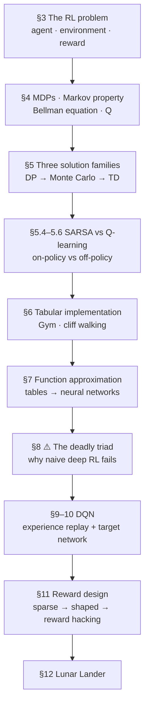

# 🎮 Reinforcement Learning — From MDPs to Deep Q-Learning

> How an agent learns to solve a problem with **no dataset and no prior knowledge** — only interaction and a scalar reward. MDPs and the Bellman equation, the three classical solution families (DP, Monte Carlo, TD), SARSA vs Q-learning, why naive neural-network RL *fails*, how DQN fixes it, and why **reward design decides behaviour more than the algorithm does**.

This module is a **single complete tutorial** rather than a lesson-per-video split — the playlist's six videos are reorganized into dependency order and merged, with the gaps filled in.

**Related modules:** [`10_rl-environments-and-infra/`](../10_rl-environments-and-infra/README.md) covers the *job* of building gradable RL environments for frontier labs — a different subject that assumes the fundamentals taught here. [`02_fine-tuning-and-alignment/`](../02_fine-tuning-and-alignment/README.md) applies this machinery to LLMs via RLHF.

---

## 📓 The tutorial

| Document | Length | What it covers |
|---|---|---|
| **[Reinforcement Learning — Complete Tutorial](reinforcement-learning-complete-tutorial.md)** | 21 sections | Everything below, plus exercises, projects, 37 interview questions, and a glossary |

---

## 🗺️ The arc

---

## 🎥 Source videos

CampusX *Reinforcement Learning Crash Course* · [full playlist](https://www.youtube.com/playlist?list=PLKnIA16_RmvbMK0_fdp0DZHZKm4Q1slAB) · ~3h 21m

| # | Video | Length | Feeds into |
|---|-------|:------:|------------|
| 1 | [What is Reinforcement Learning?](https://www.youtube.com/watch?v=zdIQkjtFX_I) | 14:50 | §1, §3 |
| 2 | [How do RL agents really learn?](https://www.youtube.com/watch?v=DLcBjo5gIxs) | 25:05 | §4, §5 |
| 3 | [How to train our first RL agent!](https://www.youtube.com/watch?v=tbpBW5Yr44k) | 41:21 | §6 |
| 4 | [Introducing Neural Networks into RL](https://www.youtube.com/watch?v=F-HRiwlqPDU) | 34:02 | §7, §8 |
| 5 | [Deep Learning meets Reinforcement Learning](https://www.youtube.com/watch?v=FkTN6yw1S54) | 57:41 | §9, §10 |
| 6 | [Design the Best Reward Function](https://www.youtube.com/watch?v=IdJL9rcQrFU) | 27:58 | §11, §12 |

---

## 🔑 Core cheat-sheet

| Concept | In one line |
|---|---|
| **MDP** | `p(s',r\|s,a)` — the formal frame for all of RL |
| **Markov property** | The future is independent of the past given the present |
| **Return `G` / discount `γ`** | Total discounted future reward; `γ` keeps it finite and sets the horizon (`≈1/(1−γ)` steps) |
| **`V(s)` vs `Q(s,a)`** | State goodness vs action goodness — **`Q` is what enables model-free control** |
| **Bellman equation** | `V(s) = E[r + γV(s')]` — infinite sum → one-step recursion |
| **Monte Carlo vs TD** | Learn at episode end (unbiased) vs learn after one step (online, bootstrapped) |
| **Bootstrapping** | Using your own current estimate inside the learning target |
| **SARSA vs Q-learning** | Target uses the ε-greedy next action vs the `max` — one term apart |
| **On- vs off-policy** | Off-policy enables **data reuse** (hence replay) but is **less** stable |
| **Deadly triad** | Approximation + bootstrapping + off-policy ⇒ can diverge. **Any two are safe.** |
| **Experience replay** | Breaks sample correlation · enables reuse · enables mini-batches |
| **Target network** | Slow copy computing targets — stops the network chasing its own tail |
| **Sparse vs shaped reward** | Rare signal (slow) vs smooth signal (fast, but hackable) |
| **Reward hacking** | The agent maximizes the reward *as written* — MountainCar farmed an oscillation bonus and finished **late** |
| **Potential-based shaping** | `γΦ(s') − Φ(s)` — **provably** preserves the optimal policy |

---

## 📊 Results reproduced from the playlist

| Experiment | Outcome |
|---|---|
| Tabular SARSA & Q-learning on cliff walking | Both solve it; episode length 141 → <30 over 500 episodes |
| α sweep | SARSA destabilizes at α≈0.5 and diverges higher; Q-learning tolerates it |
| Semi-gradient SARSA/Q-learning on CartPole | ❌ **Fails — even at 3000 episodes** (this is the point) |
| DQN on CartPole | ✅ Reaches the 500-step cap by ~225–350 episodes |
| DQN on MountainCar | ✅ First goal ~episode 210; reliable by ~600 |
| CartPole reward shaping | Learns in **~70** episodes vs ~200 |
| MountainCar reward redesign | **~350** episodes vs ~1200 (hacked) vs ~1500 (sparse) |
| DQN on LunarLander | ✅ Crash → hover → land — mirrors how a human learns |

---

## ⚠️ Corrections & additions in these notes

The tutorial flags where the videos are outdated or imprecise, and fills in what they skip:

| Type | Item |
|---|---|
| **Added (missing theory)** | The **Bellman equation** — used throughout the playlist but never named |
| **Added (missing theory)** | The **deadly triad** — the actual explanation for Video 4's failure |
| **Added (missing theory)** | **Potential-based reward shaping** — the theorem that would have prevented Video 6's reward hacking |
| **Outdated** | `gym` → `gymnasium`: `step()` now returns **5** values, `reset()` returns a tuple. The videos' code no longer runs as written |
| **Real bug** | `terminated` vs `truncated` — treating a time limit as termination teaches the agent that *succeeding* is worthless |
| **Real bug** | `target_update_after = 4` caused the diverging Q-values debugged live; needs 1000+ |
| **Real bug** | Off-by-one in random action bounds — hit twice in the videos, and it fails *silently* |
| **Oversimplified** | "Off-policy is stronger than on-policy" — off-policy buys data reuse at the cost of **stability** |
| **Inconsistency** | Video 2 says a cliff fall ends the episode; Video 3 correctly says it doesn't |
| **Improvement** | `deque(maxlen=N)` instead of `list.pop(0)` — O(1) vs O(n) per step |
| **Missing practice** | Seeding and multi-seed reporting — the instructor's own runs flipped between success and failure with no code change |

---

## 🎯 Suggested route

1. **§1–4** in one sitting — theory.
2. **§5** carefully — the three solution families are the conceptual core.
3. **§6 hands-on before continuing.** Don't read ahead until tabular Q-learning works.
4. **§7–8** — §8 is the pivot of the whole tutorial.
5. **§9–10** hands-on.
6. **§11 slowly** — the highest-leverage section, and the one most tutorials skip.
7. **§15–16** — exercises and projects.

---

## 📁 How this page is structured

- **TL;DR** — the one thing to remember.
- **21 sections** — fundamentals → core → advanced → implementation → production, with Mermaid diagrams and comparison tables throughout.
- **Callouts** — ⚠️ *Important Note* / *Modern Approach* / *Common Misconception* wherever the videos need correcting.
- **Exercises** (4 levels) · **Projects** (3 levels) · **37 interview questions** with answers.
- **Glossary** — every term, with a "why it matters" column; additions beyond the videos marked.
- **Dependency map** — the learning order in one diagram.

_Built from the full auto-caption transcript of all six videos, not just titles/descriptions — including the real measured numbers, live debugging sessions, and the instructor's own acknowledged bugs._
