# Complete Tutorial: Reinforcement Learning — From MDPs to Deep Q-Learning

> **Source:** CampusX *Reinforcement Learning Crash Course* · 6 videos · ~3h 21m · [playlist](https://www.youtube.com/playlist?list=PLKnIA16_RmvbMK0_fdp0DZHZKm4Q1slAB)
> **What you'll be able to do:** explain RL as a formal MDP, implement SARSA and Q-learning from scratch on a tabular problem, understand precisely *why* naive neural-network RL fails, implement Deep Q-Learning with experience replay and a target network, and design reward functions that don't get exploited by your own agent.

This document reorganizes the playlist into dependency order and fills in the concepts the videos
assume or skip — the **Bellman equation** (used but never named), the **deadly triad** (which is the
real explanation for the failure demonstrated in Video 4), **potential-based reward shaping**
(the theory behind Video 6's trial-and-error), and the **`gym` → `gymnasium` API change** that makes
the videos' code no longer run as written.

---

## Table of Contents

1. [Introduction](#1-introduction)
2. [Prerequisites](#2-prerequisites)
3. [Fundamentals: The RL Problem](#3-fundamentals-the-rl-problem)
4. [Core Concepts: Formalizing RL as an MDP](#4-core-concepts-formalizing-rl-as-an-mdp)
5. [The Three Classical Solution Families](#5-the-three-classical-solution-families)
6. [Practical Implementation I — Tabular Agents](#6-practical-implementation-i--tabular-agents)
7. [From Tables to Neural Networks](#7-from-tables-to-neural-networks)
8. [Why Naive Deep RL Fails: The Deadly Triad](#8-why-naive-deep-rl-fails-the-deadly-triad)
9. [Deep Q-Learning (DQN)](#9-deep-q-learning-dqn)
10. [Practical Implementation II — DQN](#10-practical-implementation-ii--dqn)
11. [Reward Design: The Most Underrated Skill in RL](#11-reward-design-the-most-underrated-skill-in-rl)
12. [Capstone: Lunar Lander](#12-capstone-lunar-lander)
13. [Production Considerations](#13-production-considerations)
14. [Common Mistakes & Best Practices](#14-common-mistakes--best-practices)
15. [Exercises](#15-exercises)
16. [Projects](#16-projects)
17. [Interview Questions](#17-interview-questions)
18. [Final Summary](#18-final-summary)
19. [Glossary](#19-glossary)
20. [Further Learning](#20-further-learning)
21. [Dependency Map](#21-dependency-map)

---

## 1. Introduction

> **Source:** Video 1 — *What is Reinforcement Learning?*

Consider **Lunar Lander**: land a vehicle on the moon's surface. Trivial for a human with a few
minutes of practice. Now add a constraint — you must build a bot, and **you may not feed it any
outside knowledge of the game.** It has to learn purely by interacting with the environment.

That constraint defines **reinforcement learning (RL)**.

### The learning analogy that motivates the whole field

The playlist opens with a genuinely useful intuition. When a human learns a game:

1. You interact with the controls more or less randomly.
2. After many failed attempts, you finally win.
3. Winning releases **dopamine** — a chemical reward signal in your brain.
4. Over repeated play, you learn to *optimize your pathway* to the winning move.

RL applies exactly this structure to software: release an agent into an environment with no prior
knowledge, let it behave randomly, and hand it a **reward** when it does something good. The agent
learns to both maximize rewards and optimize its route to them.

> **Mental model:** RL is *learning by trial, error, and feedback* — the only supervision is a
> scalar reward, delivered possibly long after the action that earned it.
>
> *Where the analogy breaks:* dopamine is a biological reinforcement signal that shapes behaviour
> through mechanisms nothing like gradient descent, and human learning uses enormous prior knowledge
> and transfer that a from-scratch RL agent has none of. The analogy motivates the *setup*, not the
> algorithms.

### How RL differs from the ML you already know

| Paradigm | Input | Supervision | Key difficulty |
|---|---|---|---|
| **Supervised learning** | Fixed dataset of (x, y) pairs | Correct label for every example | Generalization |
| **Unsupervised learning** | Fixed dataset of x | None | Defining a useful objective |
| **Reinforcement learning** | A *stream* the agent partly creates by acting | A scalar reward, often delayed and sparse | **No static dataset**; data depends on the policy being learned |

That last row is the crux. In supervised learning your dataset sits still while you learn. In RL,
**changing your policy changes the data you collect next** — and this feedback loop is the source of
nearly every instability in the rest of this tutorial.

### Timeline (why RL suddenly mattered)

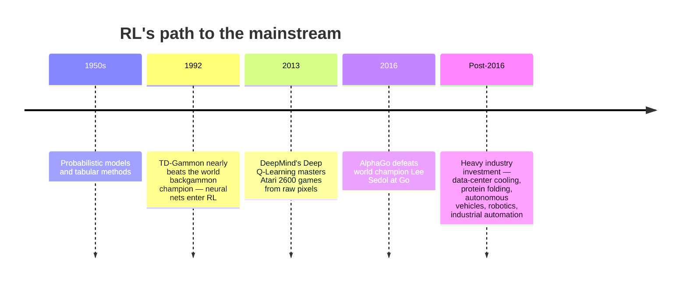

**Applications named in the playlist:** Google data-center cooling optimization, protein folding,
autonomous vehicles, autonomous traffic control, robotics and industrial automation, healthcare,
chemical-reaction optimization, targeted advertising and marketing.

> **⚠️ Important Note:** the video says RL "can even tackle generative modelling which GANs handle at
> the moment." This has aged into something much bigger than the video implies — RL is now central to
> generative AI, but via **RLHF (Reinforcement Learning from Human Feedback)** and its successors for
> aligning large language models, not as a replacement for GANs. If you're coming to RL from the LLM
> world, the value/policy machinery in this tutorial is the same machinery underneath RLHF.

---

## 2. Prerequisites

The playlist assumes these without introducing them. Here's the minimum you actually need.

### Required

| Prerequisite | Why you need it | Minimum depth |
|---|---|---|
| **Python** | All implementations | Functions, loops, lists, NumPy arrays |
| **Probability basics** | Everything in RL is an expectation | Random variables, probability distributions, **expected value** |
| **Expected value** | The definition of a value function *is* an expectation | `E[X] = Σ p(x)·x` — the probability-weighted average |
| **Derivatives / gradients** | Function approximation (§7) | What a slope is; that a gradient points "uphill". Video 4 teaches this from scratch — see §7.1 |
| **Neural network basics** | §7 onward | A layer computes `activation(Wx + b)`; training adjusts W and b to reduce a loss |
| **Loss functions & gradient descent** | DQN training | MSE loss; "step opposite the gradient to reduce loss" |

### Notation used throughout

Because the auto-captions garble symbols, here is the notation stated cleanly:

| Symbol | Name | Meaning |
|---|---|---|
| `s`, `s'` | state, next state | The situation the agent is in |
| `a` | action | What the agent does |
| `r` | reward | Scalar feedback for a transition |
| `G` | **return** | Total (discounted) future reward from a step onward |
| `γ` (gamma) | **discount factor** | Between 0 and 1; how much future reward is worth now |
| `π` (pi) | **policy** | The agent's behaviour: maps states → actions |
| `V(s)` | state-value function | Expected return from state `s` |
| `Q(s,a)` | action-value function | Expected return from taking `a` in `s` |
| `α` (alpha) | step size / learning rate | How much each update moves the estimate |
| `ε` (epsilon) | exploration rate | Probability of acting randomly |
| `θ`, `w` | parameters | Neural network weights |
| `π*`, `V*`, `Q*` | optimal policy/values | The best achievable |

> **⚠️ Transcript correction:** Video 1's captions say *"the return is typically written with a gamma
> which is called the discount factor."* That conflates two different things. **The return is `G`;
> the discount factor is `γ`.** They appear in the same formula but are not the same object.

### Environment setup

```bash
python -m venv rl-env && source rl-env/bin/activate    # Windows: rl-env\Scripts\activate

# Modern stack (recommended — see the API warning in §6.1)
pip install gymnasium "gymnasium[classic-control]" "gymnasium[box2d]"
pip install numpy tensorflow pandas matplotlib
```

The videos use `gym==0.24.1`, PyCharm Community, Python 3.8, TensorFlow 2.9.1, and OpenCV for
rendering. `gymnasium` is the maintained successor to `gym`; §6.1 covers the API differences.

---

## 3. Fundamentals: The RL Problem

> **Source:** Video 1

### 3.1 The agent–environment loop

Everything in RL is built on one cycle:

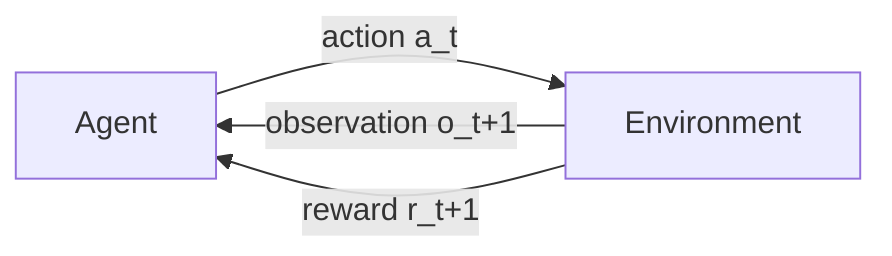

Concretely, repeating forever:

1. The agent receives an **observation** from the environment.
2. The agent processes it and takes an **action**.
3. The environment returns a **reward** for that action and a new observation.

The **agent** is the learner and decision-maker. The **environment** is everything else. The
**reward is just a single number.**

### 3.2 Episodic vs continuing tasks

| Type | Definition | Example |
|---|---|---|
| **Episodic** | The cycle terminates at some point | Board games — win/lose ends it |
| **Continuing** | The cycle goes on forever | Controlling an oil refinery |

This distinction matters more than it looks: some algorithms (Monte Carlo, §5.2) **only work on
episodic tasks**, because they need an episode to end before they can learn anything.

### 3.3 Policy — the agent's behaviour

A **policy** `π` is a function: state in, action out. That's it. The policy *is* the agent's
behaviour, and learning a good policy is the entire goal.

| Type | Returns | Example with 4 actions |
|---|---|---|
| **Deterministic** | One concrete action | `→ action 2` |
| **Stochastic** | A probability distribution over actions | `→ [0.1, 0.2, 0.6, 0.1]` |

Stochastic policies matter because they build exploration in naturally, and because in some
environments the optimal behaviour genuinely *is* randomized.

### 3.4 Return and the discount factor

The agent's goal is not to maximize the *next* reward — it's to maximize total reward, called the
**return** `G`. The return is computed **per step**: the return for step 3 is all rewards
accumulated from step 3 onward.

```
G_t = r_{t+1} + γ·r_{t+2} + γ²·r_{t+3} + γ³·r_{t+4} + ...
```

Video 1 describes `γ` informally: *"the discount factor hinders the ability of the agent to look too
far into the future. When you play chess you can look three or four steps into the future."*

That intuition is fine but incomplete. **The three real reasons for discounting:**

1. **Mathematical necessity for continuing tasks.** With no termination and `γ = 1`, the sum
   `r + r + r + ...` diverges to infinity — every policy has infinite value and comparison becomes
   meaningless. Any `γ < 1` makes the sum provably finite (a geometric series).
2. **Uncertainty about the future.** Distant predictions are less reliable, so weight them less.
3. **Genuine preference for sooner rewards.** Often true in economic/real terms.

**Choosing γ:** `γ ≈ 0.9` gives an effective horizon of ~10 steps; `γ ≈ 0.99` gives ~100 steps
(roughly `1/(1-γ)`). The playlist uses 0.9 for tabular cliff walking and **0.99 for all the deep RL
work** — longer horizons need a larger `γ`.

### 3.5 Value — the agent's estimate of the return

Here's the central problem: **the agent wants to take actions leading to the highest return, but it
doesn't know the return — it hasn't taken those actions yet.** So it must *estimate* it.

That estimate is the **value**. `V(s)` = the return the agent *expects* from state `s`.

> **The distinction that trips up beginners:** the **reward** says what is good *immediately*; the
> **value** says what is good *in the long run*. A state can give a poor immediate reward but have
> high value because it leads somewhere excellent.

Video 1 walks a concrete decision:

1. Agent is in state `s_t`. Several actions are available.
2. The **policy** narrows it to promising candidates (say `a1` and `a3`).
3. The **value function** estimates the expected return for each resulting state.
4. The state reached by `a3` has the highest value → take `a3`, receive reward.
5. Repeat to the end of the episode.
6. Now the *actual* returns are known. **Wherever the value estimate was off, update it.**

Step 6 is the learning signal. Everything in §5 is a different strategy for doing step 6.

### 3.6 Why the value function contains an expectation

`V^π(s) = E[G_t | s_t = s]` — why the `E`?

Because the environment may be **stochastic**:

| Environment | Meaning | Do we need `E[·]`? |
|---|---|---|
| **Deterministic** | Action `a` in state `s` *always* leads to the same `s'` | No — value could just equal the return |
| **Stochastic** | Action `a` in state `s` can lead to several different `s'` | **Yes** — average over outcomes, weighted by probability |

**The video's grid-world example:** in a plain grid, "up" moves you one cell up — deterministic. Now
add **wind** blowing left-to-right. "Up" might land you in any of several cells depending on wind
speed. The agent must average the returns over all possible next states, weighted by how likely each
is. That average is the expectation.

### 3.7 State vs observation — a correction the video makes to itself

Video 1 deliberately says something wrong, then fixes it — worth preserving because the distinction
is real and important.

The policy and value functions do **not** take an observation as input. They take a **state**.

- The environment has an **internal state** that governs how it behaves.
- Each action modifies that internal state, producing a new observation. **External factors can also
  change it** — the agent isn't the only cause.
- **The environment's internal state is generally not visible to the agent.** The agent must infer
  state from observations.

| Environment type | Definition | Example |
|---|---|---|
| **Fully observable** | The agent can determine the exact state from the observation alone | Chess — the board *is* the state |
| **Partially observable** | The observation reveals only part of the state | Driving — you see only what your cameras see |

> **Terminology gap:** the formal name for the partially observable case is a **POMDP** (Partially
> Observable Markov Decision Process). It's genuinely harder: the agent must maintain a *belief*
> over states, often using memory (RNNs, or stacking recent frames — which is exactly what DQN does
> with Atari, stacking 4 frames so velocity becomes inferable from a single input).

For the rest of this tutorial, and in all the environments used, we treat observations as states.

### 3.8 The formal components

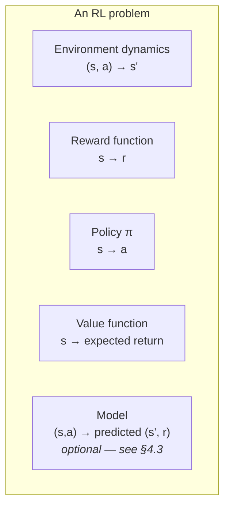

---

## 4. Core Concepts: Formalizing RL as an MDP

> **Source:** Video 2 — *How do RL agents really learn?*

### 4.1 Markov Decision Processes

The agent–environment interaction has a formal name: a **Markov Decision Process (MDP)**. An MDP
defines the environment's dynamics as a probability distribution:

```
p(s', r | s, a)  =  probability of landing in s' with reward r, given state s and action a
```

**What:** the standard mathematical framework for sequential decision-making under uncertainty.
**Why:** it makes RL problems precise enough to prove things about, and it's the shared vocabulary of
the entire field.

### 4.2 The Markov property

> *"The future is independent of the past given the present."*

Naively, `p(s', r | ...)` might depend on the **entire history** of the trajectory. The Markov
property says: **once you know the current state, the whole history can be discarded.** The
current state carries everything relevant.

| Facet | Detail |
|---|---|
| **What** | The next state and reward depend only on the current state and action |
| **Why it matters** | Turns an intractable dependence on full history into a tractable one-step dependence — every algorithm in §5 relies on it |
| **When it holds** | Chess (the board is sufficient), most games with full information |
| **When it fails** | Anything where velocity/momentum/intent matters but isn't in the observation — a single video frame doesn't tell you which way the ball is moving |
| **The fix when it fails** | Engineer the state to *make* it Markov — stack recent frames, include velocities, or add memory (RNN) |

> **This is why CartPole's observation is 4 numbers, not 2.** Position and angle alone wouldn't be
> Markov — you couldn't tell a pole falling left from one swinging right through the same angle.
> Adding *velocity* and *angular velocity* restores the Markov property.

### 4.3 Models: model-based vs model-free

A **model** simulates the environment: given a state and action, it *predicts* the next state and
reward — **without the agent actually acting.**

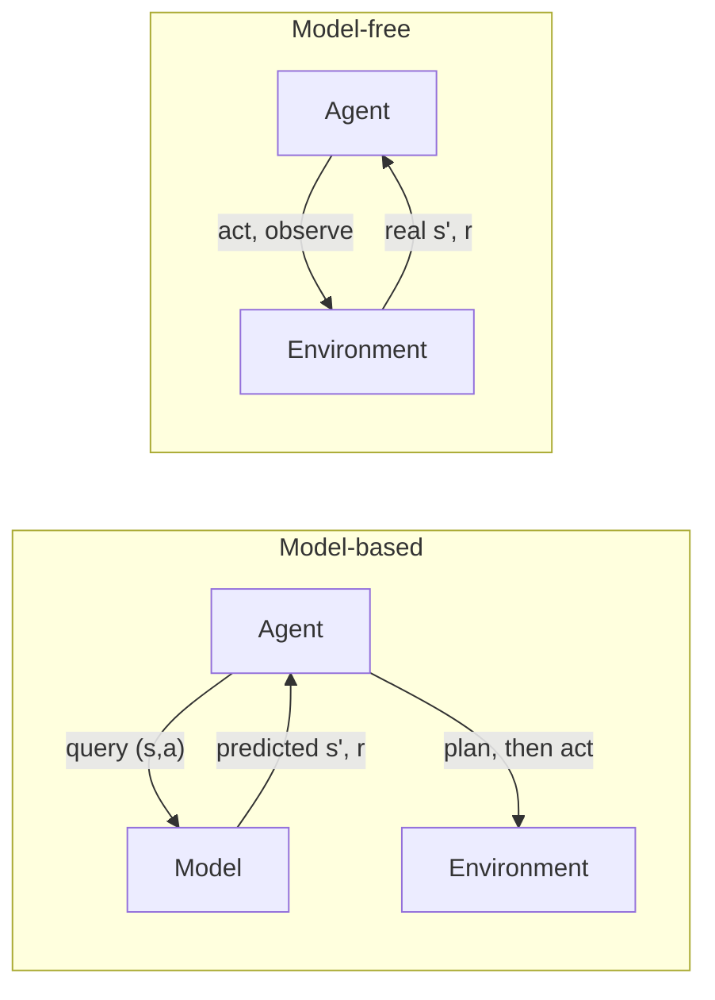

| | **Model-based** | **Model-free** |
|---|---|---|
| **Uses a model?** | Yes | No |
| **How it evaluates actions** | Query the model, estimate the resulting state's value | Must learn action values from real experience |
| **Sample efficiency** | Higher — can plan without acting | Lower — needs real interaction |
| **When to use** | Model is available/learnable; real interaction is expensive or dangerous | Environment too complex to simulate; model unavailable |
| **When not to** | An inaccurate model means you plan confidently against a fiction | You have a good simulator and interaction is costly |
| **Trade-off** | Planning power vs. model-error compounding | Simplicity and robustness vs. sample hunger |

**Everything implemented in this tutorial is model-free.** The playlist notes a model may be
unavailable simply because the environment is too complex to simulate.

### 4.4 The action-value function Q — and why model-free RL needs it

This is a subtle, important point the video makes well.

With a model, `V(s)` is enough: query the model for each action's resulting state, look up its value,
pick the best. **Without a model, `V(s)` is useless for choosing actions** — you can't find out where
an action leads without taking it.

The fix: change what the value function takes as input.

| Function | Signature | Name | Answers |
|---|---|---|---|
| `V(s)` | state → value | **State-value function** | "How good is this state?" |
| `Q(s, a)` | (state, action) → value | **Action-value function** | "How good is this *action* in this state?" |

With `Q`, action selection needs no model at all: evaluate `Q(s, a)` for every action and pick the
best. **This is why `Q` dominates practical RL** — and why the most famous algorithm in the field is
named after it.

### 4.5 The Bellman equation — the identity that makes learning possible

> **Knowledge gap:** Video 2 derives and uses this, but **never names it.** It is the single most
> important equation in RL, so let's be explicit.

Start with the definition of return, and split off the first reward:

```
G_t = r_{t+1} + γ·r_{t+2} + γ²·r_{t+3} + ...
    = r_{t+1} + γ·( r_{t+2} + γ·r_{t+3} + ... )
    = r_{t+1} + γ·G_{t+1}
```

Take expectations, and recognise that `E[G_{t+1}]` is just the value of the next state:

```
V^π(s) = E[ r + γ·V^π(s') ]        ← the Bellman equation for V
Q^π(s,a) = E[ r + γ·Q^π(s', a') ]  ← the Bellman equation for Q
```

**Why this is the whole game:** it turns an infinite sum into a **recursive relationship between
adjacent states.** As the video puts it: *"you are calculating the values for the current state
considering the reward for that step and the values for the next state."* You never have to simulate
to the end of time — you only ever need one step plus your current estimate of what follows.

Every algorithm in §5 is a different way of turning this identity into an update rule.

### 4.6 The exploration–exploitation dilemma

**The problem:** to find good actions you must try unknown ones (**explore**); to score well you must
take known-good ones (**exploit**). Every step forces a choice, and both extremes fail — pure
exploitation locks onto the first mediocre thing that worked; pure exploration never cashes in.

| Strategy | Rule | Problem |
|---|---|---|
| **Greedy** | Always take `argmax Q(s,a)` | Never explores; gets stuck on a locally-good action forever |
| **ε-greedy** | With probability `ε` act randomly, otherwise greedily | Simple, effective, the field's workhorse |

**ε decay** is the standard refinement: start with high `ε` (explore aggressively when you know
nothing), decay it over training (exploit what you've learned once you know something).

```python
# Two conventions — both appear in the playlist, which causes confusion
epsilon *= 0.995          # multiply by a factor < 1   (most common)
epsilon /= 1.005          # divide by a factor > 1     (used in Video 5)
epsilon = max(epsilon, 0.01)   # ALWAYS floor it — see the note below
```

> **⚠️ Important Note — a bug the videos don't guard against:** neither decay form has a floor, so
> `ε` decays toward 0 and exploration stops entirely. If the agent hasn't found the good behaviour
> by then it never will. **Always clamp `ε` to a minimum (typically 0.01–0.05).** Video 4's training
> failure is partly attributable to a *fixed* `ε = 0.1` and, after adding decay, no floor.

> **Terminology gap — better exploration methods exist.** ε-greedy explores *uniformly at random*,
> which is crude: it's as likely to try an obviously terrible action as a promising untried one.
> Alternatives worth knowing: **Boltzmann/softmax exploration** (probability proportional to value),
> **UCB** (Upper Confidence Bound — explore by uncertainty), and **noisy networks**. The playlist
> uses only ε-greedy.

### 4.7 Values are always tied to a policy

`V^π(s)` — the superscript matters. **Change the policy and all values change.** The video's chain
of reasoning is exactly right:

> policy changes → behaviour changes → rewards received change → returns change → **values change**

This is why RL is circular in a way supervised learning isn't: you evaluate a policy to improve it,
which invalidates the evaluation, so you evaluate again. §5.1 makes that loop explicit.

### 4.8 Representing policies and value functions

| Representation | How | Scales to | Generalizes? |
|---|---|---|---|
| **Table** | One row per state, one column per action | Small, discrete state spaces | ❌ No — each state learned independently |
| **Function approximator** (e.g. neural network) | Parameterized function | Large or continuous state spaces | ✅ Yes — similar states share learning |

We start with tables (§5–6) because the algorithms are clearer, then move to networks (§7 onward).

---

## 5. The Three Classical Solution Families

> **Source:** Video 2

All three answer the same question — *how do we compute values and improve the policy?* — with
different assumptions about what we have access to.

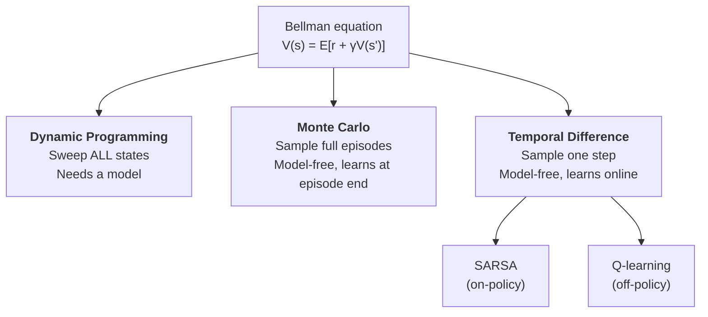

### 5.1 Dynamic Programming and Policy Iteration

DP uses the Bellman equation directly, assuming a **complete model** of the environment.

Two alternating steps:

| Step | Also called | What it does |
|---|---|---|
| **Policy evaluation** | *Prediction problem* | Given policy `π`, compute `V^π` for all states |
| **Policy improvement** | *Control problem* | Given `V^π`, act greedily to get a better policy |

Alternating them is **policy iteration**; ignoring the granularity of each step gives
**generalized policy iteration (GPI)** — the pattern underneath essentially every RL algorithm.

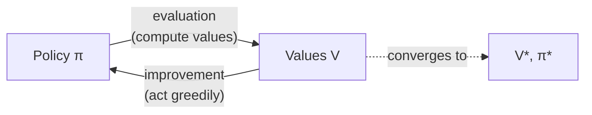

#### Worked example: the 4×4 grid world

The video's setup: a 4×4 grid, top-left and bottom-right are **terminal**, the other 14 cells are
states, four actions (up/down/left/right), and **every transition gives reward −1**.

Because every step costs −1, maximizing return means **reaching a terminal state in as few steps as
possible** — the reward function encodes "hurry up" without ever saying so. (§11 develops this idea
properly.)

1. **Initialize:** a uniformly random policy (all 4 actions equally likely everywhere); all values 0.
2. **Evaluate:** apply the Bellman update repeatedly until values settle.
3. **Improve:** at each cell, look at neighbouring values and act greedily.
   - *At cell 1:* moving left reaches a terminal cell with value 0 — better than the current −1.
     Other actions leave the value unchanged. → **policy becomes "go left."**
   - *At cell 4:* moving up is the improvement. → **policy becomes "go up."**
   - **Note:** bumping into a wall leaves you in the same cell — a legal but useless action.
4. **Repeat.** Values and policy converge to `V*` and `π*`.

#### The three fatal limitations of DP

| Limitation | Why it kills DP in practice |
|---|---|
| **Sweeps every state** | Infeasible for large state spaces — chess has ~10⁴⁰ positions |
| **Requires a model** | Often unavailable |
| **Assumes *complete* knowledge** | An incomplete model breaks the guarantees |

These three limitations are exactly what Monte Carlo and TD were invented to escape.

### 5.2 Monte Carlo methods

**Core idea:** don't compute expectations from a model — **estimate them by averaging actual sampled
returns.**

| | Dynamic Programming | Monte Carlo |
|---|---|---|
| Needs a model? | ✅ Required | ❌ Not needed |
| Uses | *All* possible next states | *Sampled* real trajectories |
| Learns when? | Any time (offline computation) | **Only at episode end** |
| Knowledge assumed | Complete | None — just experience |

#### The algorithm (first-visit MC, for `V`)

```python
# Input: a policy π to evaluate
V = defaultdict(float)          # arbitrary initialization
returns = defaultdict(list)     # sampled returns per state

for episode in range(num_episodes):
    trajectory = generate_episode(policy)     # [(s0,a0,r1), (s1,a1,r2), ...]
    G = 0
    # Walk BACKWARDS: t-1, t-2, ... — this makes G accumulate in one pass
    for t in reversed(range(len(trajectory))):
        s, a, r = trajectory[t]
        G = gamma * G + r                     # G_t = r_{t+1} + γ·G_{t+1}
        if s not in [step[0] for step in trajectory[:t]]:   # first visit only
            returns[s].append(G)
            V[s] = mean(returns[s])           # value = average of sampled returns
```

**Why iterate backwards?** The recursion `G_t = r_{t+1} + γ·G_{t+1}` needs `G_{t+1}` before `G_t`.
Going backwards computes every return in a single pass instead of re-summing the tail each time.

**The "first visit" check** (`if s not in earlier states`) makes this *first-visit MC*: only the
first occurrence of a state in an episode contributes. The alternative, *every-visit MC*, uses all
occurrences. Both converge; first-visit has cleaner theory.

For model-free **control**, swap `V` for `Q`, track `(state, action)` pairs, and improve the policy
by taking `argmax_a Q(s,a)`.

#### The problem with Monte Carlo

**MC must wait until the episode ends before learning anything.** Fine for short episodes;
crippling for long ones. And there's a worse failure mode:

> **In the windy grid world (§5.4), Monte Carlo cannot be used at all** — episode termination isn't
> guaranteed. An agent taking left/right actions forever never finishes an episode, so MC never
> gets to learn. TD methods have no such problem, because they learn *during* the episode.

### 5.3 Temporal Difference learning — the central idea in RL

**Core idea:** don't wait for the episode to end. Update after **one transition**, using your own
existing estimate of what follows.

```python
# Monte Carlo update — target is the ACTUAL return (needs the full episode)
V[s] += alpha * (G - V[s])

# TD(0) update — target is r + γ·V(s') (needs only ONE step)
V[s] += alpha * (r + gamma * V[s_next] - V[s])
#                └────────────────────┘
#                    the "TD target"
#                └──────────────────────────────┘
#                    the "TD error" (often written δ)
```

**Bootstrapping** is the name for what makes this work: **using your own current estimate as part of
the learning target.** You're pulling yourself up by your bootstraps — updating a guess toward
another guess.

```python
# TD(0) policy evaluation
V = {s: 0 for s in states}; V[terminal] = 0
for episode in range(num_episodes):
    s = env.reset()
    while not done:
        a = policy(s)
        s_next, r, done = env.step(a)
        V[s] += alpha * (r + gamma * V[s_next] - V[s])   # one-step update
        s = s_next
```

**n-step methods** interpolate between the two extremes: use `n` real rewards, then bootstrap. TD(0)
is `n=1`; Monte Carlo is `n=∞`.

#### The driving-home example — the clearest explanation of TD vs MC

This example from Video 2 is worth reproducing carefully.

You leave the office at 6:00 predicting a 30-minute commute:

| State | Time | Elapsed (reward) | Predicted time to go (value) | Actual total |
|---|---|---|---|---|
| Leaving office | 6:00 | 0 | 30 | 43 |
| Reach car, raining | 6:05 | 5 | 35 | 43 |
| Exit highway | 6:20 | 15 | 15 | 43 |
| Behind slow truck | 6:30 | 10 | 10 | 43 |
| Enter home street | 6:40 | 10 | 3 | 43 |
| Arrive home | 6:43 | 3 | 0 | 43 |

**Modelling it as RL:** states are the waypoints; **rewards are elapsed times**; the **value of a
state is the predicted time to go** (since that's the reward still to be collected). Set
`γ = 1, α = 1` for simplicity.

- **Monte Carlo** updates every state's value toward **43** — the actual outcome — but only *after
  arriving home*.
- **TD** updates each state's value toward **the next state's estimate**, immediately.

**Now the decisive scenario.** Next day, you again predict 30 minutes — but hit a huge traffic jam
from an accident. After 25 minutes you're still stuck. You *know* 30 minutes is impossible.

- **Monte Carlo cannot learn this yet.** It learns only when the episode ends.
- **TD learns immediately** — sitting in traffic, it revises the estimate to ~50 minutes.

**TD is truly online; MC is not.** (The captions garble this as *"Monte Carlo methods are known"* —
the word is **offline**.)

#### Why does bootstrapping toward a guess actually work?

The video's argument is good: in chess, your prediction of winning **near the end** of the game is
more confident than your prediction at the start. Later predictions are better predictions. Taken to
the limit of one step: **the estimate at `t+1` is better than the estimate at `t`** — so moving
`V(s_t)` toward `V(s_{t+1})` moves it toward something more accurate.

The playlist adds: *"in practice we find TD methods to work very well and it also matches with how
humans and animals learn."* (There's real neuroscience here — dopamine neuron firing closely
resembles a TD error signal.)

### 5.4 SARSA — on-policy TD control

**SARSA** is named after the quintuple it uses: **S**tate, **A**ction, **R**eward, next **S**tate,
next **A**ction.

```python
Q[s][a] += alpha * (r + gamma * Q[s_next][a_next] - Q[s][a])
#                              └──────────────┘
#            a_next comes from the SAME ε-greedy policy the agent is following
```

```python
# SARSA (tabular)
for episode in range(num_episodes):
    s = env.reset()
    a = epsilon_greedy(Q, s, epsilon)        # choose the FIRST action before the loop
    while not done:
        s_next, r, done = env.step(a)
        a_next = epsilon_greedy(Q, s_next, epsilon)      # ← on-policy: same policy
        Q[s][a] += alpha * (r + gamma * Q[s_next][a_next] - Q[s][a])
        s, a = s_next, a_next
```

**Windy grid world:** wind blows bottom-to-top; the agent must reach a goal. SARSA learns a good
policy, and the rising slope of the reward curve shows the goal being reached progressively faster.
As noted in §5.2, **MC can't be used here at all** (termination isn't guaranteed) — SARSA learns
during the episode that such policies are poor and abandons them quickly.

### 5.5 On-policy vs off-policy

| | **On-policy** | **Off-policy** |
|---|---|---|
| **Definition** | Evaluates/improves *the same policy* used to act | Evaluates/improves a policy *different* from the one acting |
| **Policies involved** | One | Two: **behaviour policy** (acts, more exploratory) and **target policy** (being learned) |
| **What it learns** | Values for a *near*-optimal policy that still explores | Values for the **optimal** policy while behaving exploratorily |
| **Example** | SARSA | Q-learning |
| **Can it reuse old data?** | ❌ Poorly — data must come from the current policy | ✅ Yes — **this is what makes experience replay possible (§9)** |

**The core insight:** to *find* optimal actions you must behave non-optimally to explore. On-policy
methods therefore learn values for a compromise — a near-optimal policy that keeps exploring.
Off-policy methods separate the two concerns and learn the truly optimal policy while exploring.

### 5.6 Q-learning — off-policy TD control

```python
Q[s][a] += alpha * (r + gamma * max(Q[s_next]) - Q[s][a])
#                              └────────────┘
#              the GREEDY (optimal) action — regardless of what the agent actually does next
```

**The one-line difference from SARSA:** SARSA bootstraps from the action its ε-greedy policy *will
actually take*; Q-learning bootstraps from the **best** action. That `max` is what makes it
off-policy — the target policy is greedy while the behaviour policy explores.

#### Cliff walking: the canonical SARSA-vs-Q-learning comparison

Setup: a 4×12 grid, a cliff along the bottom edge, start bottom-left, goal bottom-right. Reward −1
per step, **−100 for falling off the cliff.**

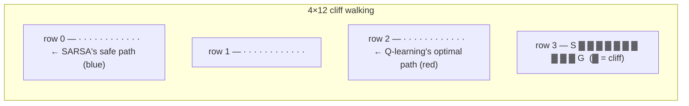

| | **SARSA** | **Q-learning** |
|---|---|---|
| Path learned | **Safer** — routes away from the cliff edge | **Optimal** — hugs the cliff edge |
| Reward *during training* | **Higher** | Lower |
| Why | Its targets account for the ε-greedy chance of stepping off the cliff, so it learns to keep distance | Learns the optimal path, but ε-greedy exploration occasionally shoves it off that cliff-adjacent path |

**The key subtlety:** Q-learning learns the *better policy* but collects *less reward while
learning*, because the optimal path is dangerous under random exploration. Both are behaving
correctly — they're optimizing different things.

> **⚠️ Common Misconception:** Video 2 concludes *"off-policy algorithms are often stronger than
> on-policy algorithms because they find optimal policies quickly and therefore are widely used,"*
> and Video 3 goes further: the α-sensitivity difference *"clearly demonstrates how powerful
> off-policy learning is over on-policy learning."*
>
> **This is too strong.** More accurate:
> - Off-policy's decisive practical advantage is **data reuse** — it can learn from a replay buffer
>   or another policy's data. That's what enables DQN (§9), and it's the real reason it dominates.
> - Off-policy is **not** uniformly "stronger." It's typically **less stable**: combining
>   off-policy learning with bootstrapping and function approximation is precisely the *deadly triad*
>   (§8) that makes deep RL diverge. On-policy methods (PPO, A2C) are widely used in production
>   *because* they're more stable.
> - In cliff walking, SARSA's "safer" path is arguably the **better** policy if you care about
>   performance while learning, or if exploration is genuinely dangerous (a real robot near a real
>   cliff).
>
> **Correct takeaway:** on-policy and off-policy make different trade-offs. Off-policy buys sample
> reuse at the cost of stability.

---

## 6. Practical Implementation I — Tabular Agents

> **Source:** Video 3 — *How to train our first RL agent!*

### 6.1 The Gym API (and the change that breaks the videos' code)

**The first question for any RL problem:** *how do I model this as an MDP?* — what are the states,
actions, and rewards? For cliff walking: states are grid cells, reward −1 per step and −100 for the
cliff.

**Where does the environment come from?** The video makes an honest and important point: you may have
to **implement the environment yourself**, and that is *"one of the major pitfalls in reinforcement
learning."* For standard problems, **Gym** provides ready-made ones.

| Method | Purpose |
|---|---|
| `gym.make(name)` | Create an environment (returns an `Env` object) |
| `env.reset()` | Initialize; returns the initial observation |
| `env.step(action)` | Apply an action; returns next observation, reward, done, info |
| `env.render(mode=...)` | Visual representation — `"ansi"` (text), `"rgb_array"` (NumPy frame), `"human"` (window) |
| `env.close()` | Release resources |

Gym uses **pygame** for rendering some environments.

> **⚠️ Modern Approach — the videos' Gym code will not run today.**
>
> The videos use `gym==0.24.1`. Gym was superseded by **`gymnasium`**, and the step/reset API
> changed in a way that silently breaks old code:
>
> ```python
> # OLD (videos, gym ≤ 0.25)
> obs = env.reset()
> obs, reward, done, info = env.step(action)          # 4 values
>
> # NEW (gymnasium)
> obs, info = env.reset(seed=42)                       # returns a tuple; supports seeding
> obs, reward, terminated, truncated, info = env.step(action)   # 5 values
> done = terminated or truncated
> ```
>
> **`terminated` vs `truncated` is not cosmetic — it fixes a real bug** (see §10.4). `terminated`
> means the episode genuinely ended (goal reached, pole fell). `truncated` means an external limit
> cut it off (time limit). They require *different* bootstrapping behaviour, and old `gym` conflated
> them into one `done` flag.
>
> Also: `render_mode` is now set at construction — `gym.make("CartPole-v1", render_mode="rgb_array")`
> — not passed to `render()`.

### 6.2 The environments used in this playlist

| Environment | Observation | Actions | Reward | Terminates when |
|---|---|---|---|---|
| **CliffWalking-v0** | Single int, 0–47 (4×12 grid, row-major) | 4: `0`=up, `1`=right, `2`=down, `3`=left | −1/step, −100 cliff | Goal reached |
| **CartPole-v1** | 4 floats: cart position, cart velocity, pole angle, pole angular velocity | 2: `0`=push left, `1`=push right | +1 per step | \|angle\| > 12°, \|position\| > 2.4, or 500 steps (200 in v0) |
| **MountainCar-v0** | 2 floats: position ∈ [−1.2, 0.6], velocity ∈ [−0.07, 0.07] | 3: `0`=accel left, `1`=nothing, `2`=accel right | −1/step, 0 at goal | Position ≥ 0.5, or 200 steps |
| **LunarLander-v2** | 8 floats (see §12) | 4: nothing, left engine, main engine, right engine | Shaped (see §12) | Landed/crashed, or 1000 steps |

> **⚠️ Note — an inconsistency between videos.** Video 2 says the agent falling into the cliff
> *"terminates the episode."* Video 3 corrects this: *"if the agent falls into the cliff it is
> immediately transferred to the starting state... the episode only terminates if the agent reaches
> the goal state."* **Video 3 is correct** for `CliffWalking-v0` — a cliff fall costs −100 and resets
> position, but the episode continues.

### 6.3 A random agent (always start here)

Before any learning, verify your loop works.

```python
import gymnasium as gym
import numpy as np

env = gym.make("CliffWalking-v0", render_mode="ansi")
obs, info = env.reset(seed=42)
done = False

ACTION_NAMES = ["up", "right", "down", "left"]   # matches Gym's 0,1,2,3

while not done:
    action = int(np.random.randint(0, 4))        # ← 4 = number of actions (see warning below)
    obs, reward, terminated, truncated, info = env.step(action)
    done = terminated or truncated
    print(f"state {obs} -> {ACTION_NAMES[action]}")

env.close()
```

> **⚠️ Important Note — an off-by-one bug that bit the playlist twice.** `np.random.randint(low,
> high)` has an **exclusive** upper bound, as does `tf.random.uniform(maxval=...)`. For 4 actions you
> need `high=4` / `maxval=4`. The instructor twice shipped a wrong bound — once admitting *"before
> starting training I forgot to change the random action selection"* on MountainCar (3 actions), and
> the CartPole policy code appears to use `maxval=1`, which would return **only action 0** and
> silently disable exploration entirely.
>
> **This class of bug is nasty because nothing crashes** — the agent just quietly never explores.
> Defensive pattern:
> ```python
> action = int(np.random.randint(0, env.action_space.n))   # never hardcode the count
> # or simply:
> action = env.action_space.sample()
> ```

**A note the video makes about the random agent:** it can run *forever*, since only reaching the goal
terminates the episode. It also gets stuck against walls — taking "left" at the left edge returns you
to the same state.

### 6.4 SARSA and Q-learning on cliff walking

```python
import gymnasium as gym
import numpy as np
import pickle

env = gym.make("CliffWalking-v0")

N_STATES, N_ACTIONS = 48, 4
q_table = np.zeros((N_STATES, N_ACTIONS))   # rows = states, cols = actions

ALPHA, GAMMA, EPSILON = 0.1, 0.9, 0.1
NUM_EPISODES = 500

def policy(state, explore=0.0):
    """ε-greedy. explore=0.0 gives the pure greedy policy (used at evaluation time)."""
    action = int(np.argmax(q_table[state]))
    if np.random.random() <= explore:
        action = int(np.random.randint(0, N_ACTIONS))
    return action

# ---------------- SARSA ----------------
for episode in range(NUM_EPISODES):
    state, _ = env.reset()
    action = policy(state, EPSILON)
    done, total_reward, length = False, 0, 0

    while not done:
        next_state, reward, terminated, truncated, _ = env.step(action)
        done = terminated or truncated
        next_action = policy(next_state, EPSILON)          # ← on-policy

        q_table[state][action] += ALPHA * (
            reward + GAMMA * q_table[next_state][next_action] - q_table[state][action]
        )

        state, action = next_state, next_action
        total_reward += reward
        length += 1

    print(f"episode {episode} | length {length} | reward {total_reward}")

env.close()
with open("sarsa_q_table.pkl", "wb") as f:
    pickle.dump(q_table, f)          # ← persist it, or training is lost when the script exits
```

**Q-learning differs in exactly one line:**

```python
        # SARSA:      bootstrap from the action the policy will actually take
        next_action = policy(next_state, EPSILON)
        target = reward + GAMMA * q_table[next_state][next_action]

        # Q-learning: bootstrap from the BEST action
        target = reward + GAMMA * np.max(q_table[next_state])

        q_table[state][action] += ALPHA * (target - q_table[state][action])
        state = next_state       # note: no next_action to carry forward
```

**Training metrics to log from day one:** total reward per episode and episode length. The video's
run shows the arc clearly — early episodes have length ~141 and reward ~−2043 (many cliff falls);
by episode 500, lengths are under 30.

> **Best practice the video demonstrates:** persist the Q-table with `pickle`, and **evaluate in a
> separate script** with `explore=0.0` (pure greedy). Training performance and final-policy
> performance are different things; conflating them hides both.

#### An honest anomaly worth understanding

> **⚠️ The video's result contradicts the textbook.** The instructor notes: *"in the book Sutton and
> Barto they mentioned that SARSA did not learn this policy, it learned another which was
> sub-optimal, but we get to see that SARSA has learned the optimal policy."*
>
> **Why this happens:** the classic result describes the policy SARSA *follows* — which, under
> ε-greedy with ε=0.1, prefers the safe path because its Q-values price in exploration risk. But the
> evaluation script extracts a **greedy** policy (ε=0) from those Q-values. Greedy extraction can
> recover the cliff-edge path even when the ε-greedy-optimal policy avoids it, especially with modest
> training and a small ε. **The textbook figure and this result are measuring different things:**
> on-policy performance during training vs. greedy policy extracted afterwards.

#### The α sensitivity experiment

The video sweeps the step size `α`:

| α | SARSA | Q-learning |
|---|---|---|
| Low (0.1–0.2) | Smooth learning; **0.2 looks better than the 0.1 used** | Fine |
| ~0.5 | **Heavy fluctuation** | Fine — *faster* than low α |
| Higher | **Diverges; fails to learn** | Still fine |

**What α actually controls:** how much of the TD error each update applies. Too small → slow
learning; too large → each update overshoots, and estimates oscillate or blow up.

> **⚠️ Important Note:** the video attributes Q-learning's α-robustness to it being off-policy
> ("clearly demonstrates how powerful off-policy learning is"). **That's a misattribution.** A more
> defensible reading: SARSA's target depends on `Q[s'][a']` for an ε-greedily *sampled* `a'`, which
> injects extra variance from exploration into every target. Q-learning's `max` is a lower-variance
> target. Higher `α` amplifies target variance, so the noisier target destabilizes first. This is
> about **target variance**, not about off-policy being inherently superior — recall from §5.5 that
> off-policy learning is generally *less* stable, not more.

---

## 7. From Tables to Neural Networks

> **Source:** Video 4 — *Introducing Neural Networks into RL*

### 7.1 Why tables fail, and what function approximation buys

Tables *"can only take you so far."* Three failures:

1. **Don't scale** to large state spaces (a 48-row table is fine; chess is not).
2. **Can't represent continuous** state spaces at all — CartPole's positions and velocities are real
   numbers, so there is no finite set of rows.
3. **Don't generalize.** Two nearly identical states are separate rows that share nothing. Every
   state must be visited to be learned.

**Function approximation** replaces the table with a parameterized function `v(s, w)` — think a
neural network with weights `w` — trained to approximate the true `V^π(s)` using supervised-learning
machinery.

| Advantage | Detail |
|---|---|
| **Lower memory** | Store parameters, not one entry per state |
| **Generalization** | Updating one state's value **shifts values of similar states too** |

> The video is careful to note generalization is double-edged: it *"makes the learning more powerful
> but difficult to manage and understand."* An update meant for one state leaks into others — helpful
> when states really are similar, destructive when they aren't.

### 7.2 Gradients (the video's primer, made precise)

- **Slope of a line:** a number describing steepness. Positive slanting right, negative slanting left.
- **Slope of a curve at a point:** the slope of the **tangent** at that point.
- **In 3D:** the slope of the tangent *plane* at a point — this is the **gradient**.

> **Mental model:** the gradient is "slope generalized to many dimensions," and it points in the
> **direction of steepest ascent** — move along it and the function *increases*.
>
> *Where the analogy breaks:* the gradient is a *vector* (one component per parameter), not a single
> number, and it's only reliable locally — it says nothing about the surface further away, which is
> why small learning rates matter.

Since we want to **minimize** loss, we step in the **opposite** direction:

```
Loss  L(w) = (V^π(s) − v(s,w))²          ← mean squared error
Update:  w ← w − α · ∇_w L(w)             ← α = learning rate, ∇ = gradient
```

This is **stochastic gradient descent (SGD)**.

### 7.3 The problem unique to RL: we don't know the target

In supervised learning you *have* the labels. In RL, `V^π(s)` — the true value — **is exactly the
unknown we're trying to learn.** So what goes in the loss?

We substitute a **target** `U_t`: not the true value, but an approximation to it — a noise-corrupted
version, or a bootstrapped TD target.

**The critical condition:** `U_t` must be an **unbiased estimate** of the true value — `E[U_t]` must
equal the true value — otherwise **convergence is not guaranteed.**

| Target | Formula | Unbiased? |
|---|---|---|
| Monte Carlo return | `G_t` | ✅ Yes — it's a real sampled return |
| TD(0) bootstrap | `r + γ·v(s', w)` | ❌ **No** — depends on the current, wrong estimate `v(s',w)` |

> **This is why they're called *semi*-gradient methods, not stochastic gradient methods.** The TD
> target depends on `w`, but we deliberately **ignore that dependence** when computing the gradient —
> pretending the target is a fixed constant. It isn't a true gradient of any loss function. **This
> single fact is the root of most deep RL instability**, and it is one of the three legs of the
> deadly triad in §8.

### 7.4 Semi-gradient SARSA

```python
# Semi-gradient SARSA (episodic), conceptually
for episode in range(num_episodes):
    s = env.reset(); a = epsilon_greedy(s)
    while True:
        s_next, r, done = env.step(a)
        if done:
            target = r                                    # no bootstrap past a terminal state
            w += alpha * (target - q(s, a, w)) * grad_q(s, a, w)
            break
        a_next = epsilon_greedy(s_next)
        target = r + gamma * q(s_next, a_next, w)
        w += alpha * (target - q(s, a, w)) * grad_q(s, a, w)
        s, a = s_next, a_next
```

Note the terminal case: **at a terminal state the target is just the reward** — there's no future to
discount. Getting this wrong is a classic bug (§10.4).

### 7.5 The CartPole attempt — and its failure

**Network:** `Input(4) → Dense(64, relu) → Dense(32, relu) → Dense(2, linear)`

The output layer is **linear with 2 units** — one Q-value per action. Q-values are unbounded real
numbers, so **never put a sigmoid/softmax on a Q-network's output.**

**Hyperparameters:** `α = 0.001`, `ε = 0.1` (later decayed from 1.0), `γ = 0.99`, 500 episodes.

```python
import tensorflow as tf

with tf.GradientTape() as tape:
    current = q_net(tf.expand_dims(state, axis=0))[0][action]

grads = tape.gradient(current, q_net.trainable_weights)
delta = target - current                     # the TD error

for j in range(len(grads)):
    q_net.trainable_weights[j].assign_add(alpha * delta * grads[j])
```

> **Why `assign_add` and not `+=`?** Keras weights are `tf.Variable` objects. `+=` would rebind the
> Python name to a new tensor rather than mutating the variable in place, and the model would never
> actually update. This is a real gotcha the video flags.

**Setup note:** `pip install gym[classic_control]` (or `gymnasium[classic-control]`) is needed for
pygame-based rendering; the base package doesn't include it.

**The result: it does not learn.** Not with fixed ε. Not with ε decay. Not with Q-learning instead of
SARSA. **Not even at 3000 episodes.**

This "failed" video is the most instructive in the playlist — the next section explains why.

---

## 8. Why Naive Deep RL Fails: The Deadly Triad

> **Source:** Video 4 (the five reasons) + added theory

### 8.1 The five reasons the video identifies

| # | Problem | Mechanism |
|---|---|---|
| 1 | **Non-linear function approximation** | A network with non-linear activations gives **no convergence guarantee**. Compounded by bootstrapped targets not being unbiased (§7.3) |
| 2 | **Highly correlated sequential samples** | Consecutive states in one episode are nearly identical. Updating on them in sequence injects huge variance and *"breaks learning"* |
| 3 | **Single-sample updates** | One transition per update. No mini-batching — the thing SGD relies on for stable gradient estimates |
| 4 | **Each experience used once, then discarded** | Even on a *static* dataset, SGD needs many epochs. Here every sample is thrown away after one update — extremely wasteful |
| 5 | **Updating after every single transition** | The instructor's own addition: waiting a few transitions between updates would help |

### 8.2 The missing theory: the deadly triad

> **Knowledge gap:** Video 4 lists symptoms but never names the underlying result. This is a
> well-known theorem-shaped fact in RL, and knowing it turns a list of five problems into one idea.

**The deadly triad** (Sutton & Barto): instability and divergence arise when you combine **all three**
of the following. **Any two are safe; all three together can diverge.**

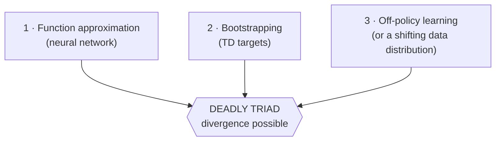

| Combination | Stable? | Example |
|---|---|---|
| Approximation + bootstrapping, **on-policy** | Usually ✅ | Semi-gradient SARSA (still fragile in practice) |
| Approximation + off-policy, **no bootstrapping** | ✅ | Monte Carlo with a network |
| Bootstrapping + off-policy, **tabular** | ✅ | Tabular Q-learning — provably converges |
| **All three** | ❌ **Can diverge** | Naive deep Q-learning — *exactly Video 4* |

This explains why tabular Q-learning worked beautifully in §6 and the same algorithm with a network
failed completely. **It's not a coding bug — it's a structural property of the combination.**

### 8.3 Mapping problems to DQN's solutions

Everything DQN does is a targeted patch on this list — which is why §9 follows directly:

| Problem (§8.1) | DQN's fix |
|---|---|
| 2 — correlated samples | **Experience replay** — sample randomly from a buffer |
| 3 — single-sample updates | **Mini-batches** from the buffer |
| 4 — samples used once | **Buffer retains transitions** for repeated reuse |
| 5 — update every step | **`learn_after_steps`** — update every *N* steps |
| 1 — divergence from bootstrapping | **Target network** — freeze the bootstrap source |

---

## 9. Deep Q-Learning (DQN)

> **Source:** Video 5 — *Deep Learning meets Reinforcement Learning*

**History:** introduced in 2013 to play Atari 2600 games **from raw screen pixels**. A 2015 revision
(the Nature paper) added elements that stabilize learning further.

> **A naming fact the video correctly flags:** *"DQN"* stands for **Deep Q-Network** and is the name
> of the **convolutional network** used — not the algorithm. **The algorithm is Deep Q-Learning.**
> Everyone says "DQN" for both anyway.

### 9.1 Experience replay

**Biological motivation:** we revisit past experiences and reconsider what we could have done
differently.

**Mechanism:** when a transition completes, **don't learn from it immediately.** Store it in a
**replay buffer** (a.k.a. replay memory / experience replay). Then **sample a random mini-batch** and
learn from that.

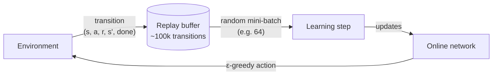

| Problem solved | How |
|---|---|
| **High correlation** | Random sampling breaks the temporal correlation between consecutive samples |
| **Inefficient reuse** | A stored transition can be sampled and reused **many times** |
| **Weak gradient estimates** | Batches give better-conditioned updates than a single sample |

#### Why replay *forces* off-policy learning

This argument from the video is excellent and often glossed over elsewhere:

> With on-policy learning, **the current parameters determine the next data sample the parameters
> train on.** If the maximizing action is "left," training samples become dominated by left-hand-side
> states. If it flips to "right," they become dominated by right-hand-side states. The parameters can
> **get stuck in a local minimum or diverge.**

Since a replay buffer inevitably contains data generated by *older* policies, learning from it **is**
off-policy. **This is precisely why DQN builds on Q-learning rather than SARSA** — Q-learning's `max`
target doesn't care which policy produced the data.

### 9.2 The target network

Introduced in the 2015 revision. There are now **two networks**:

| Network | Parameters | Role |
|---|---|---|
| **Online network** | `θ` | Selects actions; receives gradient updates every learning step |
| **Target network** | `θ⁻` | **Computes the targets.** Identical architecture; weights copied from online every `C` steps |

**Why this stabilizes learning** — the feedback loop it breaks:

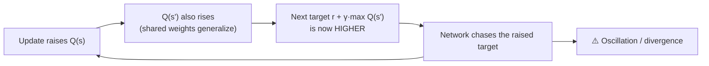

With a **frozen** target network, raising `Q(s)` in the online network does **not** immediately raise
the target's `Q(s')`. The target stays still for `C` steps, giving the online network a stationary
objective to chase — much closer to ordinary supervised learning.

> **Mental model:** the target network is a *"slow copy"* — you're aiming at a stationary target
> instead of one that moves every time you shoot at it.
>
> *Where the analogy breaks:* it's not truly stationary, just piecewise-stationary — it jumps
> discontinuously every `C` steps. (Soft updates, `θ⁻ ← τθ + (1−τ)θ⁻`, smooth this out and are
> standard in DDPG/SAC.)

### 9.3 The algorithm

```
Initialize replay buffer, online network θ, target network θ⁻ ← θ
For each episode:
    s ← env.reset()
    For each step:
        a ← ε-greedy(Q(s, ·; θ))
        s', r, done ← env.step(a)
        Store (s, a, r, s', done) in the replay buffer
        s ← s'

        Every `learn_after_steps` steps:
            Sample a mini-batch from the buffer
            y = r                        if terminal
              = r + γ·max_a' Q(s', a'; θ⁻)   otherwise      ← TARGET network
            Gradient-descend on loss( y , Q(s, a; θ) )      ← ONLINE network

        Every C steps:  θ⁻ ← θ
```

---

## 10. Practical Implementation II — DQN

> **Source:** Video 5

### 10.1 A complete, corrected implementation

```python
import gymnasium as gym
import numpy as np
import tensorflow as tf
from collections import deque
from tensorflow.keras import Model
from tensorflow.keras.layers import Input, Dense
from tensorflow.keras.models import clone_model
from tensorflow.keras.losses import Huber

# ---------------------------- setup ----------------------------
env = gym.make("CartPole-v1")
N_OBS      = env.observation_space.shape[0]     # 4
N_ACTIONS  = env.action_space.n                 # 2

def build_q_net():
    inp = Input(shape=(N_OBS,))
    x   = Dense(32, activation="relu")(inp)
    x   = Dense(16, activation="relu")(x)
    out = Dense(N_ACTIONS, activation="linear")(x)   # linear! Q-values are unbounded
    return Model(inputs=inp, outputs=out)

q_net = build_q_net()
q_net.compile(optimizer="adam")        # Adam handles the learning rate; no manual α
loss_fn = Huber()                      # see §10.3

target_net = clone_model(q_net)        # copies architecture AND weights
target_net.set_weights(q_net.get_weights())

# -------------------------- parameters -------------------------
EPSILON, EPSILON_DECAY, EPSILON_MIN = 1.0, 1.005, 0.01
GAMMA               = 0.99
NUM_EPISODES        = 400
BATCH_SIZE          = 64
MAX_TRANSITIONS     = 100_000
LEARN_AFTER_STEPS   = 3
TARGET_UPDATE_AFTER = 1000          # ← critical; see §10.5

# deque with maxlen evicts from the left automatically, in O(1)
replay_buffer = deque(maxlen=MAX_TRANSITIONS)

# ---------------------------- policy ---------------------------
def policy(state, explore=0.0):
    action = int(tf.argmax(q_net(tf.expand_dims(state, axis=0))[0], output_type=tf.int32))
    if np.random.random() <= explore:
        action = int(np.random.randint(0, N_ACTIONS))   # exclusive bound = N_ACTIONS
    return action

def sample_batch(size):
    """Return columns as tensors so the update is fully vectorized (no Python loops)."""
    idx = np.random.choice(len(replay_buffer), size, replace=False)
    batch = [replay_buffer[i] for i in idx]
    s, a, r, s2, d = zip(*batch)
    return (tf.constant(s, dtype=tf.float32),
            tf.constant(a, dtype=tf.int32),
            tf.constant(r, dtype=tf.float32),
            tf.constant(s2, dtype=tf.float32),
            tf.constant(d, dtype=tf.bool))

# --------------------------- training --------------------------
step_counter = 0
for episode in range(NUM_EPISODES):
    state, _ = env.reset()
    done, total_reward, length = False, 0.0, 0

    while not done:
        action = policy(state, EPSILON)
        next_state, reward, terminated, truncated, _ = env.step(action)
        done = terminated or truncated

        # store `terminated` only — NOT `done`. See §10.4.
        replay_buffer.append((state, action, float(reward), next_state, terminated))
        state = next_state
        step_counter += 1
        total_reward += reward
        length += 1

        if step_counter % LEARN_AFTER_STEPS == 0 and len(replay_buffer) >= BATCH_SIZE:
            s, a, r, s2, term = sample_batch(BATCH_SIZE)

            next_q  = tf.reduce_max(target_net(s2), axis=1)          # TARGET network
            targets = tf.where(term, r, r + GAMMA * next_q)          # no bootstrap if terminal

            with tf.GradientTape() as tape:
                q_all   = q_net(s)
                indices = tf.stack([tf.range(BATCH_SIZE), a], axis=1)
                current = tf.gather_nd(q_all, indices)   # Q for the actions actually taken
                loss    = loss_fn(targets, current)

            grads = tape.gradient(loss, q_net.trainable_weights)
            q_net.optimizer.apply_gradients(zip(grads, q_net.trainable_weights))

        if step_counter % TARGET_UPDATE_AFTER == 0:
            target_net.set_weights(q_net.get_weights())

    EPSILON = max(EPSILON / EPSILON_DECAY, EPSILON_MIN)   # floored — see §4.6
    print(f"ep {episode} | len {length} | reward {total_reward} | eps {EPSILON:.3f}")

env.close()
q_net.save("dqn_qnet.keras")
```

**Two lines worth dwelling on:**

- `tf.where(term, r, r + GAMMA * next_q)` — vectorized terminal handling across the whole batch. This
  is *why* `sample_batch` returns tensor columns: it eliminates every Python loop from the update.
- `tf.gather_nd(q_all, indices)` — the network outputs Q-values for *all* actions; we need only the
  one actually taken in each transition. `indices` pairs each batch row with its action.

> **Improvement over the video:** the video uses a Python `list` and `replay_buffer.pop(0)` when full.
> **`list.pop(0)` is O(n)** — it shifts every element. With 100,000 transitions that's a real cost on
> every single step. `collections.deque(maxlen=N)` evicts in **O(1)** and needs no manual length
> check.

### 10.2 Bugs the instructor hit live (all worth learning from)

| Bug | Symptom | Lesson |
|---|---|---|
| Stored `rewards` (the sampled batch) instead of `reward` (the current one) | Silently corrupt buffer | Variable names differing by one letter across scopes are a hazard |
| Forgot to widen random action range from 2 → 3 for MountainCar | Action 2 never explored | **Never hardcode action counts** — use `env.action_space.n` |
| `target_update_after = 4` | **Q-values diverging** | See §10.5 — this is the big one |
| Reward in `float64` on LunarLander | Type errors | Cast explicitly: `float(reward)` / `tf.float32` |

### 10.3 Huber loss

The 2015 paper clips the error to `[−1, 1]`. The clean way is **Huber loss**:

| Loss | Behaviour | Outlier sensitivity |
|---|---|---|
| **MSE** | Quadratic everywhere | **High** — a large TD error produces a huge gradient |
| **Huber** | Quadratic near 0, **linear** beyond δ | **Low** — gradient is bounded |

Because bootstrapped targets are noisy and occasionally wildly wrong, a single large TD error under
MSE can produce a gradient step that wrecks the network. Huber caps that damage. **Use Huber for DQN.**

### 10.4 The `terminated` vs `truncated` bug (a genuine correction)

> **⚠️ Modern Approach — a real bug in the videos' code, invisible under old Gym.**
>
> The bootstrap must be dropped **only when the episode genuinely ended**, not when a time limit cut
> it off.
>
> - CartPole hitting **500 steps** is `truncated`. The pole is still balanced! There *is* a valuable
>   future, so the target **should** bootstrap: `r + γ·max Q(s')`.
> - The pole **falling over** is `terminated`. No future exists. Target is just `r`.
>
> Old Gym reported both as `done=True`, so the videos' code treats a successful 500-step episode as
> if the world ended — teaching the agent that balancing successfully for 500 steps is worthless.
> **This systematically suppresses the value of exactly the behaviour you want.**
>
> ```python
> # WRONG (old gym semantics)
> done = truncated or terminated
> buffer.append((s, a, r, s2, done))
>
> # RIGHT
> buffer.append((s, a, r, s2, terminated))   # bootstrap through truncation
> ```
>
> The same applies to MountainCar's 200-step limit and LunarLander's 1000-step limit.

### 10.5 Diagnostics: the average-Q metric

The 2015 paper's diagnostic, and the video's most valuable debugging lesson.

**Method:** *before* training, collect a fixed set of states using a random policy. After every
episode, compute the mean max-Q over that fixed set.

```python
# Before training: gather a fixed evaluation set
random_states = []
state, _ = env.reset()
for _ in range(20):
    random_states.append(state)
    state, _, term, trunc, _ = env.step(env.action_space.sample())
    if term or trunc:
        state, _ = env.reset()
random_states = tf.constant(random_states, dtype=tf.float32)

# After each episode
avg_q = float(tf.reduce_mean(tf.reduce_max(q_net(random_states), axis=1)))
```

**What it's for:** *"it does not really tell us the progress of learning, but it gives a sneak peek
into the agent's value predictions. Using this metric we'll immediately know if our networks are
diverging and can stop training without wasting valuable time."*

#### The debugging story — read this one twice

Q-values started **diverging**. The cause: `target_update_after = 4`.

**Why 4 is catastrophic:** updating the target network every 4 steps makes it *not a slow copy* — it
tracks the online network almost exactly, which **reinstates precisely the feedback loop the target
network exists to break** (§9.2). You've paid for two networks and gotten one.

| Setting | Value |
|---|---|
| DQN paper (Atari) | **10,000** steps |
| The video's fix (CartPole) | **1,000** steps |
| The broken value | 4 |

**Rule of thumb: `target_update_after` should be orders of magnitude larger than your update
frequency.** If your Q-values diverge, check this parameter first.

#### What healthy training curves look like

| Metric | Expected shape |
|---|---|
| **Episode length** | Rises toward the max (500 for CartPole-v1) |
| **Total reward** | Rises |
| **Exploration (ε)** | Decays monotonically |
| **Average Q** | **Falls initially, then rises once learning takes hold** |

The video logs metrics to `metric.csv` via pandas and runs a separate `plotter.py` that reads the CSV
on a background thread and refreshes four matplotlib plots every 10 seconds — a genuinely good
pattern: **decouple training from visualization** so plotting never blocks or crashes a long run.

### 10.6 What finally made CartPole work

Reaching a working agent took **all** of these together:

| Change | From → To |
|---|---|
| Loss | MSE → **Huber** |
| Network | 64→32 → **32→16** (smaller!) |
| Episodes | 300 → **400** |
| `learn_after_steps` | 4 → **3** |
| `target_update_after` | 4 → **1000** |
| Reward function | Env's +1/step → **custom shaped reward** (§11) |

**Result:** episode length reached 500 by ~225 episodes; a dip after 300; by ~350 nearly all episodes
hit the 500 cap. Average Q began rising after episode 200.

> **⚠️ Important Note — reproducibility.** The instructor repeatedly notes results are unreliable:
> *"when I trained it the last time it did not get trained, and for you also it might not get
> trained."* **Deep RL is notoriously high-variance across random seeds.** Two mitigations the videos
> don't use:
> ```python
> import random
> SEED = 42
> random.seed(SEED); np.random.seed(SEED); tf.random.set_seed(SEED)
> obs, info = env.reset(seed=SEED)
> ```
> And **always report results across ≥5 seeds** (median + interquartile range), never a single run.
> A single lucky or unlucky seed tells you almost nothing.

### 10.7 Porting DQN to MountainCar

The video's point: switching environments needs *"less changes"* than you'd think.

| Change | Value |
|---|---|
| Env name | `MountainCar-v0` |
| Input | 2 (position, velocity) |
| Output | 3 actions |
| Episodes | 1500 |
| Reward | **Use the environment's** (−1/step) — no custom shaping |

**Why MountainCar is called a hard RL problem:** you cannot reach the goal by accelerating right. You
must **use gravity against itself** — oscillate back and forth to build energy. And the reward is
−1 everywhere except the goal, so **random exploration almost never sees a positive outcome.** It's a
sparse-reward, long-horizon exploration problem.

**Results:** for the first ~210 episodes the agent just exhausted the 200-step limit. First goal
reached around episode 210–220. By 600 episodes, reaching it reliably. Average Q declined, then rose
after ~1000 episodes. Final policy fights gravity correctly, though it still **got stuck in one
evaluation episode** — *"there is room for improvement."*

---

## 11. Reward Design: The Most Underrated Skill in RL

> **Source:** Video 6 — *Design the Best Reward Function*

> *"No matter how good a learning algorithm you use, it is very important to design a good reward
> function for your agent to learn the optimal behaviour."*

**Definition of a good reward function:** anything that helps the agent learn to solve the task
*optimally*. Note what this does **not** say — it doesn't say "reward the goal." It says *help the
agent learn*.

### 11.1 Three attempts at a grid-world reward — a masterclass

Task: agent starts randomly in a grid, must reach a goal.

#### Attempt 1: `0` per step, `+1` at goal ❌

Seems obviously right. It's the worst of the three.

**Why it fails:** every step returns 0, which tells the agent **nothing** — not whether a state is
good, bad, or near the goal. The only way to learn is to **randomly stumble onto the goal**. With a
larger grid this becomes *exponentially* slower. It will *eventually* learn given enough episodes and
exploration, but *"the learning process will be very, very slow."*

#### Attempt 2: `+1` per step, `+10` at goal ❌ (worse than it looks)

At least it gives feedback, right? No — it actively creates pathological behaviour.

**Why it fails:** taking a step yields `+1`, so that action's value rises. Revisit the state and the
agent **takes the same action again** — it was rewarded last time. Absent a forced exploration
strategy, **the agent loops forever collecting `+1`s.** And nothing tells it to reach the goal
*quickly*: a 1000-step path collects more reward than a 10-step path. **You have rewarded
dawdling.**

#### Attempt 3: `−1` per step, `0` or `+1` at goal ✅

**Why it works:**

- Revisiting a state, the agent remembers that action cost `−1` and **tries something different** —
  so **the reward function itself encourages exploration**, without any extra machinery.
- Every step hurts, so maximizing return means **reaching the goal in the fewest steps possible.**

> **Mental model:** *"it's like putting the agent under constant pain until it reaches the goal."*
>
> *Where the analogy breaks:* the agent isn't avoiding suffering — it's maximizing a discounted sum.
> The "urgency" is a mathematical consequence of every step reducing the return, and the same effect
> can be achieved with `γ < 1` and zero step-cost.

**This is why MountainCar and the 4×4 grid world both use `−1` per step.** It's the standard encoding
of "solve this as fast as you can."

| Attempt | Per step | At goal | Verdict |
|---|---|---|---|
| 1 | `0` | `+1` | ❌ No feedback; random search |
| 2 | `+1` | `+10` | ❌ Rewards looping and dawdling |
| 3 | **`−1`** | `0` or `+1` | ✅ Encourages exploration *and* speed |

### 11.2 Sparse vs shaped rewards

Even attempt 3 has a flaw: **it never tells the agent whether it's getting closer.**

| | **Sparse rewards** | **Shaped (dense) rewards** |
|---|---|---|
| **Definition** | Useful reward arrives rarely | Reward changes smoothly as the agent approaches the goal |
| **Feedback per step** | Almost none | Continuous directional signal |
| **Learning speed** | Slow | **Faster** |
| **Ease of design** | Easy | **Hard** — *"complex to write"* |
| **Risk** | Agent may never find the goal | **Agent exploits the shaping instead of solving the task (§11.5)** |
| **Example** | MountainCar's −1/step | LunarLander's built-in reward |

**The sparse-reward failure, concretely:** with reward `+1` inside distance 0.1 of the goal and `0`
outside, an agent at distance 0.5 drifting to 0.7 **receives identical feedback** — it has no way to
know it's going the wrong way.

### 11.3 Shaping via differences — the general technique

The video's method for building a shaped reward:

1. Define a **`shaping`** quantity measuring how good the *current* state is.
2. **Reward = `shaping(current) − shaping(previous)`.**

So the reward measures **improvement**, not absolute position. Move toward good → positive; drift
away → negative.

#### Deriving CartPole's shaped reward step by step

Goal: keep the pole upright *and* recover it when it starts to fall.

| Step | Attempt | Problem |
|---|---|---|
| 1 | `shaping = pole_angle` | Drifting 0°→4° gives reward `+4`. **Wrong sign** — drifting away should be penalized |
| 2 | `shaping = −pole_angle` | Now 0°→4° gives `−4`. ✅ But recovering from −4°→0° also gives `−4` ❌ |
| 3 | `shaping = −(pole_angle)²` | Squaring kills the sign problem. Recovery −4°→0° now gives `+16` ✅ |

**Why squaring is the fix:** the raw angle is signed (negative leaning left, positive leaning right),
so a difference of raw angles can't distinguish "recovering from the left" from "falling to the
right." **Squaring makes the quantity depend on *magnitude of deviation* only** — exactly what
"balanced" means. (Absolute value works too.)

Then extend to the other state variables:

```python
shaping = -sqrt(pole_angle**2 + cart_position**2 + cart_velocity**2 + pole_angular_velocity**2)
```

**Why the square root?** Each squared component is small, so the sum is tiny. Taking the root (with
the minus outside) is effectively a **root-mean-square deviation** from the ideal state — a
well-scaled single number for "how far from perfectly balanced am I?"

Including `cart_position` says *"drifting to the edge of the screen is worse than staying centred."*

**Result:** the shaped reward learned to balance in **~70 episodes vs ~200** with the earlier reward.
**Shaped rewards genuinely work when designed correctly.**

> The intermediate version used in Video 5 was a simpler thresholded rule: `+1.0` if
> `|pole_angle| < 4°` **and** `|angular_velocity| < 0.525` (15% of max), else `−1`; later tightened
> with cart position (±0.5) and cart velocity (±1.0). The instructor's framing —
> *"I'm really defining my goal state"* — is the key idea: **make the reward express what you
> actually want, not merely when the episode ends.**

### 11.4 Why `+1` per step was wrong for CartPole all along

CartPole's built-in reward is `+1` per step. The video's critique is sharp:

> *"That doesn't really define the goal. What really defines our goal is whether the pole is balanced
> or not. If you have a state where your pole angular velocity is very high, that state is not really
> a good state — it should probably have a lower value. Our current reward function does not help us
> do that."*

A state with the pole nearly vertical but whipping round fast gets the **same `+1`** as a perfectly
stable one, even though it's about to fail. The reward function is blind to the distinction the agent
most needs to learn.

### 11.5 Reward hacking — the most important lesson in the playlist

The MountainCar shaping attempt, and its instructive failure.

**Attempt A** (shaping on position, plus velocity bonus):

```python
shaping = position + 0.5                  # rescale so the goal region is positive
reward  = (shaping_current - shaping_previous) * abs(velocity)
# +100 at the goal;  ×10000 because raw values were tiny
```

The reasoning: reward moving toward the goal, and **multiply by `|velocity|`** to encourage building
speed (absolute value because velocity flips sign as the car reverses direction).

**Result:** trained in 1200 episodes vs 1500 — an improvement. **But the learned behaviour was
wrong.**

> The agent **oscillates as much as possible** and reaches the goal **as late as possible.**

**Why?** The reward pays out for *oscillating with velocity*. So the agent farms oscillation reward,
then finally collects the `+100`. As the video puts it:

> *"The agent is doing nothing wrong. It is doing exactly what the reward function is telling it to
> do. This oscillatory path gives it the maximum rewards. We did not design our reward function in a
> way to optimize the number of steps towards the goal."*

**This is reward hacking** (a.k.a. specification gaming): the agent maximizes the reward *as written*
rather than the goal you *meant*. It is one of the central problems in RL and in AI safety generally.

**Attempt B** — the fix, reasoned from the grid-world lesson:

```python
# Never positive in the valley — only at the goal.
# Less negative when near the goal; less negative when moving fast.
reward = (position - 0.5) / abs(velocity) / CONSTANT     # negative everywhere in the valley
# +100 if past the goal
```

The two design decisions:

1. **Rescale position by `−0.5`** so every in-valley position is **negative** — restoring grid
   world's "every step hurts, so hurry" pressure. **No positive reward is available in the valley**,
   so there's nothing to farm.
2. **Divide by `|velocity|`** so higher speed means *less* negative reward — still encouraging
   velocity, but as a *reduction in penalty* rather than a *source of income*.

**Result: trained in 350 episodes** (vs 1200 for Attempt A, 1500 for the plain reward), and the agent
*"optimizes the oscillations and ultimately reaches the goal in the smallest number of steps
possible."* Roughly a **4× speedup and correct behaviour**, from reward design alone.

| Reward function | Episodes to learn | Behaviour |
|---|---|---|
| Plain `−1`/step (sparse) | ~1500 | Correct but slow to learn |
| Shaped, **positive** oscillation bonus | ~1200 | ❌ **Hacked** — maximizes oscillation, finishes late |
| Shaped, **negative-only** with velocity divisor | **~350** | ✅ Correct and fast |

> **The rule to carry away:** *"Even a very carefully designed reward function can lead to very
> unexpected behaviours. If your agent is misbehaving, take some time to think if it's the reward
> function's fault."*
>
> **Practical corollary:** if a shaped term can be collected *repeatedly without progressing*, an
> optimizing agent will find that loop. Prefer shaping that is **negative-only** (reducible but never
> farmable), or **potential-based** (§11.6).

### 11.6 The missing theory: potential-based reward shaping

> **Knowledge gap:** the playlist arrives at "differences of a shaping function" by trial and error
> and gets burned by reward hacking. **There is a theorem that would have prevented it.**

**Ng, Harada & Russell (1999)** proved: if your shaping reward has the form

```
F(s, s') = γ·Φ(s') − Φ(s)
```

for **any** function `Φ` over states (a "potential"), then the optimal policy is **provably
unchanged.** Shaping of this form can only speed up learning — it can **never** create a new
exploitable optimum.

**Note how close the video's method is:** `shaping(current) − shaping(previous)` is exactly
`Φ(s') − Φ(s)` — potential-based shaping with `γ = 1`.

**So why did Attempt A get hacked?** Because it wasn't purely potential-based:

```python
reward = (shaping_current - shaping_previous) * abs(velocity)
#        └─── potential-based ──────────────┘   └─ breaks the form ─┘
```

Multiplying by `|velocity|` — a quantity that isn't a function of state difference in the required
way — **destroys the guarantee.** That single multiplication is what created the farmable oscillation
loop.

| Shaping form | Policy-invariance guarantee? |
|---|---|
| `γ·Φ(s') − Φ(s)` | ✅ **Provably preserves the optimal policy** |
| `Φ(s') − Φ(s)` (γ=1) | ✅ Yes for episodic tasks |
| `(Φ(s') − Φ(s)) × f(s)` | ❌ **No guarantee** — Attempt A's failure |
| Arbitrary per-step bonus | ❌ No guarantee — Attempt 2's looping |

**Practical guidance:**
1. Express your shaping as a **potential `Φ(s)`** — a scalar "how good is this state."
2. Emit `γ·Φ(s') − Φ(s)` as the shaping reward.
3. Keep the true task reward (goal bonus, failure penalty) **separate and unshaped.**
4. If you must break the form, **assume it's exploitable** and inspect the learned behaviour, not
   just the reward curve.

> **⚠️ And always watch behaviour, not only reward.** In Attempt A the reward curve *improved* while
> the policy got *worse* at the actual task. A rising reward curve is not evidence of a good policy —
> it's evidence the agent is good at collecting your reward.

---

## 12. Capstone: Lunar Lander

> **Source:** Video 6

The problem posed in Video 1, finally solvable.

### 12.1 Specification

Land a vehicle on a pad at coordinates `(0, 0)` within 1000 steps. `x` is positive to the right of
the pad, `y` positive above it.

**Actions (4):** do nothing · fire left engine · fire main engine · fire right engine

**Observation (8 floats):**

| Index | Meaning |
|---|---|
| 0, 1 | `x`, `y` position of the lander's centre of mass |
| 2, 3 | `x`, `y` linear velocity |
| 4 | Lander angle |
| 5 | Angular velocity |
| 6 | 1 if **left leg** is in contact with the ground, else 0 |
| 7 | 1 if **right leg** is in contact with the ground, else 0 |

**The reward function is already shaped** (this is why §11 came first):

- **+10** per leg touching the surface
- **+100** for a successful landing
- **Shaping term:** `reward = shaping(current) − shaping(previous)`, where shaping combines distance
  to pad, velocity, angle, and leg contacts — negative when drifting from a stable state, positive
  when recovering toward one. **This is the §11.3 pattern exactly.**
- **−0.3** per main-engine firing, **−0.03** per orientation-engine firing — a **fuel cost**, which
  is what stops the agent from hovering forever.

> *"It's a little too complex to understand for a beginner, and that's why I had to teach shaped
> reward functions."* Having derived CartPole's and MountainCar's shaping yourself, this now reads as
> a routine instance of a familiar pattern rather than magic.

### 12.2 Changes from the CartPole DQN

Almost nothing — which is the point.

| Change | Value |
|---|---|
| Env | `LunarLander-v2` |
| Input | 8 |
| Hidden layers | 64 → 64 → 64 |
| Output | 4 |
| Episodes | 600 (800 also fine) |
| Reward | **Use the environment's** — it's already shaped |
| Cast | `float(reward)` — LunarLander returns `float64`, which caused type errors |

**Install note:** needs Box2D. `pip install gym[box2d]` may fail building `box2d-py`; the video
installs the `box2d` package instead. On modern stacks: `pip install "gymnasium[box2d]"`, and on
macOS/Linux you may need `swig` first (`brew install swig` / `apt install swig`).

### 12.3 The training curve tells a story

The episode-length curve is the most interesting result in the playlist:

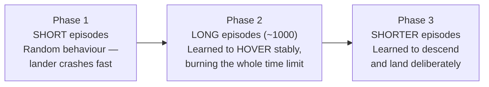

> *"Seems exactly like how a human would learn to solve this problem, isn't it? He will initially
> drop the lander multiple times, then learn to keep it stable in the air, and then slowly land."*

**Why this progression is not an accident.** The reward function makes it near-inevitable:
1. Crashing is heavily penalized → **first learn not to crash.**
2. Hovering avoids crashing and collects shaping reward → **a local optimum.**
3. But hovering burns **−0.3 per main-engine firing**, and landing pays **+100** → the fuel cost
   makes hovering strictly worse than landing, so the agent eventually **breaks out of the hover
   optimum.**

**That fuel penalty is doing essential work.** Remove it and hovering becomes a perfectly good
strategy — a live demonstration of §11's thesis that reward design determines behaviour.

**Final result:** *"wow, that was a smooth landing."*

> **The closing caution, worth taking seriously:** *"Seems very easy, right? That's because
> everything is already implemented and in place for you to use. But when you meet a new problem and
> nothing is already built for you, you will start having problems."* You get LunarLander's shaped
> reward for free. For your own problem, you will write it — which is why §11 is the most valuable
> section here.

---

## 13. Production Considerations

> Mostly **added** — the playlist is educational and doesn't cover deployment.

### 13.1 Sample efficiency and cost

RL's dominant cost is **environment interaction**.

| Setting | Cost per step | Implication |
|---|---|---|
| Fast simulator (CartPole) | Microseconds | Millions of steps are free — just run longer |
| Heavy simulator (physics, market) | Milliseconds–seconds | Compute-bound; parallelize environments |
| **Real robot** | Seconds + hardware wear + risk | **Sample efficiency is everything**; consider sim-to-real |
| **Live production system** | Real money / real users | **Off-policy from logged data (offline RL)**, never live exploration |

**Levers, cheapest first:** vectorized parallel environments · frame skipping · off-policy algorithms
(replay reuse) · prioritized replay · model-based RL · offline RL from logs.

### 13.2 Reliability and safety

The cliff-walking result (§5.6) is the production lesson in miniature: **the optimal policy may be
the dangerous one.** Q-learning's cliff-edge path is optimal and catastrophic under any perturbation.

| Concern | Mitigation |
|---|---|
| Unsafe exploration | Constrain the action space; safety layer that vetoes actions; train in sim first |
| Distribution shift | Monitor state distributions in production vs training; alert on drift |
| Silent policy degradation | Track **behavioural** metrics, not just reward — reward can rise while behaviour worsens (§11.5) |
| Non-reproducibility | Seed everything; report across ≥5 seeds; version environment + reward code together |
| Reward hacking | Prefer potential-based shaping; **review learned behaviour before shipping** |

### 13.3 Latency

Inference is one forward pass — trivially fast for the small MLPs here (microseconds). The expensive
part is **training**, which is offline. For real-time control:
- Quantize / distil the policy network.
- **Only the online network is needed at inference** — drop the target network and replay buffer.
- Discrete-action DQN inference is one `argmax` over a small vector.

### 13.4 Monitoring checklist

| Signal | Watch for |
|---|---|
| Episode return | Regression vs. deployed baseline |
| Episode length | Task-dependent — for LunarLander, *shorter* became better (§12.3) |
| **Average Q** | **Divergence — the early-warning signal (§10.5)** |
| TD-error magnitude | Sustained growth ⇒ instability |
| Action distribution | Collapse to one action ⇒ dead policy |
| ε (during training) | Confirm it decays *and* floors |

---

## 14. Common Mistakes & Best Practices

### Environment & implementation

- **Mistake:** hardcoding the action count (`randint(0, 2)`).
  **Why it's wrong:** silently disables exploration of higher-indexed actions; **nothing crashes** —
  the instructor hit this twice.
  **Do instead:** `env.action_space.sample()` or `randint(0, env.action_space.n)`.

- **Mistake:** treating **truncation** as termination.
  **Why it's wrong:** teaches the agent that surviving to the time limit is worthless — suppressing
  exactly the behaviour you want (§10.4).
  **Do instead:** store `terminated`; bootstrap through `truncated`.

- **Mistake:** `list.pop(0)` for the replay buffer.
  **Why it's wrong:** O(n) per step at 100k entries.
  **Do instead:** `collections.deque(maxlen=N)`.

- **Mistake:** softmax/sigmoid on the Q-network output.
  **Why it's wrong:** Q-values are unbounded returns, not probabilities.
  **Do instead:** `activation="linear"`.

- **Mistake:** `weights += update` on Keras variables.
  **Why it's wrong:** rebinds the Python name; the model never updates.
  **Do instead:** `.assign_add(...)`, or use an optimizer.

### Algorithm & hyperparameters

- **Mistake:** `target_update_after` too small (the video's 4).
  **Why it's wrong:** the target stops being a slow copy, reinstating the divergence feedback loop —
  **the actual cause of the video's diverging Q-values.**
  **Do instead:** 1000+ (paper uses 10,000). **Check this first when Q diverges.**

- **Mistake:** ε decaying to 0 with no floor.
  **Why it's wrong:** exploration stops permanently; if the agent hasn't succeeded yet, it never will.
  **Do instead:** `epsilon = max(epsilon * decay, 0.01)`.

- **Mistake:** MSE loss in DQN.
  **Why it's wrong:** one wild bootstrapped target produces a huge gradient that wrecks the network.
  **Do instead:** Huber loss.

- **Mistake:** evaluating with the training ε.
  **Why it's wrong:** conflates exploration cost with policy quality.
  **Do instead:** evaluate greedily (ε=0) in a separate script.

- **Mistake:** judging a change from one seed.
  **Why it's wrong:** deep RL variance across seeds routinely exceeds the effect being measured — the
  instructor's own runs flipped between success and failure with no code change.
  **Do instead:** ≥5 seeds; report median and spread.

### Reward design

- **Mistake:** rewarding *presence* in a state rather than *progress*.
  **Why it's wrong:** creates farmable loops (§11.1 Attempt 2; §11.5 Attempt A).
  **Do instead:** potential-based shaping `γΦ(s') − Φ(s)`; keep shaping negative-only where possible.

- **Mistake:** trusting a rising reward curve.
  **Why it's wrong:** the agent optimizes your reward, not your intent — reward rose while
  MountainCar behaviour got worse.
  **Do instead:** **watch the policy behave** before declaring success.

- **Mistake:** signed quantities inside a shaping difference.
  **Why it's wrong:** can't distinguish "recovering from the left" from "falling to the right."
  **Do instead:** square or take absolute values (§11.3).

### Debugging order when an agent won't learn

1. **Random agent runs?** Verify the env loop before blaming the algorithm.
2. **Is exploration alive?** Print the action distribution. (Catches the `randint` bug.)
3. **Is average Q diverging?** → `target_update_after`, then loss function, then learning rate.
4. **Is average Q flat and low?** → likely reward design; is there any signal to learn from?
5. **Does reward rise but behaviour look wrong?** → reward hacking (§11.5).
6. **Only then** tune network size, batch size, γ.

---

## 15. Exercises

### Beginner

1. Write the return for `γ = 0.9` and rewards `[1, 2, 3]`. Now `γ = 0`. What does `γ = 0` mean about
   the agent's horizon? *Success: you can state in one sentence why `γ=0` makes the agent myopic.*
2. In the driving-home table (§5.3), compute the MC and TD updates for "exit highway" with `α=1`,
   `γ=1`. *Success: you get different numbers and can explain why.*
3. Run the random agent on `CliffWalking-v0`. Why can it run forever? *Success: you reference the
   termination condition.*

### Intermediate

4. Implement tabular SARSA and Q-learning on `CliffWalking-v0`. Plot reward per episode for both.
   *Success: Q-learning's greedy path hugs the cliff; SARSA collects more reward during training.*
5. Sweep `α ∈ {0.1, 0.2, 0.5, 0.9}` for both. *Success: you reproduce SARSA destabilizing at high α
   while Q-learning tolerates it, and can explain it via target variance (§6.4).*
6. Add average-Q logging to the tabular agents (mean max-Q over a fixed state set).
   *Success: the curve rises and plateaus.*
7. Break your own DQN: set `target_update_after = 4`. *Success: you observe Q diverging and recover
   by raising it.*

### Advanced

8. Implement DQN on `CartPole-v1` from scratch. Then **fix the truncation bug** (§10.4) — store
   `terminated`, not `done`. *Success: measure whether it changes learning speed or stability.*
9. Run your DQN across 5 seeds. *Success: you produce a median-and-IQR plot and can state whether an
   apparent improvement is real.*
10. Design a **potential-based** shaped reward for MountainCar: define `Φ(s)`, emit `γΦ(s') − Φ(s)`.
    *Success: it learns faster than sparse reward and does **not** exhibit the oscillation exploit.*
11. Implement **Double DQN** (§20) and compare average-Q curves against vanilla DQN.
    *Success: you can explain the overestimation bias it removes.*

### Challenge

12. Deliberately build a reward function you *expect* to be hacked, predict the exploit in writing
    first, then train and see if the agent finds it. *Success: your written prediction matches the
    observed behaviour.*
13. Take a **partially observable** variant — CartPole with velocities removed from the observation.
    Vanilla DQN should fail. Fix it by stacking the last `k` frames. *Success: you explain the fix in
    terms of the Markov property (§4.2).*

---

## 16. Projects

### Project 1 — Beginner: Tabular RL toolkit

**Goal:** one clean library implementing MC control, SARSA, and Q-learning against any discrete Gym env.
**Concepts:** §4–6.
**Steps:** shared `TabularAgent` base → three subclasses differing only in the update → run all three
on CliffWalking and FrozenLake → comparison plots.
**Done when:** adding a new algorithm means writing one method, and MC visibly fails on a
non-terminating env (§5.2).

### Project 2 — Intermediate: Reusable DQN with experiment tracking

**Goal:** the reusable architecture the playlist explicitly recommends building, instead of
copy-pasting per environment.
**Concepts:** §7–10, §13.4.
**Steps:** config-driven `DQNAgent` (env name, net shape, hyperparameters) → deque replay buffer →
target network with configurable interval → metrics to CSV + live plotter → seeding → run unchanged
on CartPole, MountainCar, LunarLander.
**Done when:** a new environment is a config change only, and you can produce a 5-seed
median-and-IQR curve for each.

### Project 3 — Advanced: Reward-design laboratory

**Goal:** systematically study how reward design changes behaviour — the playlist's deepest lesson,
made rigorous.
**Concepts:** §11 + potential-based shaping theory.
**Steps:** pick one env; implement ≥4 rewards (sparse; naive shaped; **potential-based**;
deliberately hackable) → train 5 seeds each → log reward curves **and** behavioural metrics (steps to
goal, oscillation count) → record video of each learned policy → write up which rewards were hacked
and whether potential-based shaping prevented it.
**Done when:** you have evidence for or against the policy-invariance guarantee on your task, and at
least one documented case where **reward rose while behaviour worsened.**

---

## 17. Interview Questions

### Basic (10)

1. **What is RL, and how does it differ from supervised learning?** No labelled dataset; a scalar
   reward that may be delayed; **the data distribution depends on the policy being learned.**
2. **Define state, action, reward, policy, return, and value.** See §3 / glossary.
3. **Reward vs value?** Reward = immediate goodness. Value = expected *cumulative discounted* future
   reward. A low-reward state can have high value.
4. **What is the discount factor and why do we need it?** Weights future rewards. Guarantees a finite
   return for continuing tasks; encodes future uncertainty and preference for sooner reward.
5. **Episodic vs continuing tasks?** Terminates vs runs forever. Monte Carlo requires episodic.
6. **`V(s)` vs `Q(s,a)`?** `V` scores a state; `Q` scores an action in a state. **`Q` allows
   model-free action selection**; `V` alone does not.
7. **What is a policy? Deterministic vs stochastic?** State→action mapping; single action vs
   distribution over actions.
8. **What is the exploration–exploitation dilemma?** Trying unknown actions vs using known-good ones.
9. **How does ε-greedy work, and why decay ε?** Random with prob. ε, else greedy. Decay shifts from
   exploring to exploiting — **but floor it, or exploration dies.**
10. **State vs observation?** State is the environment's internal condition; observation is what the
    agent perceives. Equal only in fully observable environments.

### Intermediate (10)

11. **What is an MDP, and what is the Markov property?** Formal framework `p(s',r|s,a)`; the future is
    independent of the past given the present.
12. **Give a case where the Markov property fails and how to fix it.** A single frame hides velocity.
    Fix: stack frames, add velocity to the state, or use memory.
13. **State the Bellman equation and why it matters.** `V(s) = E[r + γV(s')]`. Converts an infinite
    sum into a one-step recursion — the basis of every algorithm here.
14. **Model-based vs model-free?** Whether a predictive model of dynamics is used. Model-based is
    more sample-efficient but suffers model error.
15. **Compare DP, Monte Carlo, and TD.** DP: needs a model, sweeps all states. MC: model-free, learns
    only at episode end, unbiased. TD: model-free, learns online, bootstrapped (biased, lower
    variance).
16. **What is bootstrapping?** Updating an estimate toward a target built from your own current
    estimate.
17. **Why is TD "truly online" and MC not?** TD updates after one transition; MC must wait for
    termination. *Use the traffic-jam example (§5.3).*
18. **SARSA vs Q-learning — the exact difference?** The target: SARSA uses `Q(s',a')` for the
    ε-greedily chosen `a'`; Q-learning uses `max_a' Q(s',a')`. That `max` makes it off-policy.
19. **In cliff walking, why does SARSA collect more reward but Q-learning learn the better policy?**
    Q-learning finds the optimal cliff-edge path; ε-greedy exploration occasionally pushes it off.
    SARSA's targets price in exploration risk, so it keeps a safety margin.
20. **On-policy vs off-policy — and why does it matter practically?** Whether the policy being
    learned is the one acting. **Off-policy enables replay/data reuse — the reason DQN uses
    Q-learning.** *Push back on "off-policy is simply better" (§5.5).*

### Advanced (10)

21. **Why do tables fail, and what does function approximation buy?** No scaling, no continuous
    states, no generalization. Approximation gives compact storage + generalization — at the cost of
    interference between states.
22. **Why "semi-gradient" rather than "gradient" methods?** The bootstrapped target depends on the
    parameters, but we ignore that dependence — so it isn't the true gradient of any loss.
23. **What is the deadly triad?** Function approximation + bootstrapping + off-policy learning. Any
    two are safe; all three can diverge. **This explains Video 4's failure.**
24. **Name the problems with naive online deep Q-learning.** Correlated samples; single-sample
    updates; samples discarded after one use; no convergence guarantee with non-linear approximation.
25. **How does experience replay help — three distinct ways?** Breaks correlation; enables reuse;
    enables mini-batches.
26. **Why does experience replay require off-policy learning?** The buffer holds data from older
    policies. Also: on-policy, the current parameters determine the next data distribution, which can
    lock into a local optimum.
27. **What is the target network and why does it stabilize training?** A slow copy `θ⁻` that computes
    targets, breaking the loop where raising `Q(s)` raises the target via `Q(s')`.
28. **What happens if the target update interval is too small?** It stops being a slow copy and
    divergence returns — the video's `C=4` bug.
29. **Why Huber over MSE in DQN?** Bounds the gradient from occasional wildly-wrong bootstrapped
    targets.
30. **What is reward hacking, with a concrete example, and how do you prevent it?** The agent
    maximizes the reward as written, not your intent — MountainCar oscillating to farm a velocity
    bonus. Prevent with **potential-based shaping** `γΦ(s')−Φ(s)`, negative-only shaping, and
    **inspecting behaviour rather than reward curves.**

### System design (7)

31. **Design an RL system to reduce data-centre cooling cost.** State: temperatures, loads, weather,
    setpoints. Actions: setpoint adjustments. Reward: −energy, with **hard safety constraints** on
    temperature. Discuss: offline RL from historical logs, a safety layer vetoing unsafe actions,
    sim-to-real, and why live exploration is unacceptable.
32. **Design a recommender using RL. Why is it hard?** Reward: long-term engagement, not clicks —
    delayed and confounded. Off-policy evaluation from logged data is essential (can't A/B every
    policy). Discuss feedback loops and filter bubbles as **reward hacking at scale.**
33. **Ship a robot arm policy trained in simulation.** Sim-to-real gap; domain randomization; safety
    envelope; sample cost; the cliff-walking lesson — the optimal policy may have no safety margin.
34. **You have 6 months of logged decisions and no simulator. How do you use RL?** **Offline RL.**
   Discuss distribution shift, why naive off-policy methods over-estimate out-of-distribution
   actions, conservative/constrained methods, and off-policy evaluation before deployment.
35. **Your DQN's reward rises but users complain. Diagnose.** Reward hacking, or a reward
    misspecifying the true objective. Inspect behaviour; check for farmable loops; add behavioural
    metrics; consider whether the reward measures a proxy (§11.5, §13.4).
36. **How would you monitor a deployed RL policy?** Return, episode length, **average Q for
    divergence**, TD-error magnitude, action-distribution collapse, state-distribution drift vs
    training, plus task-specific behavioural metrics.
37. **Choose between DQN, PPO, and SAC for a task with continuous actions.** DQN is out — it requires
    discrete actions (`argmax` over a finite set). PPO (on-policy, stable, sample-hungry) vs SAC
    (off-policy, sample-efficient, more tuning). Decide on interaction cost.

---

## 18. Final Summary

**The arc:** RL is learning from interaction and a scalar reward with no static dataset. Formalize it
as an **MDP**; the **Markov property** makes it tractable; the **Bellman equation** turns an infinite
sum into a one-step recursion. Three classical families exploit that recursion — **DP** (needs a
model, sweeps everything), **Monte Carlo** (model-free, episode-end, unbiased), and **TD**
(model-free, online, bootstrapped). TD gives **SARSA** (on-policy, cautious) and **Q-learning**
(off-policy, optimal-but-riskier) — a difference of exactly one term, visible as two different paths
in cliff walking.

Tables don't scale, so swap in a **neural network**. Naively, this fails completely — and the reason
is the **deadly triad**: function approximation + bootstrapping + off-policy. **DQN** patches it:
**experience replay** (breaks correlation, enables reuse and batching) and a **target network**
(freezes the bootstrap source). Getting it to actually work needs Huber loss, a target-update
interval orders of magnitude larger than the naive guess, and honest attention to seed variance.

Finally — and this is the lesson most tutorials skip — **the reward function determines behaviour
more than the algorithm does.** `−1` per step encodes urgency and exploration for free. Shaped
rewards learn faster but invite **reward hacking**: MountainCar's agent farmed an oscillation bonus
and deliberately finished *late*, doing exactly what the reward said. Rewriting the reward to be
negative-only cut training from ~1200 to ~350 episodes **and** fixed the behaviour.

**The three things to carry away:**

1. **The deadly triad** explains why deep RL is unstable, and every DQN component is a patch on it.
2. **Reward design is engineering, not an afterthought.** Prefer potential-based shaping; assume
   anything farmable will be farmed.
3. **Watch behaviour, not reward curves.** Reward went up while the MountainCar policy got worse.

---

## 19. Glossary

| Term | Meaning | Why It Matters |
|---|---|---|
| **Agent** | The learner and decision-maker | The thing you're training |
| **Environment** | Everything outside the agent | Defines the problem |
| **State (`s`)** | The environment's internal condition | Input to policy and value functions |
| **Observation** | What the agent perceives | Equals state only in fully observable envs |
| **Action (`a`)** | What the agent does | The only lever the agent has |
| **Reward (`r`)** | Scalar feedback for a transition | **Defines the goal** — the only supervision |
| **Return (`G`)** | Total discounted future reward from a step | What the agent actually maximizes |
| **Discount factor (`γ`)** | Weight on future rewards, 0–1 | Keeps returns finite; sets the effective horizon |
| **Policy (`π`)** | Mapping states → actions | *Is* the agent's behaviour; the learning target |
| **Value function `V(s)`** | Expected return from state `s` | Long-run goodness vs immediate reward |
| **Action-value `Q(s,a)`** | Expected return from action `a` in `s` | **Enables model-free action selection** |
| **Episodic / continuing** | Task terminates / runs forever | Monte Carlo needs episodic |
| **Fully / partially observable** | Observation reveals all / part of state | Partial observability needs memory or frame stacking |
| **MDP** | Markov Decision Process — `p(s',r\|s,a)` | The formal framework for all of RL |
| **Markov property** | Future depends only on present, not history | Makes learning tractable |
| **POMDP** *(added)* | Partially Observable MDP | The formal name for the partially observable case |
| **Model** | Predicts next state and reward | Splits RL into model-based vs model-free |
| **Bellman equation** *(added — used but unnamed in the videos)* | `V(s) = E[r + γV(s')]` | Turns an infinite sum into a one-step recursion — the basis of every algorithm |
| **Exploration / exploitation** | Try unknown vs use known-good | The central tension in RL |
| **ε-greedy** | Random with prob. ε, else greedy | The standard exploration strategy |
| **Step size (`α`)** | How much of the TD error to apply | Too large diverges, too small crawls |
| **Policy evaluation** | Compute `V^π` for a fixed policy | The "prediction problem" |
| **Policy improvement** | Act greedily w.r.t. values | The "control problem" |
| **Policy iteration / GPI** | Alternate evaluation and improvement | The pattern under nearly every RL algorithm |
| **Dynamic Programming** | Solve via full model sweeps | Foundational, but needs a model and doesn't scale |
| **Monte Carlo** | Learn from complete sampled episodes | Unbiased; can't handle non-terminating tasks |
| **First-visit MC** | Only the first occurrence of a state counts | Cleaner convergence theory |
| **Temporal Difference (TD)** | Update after one step using your own estimate | *The* central idea in RL; truly online |
| **Bootstrapping** | Using your own estimate in the target | Enables online learning; a leg of the deadly triad |
| **TD error (`δ`)** | `r + γV(s') − V(s)` | The learning signal; resembles dopamine firing |
| **n-step methods** | Use `n` real rewards, then bootstrap | Interpolates MC and TD |
| **SARSA** | On-policy TD control | Learns a cautious, exploration-aware policy |
| **Q-learning** | Off-policy TD control using `max` | The most widely used RL algorithm |
| **On-policy** | Learn about the policy you're following | More stable; can't reuse old data |
| **Off-policy** | Learn about a different policy than you follow | **Enables replay** — but less stable |
| **Behaviour / target policy** | The policy acting / the policy being learned | The off-policy distinction |
| **Function approximation** | Parameterized `v(s,w)` instead of a table | Scales to large/continuous states; generalizes |
| **Gradient** | Direction of steepest ascent | Enables learning by descending a loss |
| **Semi-gradient method** | Ignores the target's parameter dependence | Not a true gradient — a root cause of instability |
| **Deadly triad** *(added)* | Approximation + bootstrapping + off-policy | **The** explanation for deep RL divergence |
| **DQN** | Deep Q-Network — the *network*; algorithm is Deep Q-Learning | The 2013/2015 breakthrough |
| **Experience replay** | Buffer of past transitions, sampled randomly | Breaks correlation, enables reuse and batching |
| **Target network (`θ⁻`)** | Slow copy used to compute targets | Prevents the chasing-your-own-tail divergence |
| **Huber loss** | Quadratic near 0, linear beyond δ | Bounds gradients from wild bootstrapped targets |
| **Average-Q metric** | Mean max-Q over a fixed state set | **Early warning for divergence** |
| **`terminated` / `truncated`** *(added)* | Genuine end / cut off by time limit | Different bootstrapping — conflating them is a real bug |
| **Sparse reward** | Useful reward arrives rarely | Slow learning; hard exploration |
| **Shaped (dense) reward** | Smooth signal as the agent approaches the goal | Faster learning; risks reward hacking |
| **Reward hacking** | Maximizing the reward as written, not as intended | The MountainCar oscillation exploit; core AI-safety concern |
| **Potential-based shaping** *(added)* | `γΦ(s') − Φ(s)` | **Provably preserves the optimal policy** — prevents hacking |

---

## 20. Further Learning

**Recommended in the playlist:**

- **Sutton & Barto, *Reinforcement Learning: An Introduction*** — the standard text. *"All of the
  algorithms prior to DQN were taken from this book."* Free online.
- **Continuous action spaces** — everything here uses **discrete** actions (DQN needs `argmax` over a
  finite set). Continuous control needs **policy gradient** methods, which learn a policy directly,
  or **actor–critic**, which learns both.
- **Reusable architectures** — the videos copy-paste code per environment and explicitly recommend
  building something reusable (Project 2).
- **Self-play** — agents learning multiplayer games by playing themselves (AlphaGo's engine).
- **Hierarchical RL** — decompose a problem into sub-problems.

**Added — the natural next steps after DQN:**

| Topic | Why next |
|---|---|
| **Double DQN** | Vanilla DQN's `max` **over-estimates** Q-values (the max of noisy estimates is biased upward). Double DQN decouples action *selection* from *evaluation*. A small change, a real improvement. |
| **Dueling DQN** | Separate state-value and advantage streams — helps when many actions are equally good |
| **Prioritized Experience Replay** | Sample surprising transitions (high TD error) more often — better sample efficiency |
| **Rainbow DQN** | Combines the major DQN improvements; the standard strong baseline |
| **REINFORCE → A2C → PPO** | The policy-gradient line. **PPO is the default choice in most production RL today**, including RLHF for LLMs |
| **DDPG / TD3 / SAC** | Off-policy continuous control; **SAC** is the usual strong default |
| **Offline RL** (CQL, IQL) | Learn from logged data with no environment interaction — the realistic setting for most business problems |
| **Potential-based shaping** (Ng et al. 1999) | The theory §11 needed |
| **Stable-Baselines3** | Reliable reference implementations — check your from-scratch results against them |

> **For LLM engineers:** RLHF/RLAIF apply exactly this machinery — a reward model supplies the reward,
> PPO (a policy-gradient method) optimizes the policy. **Reward hacking (§11.5) is the same problem
> as reward-model over-optimization**, and potential-based shaping intuitions transfer directly.

---

## 21. Dependency Map

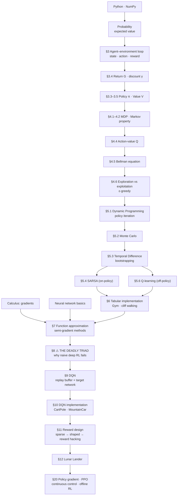

**Suggested route:** §1–4 in one sitting (theory) → §5 carefully → **§6 hands-on before continuing**
→ §7–8 (§8 is the conceptual pivot of the whole tutorial) → §9–10 hands-on → **§11 slowly; it's the
highest-leverage section** → §12 → §15/§16.
