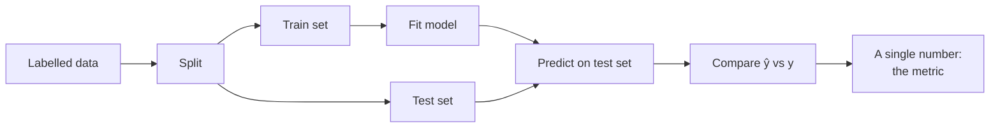
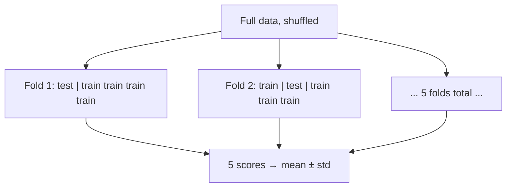

# 1 · Foundations — What "Evaluation" Actually Means

> **Prerequisite chapter.** The playlist opens with *"you've applied a regression algorithm — how do you know how good it is?"* and goes straight to formulas. That question hides four ideas you need first: why training error is worthless, what a held-out set buys you, how a *loss function* differs from an *evaluation metric*, and why there is no single best metric. This chapter supplies them. Nothing here is a summary of the videos; it is the floor they stand on.

---

## 1.1 The problem in one picture

You fit a model. It produces numbers. Are they any good?



Every metric in this module is a different answer to the box labelled **"compare ŷ vs y"**. That is genuinely all a metric is: a function that eats two vectors — the truth `y` and your predictions `ŷ` — and returns one scalar you can rank models by.

```python
metric(y_true, y_pred) -> float
```

The entire difficulty is that **many different scalars can be computed from the same two vectors, and they disagree about which model is better.** Choosing among them is a modelling decision, not a formality.

---

## 1.2 Why you may never evaluate on training data

A model that memorises its training set scores perfectly on it and can be useless. The classic demonstration: a 1-nearest-neighbour classifier gets **100% training accuracy on any dataset**, always, because the nearest neighbour of a training point is itself. Its training accuracy tells you nothing about anything.

So we hold data back.

| Split | Purpose | Touched during |
|---|---|---|
| **Train** | fit parameters | fitting |
| **Validation** | choose hyperparameters, select models, pick thresholds | tuning |
| **Test** | final, one-shot estimate of generalisation | reporting only |

**Why three and not two:** every time you look at a set and change something because of what you saw, you leak information into your model. Tune on the test set and your test score becomes a training score in disguise — optimistically biased, and you have no clean estimate left. The test set is a bullet you get to fire once.

> ### ⚠️ Important Note
> The playlist computes every metric on a single train/test split (`train_test_split`, then `metric(y_test, y_pred)`). That is fine for teaching a formula and is what you'll see in the code sections here too. It is **not** a reliable way to compare two models. A single split of a few hundred rows has enough sampling noise to reverse a model ranking. For any real comparison use **k-fold cross-validation** — see §1.5.

### The one non-negotiable rule: fit transforms on train only

```python
# WRONG — the scaler has seen the test set's mean and variance
X_scaled = StandardScaler().fit_transform(X)          # leak
X_tr, X_te, y_tr, y_te = train_test_split(X_scaled, y)

# RIGHT — fit on train, apply to test
X_tr, X_te, y_tr, y_te = train_test_split(X, y, test_size=0.2, random_state=42)
sc = StandardScaler().fit(X_tr)                        # learns from train only
X_tr, X_te = sc.transform(X_tr), sc.transform(X_te)
```

This applies to *every* fitted preprocessing step: scalers, imputers (the mean used to fill missing values is learned!), encoders, feature selectors, PCA, target encoders. The clean way to make this structurally impossible is an sklearn `Pipeline` — covered in [`24_xgboost/07-practical-implementation.md`](../24_xgboost/07-practical-implementation.md).

---

## 1.3 Loss function vs. evaluation metric — the distinction the videos blur

The regression video says of MAE *"the modulus function is not differentiable, that's the biggest problem, which is why MSE had to come"*. That sentence is true about **loss functions** and irrelevant to **metrics**, and the video does not draw the line. Draw it now, because it removes most of the confusion around MAE vs MSE.

| | **Loss function** | **Evaluation metric** |
|---|---|---|
| Consumed by | the optimiser, during training | a human or a model-selection loop, after training |
| Must be differentiable? | usually **yes** (for gradient-based methods) | **no** — never |
| Computed on | training batches | held-out data |
| Optimised? | yes, directly | no, only reported |
| Example | MSE inside `LinearRegression` | MAE, R², precision, F1 |

**The consequences:**

- **Non-differentiability is not a defect in a metric.** MAE is a perfectly good metric. Accuracy, precision, recall, and F1 are all non-differentiable and piecewise-constant — you cannot do gradient descent on them, and nobody cares, because you don't train on them.
- **The two need not match, and often shouldn't.** You can train with MSE (smooth, convenient) and report MAE (interpretable). You can train a classifier with log loss (smooth) and select on F1 (what the business cares about). Training on a proxy and evaluating on the real objective is standard practice.
- **When it does matter:** if you *do* want to optimise MAE directly, use a solver that doesn't need smoothness at the kink — quantile/L1 regression via linear programming, or a gradient-boosting library with an MAE objective (`objective="reg:absoluteerror"` in XGBoost, `objective="l1"` in LightGBM). Tree-based learners don't do gradient descent on inputs, so the kink is a non-issue for them.

> **Mental model:** the loss function is the *steering wheel* the optimiser turns; the metric is the *scoreboard* you get judged on. A driving instructor can grade you on "did you arrive safely" even though that grade isn't what your hands are doing moment to moment.
>
> *Where the analogy breaks:* the optimiser genuinely cannot see the scoreboard. If the loss and the metric are badly misaligned — training on MSE when the business is scored on relative error — the optimiser will confidently drive somewhere you didn't want to go. Misalignment is silent. Nothing warns you.

---

## 1.4 There is no universally best metric

The regression video makes this point in passing — *"if one metric were enough you'd only use that one; on some data one metric works better and on other data another"* — and then, more sharply, in the accuracy video, via an interview story: a student asked *"what accuracy should a model have?"* answered "98%", and was wrong. **The only correct answer is "it depends on the problem."**

The video's own examples, which are the right ones:

| System | 99% accurate is… | Why |
|---|---|---|
| Cancer detection from chest X-rays | **unacceptable** | 1 in 100 patients misdiagnosed; a missed cancer kills someone |
| Self-driving car steering left/right | **unacceptable** | 1 wrong decision per 100 is a crash |
| Predicting whether a user orders food this weekend | **fine, and so is 80%** | a wrong guess costs a wasted push notification |

The variable is not the number. It is **the cost of being wrong**, and that lives in the domain, not in the data.

### The three questions that pick your metric

1. **Is the target a number or a category?** → regression metrics (Ch. 2–3) or classification metrics (Ch. 4–6).
2. **Are the two kinds of mistake equally bad?** → if no, you need precision/recall, not accuracy (Ch. 5).
3. **Do you need a ranking, a probability, or a hard label?** → AUC, calibration, or threshold metrics respectively (Ch. 7).

---

## 1.5 Cross-validation in one page

Because a single split is noisy, evaluate across several.



```python
from sklearn.model_selection import cross_val_score, KFold, StratifiedKFold

# Regression — plain KFold
cv = KFold(n_splits=5, shuffle=True, random_state=42)
scores = cross_val_score(model, X, y, cv=cv, scoring="neg_mean_absolute_error")
print(f"MAE = {-scores.mean():.3f} ± {scores.std():.3f}")

# Classification — ALWAYS stratify, so each fold keeps the class ratio
cv = StratifiedKFold(n_splits=5, shuffle=True, random_state=42)
scores = cross_val_score(model, X, y, cv=cv, scoring="f1")
```

**Report the standard deviation.** "MAE 0.31 ± 0.02" and "MAE 0.31 ± 0.15" are completely different claims, and the second one means you cannot distinguish your model from a slightly worse one.

**Note the `neg_` prefix.** sklearn's convention is that *higher is better* for everything in `scoring`. Error metrics are therefore negated: `neg_mean_absolute_error`, `neg_mean_squared_error`, `neg_root_mean_squared_error`. Forgetting the sign flip and reporting a negative MAE is one of the most common beginner bugs.

> ### ⚠️ Important Note — when random splitting is wrong
> `shuffle=True` assumes your rows are exchangeable. Two cases where it silently inflates every score in this module:
> - **Time series.** Shuffling lets the model train on the future and predict the past. Use `TimeSeriesSplit`.
> - **Grouped data** (multiple rows per patient, user, or device). Shuffling puts the same entity in train and test. Use `GroupKFold`.

---

## 1.6 Notation used throughout this module

| Symbol | Meaning |
|---|---|
| $n$ | number of observations in the set being scored |
| $y_i$ | the true value for observation $i$ |
| $\hat{y}_i$ | the model's prediction for observation $i$ |
| $\bar{y}$ | the mean of the true values |
| $e_i = y_i - \hat{y}_i$ | the **residual** — signed error. Positive = model under-predicted |
| $k$ | number of independent (input) columns |
| TP, FP, FN, TN | confusion-matrix cells (Ch. 4) |

**Sign convention for residuals.** This module uses $y - \hat{y}$ (truth minus prediction) throughout, which is what the playlist uses and what gradient-boosting derivations assume. Some textbooks use $\hat{y} - y$. It never matters for MAE/MSE/RMSE — the sign is destroyed by the absolute value or the square — but it flips the sign of every residual plot, so state your convention.

---

## 1.7 The running example

The playlist reuses one toy dataset across all three videos, and so does this module. It is worth keeping in your head:

- **Regression:** `placement.csv` — input **CGPA**, target **package in LPA** (lakhs per annum). Roughly linear, one feature. Used for MAE/MSE/RMSE/R².
- **Binary classification:** students' **CGPA + IQ → placed (1) or not (0)**, and the `heart.csv` heart-disease dataset. Used for accuracy and the confusion matrix.
- **Multiclass:** the **iris** dataset (3 classes) and **MNIST** digits (10 classes). Used for multiclass confusion matrices and averaging.

The unit of the target is the point of the exercise. "My model is off by 1.5" is meaningless. "My model is off by 1.5 LPA" is a fact a hiring manager can act on. Chapter 2 is built entirely around that observation.

---

## Common Mistakes

> - **Mistake:** reporting training-set scores → **Why it's wrong:** the model has already seen those labels; the score measures memorisation, not generalisation, and a 1-NN model scores 100% on any dataset → **Do instead:** always score on data withheld from fitting; report cross-validated mean ± std.
> - **Mistake:** scaling, imputing, or encoding before the split → **Why it's wrong:** the transform's learned statistics (mean, variance, category list) absorb test-set information, so your test score is optimistic by an amount you cannot measure → **Do instead:** fit every transform inside a `Pipeline` so it can only ever see the training fold.
> - **Mistake:** tuning hyperparameters against the test set → **Why it's wrong:** repeated peeking turns the test set into a training set; with enough trials you will find a configuration that fits its noise → **Do instead:** tune on a validation set or inner CV loop, touch the test set once at the end.
> - **Mistake:** rejecting MAE because "it isn't differentiable" → **Why it's wrong:** differentiability is a requirement on *loss functions* consumed by gradient-based optimisers, not on metrics you merely report → **Do instead:** pick the metric for interpretability and cost-alignment; pick the loss for optimisability; let them differ.
> - **Mistake:** answering "what accuracy is good?" with a number → **Why it's wrong:** the threshold is set by the cost of error in the domain — 99% is superb for food-order prediction and negligent for cancer screening → **Do instead:** answer "it depends on the cost of each error type in this problem," then name the errors.
> - **Mistake:** shuffling time-series or grouped data into folds → **Why it's wrong:** the model trains on the future or on the same entity it is tested on, inflating every metric → **Do instead:** `TimeSeriesSplit` for temporal data, `GroupKFold` when rows share an entity.

---

## Exercises

**Beginner.** In one sentence each, state whether differentiability matters for (a) the function `LinearRegression` minimises, (b) the number you put in a report. *Success criterion:* you correctly identify that only (a) requires it, and can say why.

**Intermediate.** Take any regression dataset. Compute MAE on the training set and on a held-out test set. Then replace the model with `KNeighborsRegressor(n_neighbors=1)` and recompute both. *Success criterion:* training MAE for 1-NN is exactly 0.0 while test MAE is large, and you can explain the 0.0 without running the code.

**Advanced.** Build a leakage bug on purpose: scale with `StandardScaler` *before* `train_test_split` on a dataset of ~200 rows, and compare the test R² against the correct pipeline version, across 50 different `random_state` values. *Success criterion:* you can report the mean size of the optimistic bias and say whether it is large enough to change a model-selection decision.

**Challenge.** You are asked to evaluate a model that predicts hospital readmission within 30 days. Rows are patient *visits*; the same patient may appear many times; the data spans three years; only 8% of visits end in readmission. Specify the complete evaluation protocol — splitting strategy, cross-validation scheme, primary metric, and what you would report alongside it — and justify every choice against a specific failure it prevents. *Success criterion:* your protocol addresses grouping, time, and imbalance separately, and you can name the metric you would *refuse* to use and why.

---

**Next:** [2 · Regression Metrics — MAE, MSE, RMSE](02-regression-metrics-mae-mse-rmse.md)
