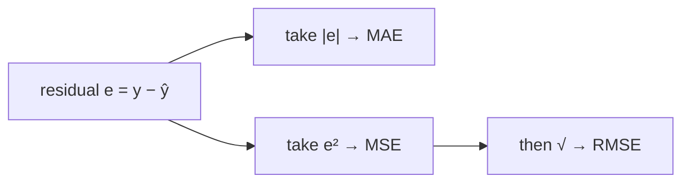
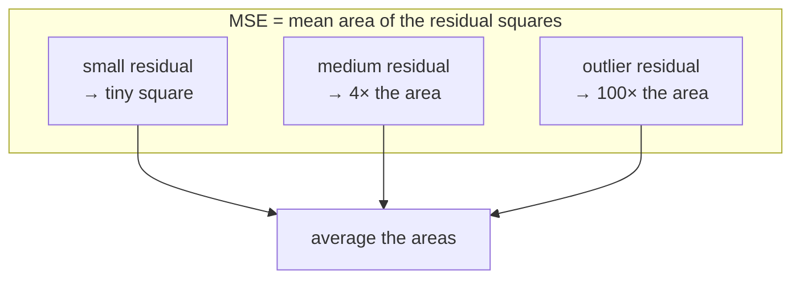

# 2 · Regression Metrics — MAE, MSE, RMSE

> **Source:** Video 1 — *Regression Metrics | MSE, MAE & RMSE | R² Score & Adjusted R² Score* (first half)

Three metrics, one residual. All three ask *"how far is $\hat{y}$ from $y$?"* and differ only in how they punish distance. That single design choice — linear vs. quadratic punishment — determines everything else about them: their units, their outlier behaviour, and whether an optimiser can use them.

---

## 2.1 The residual: the only raw material

For each observation, the model's mistake is

$$e_i = y_i - \hat{y}_i$$

Geometrically, on a scatter plot with the regression line drawn through it, $e_i$ is the **vertical** distance from the point to the line — vertical, not perpendicular, because we only care about error in the target.



We cannot simply average the raw residuals: positive and negative errors cancel, and for any model fitted by least squares with an intercept the mean residual is **exactly zero** by construction. A model that is wildly wrong in both directions would score a perfect 0. So we must destroy the sign first — with a modulus, or with a square. That fork is this whole chapter.

---

## 2.2 MAE — Mean Absolute Error

$$\text{MAE} = \frac{1}{n}\sum_{i=1}^{n} \left| y_i - \hat{y}_i \right|$$

| Facet | MAE |
|---|---|
| **What** | The average size of the mistake, ignoring direction. If MAE = 1.5 LPA, the model is off by 1.5 LPA on a typical candidate. |
| **Why** | You need a single number in the *same unit as the target* so a non-specialist can act on it. This is the only metric in the chapter you can put in a slide without a footnote. |
| **How** | Sum the absolute residuals, divide by $n$. Each error contributes in proportion to its size — an error of 10 counts exactly ten times an error of 1. |
| **When to use** | Reporting to stakeholders; data with outliers you consider *legitimate* (real extreme salaries, genuine spikes in demand); when the cost of error grows roughly linearly with its size. |
| **When NOT to use** | As a loss for a gradient-descent learner without a subgradient-aware solver (the kink at zero). When large errors are disproportionately catastrophic — MAE deliberately under-weights them. |
| **Trade-offs** | Buys interpretability and outlier-robustness; gives up smoothness, and gives up sensitivity to the rare huge miss that may be the one that matters. |
| **Example** | Predicted packages [3.2, 3.4, 4.1, 4.3, 5.0] against actual [3.0, 3.5, 4.0, 4.5, 8.0] → residuals [−0.2, +0.1, −0.1, +0.2, +3.0] → MAE = 3.6 / 5 = **0.72 LPA**. |

**On "MAE is robust to outliers".** The video's phrasing is that MAE handles outliers better and MSE "goes mad". Be precise about what that means: MAE is *less influenced*, not *immune*. In the worked example above, deleting the single outlier moves MAE from 0.72 to 0.15 — a factor of **4.8**. It moves RMSE from 1.349 to 0.158 — a factor of **8.5**. MAE is hurt roughly half as much. Both are hurt.

> **The differentiability question, settled.** $|e|$ has no derivative at $e = 0$; its subgradient jumps from $-1$ to $+1$. This is a real obstacle for plain gradient descent and the reason MSE became the default *training* objective for linear models. It is **not** a reason to avoid MAE as a *reported metric* — see §1.3. And it is a non-issue for tree ensembles, which don't differentiate with respect to inputs at all.

---

## 2.3 MSE — Mean Squared Error

$$\text{MSE} = \frac{1}{n}\sum_{i=1}^{n} \left( y_i - \hat{y}_i \right)^2$$

### The geometric picture the video draws

For each point, erect a square whose side is the residual. MSE is the **average area** of those squares. Fitting by least squares is literally shrinking the total area of a set of squares hanging off the line.



That picture explains the outlier behaviour immediately and without algebra: doubling a residual **quadruples** its contribution. A residual ten times the typical size contributes a hundred times as much. One bad point can dominate the sum.

| Facet | MSE |
|---|---|
| **What** | The average squared residual. In the example: 9.10 / 5 = **1.82 LPA²**. |
| **Why** | It is smooth and convex everywhere, so it can be minimised in closed form (the normal equations) or by gradient descent. It is the reason linear regression has an analytical solution at all. |
| **How** | Square each residual, average. Squaring both removes the sign and applies quadratic punishment. |
| **When to use** | As a **loss function** — this is its real job. Also when large errors genuinely are disproportionately expensive (structural load prediction, dosage, anything with a cliff). |
| **When NOT to use** | As the number you report. Its unit is the target's unit *squared* — "1.82 LPA²" is not a quantity anyone has intuition for. Also when your data has recording errors you don't want the model chasing. |
| **Trade-offs** | Buys differentiability and a unique minimum; gives up interpretability entirely, and buys a strong sensitivity to outliers that is a feature in some domains and a bug in most. |
| **Example** | Same data as above → MSE = 1.82; note that 9.0 of the 9.10 total comes from the *single* outlier. 99% of the metric is one point. |

> ### ⚠️ Important Note
> Because squaring is a monotone transform on non-negative numbers, **MSE and RMSE always rank models identically.** They can never disagree about which of two models is better. Reporting both adds no information — pick RMSE for humans, keep MSE for the optimiser. Where MSE and MAE *can* and do disagree is the interesting case, and it is always about outliers.

---

## 2.4 RMSE — Root Mean Squared Error

$$\text{RMSE} = \sqrt{\frac{1}{n}\sum_{i=1}^{n}\left(y_i - \hat{y}_i\right)^2}$$

RMSE exists for exactly one reason: to undo MSE's unit problem while keeping its quadratic weighting.

| Facet | RMSE |
|---|---|
| **What** | The square root of MSE. In the example: √1.82 = **1.349 LPA**. |
| **Why** | You want MSE's behaviour (heavy punishment of large errors, differentiable) *and* a number in the target's own unit. RMSE is the compromise, and it is why RMSE is the default reported regression metric in deep learning and on most Kaggle leaderboards. |
| **How** | Compute MSE, take the square root. The root restores the unit; it does **not** restore robustness. |
| **When to use** | Default choice for reporting when large errors matter more than small ones. Comparing across models on the same target. |
| **When NOT to use** | When you want the *typical* error rather than a large-error-weighted one — use MAE. Across datasets with different target scales — use R² (Ch. 3) or a relative metric (§2.7). |
| **Trade-offs** | Interpretable unit and outlier sensitivity together. Still not robust; still not directly minimisable at the same time as being a percentage. |
| **Example** | The 8.5× blow-up from one outlier shown in §2.2 is RMSE's, not MSE's — the root shrinks the number but not the *relative* damage. |

### The relationship worth memorising

**RMSE ≥ MAE, always.** Equality holds only if every residual has identical magnitude. The gap between them is a free diagnostic:

| Observation | Interpretation |
|---|---|
| RMSE ≈ MAE | errors are uniform in size; no dominant outliers |
| RMSE ≫ MAE | a few large errors dominate — go look at them |

In the worked example RMSE/MAE = 1.349/0.72 = **1.87**, which is your signal that something extreme is in the data. Computing both and looking at the ratio costs nothing and is the fastest outlier detector in this module.

---

## 2.5 Side by side

| | MAE | MSE | RMSE |
|---|---|---|---|
| Formula | $\frac{1}{n}\sum\lvert e_i\rvert$ | $\frac{1}{n}\sum e_i^2$ | $\sqrt{\frac{1}{n}\sum e_i^2}$ |
| Unit | target | target² | target |
| Interpretable to a stakeholder | ✅ | ❌ | ✅ |
| Differentiable everywhere | ❌ (kink at 0) | ✅ | ✅ |
| Outlier sensitivity | moderate | very high | high |
| Usable as a training loss | with an L1-aware solver | ✅ natural choice | ✅ |
| Worked example value | 0.72 | 1.82 | 1.349 |
| Same example, outlier removed | 0.15 | 0.025 | 0.158 |
| Blow-up factor from one outlier | 4.8× | 72.8× | 8.5× |

**The one-line advice from the video, which is correct:** compute all three. They are three lines of code, they cost nothing, and their disagreements are informative.

---

## 2.6 Code

```python
# Dependencies: scikit-learn >= 1.4, numpy, pandas
import numpy as np, pandas as pd
from sklearn.model_selection import train_test_split
from sklearn.linear_model import LinearRegression
from sklearn.metrics import mean_absolute_error, mean_squared_error, root_mean_squared_error

df = pd.read_csv("placement.csv")          # columns: cgpa, package
X = df[["cgpa"]]                            # 2-D: sklearn wants (n_samples, n_features)
y = df["package"]                           # 1-D

X_tr, X_te, y_tr, y_te = train_test_split(X, y, test_size=0.2, random_state=42)

model = LinearRegression().fit(X_tr, y_tr)
y_pred = model.predict(X_te)

mae  = mean_absolute_error(y_te, y_pred)
mse  = mean_squared_error(y_te, y_pred)
rmse = root_mean_squared_error(y_te, y_pred)   # sklearn >= 1.4

print(f"MAE  {mae:.4f} LPA")
print(f"MSE  {mse:.4f} LPA²")
print(f"RMSE {rmse:.4f} LPA   (ratio to MAE: {rmse/mae:.2f})")
```

**Expected shape of the output** on this dataset: MAE around 0.2 LPA, MSE around 0.12 LPA², RMSE around 0.35 LPA — a well-behaved, nearly linear dataset where RMSE/MAE sits near 1.5. (The video demonstrates these live; the exact figures below the second decimal are not reliably recoverable from the auto-captions, so treat them as the right order of magnitude rather than as quoted results.)

> ### 🔧 Modern Approach
> The video computes RMSE as `np.sqrt(mean_squared_error(...))`, and older tutorials use `mean_squared_error(..., squared=False)`. As of **scikit-learn 1.4** there is a first-class `root_mean_squared_error`, and the `squared=` parameter is deprecated — it was removed in 1.6. Use `root_mean_squared_error`; fall back to `np.sqrt(...)` only if you are pinned to an older version.

### Why `X = df[["cgpa"]]` and not `df["cgpa"]`

Single brackets give a `Series` of shape `(n,)`; sklearn estimators require a 2-D `(n_samples, n_features)` array and will raise `ValueError: Expected 2D array, got 1D array instead`. Double brackets give a `DataFrame` of shape `(n, 1)`. This is the single most common error when following along with a one-feature example.

---

## 2.7 Regression metrics the playlist doesn't cover (but you will need)

The video covers the three above plus R². Four more come up constantly in real work; none is hard once you have the residual.

| Metric | Formula | Use it when |
|---|---|---|
| **MAPE** — mean absolute percentage error | $\frac{100}{n}\sum\left\lvert \frac{y_i-\hat{y}_i}{y_i}\right\rvert$ | error should be judged *relative* to size — forecasting revenue across small and large stores. **Breaks entirely if any $y_i = 0$**, and punishes over-prediction more than under-prediction. |
| **sMAPE** — symmetric MAPE | $\frac{100}{n}\sum\frac{\lvert y_i-\hat{y}_i\rvert}{(\lvert y_i\rvert+\lvert\hat{y}_i\rvert)/2}$ | you need MAPE's relative reading without the asymmetry. Still undefined when both are 0. |
| **MSLE / RMSLE** — squared log error | $\frac{1}{n}\sum(\log(1{+}y_i)-\log(1{+}\hat{y}_i))^2$ | the target spans orders of magnitude and you care about *ratios*. Punishes under-prediction more than over-prediction. Requires non-negative targets. |
| **Huber loss** | quadratic within $\delta$ of zero, linear beyond | you want MSE's smoothness near zero *and* MAE's outlier tolerance in the tails. This is the principled resolution of the MAE-vs-MSE tension the video sets up but never resolves. |

```python
from sklearn.metrics import mean_absolute_percentage_error, mean_squared_log_error
from sklearn.linear_model import HuberRegressor   # Huber as a robust *estimator*

# MAPE returns a fraction, not a percentage — multiply by 100 yourself
mape = mean_absolute_percentage_error(y_te, y_pred) * 100
```

> **Mental model for Huber:** it is MSE wearing MAE's shoes past a certain distance. Inside $\pm\delta$ it behaves like a parabola, so the optimiser gets a clean gradient near the optimum; outside, it flattens to a straight line, so one wild point can only pull with bounded force.
>
> *Where the analogy breaks:* $\delta$ is a hyperparameter in the target's units, so Huber is not scale-free — rescale your target and you must retune $\delta$. MAE and MSE need no such tuning.

---

## Common Mistakes

> - **Mistake:** averaging raw residuals instead of absolute or squared ones → **Why it's wrong:** positives and negatives cancel, and for any least-squares fit with an intercept the mean residual is exactly 0, so an arbitrarily bad model scores perfectly → **Do instead:** destroy the sign first with $\lvert e\rvert$ or $e^2$.
> - **Mistake:** reporting MSE to a non-technical audience → **Why it's wrong:** its unit is the target squared; "1.82 LPA²" carries no intuition and invites misreading as 1.82 LPA → **Do instead:** report RMSE or MAE, and keep MSE for the optimiser.
> - **Mistake:** reporting MSE *and* RMSE as if they were two pieces of evidence → **Why it's wrong:** √ is monotone, so they always agree on model ranking; the pair is one fact stated twice → **Do instead:** report RMSE with MAE, whose disagreement is genuinely informative.
> - **Mistake:** treating MAE as outlier-*proof* → **Why it's wrong:** it is merely less sensitive; a single outlier moved MAE 4.8× in this chapter's example → **Do instead:** say "less sensitive than RMSE", and inspect the residual distribution rather than trusting any single scalar.
> - **Mistake:** comparing RMSE across two different targets or datasets → **Why it's wrong:** RMSE is scale-bound, so "RMSE 3" on salaries in rupees and "RMSE 3" on salaries in lakhs describe wildly different models → **Do instead:** use R² (Ch. 3) or a relative metric like MAPE for cross-dataset comparison.
> - **Mistake:** using MAPE on data containing zeros → **Why it's wrong:** division by $y_i = 0$ gives infinity or a `ZeroDivisionError`, and near-zero actuals produce absurd percentages that swamp the mean → **Do instead:** use sMAPE, MAE, or MSLE, or exclude zeros with a documented, justified rule.

---

## Exercises

**Beginner.** Given residuals [−3, +3, −3, +3], compute the mean residual, MAE, MSE, and RMSE by hand. *Success criterion:* mean residual 0, MAE 3, MSE 9, RMSE 3 — and you can state why the first number makes the metric useless and why RMSE equals MAE here.

**Intermediate.** Write `my_mae`, `my_mse`, and `my_rmse` in NumPy without importing anything from `sklearn.metrics`, then assert agreement with sklearn to 10 decimal places on random vectors. *Success criterion:* all three assertions pass on 100 random trials.

**Advanced.** Take a clean regression dataset and inject a single outlier by multiplying one target value by 20. Plot MAE and RMSE as a function of that multiplier from 1× to 20×. *Success criterion:* your plot shows RMSE growing visibly faster than MAE, and you can state the approximate multiplier at which RMSE/MAE exceeds 2.

**Challenge.** You are forecasting daily demand for 5,000 retail SKUs. Volumes range from 2 units/day to 40,000 units/day. Some SKUs have zero-demand days. Leadership wants one headline number; the replenishment team needs to know absolute unit error per SKU. Design the metric suite — specify what is optimised, what is reported to leadership, what is reported per SKU, and how you aggregate across SKUs of wildly different scale. *Success criterion:* you handle the zeros explicitly, you do not use a single scale-bound metric across all SKUs, and you can justify why your headline number cannot be gamed by ignoring the small SKUs.

---

**Next:** [3 · R² and Adjusted R²](03-r2-and-adjusted-r2.md)
