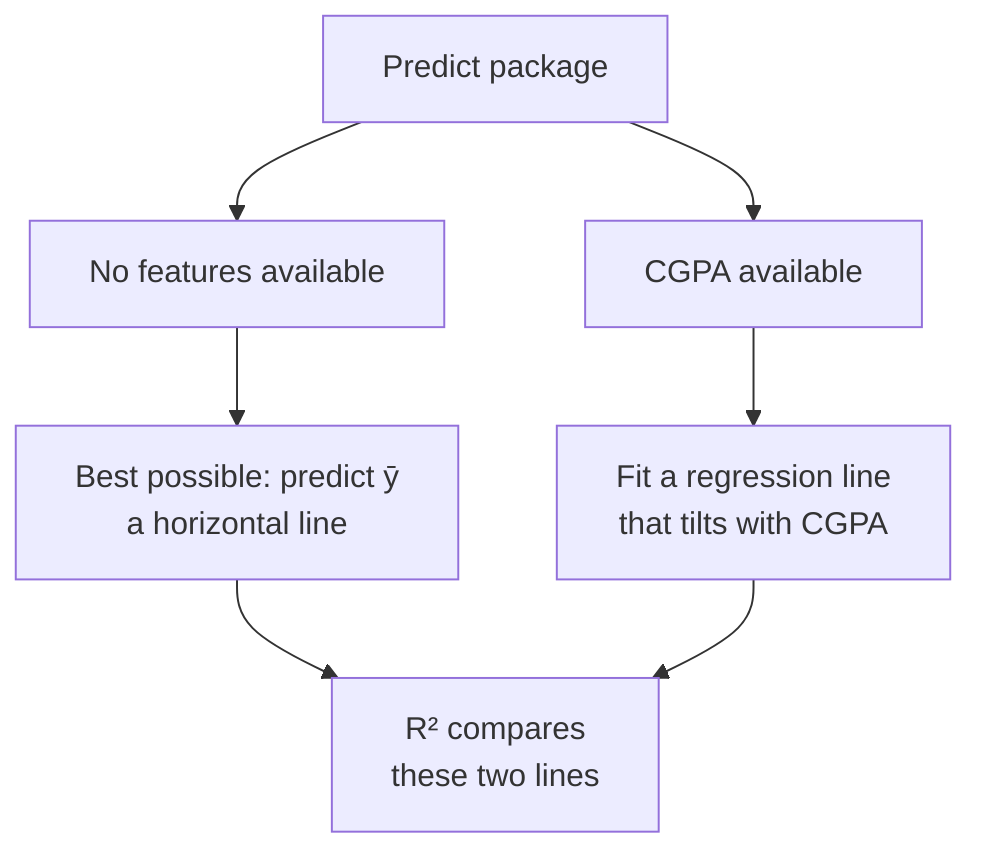
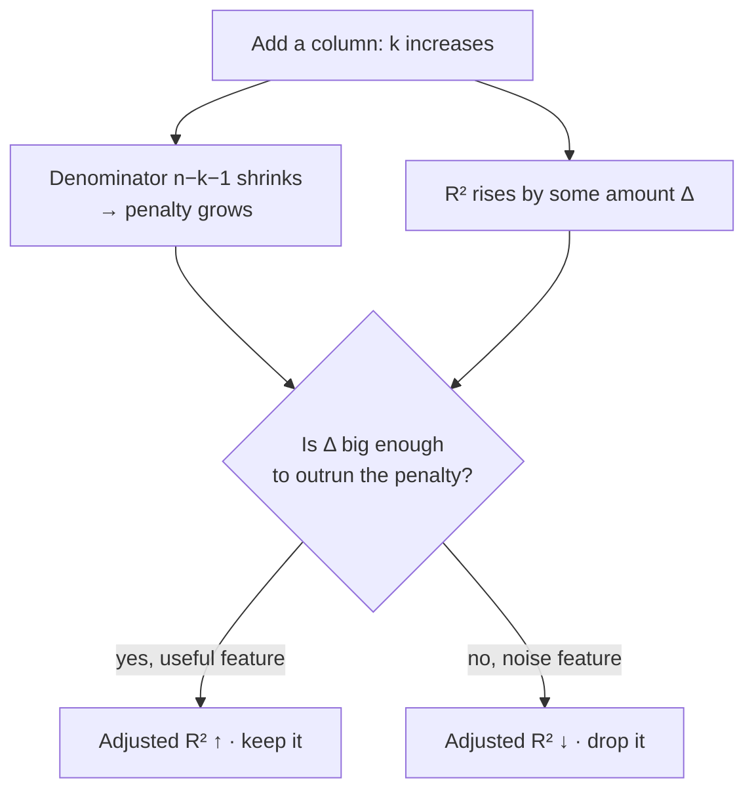

# 3 · R² and Adjusted R² — Scoring Against a Baseline

> **Source:** Video 1 — *Regression Metrics | MSE, MAE & RMSE | R² Score & Adjusted R² Score* (second half)

MAE, MSE and RMSE tell you *how much* error there is, in the target's units. That makes them incomparable across problems: is an RMSE of 0.35 good? Unanswerable without knowing the target. R² answers a different, scale-free question — **is my model better than the dumbest defensible alternative, and by how much?**

---

## 3.1 The baseline: what you'd do with no features at all

The video sets this up well, and it is the key to the whole chapter. Suppose you must predict a student's placement package and you have **no input data whatsoever** — no CGPA, no IQ, nothing. What is your best strategy?

Predict the **mean** of all past packages, every time. It is the constant that minimises squared error, so it is the optimal zero-feature model.



R² is the answer to: **how much of the mean line's error did my regression line eliminate?**

---

## 3.2 The formula and its two sums

$$R^2 = 1 - \frac{SS_{res}}{SS_{tot}} = 1 - \frac{\sum_i (y_i - \hat{y}_i)^2}{\sum_i (y_i - \bar{y})^2}$$

| Term | Name | What it is |
|---|---|---|
| $SS_{res} = \sum(y_i - \hat{y}_i)^2$ | residual sum of squares (**SSR**, or SSE) | squared error of **your model** |
| $SS_{tot} = \sum(y_i - \bar{y})^2$ | total sum of squares (**SST**, or SSM) | squared error of the **mean line** |

The ratio is *"what fraction of the baseline's error do I still have?"* Subtracting from 1 flips it into *"what fraction did I remove?"*

R² is also called the **coefficient of determination**, and sometimes **goodness of fit**.

> ### ⚠️ Important Note — a naming trap
> Different sources use SSR for *sum of squares **residual*** and for *sum of squares **regression*** — two different quantities. The video uses SSR for the residual sum and SSM for the mean-line sum. This module writes $SS_{res}$ and $SS_{tot}$ to avoid the collision. If you read "SSR" anywhere else, check which one is meant before trusting the formula.

### Worked example, arithmetic verified

| $y_i$ | $\hat{y}_i$ | $y_i - \hat{y}_i$ | $(y_i-\hat{y}_i)^2$ | $y_i - \bar{y}$ | $(y_i-\bar{y})^2$ |
|---|---|---|---|---|---|
| 2 | 2.2 | −0.2 | 0.04 | −2 | 4 |
| 4 | 3.6 | +0.4 | 0.16 | 0 | 0 |
| 5 | 4.6 | +0.4 | 0.16 | +1 | 1 |
| 4 | 4.4 | −0.4 | 0.16 | 0 | 0 |
| 5 | 5.2 | −0.2 | 0.04 | +1 | 1 |
| | | | **$SS_{res}=0.56$** | | **$SS_{tot}=6.00$** |

$\bar{y} = 4.0$, so

$$R^2 = 1 - \frac{0.56}{6.00} = 1 - 0.0933 = \mathbf{0.9067}$$

The model removed about **91%** of the baseline's squared error.

---

## 3.3 Reading the number

| $R^2$ | Meaning | How it happens |
|---|---|---|
| **1.0** | perfect — $SS_{res}=0$ | the line passes exactly through every point. Not achievable on real data, and a red flag for leakage if you see it |
| **0.8** | removed 80% of baseline error | a good model on noisy real-world data |
| **0.0** | exactly as good as predicting the mean | your features carry no usable signal — you may as well not have collected them |
| **< 0** | **worse than predicting the mean** | see below |

### Negative R² is real, and it means something specific

The video flags this — students see negative R² and assume a bug. It is not a bug. $R^2 < 0$ requires $SS_{res} > SS_{tot}$: **your model makes larger squared errors than a horizontal line through the mean would.**

How you get there:

- **Wrong model family.** You fitted a straight line to strongly non-linear data. The video's example: a highly non-linear relationship forced through `LinearRegression`.
- **Evaluating on a test set** whose distribution differs from train. Note that $R^2$ on the *training* set of an OLS fit with an intercept can never be negative — it is bounded in $[0,1]$ there. On a **test** set it absolutely can be, because $\bar{y}$ in the formula is the test set's own mean and the fitted line came from elsewhere. Almost every negative R² you meet in practice is a test-set R².
- **A model with no intercept**, or predictions from a badly mis-specified pipeline.

> **The diagnostic value:** $R^2 < 0$ is one of the few metrics that tells you *what to do next* rather than just how bad things are. It says: stop tuning, your model class is wrong.

### The variance interpretation

The reading the video emphasises, and the one interviewers want:

> **$R^2 = 0.80$ means the input columns explain 80% of the variance in the target.**

Concretely: packages vary — some 1.5 LPA, some 4.5 LPA. *Something* causes that spread. If CGPA gives $R^2 = 0.80$, then 80% of that spread is accounted for by CGPA, and the remaining 20% comes from things not in your data — interview performance, luck, referrals, factors you never measured.

Say **"explains 80% of the variance"**, not "is 80% accurate". They are different claims and the second one is meaningless for regression.

---

## 3.4 The flaw: R² never punishes a useless feature

This is the pivot of the second half of the video, and it is the single most important idea in this chapter.

**Add any input column — however irrelevant — and R² will increase or stay the same. It can never decrease.**

The video's example is perfect: add a column recording the **temperature on the day the candidate interviewed**. It has no causal bearing on the package. Yet R² goes up, or at best holds still.

**Why this happens.** OLS chooses coefficients to minimise $SS_{res}$. Adding a column enlarges the space of achievable fits; the old fit is still available (set the new coefficient to 0). Since the optimiser can always fall back on the old solution, the new minimum is never worse. In finite samples the new column always has *some* random correlation with the residuals, so the fit gets marginally better by fitting noise. $SS_{tot}$ meanwhile is untouched — it depends only on $y$. So the ratio shrinks and R² rises.

**Why it is dangerous.** R² becomes useless for the thing you most want it for: **deciding whether a feature is worth keeping.** Optimise R² and you will keep every column you ever add, which is a direct route to overfitting.

---

## 3.5 Adjusted R² — charging rent for each feature

$$R^2_{adj} = 1 - \frac{(1 - R^2)(n - 1)}{n - k - 1}$$

| Symbol | Meaning |
|---|---|
| $n$ | number of rows |
| $k$ | number of **independent (input) columns** |
| $R^2$ | ordinary R² from §3.2 |

The mechanism: $k$ appears only in the denominator $n - k - 1$. Add a column and that denominator **shrinks**, which **inflates** the penalty term being subtracted from 1, which **pulls $R^2_{adj}$ down**. A new feature must raise $R^2$ by enough to outrun that shrinking denominator, or it is judged not worth its cost.

### The two cases, computed on the example above ($n=5$, $R^2 = 0.9067$)

**Starting point, $k = 1$ (CGPA only):**

$$R^2_{adj} = 1 - \frac{(1-0.9067)(4)}{5-1-1} = 1 - \frac{0.3733}{3} = \mathbf{0.8756}$$

**Case A — add a useless column** (temperature). R² creeps from 0.9067 to, say, 0.9070. Now $k=2$:

$$R^2_{adj} = 1 - \frac{(1-0.9070)(4)}{5-2-1} = 1 - \frac{0.372}{2} = \mathbf{0.8140}$$

R² went **up** (0.9067 → 0.9070) while Adjusted R² went **down** (0.8756 → 0.8140). Adjusted R² correctly rejects the feature.

**Case B — add a genuinely useful column** (IQ). R² jumps from 0.9067 to 0.9600. Now $k=2$:

$$R^2_{adj} = 1 - \frac{(1-0.9600)(4)}{5-2-1} = 1 - \frac{0.16}{2} = \mathbf{0.9200}$$

Both rise (0.8756 → 0.9200). Adjusted R² accepts the feature.

That contrast — **same $k$ increase, opposite verdicts, decided purely by how much $R^2$ moved** — is the whole design of the metric.



### Properties worth knowing

- $R^2_{adj} \le R^2$ always (with equality only when $k=0$).
- $R^2_{adj}$ **can be negative** even when $R^2$ is positive — a small $n$ with a large $k$ makes the penalty brutal.
- As $n \to \infty$ with $k$ fixed, $R^2_{adj} \to R^2$. The penalty matters most when you have **few rows and many columns** — exactly when overfitting is the real risk.
- If $n = k + 1$ the denominator is 0 and the metric is undefined. With more columns than rows it goes nonsensical. Both are correct warnings that you cannot fit that model.

> **When to reach for which:** report $R^2$ for simple regression (one feature — the two agree closely anyway). Report **both** for multiple regression, and if they diverge noticeably, trust $R^2_{adj}$ and go audit your feature set. A large gap between them is itself the finding.

---

## 3.6 Code, including the trap-demonstration

```python
# Dependencies: scikit-learn, numpy, pandas
import numpy as np, pandas as pd
from sklearn.model_selection import train_test_split
from sklearn.linear_model import LinearRegression
from sklearn.metrics import r2_score

def adjusted_r2(r2: float, n: int, k: int) -> float:
    """n = rows scored, k = number of input columns. sklearn has no built-in for this."""
    return 1 - (1 - r2) * (n - 1) / (n - k - 1)

df = pd.read_csv("placement.csv")

def evaluate(X, y, label):
    X_tr, X_te, y_tr, y_te = train_test_split(X, y, test_size=0.2, random_state=42)
    pred = LinearRegression().fit(X_tr, y_tr).predict(X_te)
    r2 = r2_score(y_te, pred)
    adj = adjusted_r2(r2, n=X_te.shape[0], k=X_te.shape[1])
    print(f"{label:<28} R² = {r2:.4f}   adjusted R² = {adj:.4f}")
    return r2, adj

# 1 · baseline, one real feature
evaluate(df[["cgpa"]], df["package"], "cgpa only")

# 2 · add pure noise — watch the two metrics diverge
rng = np.random.default_rng(42)
df["random_col"] = rng.random(len(df))
evaluate(df[["cgpa", "random_col"]], df["package"], "cgpa + random noise")
```

**Expected behaviour** — and this is the experiment the video runs live: R² **rises slightly** when the random column is added, while adjusted R² **falls**. In the video's run on this dataset, R² was about 0.78 with CGPA alone and nudged upward with the noise column, while adjusted R² dropped by roughly a point and a half. He then repeats it with a *relevant* column (IQ) and both rise. The direction of movement is the lesson; the exact decimals are demo-specific.

> ### ⚠️ Important Note
> Note `k=X_te.shape[1]` — the number of **input columns**, not rows, not parameters-including-intercept. Two frequent off-by-one errors: counting the intercept as a feature, and passing the training row count as `n` while scoring on the test set. Both silently produce a plausible-looking wrong number. Compute $n$ from the set you actually scored.

---

## 3.7 What R² will *not* tell you

R² is scale-free and comparable, which makes it easy to over-trust. It is silent about all of the following:

| R² does not tell you | Use instead |
|---|---|
| Whether the relationship is actually linear | residual plots — residuals vs. fitted should look like structureless noise |
| Whether errors are acceptable in real units | MAE / RMSE (Ch. 2) |
| Whether the model will hold on new data | cross-validated R², not single-split |
| Whether a feature *causes* the target | nothing in this module. R² is correlational. Full stop. |
| Whether individual predictions are trustworthy | prediction intervals, quantile regression |

> ### ⚠️ Common Misconception
> "High R² means a good model." It does not. Anscombe's quartet is four datasets with identical R² (and identical means, variances, and regression lines) of which only one is appropriately modelled by a line. **Always plot residuals.** A high R² on a curved relationship just means the line captures the broad trend while being systematically wrong everywhere — and systematic error is worse than random error, because it does not average out.

---

## Common Mistakes

> - **Mistake:** treating negative R² as a bug in your code → **Why it's wrong:** it is a valid and informative value meaning your model has larger squared error than a horizontal mean line, usually from a wrong model family or a train/test distribution shift → **Do instead:** read it as "stop tuning, change model class", and check whether the relationship is non-linear.
> - **Mistake:** using R² to decide whether to keep a feature → **Why it's wrong:** R² is mathematically incapable of decreasing when a column is added, so it endorses every feature including pure noise → **Do instead:** use adjusted R², or a proper held-out comparison, or permutation importance.
> - **Mistake:** saying "R² = 0.8 means the model is 80% accurate" → **Why it's wrong:** accuracy is a classification notion; R² is the fraction of *variance* explained, which is a different quantity entirely → **Do instead:** say "the inputs explain 80% of the variance in the target".
> - **Mistake:** counting the intercept in $k$, or using training $n$ when scoring the test set → **Why it's wrong:** both shift $n-k-1$ and produce a wrong adjusted R² that still looks reasonable, so the error goes unnoticed → **Do instead:** $k$ = number of input columns; $n$ = rows in the set you just scored.
> - **Mistake:** trusting a high R² without looking at residuals → **Why it's wrong:** Anscombe's quartet shows four qualitatively different datasets with identical R², only one of which a line describes properly → **Do instead:** always plot residuals vs. fitted values and check for curvature, funnelling, or clusters.
> - **Mistake:** comparing R² across different datasets and calling one model better → **Why it's wrong:** R² depends on the target's own variance; an easy-to-predict target inflates it, so a 0.9 on one dataset may be a worse model than a 0.6 on another → **Do instead:** compare models on the *same* target, and compare to a documented baseline when you must cross datasets.

---

## Exercises

**Beginner.** With $SS_{res} = 15$ and $SS_{tot} = 60$, compute R². Then state what value of $SS_{res}$ would make R² exactly 0, and what value would make it negative. *Success criterion:* R² = 0.75; $SS_{res}=60$ gives 0; anything above 60 goes negative.

**Intermediate.** Implement `r2_score` yourself from $SS_{res}$ and $SS_{tot}$ and verify against sklearn on 100 random vectors. Then implement `adjusted_r2` and verify by hand on the $n=5, k=1, R^2=0.9067$ case in §3.5. *Success criterion:* both match, and you get 0.8756.

**Advanced.** Take a dataset with 8 real features. Add noise columns one at a time up to 40 extra columns, and plot R² and adjusted R² against the number of columns on the same axes, evaluated on a held-out test set. *Success criterion:* training R² rises monotonically, adjusted R² peaks and then declines, and you can identify roughly where adjusted R² turns over and explain the connection to $n - k - 1$.

**Challenge.** Construct a dataset where R² is above 0.95 and the linear model is nonetheless clearly the wrong choice — and prove it with a residual plot rather than with another scalar. Then construct a second dataset where R² is below 0.3 and the linear model is nonetheless the *right* choice for the business problem. *Success criterion:* both examples are defensible, and you can articulate the general principle about when a scalar metric can and cannot substitute for looking at the data.

---

**Next:** [4 · Accuracy and the Confusion Matrix](04-accuracy-and-the-confusion-matrix.md)
