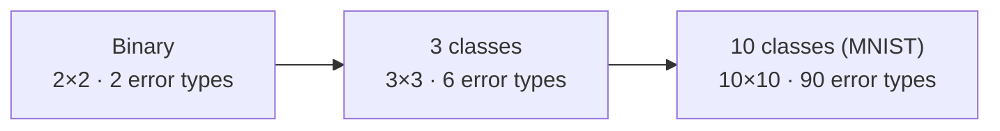

# 4 · Accuracy and the Confusion Matrix

> **Source:** Video 2 — *Accuracy and Confusion Matrix | Type 1 and Type 2 Errors | Classification Metrics Part 1*

Classification metrics are harder than regression metrics, and the video says so up front. The reason is structural: a regression error has a *size*, so averaging it is natural. A classification error has a **kind**. Getting "spam" wrong in one direction costs you a job offer; getting it wrong in the other direction costs you a moment's annoyance. No single average can hold that.

This chapter builds the object that keeps the kinds separate — the confusion matrix — and shows exactly where accuracy, the obvious first metric, collapses.

---

## 4.1 Accuracy

$$\text{Accuracy} = \frac{\text{number of correct predictions}}{\text{total number of predictions}}$$

That is the whole definition, and it is the right first metric to reach for.

### The video's toy comparison

Students' **CGPA + IQ → placed (1) / not placed (0)**. 1,000 students, split 800 train / 200 test. Two models are trained — logistic regression and a decision tree — and their predictions on the first ten test students are laid side by side against the truth:

| # | Actual | Logistic Regression | ✓/✗ | Decision Tree | ✓/✗ |
|---|---|---|---|---|---|
| 1 | 1 | 1 | ✓ | 1 | ✓ |
| 2 | 1 | 1 | ✓ | 1 | ✓ |
| 3 | 0 | 1 | ✗ | 0 | ✓ |
| 4 | 1 | 1 | ✓ | 1 | ✓ |
| 5 | 0 | 0 | ✓ | 1 | ✗ |
| 6 | 1 | 1 | ✓ | 1 | ✓ |
| 7 | 0 | 0 | ✓ | 0 | ✓ |
| 8 | 1 | 0 | ✗ | 1 | ✓ |
| 9 | 0 | 0 | ✓ | 0 | ✓ |
| 10 | 1 | 1 | ✓ | 1 | ✓ |
| | | **8/10 = 0.80** | | **9/10 = 0.90** | |

*(Illustrative reconstruction of the video's on-screen table — the individual rows are not recoverable from auto-captions, but the two totals, 8/10 and 9/10, are what he states and compares.)*

So the decision tree wins on this data: 90% vs 80%. The reasoning a child could do, as the video puts it — count the mistakes.

**Reading accuracy as a frequency:** 80% accuracy means that over 1,000 future predictions you expect roughly 800 correct. That framing is what makes accuracy so communicable, and it is why it will always be the first metric you compute.

### Multiclass accuracy: nothing changes

On the iris dataset (3 classes: setosa 0, versicolor 1, virginica 2), the procedure is identical — check each prediction, count the correct ones, divide by the total. The video's point is explicit and worth internalising: **the definition of accuracy is indifferent to the number of classes.** Binary and 10-class MNIST use the same formula.

---

## 4.2 "What accuracy should a model have?" — the interview question

The video tells a story: a student was asked this in an interview, reasoned that a higher number must be a better answer, and said "98%". **Wrong.**

The only correct answer: **"it depends on the problem being solved."**

| System | Accuracy | Deployable? | Why |
|---|---|---|---|
| Cancer detection from chest X-ray | 99% | **No** | 1 in 100 patients misdiagnosed. No hospital buys this; someone dies. |
| Self-driving car, steer left/right | 99% | **No** | 1 wrong decision per 100 road decisions is a crash. |
| Will this user order food this weekend? | 80% | **Yes** | 20 wrong guesses per 100 customers costs you some wasted notifications. |

The number is not the variable. **The cost of a mistake is the variable**, and it comes from the domain.

---

## 4.3 Accuracy's real defect: it hides the *kind* of error

Accuracy gives you one number. Say it is 90%. Ten percent of predictions were wrong — but **which way?**

In a binary problem there are exactly two ways to be wrong:

1. The student **was** placed, and the model said they wouldn't be.
2. The student **wasn't** placed, and the model said they would be.

Or in the medical framing: the patient **has** heart disease and the model says they don't; versus the patient **doesn't** and the model says they do. These are not interchangeable. One sends someone home untreated; the other orders an unnecessary test.

Accuracy tells you 10% went wrong. It refuses to tell you which 10%. That is what the confusion matrix fixes.

---

## 4.4 The confusion matrix

A table cross-tabulating what was true against what was predicted.

|  | **Predicted: 1** | **Predicted: 0** |
|---|---|---|
| **Actual: 1** | **TP** — True Positive | **FN** — False Negative |
| **Actual: 0** | **FP** — False Positive | **TN** — True Negative |

Every prediction lands in exactly one cell. The **diagonal is correct**; the off-diagonal is the two error types, now separated and countable.

> ### ⚠️ Important Note — layout is not standardised
> The video explicitly warns about this, and it causes real bugs. Some sources put predicted on the rows, some on the columns. **scikit-learn's `confusion_matrix` puts actual on rows and predicted on columns**, and orders both by sorted label — so for labels {0,1} the output is:
> ```
> [[TN, FP],
>  [FN, TP]]
> ```
> Note that **TN is the top-left**, not TP. Reading sklearn's raw array as if TP were first is one of the most common metric bugs there is. Unpack explicitly:
> ```python
> tn, fp, fn, tp = confusion_matrix(y_test, y_pred).ravel()
> ```
> Never index the array positionally from memory.

### The naming cheat code

The video offers a mnemonic that works, and it is worth committing to memory because these four terms are used constantly and confused constantly:

> - The **second word** (Positive / Negative) is **what the model predicted**.
> - The **first word** (True / False) says **whether that prediction was right**.

Apply it:

| Term | Model said | Was it right? | So the truth was |
|---|---|---|---|
| **True Positive** | 1 | yes | 1 |
| **False Positive** | 1 | no | 0 |
| **False Negative** | 0 | no | 1 |
| **True Negative** | 0 | yes | 0 |

Test yourself the way the video does: *the model predicted 1, but the truth was 0 — what is it?* Prediction was positive → second word Positive. Prediction was wrong → first word False. **False Positive.**

### Type 1 and Type 2 errors

Asked in interviews constantly, and it is pure vocabulary:

| | Name | Also called | In the heart-disease framing |
|---|---|---|---|
| **Type 1 error** | False Positive | false alarm | told a healthy patient they have heart disease |
| **Type 2 error** | False Negative | miss | told a sick patient they are fine |

**Memory hook:** Type **1** = **1** thing that wasn't there (you saw something that isn't). Type **2** = you missed the **2**nd possibility (you failed to see something that is).

### Accuracy from the confusion matrix

$$\text{Accuracy} = \frac{TP + TN}{TP + TN + FP + FN}$$

The diagonal over the whole table. Note the one-way relationship the video highlights: **you can always compute accuracy from a confusion matrix, but you can never reconstruct a confusion matrix from accuracy.** The matrix strictly dominates. This is the argument for always printing it.

### Worked example — carried forward into Chapter 5

100 test patients, 40 of whom actually have heart disease.

|  | **Predicted: disease** | **Predicted: healthy** | Row total (actual) |
|---|---|---|---|
| **Actual: disease** | TP = 32 | FN = 8 | 40 |
| **Actual: healthy** | FP = 12 | TN = 48 | 60 |
| **Column total (predicted)** | 44 | 56 | 100 |

$$\text{Accuracy} = \frac{32 + 48}{100} = \frac{80}{100} = \mathbf{0.80}$$

But now you also know the shape of the failure: **8 sick patients were sent home** and **12 healthy patients were alarmed.** Accuracy alone would have told you "80%" and hidden both facts. Chapter 5 turns these same numbers into precision and recall.

---

## 4.5 Multiclass confusion matrices

For $C$ classes the matrix is $C \times C$. Same rules: diagonal correct, off-diagonal is a specific confusion — *class $i$ mistaken for class $j$*.



$$\text{Accuracy} = \frac{\text{trace(matrix)}}{\text{sum(matrix)}} = \frac{\sum_i M_{ii}}{\sum_{i,j} M_{ij}}$$

The video demonstrates this on iris (3×3) and MNIST digits (10×10), where a cell like *(actual 4, predicted 9)* tells you precisely which digits your model conflates. That per-pair detail is why practitioners plot the matrix as a heatmap rather than reading numbers — the bright off-diagonal cells are your to-do list. Chapter 6 extends precision and recall to this setting.

---

## 4.6 Where accuracy breaks completely: imbalanced data

The final and most important section of the video. **Accuracy becomes actively misleading when classes are imbalanced** — when the two classes appear in very unequal proportion.

### The airport example

Build a model that screens passengers from a snapshot and flags potential terrorists. Realistically, out of 100,000 passengers, perhaps **1** is a threat.

Now write this model:

```python
def predict(passenger):
    return 0        # "not a terrorist" — always
```

No features. No learning. One line. Its confusion matrix:

|  | **Predicted: threat** | **Predicted: safe** |
|---|---|---|
| **Actual: threat** | TP = 0 | FN = 1 |
| **Actual: safe** | FP = 0 | TN = 99,999 |

$$\text{Accuracy} = \frac{0 + 99{,}999}{100{,}000} = 0.99999 = \mathbf{99.999\%}$$

**A model that cannot detect the thing it was built to detect scores 99.999%.** It has never been right about a single threat. Recall is exactly 0.

This is not a contrived edge case — it is the normal situation in fraud detection, disease screening, defect detection, churn, click-through prediction, and intrusion detection. **Wherever the interesting class is rare, accuracy is the wrong metric**, and the rarer the class, the more confidently accuracy lies.

> ### ⚠️ Important Note
> The failure is not that accuracy is computed wrongly. 99.999% is arithmetically correct. The failure is that accuracy weights every prediction equally, while the *value* of predictions is wildly unequal — the one you care about is 1 in 100,000. A metric that averages over the population cannot see a class that barely exists in it.

### A useful intermediate: balanced accuracy

Not in the playlist, but the smallest possible fix and worth knowing before you get to precision/recall:

$$\text{Balanced Accuracy} = \frac{1}{2}\left(\frac{TP}{TP+FN} + \frac{TN}{TN+FP}\right)$$

The average of per-class recall, so each class contributes equally regardless of size. On the terrorist model: $\frac{1}{2}(0 + 1.0) = \mathbf{0.50}$ — correctly identifying it as no better than a coin flip on the balanced problem. On the Chapter 4 worked example: $\frac{1}{2}(32/40 + 48/60) = \frac{1}{2}(0.80 + 0.80) = 0.80$, which agrees with accuracy there because that data is only mildly imbalanced.

```python
from sklearn.metrics import balanced_accuracy_score
balanced_accuracy_score(y_test, y_pred)
```

The proper tools are precision and recall — Chapter 5.

---

## 4.7 Code

```python
# Dependencies: scikit-learn, matplotlib
import pandas as pd
from sklearn.model_selection import train_test_split
from sklearn.linear_model import LogisticRegression
from sklearn.tree import DecisionTreeClassifier
from sklearn.metrics import (accuracy_score, confusion_matrix,
                             ConfusionMatrixDisplay, balanced_accuracy_score)
import matplotlib.pyplot as plt

df = pd.read_csv("heart.csv")               # target: 1 = has heart disease, 0 = does not
X, y = df.drop(columns="target"), df["target"]

# stratify keeps the class ratio identical in train and test — always do this
X_tr, X_te, y_tr, y_te = train_test_split(
    X, y, test_size=0.2, random_state=42, stratify=y)

for name, model in [("LogisticRegression", LogisticRegression(max_iter=1000)),
                    ("DecisionTree",       DecisionTreeClassifier(random_state=42))]:
    model.fit(X_tr, y_tr)
    pred = model.predict(X_te)

    cm = confusion_matrix(y_te, pred)
    tn, fp, fn, tp = cm.ravel()            # sklearn order: [[TN, FP], [FN, TP]]

    print(f"\n{name}")
    print(f"  accuracy          {accuracy_score(y_te, pred):.4f}")
    print(f"  balanced accuracy {balanced_accuracy_score(y_te, pred):.4f}")
    print(f"  TP {tp}  FN {fn}  (Type 2 errors: {fn})")
    print(f"  FP {fp}  TN {tn}  (Type 1 errors: {fp})")

    ConfusionMatrixDisplay(cm, display_labels=["no disease", "disease"]).plot()
    plt.title(name); plt.show()
```

In the video's run on `heart.csv`, logistic regression outperformed the decision tree — roughly 90% against roughly 80% accuracy — and he then plots the confusion matrix for each to show *where* the losing model loses. (Exact cell counts from his demo aren't reliably recoverable from the auto-captions; the worked example in §4.4 is a clean substitute with verified arithmetic.)

> ### 🔧 Modern Approach
> The video plots with a helper from an older workflow. Current scikit-learn gives you two direct routes: `ConfusionMatrixDisplay.from_estimator(model, X_te, y_te)` straight from a fitted model, or `ConfusionMatrixDisplay.from_predictions(y_te, pred)`. Add `normalize="true"` to show per-row rates instead of counts — essential on imbalanced data, where raw counts in the majority row dwarf everything else.

---

## Common Mistakes

> - **Mistake:** using accuracy on an imbalanced dataset → **Why it's wrong:** predicting the majority class for everything scores near-perfectly while detecting nothing; at 1:100,000 imbalance a useless model scores 99.999% → **Do instead:** report precision/recall (Ch. 5), balanced accuracy, or PR-AUC, and always state the class balance next to any accuracy figure.
> - **Mistake:** indexing sklearn's confusion matrix positionally from memory → **Why it's wrong:** sklearn returns `[[TN, FP], [FN, TP]]` — TN is first, not TP — so assuming TP-first silently swaps your error types and inverts every conclusion → **Do instead:** `tn, fp, fn, tp = confusion_matrix(y_true, y_pred).ravel()`, and pass `labels=` explicitly when classes might be missing from a fold.
> - **Mistake:** answering "what accuracy is good?" with a number → **Why it's wrong:** 99% is negligent for cancer screening and generous for food-order prediction; the answer is set by error cost, not by convention → **Do instead:** say "it depends on the cost of each error type", then name the two errors in that domain.
> - **Mistake:** reporting accuracy alone and stopping → **Why it's wrong:** it collapses two qualitatively different failures into one number, hiding whether you are missing positives or raising false alarms → **Do instead:** print the confusion matrix; it strictly dominates accuracy, since accuracy is derivable from it and not vice versa.
> - **Mistake:** forgetting `stratify=y` in `train_test_split` → **Why it's wrong:** on imbalanced data a random split can give train and test different class ratios, or a fold with zero positives, making metrics unstable or undefined → **Do instead:** always pass `stratify=y` for classification, and `StratifiedKFold` for CV.
> - **Mistake:** mixing up Type 1 and Type 2 → **Why it's wrong:** they recommend opposite fixes; optimising the wrong one makes the real problem worse → **Do instead:** Type 1 = False Positive = false alarm; Type 2 = False Negative = miss. Rehearse it on a concrete patient before using it in an argument.

---

## Exercises

**Beginner.** A model predicts 1 for a sample whose true label is 0. Name the cell, and give both its TP/FP/FN/TN name and its Type-1/Type-2 name. *Success criterion:* False Positive, Type 1 error — derived from the cheat code, not memorised.

**Intermediate.** Given the confusion matrix `[[48, 12], [8, 32]]` as returned by sklearn for labels {0,1}, identify TP, FP, FN, TN and compute accuracy and balanced accuracy by hand. *Success criterion:* TN=48, FP=12, FN=8, TP=32; accuracy 0.80; balanced accuracy 0.80.

**Advanced.** Build a deliberately imbalanced dataset (2% positives, 5,000 rows). Fit a real classifier, then also compute the metrics for a `DummyClassifier(strategy="most_frequent")`. Report accuracy and balanced accuracy for both. *Success criterion:* the dummy's accuracy is within a couple of points of the real model's while its balanced accuracy is 0.50, and you can explain to a non-specialist why the accuracy comparison is worthless here.

**Challenge.** You inherit a production fraud model whose dashboard shows "accuracy: 99.2%" and has done for eighteen months. Fraud is 0.4% of transactions. Write the one-page memo you would send: what you suspect, the exact queries or computations you would run to confirm it, which metrics should replace the dashboard, and how you would present the change to a non-technical executive who is proud of the 99.2%. *Success criterion:* you identify that the model may be near-useless while looking excellent, you propose specific replacement metrics tied to the business cost of each error type, and your memo does not require the executive to understand a formula.

---

**Next:** [5 · Precision, Recall and F1](05-precision-recall-and-f1.md)
