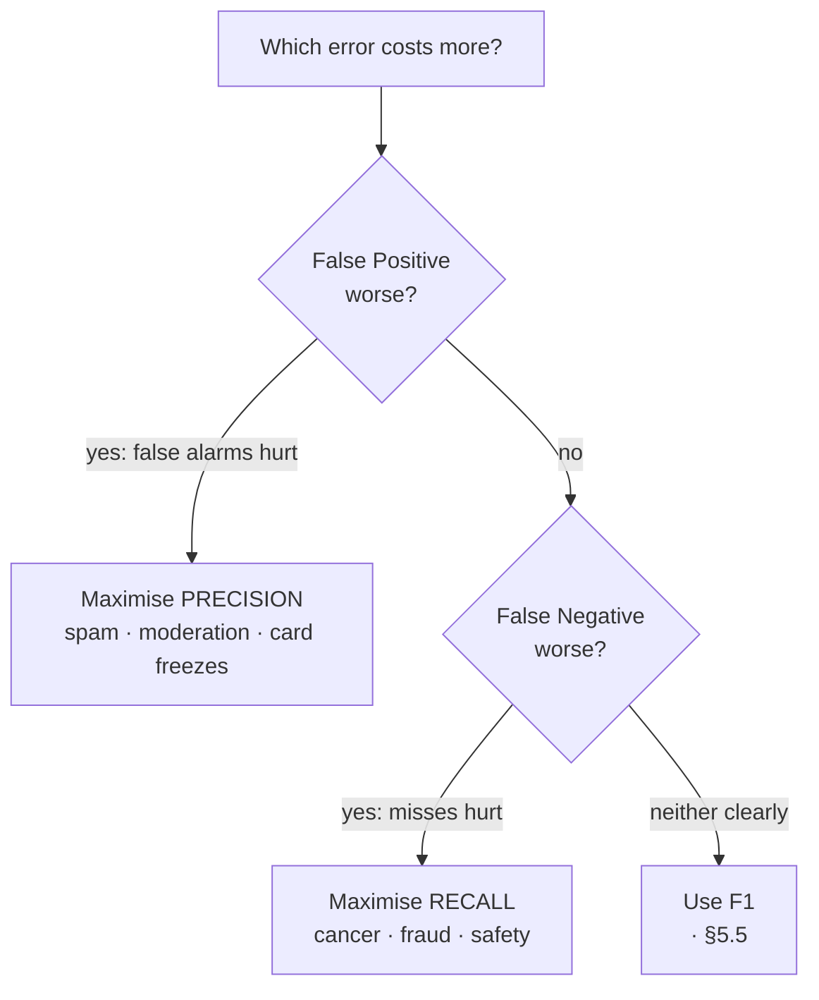

# 5 · Precision, Recall and F1

> **Source:** Video 3 — *Precision, Recall and F1 Score | Classification Metrics Part 2*

Chapter 4 ended with accuracy failing on imbalanced data and hiding the *kind* of error. Precision and recall are the fix. They are the two ways to read a confusion matrix that ignore the majority-class cell entirely — and that is exactly why they survive imbalance.

The chapter's real lesson is not the two formulas. It is that **choosing between them is a domain decision about which mistake hurts more**, and the video teaches it through two scenarios with deliberately identical accuracy.

---

## 5.1 The setup: two models, identical accuracy

The video's device is a manager comparing two juniors' models. Both have the **same accuracy**, so accuracy cannot choose. Only the off-diagonal cells differ — and they differ in opposite directions.

1,000 emails, 120 of which are genuinely spam.

**Model A** — lots of false positives:

|  | Predicted spam | Predicted not-spam |
|---|---|---|
| **Actually spam** | TP = 100 | FN = 20 |
| **Actually not-spam** | FP = 180 | TN = 700 |

**Model B** — lots of false negatives:

|  | Predicted spam | Predicted not-spam |
|---|---|---|
| **Actually spam** | TP = 100 | FN = 180 |
| **Actually not-spam** | FP = 20 | TN = 700 |

| | Accuracy | FP (Type 1) | FN (Type 2) |
|---|---|---|---|
| Model A | (100+700)/1000 = **0.80** | 180 | 20 |
| Model B | (100+700)/1000 = **0.80** | 20 | 180 |

Same diagonal, so same accuracy. Completely different failure modes. Accuracy is blind here — which is the video's whole point.

---

## 5.2 Precision — when a false alarm is the expensive mistake

$$\text{Precision} = \frac{TP}{TP + FP}$$

**In words:** of everything the model *flagged as positive*, what fraction really was positive?

Note the denominator: $TP + FP$ is the **predicted-positive column**. Precision is a question about your *alarms* — how trustworthy is a positive prediction?

### The spam decision

Which error is worse for an email filter?

- **False Positive:** a legitimate email is sent to the spam folder. The video's example is exact and visceral — **a company emails you that you've been selected, asking you to reply to confirm your placement; it lands in spam; you never see it; you lose the job.**
- **False Negative:** a spam email reaches your inbox. You are annoyed and delete it.

The asymmetry is enormous. **False Positive is far worse.** So pick the model with fewer FPs — Model B.

$$\text{Precision}_A = \frac{100}{100 + 180} = \mathbf{0.357} \qquad \text{Precision}_B = \frac{100}{100 + 20} = \mathbf{0.833}$$

Model B wins decisively on precision, and precision is the metric that encodes "don't raise false alarms".

**Use precision when a false positive is expensive:** spam filtering, content moderation strikes on real accounts, recommending a product (annoying a user), flagging a transaction as fraud (freezing a legitimate customer's card), arresting someone.

---

## 5.3 Recall — when a miss is the expensive mistake

$$\text{Recall} = \frac{TP}{TP + FN}$$

**In words:** of everything that *actually was positive*, what fraction did the model catch?

Denominator $TP + FN$ is the **actual-positive row**. Recall is a question about *coverage* — how much of the real thing did you find? (Also called **sensitivity** or **true positive rate**.)

### The cancer decision

The video's second scenario: a chest X-ray model for a hospital. Same two matrices, new domain.

- **False Positive:** a healthy patient is told they may have cancer. Frightening, and leads to further tests — which then find nothing. Recoverable.
- **False Negative:** a patient **with** cancer is told they are fine. They go home, live normally, and die of a treatable disease.

**False Negative is far worse.** Pick the model with fewer FNs — Model A.

$$\text{Recall}_A = \frac{100}{100 + 20} = \mathbf{0.833} \qquad \text{Recall}_B = \frac{100}{100 + 180} = \mathbf{0.357}$$

Model A wins on recall. **Same two models, same accuracy, opposite verdict** — because the domain changed, not the data. This is the most important idea in the chapter.

**Use recall when a false negative is expensive:** disease screening, fraud detection, safety-critical defect detection, security threat detection, child-safety content flagging, predicting equipment failure.

### The decision rule



### Why these two survive imbalance

Return to the airport model from §4.6 — always predict "not a terrorist". TP=0, FN=1, FP=0, TN=99,999.

- Accuracy = **99.999%**
- Recall = $0/(0+1) = \mathbf{0}$
- Precision = $0/(0+0)$ = **undefined** (sklearn reports 0.0 and warns)

Recall exposes the model instantly. And notice *why*: **neither precision nor recall contains TN.** The enormous true-negative count that inflates accuracy simply does not appear in either formula. That is the structural reason they work on imbalanced data, and it is worth stating explicitly — the video shows the result but not the mechanism.

---

## 5.4 The precision–recall trade-off

You cannot freely maximise both. Push one up and the other tends down.

Most classifiers output a **probability**, then threshold it at 0.5 to get a label. Moving that threshold slides you along the trade-off:

| Threshold | Behaviour | Precision | Recall |
|---|---|---|---|
| → 1.0 (very strict) | flags almost nothing, only the surest cases | **high** | **low** |
| 0.5 (default) | balanced | middling | middling |
| → 0.0 (very lenient) | flags almost everything | **low** | **high** |

The two extremes are instructive: flag *nothing* and precision is undefined-or-1 with recall 0; flag *everything* and recall is 1 with precision equal to the base rate.

> **Mental model:** think of a fishing net. A **fine mesh cast widely** catches every fish you wanted plus boots, weeds and bottles — high recall, low precision. A **small net placed carefully over one spot** brings up only fish, but most of the shoal swims past — high precision, low recall.
>
> *Where the analogy breaks:* the net implies a single physical trade-off dial. In reality a genuinely better *model* moves the whole trade-off curve outward, improving precision and recall together. The trade-off binds a **fixed** model as you move its threshold; it does not bind model quality. Confusing the two leads people to believe improvement is impossible.

Chapter 7 covers threshold selection and the PR curve properly.

---

## 5.5 F1 — one number when neither error is clearly worse

Sometimes you genuinely cannot rank the two errors. The video's example: a **cat vs. dog** classifier. Calling a cat a dog, or a dog a cat — neither is meaningfully worse. So you must watch both precision and recall, and watching two numbers makes ranking models awkward.

F1 combines them:

$$F_1 = 2 \cdot \frac{P \cdot R}{P + R}$$

This is the **harmonic mean** of precision and recall — not the arithmetic mean, and the choice is deliberate.

### Why harmonic, not arithmetic

**The harmonic mean sits near the smaller of the two values.** It refuses to let a strong score on one metric paper over a weak score on the other.

The video's demonstration — a model with precision 2% and recall 100%:

| | Arithmetic mean | Harmonic mean (F1) |
|---|---|---|
| P = 2, R = 100 | (2+100)/2 = **51.0** | 2·2·100/102 = **3.92** |

Arithmetic mean calls it a 51% model. F1 calls it a 3.92% model. **F1 is right** — a model that flags everything as positive is useless, and the arithmetic mean flatters it outrageously.

The video's second demonstration, closer to real numbers:

| Model | Precision | Recall | Arithmetic mean | **F1** |
|---|---|---|---|---|
| A | 80 | 80 | 80 | **80.0** |
| B | 60 | 100 | 80 | **75.0** |

Arithmetic mean cannot separate them. F1 penalises Model B's weaker precision and prefers the balanced Model A.

> **Mental model:** the harmonic mean is a *bottleneck* average — it is dominated by the narrowest point, the way a pipeline's throughput is set by its narrowest segment.
>
> *Where the analogy breaks:* a true bottleneck gives you exactly the minimum; the harmonic mean is somewhat more generous than the minimum and does keep responding to the larger value. F1(80,80)=80 while F1(60,100)=75, not 60.

### A convenient identity

Substituting the definitions collapses F1 into confusion-matrix cells directly:

$$F_1 = \frac{2TP}{2TP + FP + FN}$$

Check on the Chapter 4 worked example (TP=32, FN=8, FP=12, TN=48):

- Precision = 32/44 = 0.7273
- Recall = 32/40 = 0.8000
- F1 = 2(0.7273)(0.8)/(0.7273+0.8) = **0.7619**
- Identity: 64/(64+12+8) = 64/84 = **0.7619** ✓

Note again what is absent: **TN appears nowhere.** F1 is deliberately blind to correct rejections of the majority class.

### ⚠️ F1's limitation — the video stops one step early

Apply F1 to the two spam models from §5.1:

| Model | Precision | Recall | **F1** |
|---|---|---|---|
| A | 0.357 | 0.833 | **0.500** |
| B | 0.833 | 0.357 | **0.500** |

**Identical.** F1 is symmetric in precision and recall, so it cannot distinguish "many false alarms" from "many misses". The video presents F1 as the tool for when you can't decide between precision and recall — true — but does not note that this same symmetry makes F1 **useless when you *have* decided** and want a single number that respects your decision.

The fix is $F_\beta$:

$$F_\beta = (1 + \beta^2)\cdot\frac{P \cdot R}{\beta^2 P + R}$$

$\beta$ is how many times more you value recall than precision.

| $\beta$ | Weights | Model A | Model B | Prefers |
|---|---|---|---|---|
| 0.5 | precision 2× | 0.403 | **0.658** | B — the spam-filter answer |
| 1.0 | equal (= F1) | 0.500 | 0.500 | tie |
| 2.0 | recall 2× | **0.658** | 0.403 | A — the cancer-screening answer |

$F_2$ and $F_{0.5}$ recover exactly the decisions §5.2 and §5.3 argued for by hand. **If you know which error is worse, use $F_\beta$, not F1.**

```python
from sklearn.metrics import fbeta_score
fbeta_score(y_test, y_pred, beta=2)      # recall-weighted: screening, fraud
fbeta_score(y_test, y_pred, beta=0.5)    # precision-weighted: spam, moderation
```

---

## 5.6 Side by side

| | Precision | Recall | F1 |
|---|---|---|---|
| Formula | $\frac{TP}{TP+FP}$ | $\frac{TP}{TP+FN}$ | $\frac{2PR}{P+R}$ |
| Denominator is | predicted-positive **column** | actual-positive **row** | — |
| Question | "when I flag, am I right?" | "do I catch everything?" | "are both decent?" |
| Uses TN? | no | no | no |
| Punishes | false alarms (Type 1) | misses (Type 2) | whichever is weaker |
| Also called | positive predictive value | sensitivity, TPR | — |
| Use when | FP is costly | FN is costly | neither clearly dominates |
| Perfect score by cheating | flag exactly one certain case | flag everything | not gameable by either trick alone |

That last row is the practical reason you must **never report precision or recall alone.** Each is trivially gameable in isolation; together, or via F1/$F_\beta$, they are not.

---

## 5.7 Code

```python
# Dependencies: scikit-learn
from sklearn.metrics import (precision_score, recall_score, f1_score,
                             fbeta_score, classification_report,
                             precision_recall_fscore_support)

# binary: by default these report the metric for the POSITIVE class (label 1)
p  = precision_score(y_te, pred)
r  = recall_score(y_te, pred)
f1 = f1_score(y_te, pred)
print(f"precision {p:.4f}   recall {r:.4f}   f1 {f1:.4f}")

# all four at once, no repeated computation
p, r, f, support = precision_recall_fscore_support(y_te, pred, average="binary")

# everything, per class, formatted — the one to reach for by default
print(classification_report(y_te, pred, target_names=["no disease", "disease"]))
```

### The `average` parameter, and what "binary precision" really is

The video reveals something most tutorials skip: `precision_score` returns *one* number for a binary problem, but **behind the scenes precision is computed for both classes**. Pass `average=None` to see it:

```python
precision_score(y_te, pred, average=None)   # array([P_for_class_0, P_for_class_1])
recall_score(y_te, pred, average=None)      # array([R_for_class_0, R_for_class_1])
```

By convention in binary classification we report the **positive class** value, because the positive class is the one we care about — spam, cancer, fraud, placement. The negative-class value is computed and discarded.

> ### ⚠️ Important Note
> `pos_label` defaults to `1`. If your positive class is labelled `"yes"`, `2`, or `0`, the default silently scores the wrong class and every number in your report is about the class you don't care about. Set it explicitly whenever labels aren't `{0,1}`:
> ```python
> precision_score(y_te, pred, pos_label="spam")
> ```

### Handling the undefined case

When the model predicts no positives at all, precision is $0/0$. sklearn returns `0.0` and emits `UndefinedMetricWarning`. Do not suppress that warning blindly — it is telling you something real about your model. If you must silence it in a sweep, be explicit about the substitution:

```python
precision_score(y_te, pred, zero_division=0)   # 0.0, no warning
```

---

## Common Mistakes

> - **Mistake:** reporting precision or recall alone → **Why it's wrong:** each is trivially gamed — flag one certain case for precision ≈ 1.0, flag everything for recall = 1.0 → **Do instead:** always report both, plus F1 or $F_\beta$, and state the class balance.
> - **Mistake:** using F1 after you've established which error is worse → **Why it's wrong:** F1 is symmetric in P and R, so it scores "180 false alarms" and "180 misses" identically (both 0.500 in §5.5) and discards the decision you just made → **Do instead:** use $F_\beta$ with $\beta > 1$ for recall-critical and $\beta < 1$ for precision-critical problems.
> - **Mistake:** taking the arithmetic mean of precision and recall → **Why it's wrong:** it flatters degenerate models — P=2, R=100 averages to a respectable-looking 51 while F1 correctly gives 3.92 → **Do instead:** harmonic mean, which stays near the weaker value.
> - **Mistake:** swapping the denominators → **Why it's wrong:** $TP/(TP+FN)$ is recall, not precision; getting them backwards inverts your conclusion about which model to ship → **Do instead:** anchor on the geometry — precision uses the predicted **column**, recall uses the actual **row**.
> - **Mistake:** leaving `pos_label` at its default when labels aren't {0,1} → **Why it's wrong:** sklearn scores label `1`, which may be your negative class, producing a confident report about the wrong thing → **Do instead:** pass `pos_label` explicitly, and sanity-check that recall moves in the direction you expect when you lower the threshold.
> - **Mistake:** believing precision and recall cannot both improve → **Why it's wrong:** the trade-off binds a *fixed* model as you slide its threshold; better features or a better model move the entire curve outward → **Do instead:** distinguish "moving along the curve" (threshold) from "moving the curve" (modelling), and pursue the second before accepting the first.

---

## Exercises

**Beginner.** Given TP=50, FP=10, FN=40, TN=900: compute precision, recall, and F1. *Success criterion:* precision 0.833, recall 0.556, F1 0.667 — and you can say which error type dominates.

**Intermediate.** For each system, state whether you would optimise precision, recall, or $F_\beta$ (and with what $\beta$), and name the specific harm you are avoiding: (a) YouTube auto-demonetisation, (b) TB screening in a rural clinic, (c) a résumé-shortlisting filter, (d) a smoke alarm, (e) a court's DNA match evidence. *Success criterion:* each answer names the costly error concretely, and at least one of your answers argues that the *asymmetry is contested* rather than obvious.

**Advanced.** Take an imbalanced dataset. Sweep the decision threshold from 0.01 to 0.99 and plot precision, recall, and F1 on one axis. Mark the threshold maximising F1 and the threshold maximising $F_2$. *Success criterion:* your plot shows precision rising and recall falling as the threshold increases, the two $F$-optimal thresholds differ, and you can explain which you'd deploy for a screening application.

**Challenge.** You run trust-and-safety at a marketplace. A model flags listings as counterfeit. False positives remove a legitimate seller's income within minutes; false negatives let fakes reach buyers and attract regulatory attention. Legal wants recall, seller-relations wants precision, and both cite the same model. Design the evaluation and the operating policy that resolves this — you may change more than the metric. *Success criterion:* your answer sets an explicit cost ratio or chooses a $\beta$ and defends the number; and it proposes at least one mechanism (tiered thresholds, human review queue, reversible enforcement, appeals SLA) that changes the cost structure itself rather than just re-balancing the two errors against a fixed cost.

---

**Next:** [6 · Multiclass Metrics](06-multiclass-metrics.md)
