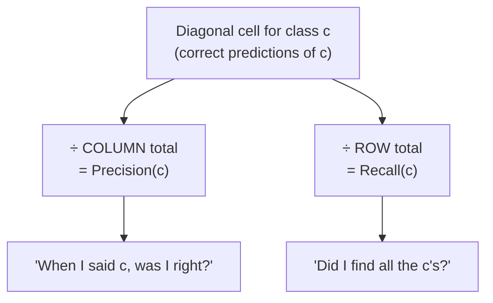

# 6 · Multiclass Metrics — Per-Class Scores and How to Average Them

> **Source:** Video 3 — *Precision, Recall and F1 Score | Classification Metrics Part 2* (second half). The instructor introduces this section by noting he couldn't find good resources on it when he was learning — and he's right that it's usually skipped. It is also where most people's metric bugs live.

Precision and recall are defined in terms of "positive" and "negative". With three classes there is no positive class. So what does precision even mean?

The answer is a two-step move that, once you see it, makes the whole area trivial:

1. Compute precision, recall and F1 **separately for each class**, treating that class as positive and all others as negative (one-vs-rest).
2. **Average** those per-class scores — and the choice of averaging scheme is a real decision with real consequences.

---

## 6.1 Reading a multiclass confusion matrix

A classifier over **dog / cat / rabbit**. Rows are actual, columns are predicted (scikit-learn's convention).

|  | pred **dog** | pred **cat** | pred **rabbit** | **row total (actual)** |
|---|---|---|---|---|
| **actual dog** | **25** | 9 | 6 | **40** |
| **actual cat** | 1 | **30** | 8 | **39** |
| **actual rabbit** | 3 | 11 | **20** | **34** |
| **column total (predicted)** | **29** | **50** | **34** | **113** |

The video's key move is adding those two totals, so read them carefully:

- **Row totals** = how many of each animal **actually exist** in the data. 40 dogs, 39 cats, 34 rabbits.
- **Column totals** = how many of each the **model predicted**. It called 29 things dogs, 50 things cats, 34 things rabbits.

Those two margins are precisely the denominators of recall and precision.



> **The rule to memorise:** for class $c$, both precision and recall have the **same numerator** — the diagonal cell $M_{cc}$. Precision divides by the **column** sum, recall by the **row** sum. Everything else in this chapter follows from that one sentence.

$$\text{Precision}(c) = \frac{M_{cc}}{\sum_i M_{ic}} \qquad\qquad \text{Recall}(c) = \frac{M_{cc}}{\sum_j M_{cj}}$$

---

## 6.2 Per-class scores, computed

**Precision** — diagonal ÷ column total:

| Class | Calculation | Precision |
|---|---|---|
| dog | 25 / 29 | **0.8621** |
| cat | 30 / 50 | **0.6000** |
| rabbit | 20 / 34 | **0.5882** |

**Recall** — diagonal ÷ row total:

| Class | Calculation | Recall |
|---|---|---|
| dog | 25 / 40 | **0.6250** |
| cat | 30 / 39 | **0.7692** |
| rabbit | 20 / 34 | **0.5882** |

**F1** — harmonic mean per class, or equivalently $2M_{cc} / (2M_{cc} + FP_c + FN_c)$:

| Class | F1 |
|---|---|
| dog | **0.7246** |
| cat | **0.6742** |
| rabbit | **0.5882** |

**Accuracy** = trace ÷ total = (25 + 30 + 20) / 113 = 75/113 = **0.6637**.

Already this is more informative than any single number. The **dog** column tells a specific story: precision 0.86 but recall only 0.63 — when the model says "dog" it is usually right, but it misses 15 of the 40 real dogs (9 called cats, 6 called rabbits). **Cat** is the mirror image: recall 0.77, precision 0.60 — it over-predicts "cat" (50 predictions for 39 real cats), sweeping in dogs and rabbits. That diagnosis is what you act on, and no averaged scalar contains it.

---

## 6.3 The three averaging schemes

Now collapse three numbers into one. There are three standard ways and they answer different questions.

### Macro average — every class counts equally

$$\text{Macro-}P = \frac{1}{C}\sum_{c} P(c)$$

$$\text{Macro-}P = \frac{0.8621 + 0.6000 + 0.5882}{3} = \mathbf{0.6834}$$

$$\text{Macro-}R = \frac{0.6250 + 0.7692 + 0.5882}{3} = \mathbf{0.6608} \qquad \text{Macro-}F_1 = \mathbf{0.6623}$$

A plain unweighted mean. A class with 3 samples has the same influence as a class with 3,000.

### Weighted average — each class counts by its support

Weight each class by its **support** — the number of *actual* instances (the row total).

$$\text{Weighted-}P = \sum_c \frac{n_c}{n} \cdot P(c) = \frac{40(0.8621) + 39(0.6000) + 34(0.5882)}{113} = \mathbf{0.6892}$$

$$\text{Weighted-}R = \mathbf{0.6637} \qquad \text{Weighted-}F_1 = \mathbf{0.6662}$$

### Micro average — pool all cells first, then compute once

Instead of averaging per-class scores, sum the raw counts across all classes and compute a single metric:

$$\text{Micro-}P = \frac{\sum_c TP_c}{\sum_c (TP_c + FP_c)}$$

For **single-label** multiclass classification every prediction is exactly one class, so every error is simultaneously a false positive for one class and a false negative for another. The sums coincide, and:

$$\boxed{\text{Micro-}P = \text{Micro-}R = \text{Micro-}F_1 = \text{Accuracy} = 0.6637}$$

**This is why you rarely see micro-averaging reported for single-label problems — it is just accuracy wearing a different name.** It becomes genuinely distinct only in **multi-label** settings, where one sample can carry several labels.

### Two identities worth knowing

- **Weighted recall = accuracy**, always, in single-label multiclass. (Verified above: both 0.6637.) So reporting "weighted recall" alongside accuracy is reporting one number twice.
- **Weighted precision ≠ accuracy** in general (0.6892 vs 0.6637 here), because precision's denominators are column sums while the weights are row sums.

### Choosing

| Scheme | Each class weighted by | Use when | Danger |
|---|---|---|---|
| **macro** | equally | classes are balanced, **or** the rare classes matter as much as common ones | a tiny class with a noisy score swings the average |
| **weighted** | its support | classes are imbalanced and you want the average to reflect the population you'll actually see | a rare-but-critical class becomes invisible |
| **micro** | every *sample* equally | multi-label problems | in single-label it is accuracy — reporting it as extra evidence is circular |

The video's guidance is correct as far as it goes — *balanced classes → macro; strongly imbalanced → weighted* — but it is worth sharpening, because the more common real situation inverts it:

> ### ⚠️ Important Note — the guidance flips when the rare class is the point
> If your rare class is the one you care about (fraud, disease, defects), **weighted averaging is exactly wrong**: it down-weights the class you built the model for, so the score is dominated by easy majority-class performance. In that situation prefer **macro** (equal voice per class) or simply report the rare class's own precision and recall unaveraged.
>
> Use weighted when you want *"how well does this perform on a random sample from the population?"* Use macro when you want *"how well does this perform on each class, treating them as equally important?"* Those are different questions and neither is the default answer.

---

## 6.4 Code

```python
# Dependencies: scikit-learn
from sklearn.metrics import (precision_score, recall_score, f1_score,
                             classification_report, confusion_matrix)

# average=None → one score per class, in sorted label order
precision_score(y_te, pred, average=None)     # array([0.8621, 0.6000, 0.5882])
recall_score(y_te, pred, average=None)        # array([0.6250, 0.7692, 0.5882])

# the three averaging schemes
precision_score(y_te, pred, average="macro")      # 0.6834
precision_score(y_te, pred, average="weighted")   # 0.6892
precision_score(y_te, pred, average="micro")      # 0.6637  == accuracy
```

### `classification_report` — the one command to prefer

The video's closing recommendation, and it is the right one. Rather than calling six functions, call this:

```python
print(classification_report(y_te, pred, target_names=["dog", "cat", "rabbit"], digits=4))
```

```
              precision    recall  f1-score   support

         dog     0.8621    0.6250    0.7246        40
         cat     0.6000    0.7692    0.6742        39
      rabbit     0.5882    0.5882    0.5882        34

    accuracy                         0.6637       113
   macro avg     0.6834    0.6608    0.6623       113
weighted avg     0.6892    0.6637    0.6662       113
```

Everything at once: per-class precision, recall, F1, and **support** (how many actual instances of that class exist — the row totals). Note that `accuracy` appears as a single figure rather than in three columns, precisely because micro-P = micro-R = micro-F1 = accuracy.

**Always read the `support` column first.** It tells you which per-class scores are trustworthy. A precision of 1.00 on a class with support 3 is noise; the same figure on support 3,000 is a finding. Reading a report top-to-bottom without checking support is how people end up excited about a metric computed from four samples.

> ### ⚠️ Important Note
> Pass `labels=` explicitly when a class may be absent from a fold or from your predictions. Otherwise the report silently omits the missing class, your arrays change length between folds, and any code averaging across folds breaks or — worse — quietly misaligns classes:
> ```python
> classification_report(y_te, pred, labels=[0, 1, 2], target_names=[...], zero_division=0)
> ```

### Scaling up

The video also runs this on **MNIST** (10 classes), where the confusion matrix is 10×10 and there are 90 distinct error types. At that size stop reading numbers and plot:

```python
import matplotlib.pyplot as plt
from sklearn.metrics import ConfusionMatrixDisplay

ConfusionMatrixDisplay.from_predictions(
    y_te, pred, normalize="true", values_format=".2f", cmap="Blues")
plt.show()
```

`normalize="true"` divides each row by its total, so cells become **per-class recall** and the diagonal is directly readable. The bright off-diagonal cells are your work queue — on MNIST they are reliably (4,9), (3,5), (7,1). Without normalisation, a large class's row visually swamps the plot and you see nothing.

---

## 6.5 One-vs-rest, made concrete

To see why per-class metrics are "treating that class as positive", collapse the 3×3 down for a single class. For **dog**:

|  | pred dog | pred **not** dog |
|---|---|---|
| **actual dog** | TP = 25 | FN = 9 + 6 = 15 |
| **actual not dog** | FP = 1 + 3 = 4 | TN = 30+8+11+20 = 69 |

- Precision = 25/(25+4) = 25/29 = 0.8621 ✓
- Recall = 25/(25+15) = 25/40 = 0.6250 ✓

Identical to §6.2. So **for class $c$: $FP_c$ is the rest of its column, $FN_c$ is the rest of its row, and $TN_c$ is everything in neither.** Every binary intuition from Chapter 5 transfers directly, one class at a time.

---

## Common Mistakes

> - **Mistake:** reporting only a macro or weighted average and never looking per class → **Why it's wrong:** averages hide exactly the failure you need to fix; the dog/cat asymmetry in §6.2 (one under-predicted, one over-predicted) is invisible in any single number → **Do instead:** print `classification_report` and read the per-class rows before the averages.
> - **Mistake:** using weighted averaging when the rare class is the point → **Why it's wrong:** weighting by support down-weights the minority class you built the model to detect, so the score reflects majority-class performance you never cared about → **Do instead:** macro-average, or report the critical class's precision and recall unaveraged.
> - **Mistake:** reporting micro-F1 alongside accuracy as independent evidence → **Why it's wrong:** in single-label multiclass they are mathematically identical, so it's one number presented as two → **Do instead:** report accuracy plus macro (and/or weighted) F1; reserve micro for genuinely multi-label problems.
> - **Mistake:** swapping row and column sums → **Why it's wrong:** you compute recall and label it precision; since the two often differ sharply per class (dog: 0.86 vs 0.63) your conclusions invert → **Do instead:** precision uses the **column** (what you predicted), recall uses the **row** (what exists).
> - **Mistake:** ignoring the `support` column → **Why it's wrong:** a perfect score on a class with 3 instances is sampling noise, and averaging it into macro-F1 with equal weight makes the headline number unstable → **Do instead:** check support first; treat any per-class score with support under ~30 as provisional and say so.
> - **Mistake:** omitting `labels=` when a class can be missing from a fold → **Why it's wrong:** the returned array silently shrinks, so cross-fold aggregation either crashes or misaligns class indices without any error → **Do instead:** always pass `labels=` explicitly in any loop or CV context, with `zero_division=0`.

---

## Exercises

**Beginner.** From the matrix in §6.1, compute precision and recall for **cat** without looking at §6.2. *Success criterion:* 30/50 = 0.60 and 30/39 = 0.769, and you can say which margin you used for each.

**Intermediate.** Verify that micro-precision, micro-recall, micro-F1 and accuracy are all equal on the §6.1 matrix by computing each from the raw cells. Then explain in two sentences why this identity holds for single-label but fails for multi-label classification. *Success criterion:* all four equal 75/113 = 0.6637, and your explanation turns on each sample producing exactly one prediction.

**Advanced.** Build a 4-class dataset with supports of roughly 1000, 500, 100, and 20. Fit any classifier and report macro-F1 and weighted-F1. Then deliberately break the model on the smallest class only (e.g. drop its most informative feature) and recompute both. *Success criterion:* macro-F1 falls substantially while weighted-F1 barely moves, and you can state which one you'd put on a dashboard for a rare-disease detector and why.

**Challenge.** You are evaluating a 30-class product-category classifier for a marketplace. Supports range from 40,000 down to 12. Revenue is concentrated in five mid-sized categories; regulatory risk is concentrated in two of the rarest. Design the reported metric suite — you may report more than one number, but you must be able to defend every one and explain what decision it drives. *Success criterion:* your suite handles the revenue/risk/size mismatch explicitly, you name at least one metric you deliberately refuse to report and why, and you specify how you'd handle categories whose support is too small to estimate reliably at all.

---

**Next:** [7 · Thresholds, ROC and Probability Metrics](07-thresholds-roc-and-probability-metrics.md)
