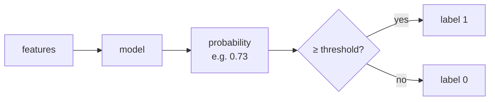

# 7 · Thresholds, ROC and Probability Metrics

> **This chapter is not in the playlist.** Video 3 closes by saying the next classification metric will come in the next video — and in this playlist there is no next video. What it was heading toward is ROC-AUC, and around it sits the whole family of metrics that judge *probabilities* rather than *labels*. Everything here is written from outside the videos to close that gap. It is also where the practical work actually happens: in production you tune a threshold far more often than you swap a model.

---

## 7.1 The hidden step: your classifier does not output labels

Chapters 4–6 treated classification as label-in, label-out. That is not what the model does.



```python
model.predict_proba(X_te)[:, 1]   # → array([0.02, 0.73, 0.41, 0.95, ...])
model.predict(X_te)               # → array([0, 1, 0, 1, ...])   applies threshold 0.5
```

**`predict()` is `predict_proba()` followed by a hard-coded 0.5.** That 0.5 is a default, not a decision. It has no claim to being right for your problem, and every metric in Chapters 4–6 is computed *after* it has been applied. Change the threshold and every one of those numbers changes — with no retraining.

This reframes Chapter 5's trade-off. Precision and recall are not fixed properties of a model; they are properties of a **model plus a threshold**. Choosing the threshold *is* choosing your position on the precision-recall trade-off.

---

## 7.2 Choosing a threshold on purpose

Two legitimate approaches.

### Optimise a metric

```python
import numpy as np
from sklearn.metrics import precision_recall_curve, fbeta_score

proba = model.predict_proba(X_te)[:, 1]
precision, recall, thresholds = precision_recall_curve(y_te, proba)

# F1 at every threshold; note precision/recall are len(thresholds)+1
f1 = 2 * precision * recall / (precision + recall + 1e-12)
best = np.nanargmax(f1[:-1])
print(f"best threshold {thresholds[best]:.3f} → F1 {f1[best]:.4f}")
```

### Optimise expected cost — the better method when you can price errors

If you can put a number on each mistake, skip metrics and minimise money directly:

$$\text{Cost}(t) = C_{FP}\cdot FP(t) + C_{FN}\cdot FN(t)$$

```python
C_FP, C_FN = 5, 500          # e.g. £5 to review a flagged case, £500 for a missed fraud

costs = []
for t in np.linspace(0.01, 0.99, 99):
    pred = (proba >= t).astype(int)
    fp = ((pred == 1) & (y_te == 0)).sum()
    fn = ((pred == 0) & (y_te == 1)).sum()
    costs.append((C_FP * fp + C_FN * fn, t))

total, t_star = min(costs)
print(f"cost-optimal threshold {t_star:.2f}  (expected cost {total})")
```

With $C_{FN} = 100 \times C_{FP}$, the optimal threshold lands far below 0.5 — the model should flag aggressively. **This is the honest version of "we care more about recall."** Instead of arguing about $\beta$, name the two costs and let the arithmetic pick.

> ### ⚠️ Important Note
> Tune the threshold on a **validation** set or inner CV fold, never on the test set. A threshold is a fitted parameter with one degree of freedom; choosing it against the test set inflates your reported score exactly the way hyperparameter tuning does. This is one of the most common leaks in production ML precisely because a threshold doesn't *feel* like a parameter.

---

## 7.3 The PR curve and average precision

Sweep the threshold from 1 to 0 and plot precision against recall.

- Starts near (recall 0, precision high) — only the most confident predictions.
- Ends at (recall 1, precision = base rate) — everything flagged.
- A perfect model reaches the top-right corner.

**Average Precision (AP)** summarises the curve as a single number, the area under it:

$$\text{AP} = \sum_n (R_n - R_{n-1}) \cdot P_n$$

```python
from sklearn.metrics import average_precision_score, PrecisionRecallDisplay
average_precision_score(y_te, proba)
PrecisionRecallDisplay.from_predictions(y_te, proba)
```

**The baseline matters and is easy to forget:** a random classifier's AP equals the **positive class prevalence**. On 1% positives, AP = 0.01 is random and AP = 0.10 is a 10× lift — genuinely good, despite looking terrible. Always report AP against the prevalence.

---

## 7.4 The ROC curve and ROC-AUC

Plot **true positive rate** against **false positive rate** as the threshold sweeps.

$$\text{TPR} = \frac{TP}{TP+FN} = \text{recall} \qquad\qquad \text{FPR} = \frac{FP}{FP+TN}$$

| Point | Meaning |
|---|---|
| (0, 0) | threshold 1.0 — flag nothing |
| (1, 1) | threshold 0.0 — flag everything |
| (0, 1) | perfect classifier |
| diagonal | random guessing |

**ROC-AUC** is the area under that curve, and it has a genuinely beautiful interpretation:

> **ROC-AUC is the probability that the model assigns a higher score to a randomly chosen positive than to a randomly chosen negative.**

So it measures **ranking quality**, threshold-free. AUC 0.5 = coin flip; AUC 1.0 = perfect separation; **AUC below 0.5 means your model is anti-correlated** — invert its predictions and you have a good model, which almost always signals a flipped label somewhere.

```python
from sklearn.metrics import roc_auc_score, RocCurveDisplay
roc_auc_score(y_te, proba)                  # pass PROBABILITIES, not labels
RocCurveDisplay.from_predictions(y_te, proba)
```

> ### ⚠️ Important Note — the single most common AUC bug
> `roc_auc_score(y_te, model.predict(X_te))` is **wrong**. Passing hard labels collapses the curve to three points and silently returns a much lower, meaningless number. It does not raise an error. Pass `predict_proba(...)[:, 1]`, or `decision_function(...)` for SVMs.

---

## 7.5 ROC-AUC vs PR-AUC on imbalanced data

This is the distinction that matters most in practice, and it is a direct continuation of §4.6.

Look at FPR's denominator: $FP + TN$ — the **entire negative class**. When negatives are 99.9% of the data, TN is enormous, so FPR stays tiny even when FP is large in absolute terms. **ROC-AUC therefore looks flattering on imbalanced problems.**

Concretely: 1,000,000 transactions, 1,000 fraudulent. A model flags 10,000 transactions and catches 800 frauds.

- Recall = 800/1000 = **0.80** — looks good
- FPR = 9,200/999,000 = **0.0092** — looks superb, so ROC-AUC will be high
- Precision = 800/10,000 = **0.08** — **92% of your alerts are false alarms**

The analysts working the queue experience precision, not FPR. ROC-AUC saw 9,200 false positives against a million negatives and shrugged; PR-AUC sees them against 800 true positives and does not.

| | ROC-AUC | PR-AUC (Average Precision) |
|---|---|---|
| Axes | TPR vs FPR | Precision vs Recall |
| Uses TN? | **yes** (in FPR) | **no** |
| Random baseline | always 0.5 | = positive prevalence |
| Behaviour under imbalance | optimistically stable | drops honestly |
| Insensitive to class ratio | yes — a feature *and* a trap | no |
| Use for | balanced problems; comparing rankers across datasets | **imbalanced problems**; anything with an alert queue |

**Rule of thumb:** if the positive class is under ~10%, lead with **PR-AUC**. Report ROC-AUC too if you like, but do not let it be the headline.

---

## 7.6 Judging the probabilities themselves

Everything so far judges *ordering* or *labels*. Sometimes the probability is the product — "this loan defaults with probability 0.07" feeds a pricing model, and being wrong about the 0.07 costs money even if the ranking is perfect.

### Log loss (binary cross-entropy)

$$\text{LogLoss} = -\frac{1}{n}\sum_i \left[ y_i\log(\hat{p}_i) + (1-y_i)\log(1-\hat{p}_i) \right]$$

Lower is better; 0 is perfect. **Punishes confident mistakes brutally** — predicting 0.99 for a true negative contributes $-\log(0.01) \approx 4.6$, while predicting 0.6 contributes only $\approx 0.92$. This is the standard training loss for classifiers and a reasonable reported metric when probabilities matter.

Its weakness: unbounded and hard to communicate. "Log loss 0.31" means nothing to a stakeholder, and a single pathologically confident error can dominate the average.

### Brier score

$$\text{Brier} = \frac{1}{n}\sum_i (\hat{p}_i - y_i)^2$$

Simply MSE on probabilities. Bounded in [0, 1], lower is better, and far more robust to a single overconfident error than log loss. Baseline: always predicting the prevalence $\bar{y}$ gives $\bar{y}(1-\bar{y})$ — compare against that, not against 0.

```python
from sklearn.metrics import log_loss, brier_score_loss
log_loss(y_te, proba)
brier_score_loss(y_te, proba)
```

---

## 7.7 Calibration — the property nobody checks

A model is **calibrated** if, among all cases it scores 0.7, about 70% are truly positive.

**Discrimination and calibration are independent.** A model that outputs `true_probability / 10` for everything has *perfect* ranking (AUC 1.0) and *terrible* calibration. If you threshold it, you get great decisions; if you multiply it by a loan amount to compute expected loss, you are wrong by 10×.

```python
from sklearn.calibration import CalibratedClassifierCV, calibration_curve
import matplotlib.pyplot as plt

prob_true, prob_pred = calibration_curve(y_te, proba, n_bins=10, strategy="quantile")
plt.plot(prob_pred, prob_true, "o-", label="model")
plt.plot([0, 1], [0, 1], "k--", label="perfect")
plt.xlabel("mean predicted probability"); plt.ylabel("observed fraction positive")
plt.legend(); plt.show()

# fix it — fit the calibrator on data the base model didn't train on
calibrated = CalibratedClassifierCV(base_model, method="isotonic", cv=5).fit(X_tr, y_tr)
```

**Which models need this:** SVMs and naive Bayes are badly calibrated by default. Random forests and boosted trees are usually over-confident near 0 and 1. Logistic regression is well calibrated almost by construction — it optimises log loss directly. Neural nets with modern training are typically over-confident.

**Two repair methods:** `method="sigmoid"` (Platt scaling — one parameter, safe on small data) and `method="isotonic"` (non-parametric, more flexible, needs a few thousand samples or it overfits).

> **Mental model:** discrimination is *sorting* the cases; calibration is *labelling the shelves with correct prices*. You can sort perfectly and price everything wrong.
>
> *Where the analogy breaks:* prices can be fixed after the fact by a monotone rescaling, which is exactly what calibration does — and because the rescaling is monotone, **calibration never changes ROC-AUC**. That surprises people: recalibrating cannot improve your ranking metric at all, and that is the clearest proof the two properties are orthogonal.

---

## 7.8 Two metrics that are better than they are famous

### Matthews Correlation Coefficient (MCC)

$$\text{MCC} = \frac{TP \cdot TN - FP \cdot FN}{\sqrt{(TP+FP)(TP+FN)(TN+FP)(TN+FN)}}$$

Ranges −1 to +1 (0 = random). MCC is the only common single-number classification metric that uses **all four** cells in a balanced way, so it is hard to fool. On the airport model from §4.6 (TP=0, FN=1, FP=0, TN=99,999) MCC is **0** — correctly, while accuracy said 99.999%. F1 would also expose it, but F1 ignores TN and is asymmetric under class swapping; MCC is not.

Many researchers argue MCC should be the default headline for binary classification. It is under-used mainly because it is harder to explain.

### Cohen's kappa

$$\kappa = \frac{p_o - p_e}{1 - p_e}$$

Observed agreement corrected for the agreement you'd get by chance. Useful for multiclass, and standard when comparing a model against human annotators — it answers "how much better than chance", which raw accuracy cannot.

```python
from sklearn.metrics import matthews_corrcoef, cohen_kappa_score
matthews_corrcoef(y_te, pred)
cohen_kappa_score(y_te, pred)
```

---

## 7.9 Choosing, in one table

| Your situation | Reach for |
|---|---|
| Balanced classes, labels are the product | accuracy + confusion matrix + F1 |
| Imbalanced, FN costly (screening, fraud) | recall, $F_2$, **PR-AUC** |
| Imbalanced, FP costly (moderation, alerts) | precision, $F_{0.5}$, **PR-AUC** |
| You can price the two errors | **expected cost** at the optimal threshold |
| Comparing rankers, roughly balanced | **ROC-AUC** |
| Probabilities feed a downstream calculation | **log loss / Brier + a calibration curve** |
| Want one robust number, hard to game | **MCC** |
| Comparing against human annotators | **Cohen's kappa** |
| Multiclass, all classes matter equally | **macro-F1** |
| Multiclass, reflect the population | **weighted-F1** |

**And in all cases: print the confusion matrix.** Every metric in this module is a lossy summary of it.

---

## Common Mistakes

> - **Mistake:** passing hard labels to `roc_auc_score` → **Why it's wrong:** the curve collapses to three points, returning a much lower number with no error raised, so you silently under-report and may discard a good model → **Do instead:** pass `predict_proba(X)[:, 1]` or `decision_function(X)`.
> - **Mistake:** treating 0.5 as the correct threshold → **Why it's wrong:** it is an arbitrary default that implicitly asserts FP and FN cost the same, which is false in nearly every real problem → **Do instead:** choose the threshold by expected cost or by the metric you actually care about, on a validation set.
> - **Mistake:** tuning the threshold on the test set → **Why it's wrong:** the threshold is a fitted parameter; selecting it against the test set inflates the reported score exactly as hyperparameter tuning would → **Do instead:** tune on validation or an inner CV fold, then evaluate once.
> - **Mistake:** leading with ROC-AUC on a 1%-positive problem → **Why it's wrong:** FPR's denominator is the whole negative class, so thousands of false alarms barely move it; the metric stays high while the alert queue is 92% noise → **Do instead:** lead with PR-AUC (Average Precision) and report prevalence as the baseline.
> - **Mistake:** comparing AP across datasets with different prevalence → **Why it's wrong:** AP's random baseline *is* the prevalence, so 0.30 on a 25%-positive set is barely better than random while 0.30 on a 1% set is a 30× lift → **Do instead:** report AP alongside prevalence, or report the lift ratio.
> - **Mistake:** assuming a high-AUC model gives usable probabilities → **Why it's wrong:** AUC depends only on ranking and is invariant to any monotone rescaling, so a perfectly-ranking model can be systematically off by 10× → **Do instead:** plot a calibration curve; if probabilities feed a downstream calculation, wrap the model in `CalibratedClassifierCV`.
> - **Mistake:** recalibrating and expecting AUC to improve → **Why it's wrong:** calibration applies a monotone transform, which cannot change the ordering AUC measures → **Do instead:** expect log loss and Brier to improve and AUC to stay put; if AUC moves, you have a bug or leakage.

---

## Exercises

**Beginner.** A model outputs probabilities [0.2, 0.4, 0.6, 0.8] for true labels [0, 1, 0, 1]. Give the predicted labels at thresholds 0.3, 0.5 and 0.7, and the accuracy at each. *Success criterion:* three different label vectors, and you can state which threshold you'd pick if false negatives were ten times worse than false positives.

**Intermediate.** On any binary dataset, compute ROC-AUC correctly and then incorrectly (passing `predict()` output). Report both. *Success criterion:* the incorrect value is noticeably lower, and you can explain geometrically why hard labels produce a three-point curve.

**Advanced.** Build a 1%-positive dataset. Train a classifier and report accuracy, ROC-AUC, and Average Precision. Then train a second, deliberately worse model and check which of the three metrics best reflects the degradation. *Success criterion:* accuracy barely moves, ROC-AUC moves a little, AP moves most — and you can quantify the gap and explain it via the TN term.

**Challenge.** You own a credit-risk model whose output is multiplied by loan size to compute expected loss, which sets the interest rate. The model has ROC-AUC 0.82 and is badly over-confident at the extremes. Explain what is and isn't broken, what it costs the business in concrete terms, how you would fix it, and — critically — why every ranking metric on your dashboard is blind to the problem. Then specify the monitoring you'd add so it cannot recur silently. *Success criterion:* you correctly separate discrimination from calibration, you identify that AUC is invariant to the defect, and your monitoring proposal includes a metric that would actually have caught it.

---

**Next:** [8 · Metrics in Production](08-metrics-in-production.md)
