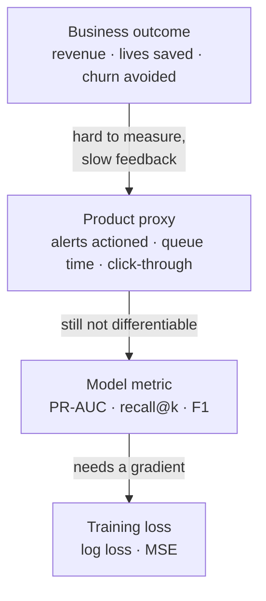

# 8 · Metrics in Production

> **This chapter is not in the playlist.** The videos stop at "here is how to compute the number." Everything that makes a metric survive contact with a real system — whether the difference between two models is even real, what breaks after deployment, and why the aggregate number is the one most likely to lie to you — is written from outside the videos.

---

## 8.1 The metric hierarchy

The metric you optimise is almost never the thing anyone actually wants.



Each arrow down buys tractability and loses fidelity. Every layer is a **proxy** for the one above, and proxies are gameable.

**The failure mode has a name: Goodhart's law.** *When a measure becomes a target, it ceases to be a good measure.* Concretely:

| Optimised | What the model learned instead |
|---|---|
| Recall on fraud | flag everything borderline; the review queue becomes unworkable and analysts start rubber-stamping |
| Click-through rate | clickbait; short-term clicks up, long-term retention down |
| Accuracy on a 99:1 dataset | predict the majority class always |
| Ticket resolution time | close tickets without resolving them |

**The defence is a guardrail metric.** Optimise one metric, and *constrain* the others: "maximise recall **subject to** precision ≥ 0.60, because the review team can absorb at most 400 alerts a day." State the constraint explicitly, in the units of the constraint (analyst-hours), not in metric units.

---

## 8.2 Offline vs online

| | Offline | Online |
|---|---|---|
| Data | historical, logged | live traffic |
| Measures | did the model rank/label the past correctly | did the system change user or business outcomes |
| Metrics | everything in Chapters 2–7 | conversion, revenue/user, queue throughput, complaint rate |
| Speed | minutes | days to weeks |
| Cost of being wrong | free | real |

**The two disagree constantly, and offline being better is not evidence.** The usual causes:

- **Feedback loops.** Your fraud model's decisions determine which transactions get labelled, so tomorrow's training set is shaped by today's model. Offline evaluation on that data is partly self-fulfilling.
- **Position and presentation effects.** A recommender's offline ranking metric ignores that users mostly click the top slot regardless of relevance.
- **Distribution shift.** Logged data reflects last quarter's users.
- **The action wasn't the prediction.** Offline you measure the score; online, a human sees the alert, forms a view, and may ignore it.

Ship behind an A/B test, and treat offline metrics as a **filter** — good enough to decide what deserves an experiment, never good enough to declare a win.

---

## 8.3 Is the difference even real?

Model A scores 0.847, model B scores 0.851. Ship B?

**Usually you cannot tell.** On a 500-row test set that gap is well inside sampling noise. Two ways to find out.

### Bootstrap confidence interval

Resample the test set with replacement, recompute, look at the spread:

```python
import numpy as np
from sklearn.metrics import f1_score

def bootstrap_ci(y_true, y_pred, metric=f1_score, n_boot=2000, seed=0):
    rng = np.random.default_rng(seed)
    y_true, y_pred = np.asarray(y_true), np.asarray(y_pred)
    n = len(y_true)
    stats = []
    for _ in range(n_boot):
        idx = rng.integers(0, n, n)
        if len(np.unique(y_true[idx])) < 2:      # skip degenerate resamples
            continue
        stats.append(metric(y_true[idx], y_pred[idx]))
    lo, hi = np.percentile(stats, [2.5, 97.5])
    return float(np.mean(stats)), float(lo), float(hi)

mean, lo, hi = bootstrap_ci(y_te, pred)
print(f"F1 = {mean:.3f}  95% CI [{lo:.3f}, {hi:.3f}]")
```

If the intervals for A and B overlap substantially, you have not shown a difference. **Report the interval, not just the point estimate** — it is the single highest-leverage change most teams can make to their reporting.

### McNemar's test — the right test for two models on the same test set

Paired, and it uses only the cases where the models *disagree*, which is where the information is:

```python
from statsmodels.stats.contingency_tables import mcnemar

both_right  = ((pred_a == y_te) & (pred_b == y_te)).sum()
a_only      = ((pred_a == y_te) & (pred_b != y_te)).sum()
b_only      = ((pred_a != y_te) & (pred_b == y_te)).sum()
both_wrong  = ((pred_a != y_te) & (pred_b != y_te)).sum()

print(mcnemar([[both_right, a_only], [b_only, both_wrong]], exact=True))
```

Note what it ignores: the cases both models get right. Those are shared and carry no evidence about which is better. A test that pools them (like comparing two independent accuracy figures) throws away the pairing and loses power.

> ### ⚠️ Important Note
> The number of *decimal places* you report is a claim about precision. "F1 = 0.8513" on a 200-row test set asserts a resolution of one part in ten thousand from 200 observations — indefensible. Round to the precision your interval supports, usually two decimals, and put the interval next to it.

---

## 8.4 The aggregate is the number most likely to lie

A single metric over the whole test set hides subgroup failure completely. This is the most consequential idea in the chapter.

A model at 92% overall accuracy can be:

| Segment | Share | Accuracy |
|---|---|---|
| Segment A | 90% | 95% |
| Segment B | 10% | 65% |

$0.9(95) + 0.1(65) = 92\%$. The headline is excellent. **The model is unusable for one in ten users**, and nothing on the dashboard says so.

**Always slice.** By whatever divides your population meaningfully:

```python
for name, mask in [("new users",      df.tenure_days < 30),
                   ("returning",      df.tenure_days >= 30),
                   ("mobile",         df.platform == "mobile"),
                   ("region: APAC",   df.region == "APAC")]:
    if mask.sum() < 30:
        print(f"{name:<16} n={mask.sum():>5}  (too small to report)")
        continue
    print(f"{name:<16} n={mask.sum():>5}  "
          f"F1={f1_score(y_te[mask], pred[mask]):.3f}")
```

Slices worth checking by default: **time** (is the model decaying?), **volume** (rare categories), **geography/language**, **device**, **new vs. established entities**, and any **protected attribute** where fairness is a legal or ethical requirement.

**On fairness:** the moment you slice by a protected attribute you are doing fairness measurement, and the metric definitions matter. *Demographic parity* (equal positive rates), *equal opportunity* (equal TPR), and *predictive parity* (equal precision) are mutually incompatible except in degenerate cases — this is a proved impossibility result, not an engineering gap. You must choose which one your domain requires and say so out loud. Do not let the choice happen by accident.

---

## 8.5 Baselines and lift

A metric without a baseline is uninterpretable. Always compute the dumbest defensible alternative:

```python
from sklearn.dummy import DummyClassifier, DummyRegressor

DummyClassifier(strategy="most_frequent")   # classification floor
DummyClassifier(strategy="stratified")      # respects class ratio
DummyRegressor(strategy="mean")             # regression floor — this is R²'s baseline
```

Report **lift**: "PR-AUC 0.31 against a 0.04 prevalence baseline — a 7.8× lift." That sentence is informative. "PR-AUC 0.31" is not.

Beyond the dummy, three baselines worth beating explicitly:

1. **The existing system.** If a rules engine already runs, its metrics are the bar. Beating a dummy is not an achievement.
2. **A human.** For anything a person currently does, measure them on the same test set. It reframes "82% accuracy" entirely if humans get 76%.
3. **A trivial model.** Logistic regression on three features. If your gradient-boosted ensemble beats it by 0.3 points, the ensemble's complexity is not paying for itself. (Cross-reference: [`24_xgboost/09-production-and-comparisons.md`](../24_xgboost/09-production-and-comparisons.md) discusses when the added complexity does pay.)

---

## 8.6 Monitoring after deployment

Offline metrics are a snapshot. Production is a moving target.

| What drifts | Detect with | Typical cause |
|---|---|---|
| **Input distribution** (covariate shift) | PSI, KL divergence per feature; simple mean/variance alarms | new market, new app version, upstream schema change |
| **Target distribution** (prior shift) | monitor the positive rate | seasonality, a fraud ring arriving |
| **The relationship** (concept drift) | metrics on newly-labelled data | adversaries adapting, policy changes |
| **The pipeline** | null rates, cardinality, range checks | the real cause of most incidents |

**The hard part is that labels arrive late.** Fraud is confirmed in 60 days; loan default in 3 years. So you cannot compute recall today. Monitor what you *can* see immediately:

- **Prediction distribution.** If mean predicted probability jumps from 0.04 to 0.11 overnight, something is wrong even before labels exist. This is your fastest signal by a wide margin.
- **Feature health.** Nulls, ranges, cardinality, unseen categories.
- **Proxy outcomes.** Alerts actioned by analysts, appeal rate, override rate.
- **Latency and error rates.** A model timing out and falling back to a default is a silent metric catastrophe.

> ### ⚠️ Important Note — training/serving skew
> The most common production failure is not drift. It is that the feature computed at serving time differs from the one computed at training time — different default for a missing value, a unit change, a timezone, an aggregation window computed over a different span. **Offline metrics cannot see this**, because offline you compute features the training way. The defence is to compute features once, in shared code (a feature store, or the same `Pipeline` object serialised and reused), and to log served feature vectors so you can replay them offline and diff.

---

## 8.7 The metrics that aren't about quality

A model that is accurate and unusable is not a good model.

| Metric | Why it can veto a deployment |
|---|---|
| **p50 / p99 latency** | a 400 ms p99 fails a 100 ms budget regardless of AUC. Watch p99, not the mean — the mean hides the tail that users feel |
| **Throughput** | predictions/second at peak |
| **Cost per 1k predictions** | a 0.2-point AUC gain for 8× the compute is usually a bad trade |
| **Model size / memory** | edge and mobile constraints |
| **Retraining cost & cadence** | how fast can you respond to drift |
| **Explainability** | often a regulatory requirement, not a nice-to-have |
| **Fallback behaviour** | what gets served when the model is down — and what metric that fallback has |

---

## 8.8 A reporting template

What a defensible model evaluation actually contains:

```markdown
## Model: fraud-detector v2.3

**Task** binary classification · positive = confirmed fraud
**Data** 1.2M transactions, Jan–Jun 2026 · prevalence 0.41%
**Split** GroupKFold(5) by customer_id, time-ordered holdout for final test
**Baseline** existing rules engine · recall 0.52, precision 0.31

### Headline
| Metric | v2.3 | v2.2 | rules | 95% CI (v2.3) |
|---|---|---|---|---|
| PR-AUC | 0.34 | 0.29 | — | [0.31, 0.37] |
| Recall @ precision ≥ 0.60 | 0.61 | 0.55 | 0.52 | [0.57, 0.64] |
| ROC-AUC | 0.961 | 0.958 | — | [0.955, 0.966] |

**Operating point** threshold 0.23, chosen by expected cost (C_FN = 140× C_FP)
**Significance** McNemar vs v2.2: p = 0.003

### Slices (recall @ threshold 0.23)
| Segment | n | recall | note |
|---|---|---|---|
| card-present | 890k | 0.64 | |
| card-not-present | 310k | 0.52 | ⚠️ below target |
| new customers (<30d) | 41k | 0.38 | ⚠️ investigate |

### Guardrails
- alert volume 380/day (capacity 400) ✅
- p99 latency 34 ms (budget 50 ms) ✅
- calibration: Brier 0.0031, curve within ±0.02 ✅

### Known limitations
- new-customer recall materially below aggregate; likely thin feature coverage
- labels lag ~60 days; this evaluation excludes Jun (unripe)
```

The parts people omit and shouldn't: **the baseline, the confidence interval, the slices, the guardrails, and the limitations.** A report with only the headline table is a marketing document.

---

## Common Mistakes

> - **Mistake:** reporting a single aggregate metric → **Why it's wrong:** an excellent average can hide a segment where the model is unusable, as in §8.4's 92%-overall / 65%-on-one-tenth example → **Do instead:** slice by time, volume, geography, device, and any protected attribute; report the worst slice next to the aggregate.
> - **Mistake:** declaring a winner from 0.847 vs 0.851 → **Why it's wrong:** the gap is typically inside sampling noise on realistic test sizes, so you are shipping randomness → **Do instead:** bootstrap a confidence interval and run McNemar's paired test; if intervals overlap, say the result is inconclusive.
> - **Mistake:** reporting metrics without a baseline → **Why it's wrong:** "PR-AUC 0.31" is uninterpretable; against 0.04 prevalence it's a 7.8× lift, against 0.28 it's noise → **Do instead:** always show a dummy baseline, the incumbent system, and where possible human performance.
> - **Mistake:** trusting offline gains to survive deployment → **Why it's wrong:** feedback loops, presentation effects, and distribution shift routinely reverse offline rankings; and offline evaluation cannot see training/serving skew at all → **Do instead:** treat offline as a filter for what deserves an A/B test, and log served features so you can replay them.
> - **Mistake:** monitoring only metrics that need labels → **Why it's wrong:** labels can lag 60 days to 3 years, so your dashboard is blind exactly when an incident starts → **Do instead:** monitor prediction distribution, feature health, and proxy outcomes daily; treat a shift in mean predicted probability as a page-worthy signal.
> - **Mistake:** optimising a proxy without a guardrail → **Why it's wrong:** Goodhart's law — maximise recall and the alert queue becomes unworkable, at which point analysts rubber-stamp and real-world recall collapses → **Do instead:** name one objective and explicit constraints, expressed in operational units like analyst-hours per day.
> - **Mistake:** reporting four decimal places on a 200-row test set → **Why it's wrong:** the precision claimed exceeds what the sample can support, lending false authority to noise → **Do instead:** round to what the confidence interval justifies and show the interval.

---

## Exercises

**Beginner.** A model has 92% accuracy overall. Segment A (90% of traffic) is at 95%; what is Segment B's accuracy, and why does the headline number make this invisible? *Success criterion:* 65%, and you can state the general principle about weighted averages hiding minority-segment failure.

**Intermediate.** Implement the bootstrap CI function from §8.3 and apply it to two models on the same test set. Report both point estimates and both intervals. *Success criterion:* you can state whether the difference is defensible, and you correctly handle resamples containing only one class.

**Advanced.** Take a dataset with a time column. Train on the first 70% chronologically and evaluate on the remaining 30% split into three consecutive blocks. Plot your primary metric across the three blocks. *Success criterion:* you can say whether performance decays over time, and you can distinguish decay from block-to-block noise using an interval rather than eyeballing.

**Challenge.** You are handed a deployed model with one dashboard tile: "accuracy 94.1%", green for eleven months. Labels arrive 45 days late. Design the complete replacement observability plan: which metrics, at what cadence, computed on what data, with what alert thresholds, and what each alert would page a human to do. Include at least two signals that need no labels at all, and specify how you would detect training/serving skew. *Success criterion:* your plan detects (a) gradual concept drift, (b) a sudden upstream schema change, and (c) a subgroup regression that leaves the aggregate untouched — and you can say which signal fires first in each case.

---

**Next:** [9 · Projects and Interview Prep](09-projects-and-interview-prep.md)
