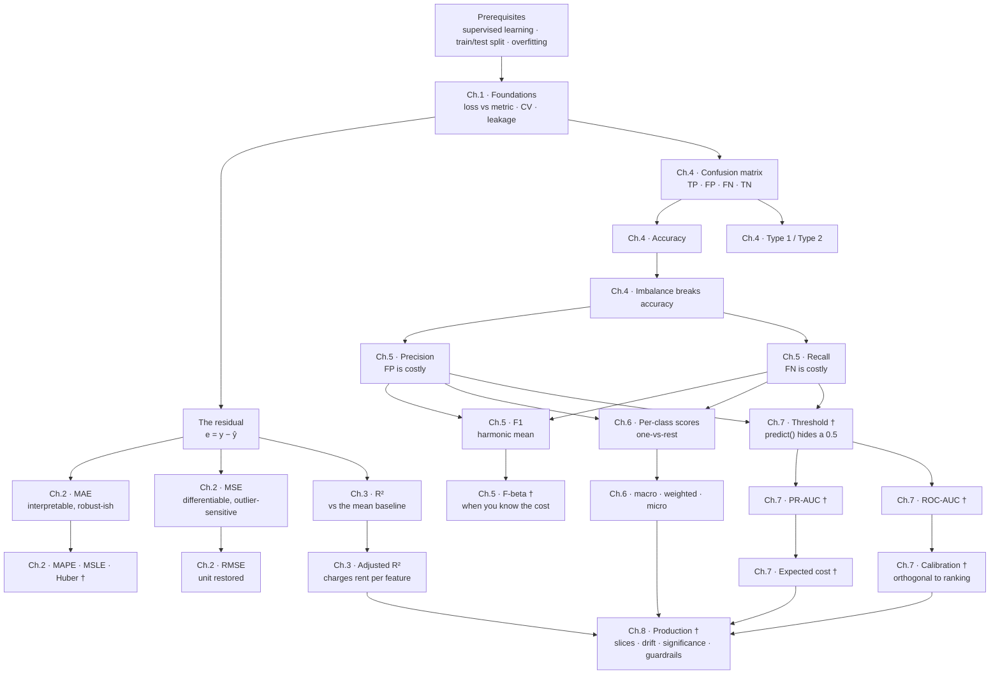

# 10 · Glossary and Dependency Map

---

## Glossary

Entries marked **†** go beyond what the playlist covers.

| Term | Meaning | Why It Matters |
|---|---|---|
| **Accuracy** | (TP+TN) / total — fraction of predictions that are correct | The natural first metric, and the one that fails hardest on imbalanced data. Always report class balance beside it |
| **Adjusted R²** | $1-\frac{(1-R^2)(n-1)}{n-k-1}$ | The only metric in Ch. 2–3 that can *fall* when you add a feature, which makes it the one usable for feature decisions |
| **Average Precision (AP)** † | Area under the precision-recall curve | The right headline for imbalanced problems; its random baseline equals prevalence, so it must be read against that |
| **Balanced accuracy** † | Mean of per-class recall | Smallest possible fix to accuracy under imbalance — scores the always-negative model at 0.50 instead of 99.999% |
| **Base rate / prevalence** | Fraction of samples that are positive | The baseline for AP and the reason accuracy misleads. A metric without it is uninterpretable |
| **Bootstrap CI** † | Confidence interval from resampling the test set with replacement | Turns "0.847 vs 0.851" from a decision into an honest "inconclusive" |
| **Brier score** † | Mean squared error on predicted probabilities | Bounded, robust alternative to log loss for judging probability quality |
| **Calibration** † | Whether a predicted 0.7 means 70% are truly positive | Independent of ranking; matters whenever the probability feeds a calculation rather than a threshold. Recalibration never changes AUC |
| **Coefficient of determination** | Another name for R² | You will meet the long name in statistics texts and the short one in code |
| **Cohen's kappa** † | Agreement corrected for chance agreement | The standard way to compare a model against human annotators |
| **Concept drift** † | The input→target relationship itself changes | Requires retraining, not rescaling; the usual cause is adversaries or policy changes |
| **Confusion matrix** | Table of actual vs predicted counts | Strictly dominates accuracy: accuracy is derivable from it, never the reverse. Print it always |
| **Covariate shift** † | Input distribution changes, relationship stays | Detectable without labels, which makes it your fastest production signal |
| **Cross-validation** | Averaging metrics over k train/test folds | A single split is noisy enough to reverse a model ranking; CV plus a std-dev is the minimum defensible comparison |
| **F1 score** | Harmonic mean of precision and recall, $\frac{2PR}{P+R}$ | One number when neither error type dominates — but symmetric, so useless once you *have* decided which error is worse |
| **F-beta score** † | $(1+\beta^2)\frac{PR}{\beta^2 P + R}$ | The metric F1 should have been when you know your error costs. $\beta>1$ favours recall, $\beta<1$ precision |
| **False Negative (FN)** | Predicted negative, actually positive — a **miss** | Type 2 error. The costly one in screening, fraud, and safety |
| **False Positive (FP)** | Predicted positive, actually negative — a **false alarm** | Type 1 error. The costly one in spam, moderation, and enforcement |
| **FPR** — false positive rate | FP / (FP + TN) | ROC's x-axis. Its huge TN denominator is exactly why ROC-AUC flatters imbalanced problems |
| **Goodhart's law** † | When a measure becomes a target it stops being a good measure | The reason every optimised metric needs an explicit guardrail |
| **Harmonic mean** | $\frac{2ab}{a+b}$ for two values | Sits near the smaller value, so it refuses to let a strong metric hide a weak one. Why F1 isn't an average |
| **Imbalanced dataset** | Classes present in very unequal proportion | The single most common reason a metric lies. At 1:100,000 a useless model scores 99.999% |
| **Leakage** | Information from outside the training fold reaching the model | Produces excellent metrics and a worthless model. Fitting a scaler before splitting is the everyday version |
| **Lift** † | Metric relative to a baseline (e.g. AP / prevalence) | Converts an uninterpretable score into a claim: "7.8× better than random" |
| **Log loss** | $-\frac{1}{n}\sum[y\log\hat p + (1-y)\log(1-\hat p)]$ | Standard classifier training loss; punishes confident errors brutally, and is unbounded |
| **MAE** | Mean absolute error, $\frac{1}{n}\sum\lvert e_i\rvert$ | The interpretable regression metric — same unit as the target, less outlier-sensitive than RMSE |
| **MAPE** † | Mean absolute percentage error | For judging error relative to magnitude; undefined at $y=0$ and asymmetric |
| **Macro average** | Unweighted mean of per-class scores | Every class gets an equal vote — the right default when the rare class is the point |
| **MCC** † | Matthews correlation coefficient, −1 to +1 | The only common single number using all four cells symmetrically; very hard to game |
| **McNemar's test** † | Paired significance test for two models on one test set | Uses only the disagreement cells, which is where the evidence lives |
| **Micro average** | Pool all counts, then compute once | Equals accuracy for single-label multiclass, so reporting both is circular. Distinct only for multi-label |
| **MSE** | Mean squared error, $\frac{1}{n}\sum e_i^2$ | A loss function, not a report metric — its unit is the target squared |
| **Precision** | TP / (TP + FP) | "When I raise an alarm, am I right?" Divides by the predicted-positive **column** |
| **PR curve** † | Precision plotted against recall over all thresholds | The honest picture on imbalanced data, because neither axis contains TN |
| **R²** | $1 - SS_{res}/SS_{tot}$ | Scale-free: scores your model against predicting the mean. Can be negative on test data |
| **Recall** | TP / (TP + FN) | "Did I catch everything?" Divides by the actual-positive **row**. Also sensitivity, TPR |
| **Residual** | $e_i = y_i - \hat{y}_i$ | The raw material of every regression metric. Its mean is exactly 0 for OLS with an intercept, which is why you must square or take absolutes |
| **RMSE** | $\sqrt{MSE}$ | MSE's outlier weighting with the target's unit restored. RMSE ≥ MAE always; the ratio is a free outlier detector |
| **ROC-AUC** † | P(model scores a random positive above a random negative) | Measures ranking only; threshold-free and invariant to monotone rescaling. Misleading under strong imbalance |
| **Slice / segment metric** † | The metric recomputed on a subpopulation | An excellent aggregate routinely hides a segment where the model is unusable |
| **$SS_{res}$** | $\sum(y_i-\hat y_i)^2$ — residual sum of squares | R²'s numerator: your model's squared error |
| **$SS_{tot}$** | $\sum(y_i-\bar y)^2$ — total sum of squares | R²'s denominator: the mean-line baseline's squared error |
| **Stratified split** | Split preserving class proportions | Non-negotiable for classification; a random split can hand you a fold with no positives |
| **Support** | Number of actual instances of a class | Read it before any per-class score. A precision of 1.00 on support 3 is noise |
| **Threshold** † | The cutoff turning a probability into a label | `predict()` hardcodes 0.5, which asserts equal error costs. Choosing it deliberately is usually higher-leverage than changing models |
| **TPR** — true positive rate | Same as recall | ROC's y-axis |
| **True Negative (TN)** | Predicted negative, actually negative | Appears in accuracy and FPR; appears in **neither** precision, recall, nor F1 — the structural reason those three survive imbalance |
| **True Positive (TP)** | Predicted positive, actually positive | The numerator of precision, recall, and F1 alike |
| **Type 1 / Type 2 error** | FP / FN respectively | Pure vocabulary, asked constantly. Type 1 = saw something that isn't; Type 2 = missed something that is |
| **Weighted average** | Per-class scores weighted by support | Reflects the population you'll see. Down-weights the rare class — wrong when the rare class is why you built the model |

**The naming cheat code, worth keeping:** the **second** word (Positive/Negative) is what the **model predicted**; the **first** word (True/False) says whether that prediction was **right**.

---

## Dependency Map

The order these ideas must be learned in — and the reason the chapters are sequenced as they are rather than following the playlist's video order.

### Why this order, and not the playlist's

| The playlist | This module | Reason |
|---|---|---|
| Formulas first | Loss-vs-metric distinction first (Ch. 1) | MAE's "non-differentiability problem" is incoherent until you know a metric isn't optimised |
| R² immediately after RMSE | Same, but with the mean-line baseline made explicit first | R² is *only* meaningful as a comparison against a baseline; teaching the formula before the baseline inverts the logic |
| Accuracy → confusion matrix | Confusion matrix → accuracy | Accuracy is derivable from the matrix and not vice versa; building the matrix first makes accuracy a special case rather than a separate idea |
| Imbalance discussed after accuracy | Same placement | Correct — the failure motivates precision and recall, and the videos get this sequencing right |
| Multiclass precision/recall at the end of video 3 | Its own chapter, after binary F1 | It is a genuinely separate skill (margins and averaging schemes) and gets buried as a video appendix |
| Threshold, ROC, calibration: absent | Ch. 7, before production | Video 3 promises "the next metric" and there is no next video. Every production metric decision depends on the threshold |
| Production concerns: absent | Ch. 8 | Where the actual work is: significance, slices, drift, guardrails |

### Gaps this module fills

The playlist assumes or omits all of the following. Each is written from scratch here:

- **Loss function vs. evaluation metric** (Ch. 1) — the distinction that makes MAE-vs-MSE sensible
- **Cross-validation and leakage** (Ch. 1) — the videos evaluate on one split
- **Huber, MAPE, sMAPE, MSLE** (Ch. 2) — the resolution of the MAE/MSE tension, and relative-error metrics
- **Anscombe's warning** (Ch. 3) — why a high R² is not a good model
- **Balanced accuracy** (Ch. 4) — the smallest fix for imbalance
- **F-beta** (Ch. 5) — F1's symmetry means it discards the very decision Ch. 5 teaches you to make
- **Why precision and recall survive imbalance** (Ch. 5) — because neither contains TN; the videos show the result, not the mechanism
- **Thresholds, PR-AUC, ROC-AUC, log loss, Brier, calibration, MCC, kappa** (Ch. 7) — the entire probability-metric family
- **Significance testing, slice metrics, drift, guardrails, training/serving skew** (Ch. 8) — everything after "the model works on my laptop"

### Where to go next

| Direction | Module |
|---|---|
| A model to apply these to | [`24_xgboost/`](../24_xgboost/README.md) — and its Ch. 8 covers metric selection *for* XGBoost specifically |
| Evaluating LLMs and RAG, where none of these apply | [`16_evals/`](../16_evals/README.md) |
| Deploying and monitoring the models you've measured | [`Shared/02_mlops/`](../../Shared/02_mlops/README.md) · [`Shared/03_llmops/`](../../Shared/03_llmops/README.md) |
| Metrics inside a training loop | [`22_transformer-and-gpt-architecture/`](../22_transformer-and-gpt-architecture/README.md) |

---

**Back to:** [README](README.md)
