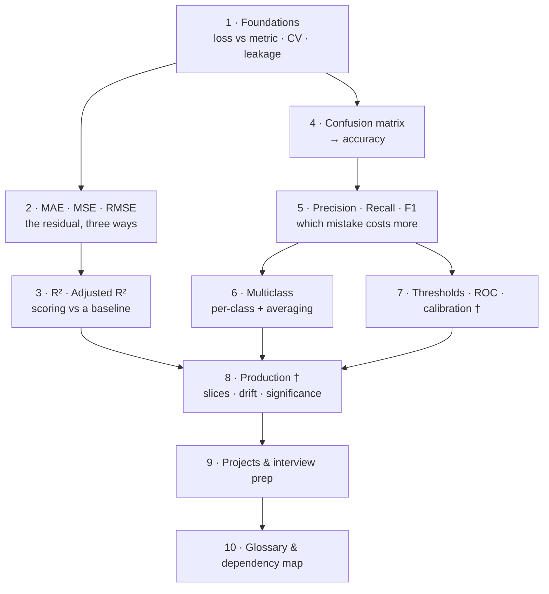

# 📏 Machine Learning Evaluation Metrics — Complete Technical Tutorial

> **Source:** CampusX *Machine Learning Metrics* playlist · 3 videos (~2h 01m) · [playlist](https://www.youtube.com/playlist?list=PLKnIA16_RmvZJGOqRjqhOhTEmQW3vDdbQ)
> **What you'll be able to do:** choose the right metric for a problem and defend the choice, compute every common regression and classification metric by hand, recognise the four situations where a metric silently lies to you, set a decision threshold from error costs rather than accepting 0.5, and build an evaluation report that survives review.

**This is a course, not video notes.** The playlist is the backbone; its prerequisites, the distinction it blurs, the metric family it promises and never delivers, and everything needed to run metrics in production are filled in. You should never need to open the videos.

---

## 🗺️ The arc of this module

† = written from outside the playlist, which does not cover these.

---

## 📓 Chapters

| # | Chapter | What you'll learn |
|---|---------|-------------------|
| 1 | [Foundations & the Evaluation Problem](01-foundations-and-the-evaluation-problem.md) | Why training error is worthless, the three-way split, **loss function vs. evaluation metric**, cross-validation, the leakage rule, why there is no best metric |
| 2 | [Regression Metrics — MAE, MSE, RMSE](02-regression-metrics-mae-mse-rmse.md) | The residual; all 7 facets of each metric; MSE as the area of squares; the RMSE/MAE ratio as a free outlier detector; **MAPE, sMAPE, MSLE, Huber** |
| 3 | [R² and Adjusted R²](03-r2-and-adjusted-r2.md) | The mean-line baseline; variance explained; **negative R² and what it tells you**; why R² can never reject a feature; adjusted R² worked both ways |
| 4 | [Accuracy and the Confusion Matrix](04-accuracy-and-the-confusion-matrix.md) | Accuracy and its interview trap; TP/FP/FN/TN with the naming cheat code; Type 1 vs Type 2; sklearn's cell order; **why imbalance makes accuracy lie** |
| 5 | [Precision, Recall and F1](05-precision-recall-and-f1.md) | Two models, same accuracy, opposite verdicts; the spam and cancer decisions; harmonic vs arithmetic mean; **F1's blind spot and F-beta** |
| 6 | [Multiclass Metrics](06-multiclass-metrics.md) | Per-class scores from row and column margins; **macro vs weighted vs micro** and when the standard advice inverts; `classification_report` and reading `support` |
| 7 | [Thresholds, ROC and Probability Metrics](07-thresholds-roc-and-probability-metrics.md) † | `predict()` hides a 0.5; cost-optimal thresholds; PR-AUC vs ROC-AUC under imbalance; log loss, Brier, **calibration**, MCC, kappa |
| 8 | [Metrics in Production](08-metrics-in-production.md) † | Goodhart's law and guardrails; offline vs online; **bootstrap CIs and McNemar's test**; slice metrics and fairness; drift with delayed labels; training/serving skew |
| 9 | [Projects & Interview Prep](09-projects-and-interview-prep.md) | 3 graded projects · **38 answered questions** (10 basic · 10 intermediate · 10 advanced · 8 system design) |
| 10 | [Glossary & Dependency Map](10-glossary-and-dependency-map.md) | 50+ terms with a *why it matters* column; full dependency graph; why this ordering differs from the playlist's |

---

## 🎥 Source videos

| # | Video | Length | Covered in |
|---|-------|:------:|-----------|
| 1 | [Regression Metrics · MSE, MAE & RMSE · R² & Adjusted R²](https://www.youtube.com/watch?v=Ti7c-Hz7GSM&list=PLKnIA16_RmvZJGOqRjqhOhTEmQW3vDdbQ&index=1) | 43:55 | Ch. 2, 3 |
| 2 | [Accuracy and Confusion Matrix · Type 1 and Type 2 Errors](https://www.youtube.com/watch?v=c09drtuCS3c&list=PLKnIA16_RmvZJGOqRjqhOhTEmQW3vDdbQ&index=2) | 34:07 | Ch. 4 |
| 3 | [Precision, Recall and F1 Score](https://www.youtube.com/watch?v=iK-kdhJ-7yI&list=PLKnIA16_RmvZJGOqRjqhOhTEmQW3vDdbQ&index=3) | 42:41 | Ch. 5, 6 |

---

## 🧭 The five ideas worth taking away

1. **A metric is a lossy summary of the confusion matrix (or of the residuals).** Print the matrix. Every scalar in this module throws information away, and the information it throws away is usually the thing you needed.
2. **Loss ≠ metric.** Differentiability is a constraint on what the optimiser consumes, not on what you report. This single distinction dissolves most confusion about MAE vs MSE.
3. **Which error costs more is a domain question, not a data question.** Chapter 5 shows the same two models, with identical accuracy, where the right answer flips between spam filtering and cancer screening. Nothing in the data tells you which; only the domain does.
4. **The aggregate is the number most likely to lie.** 92% overall can hide a segment at 65%. 99.999% accuracy can hide a model that has never once been right about the thing it was built for.
5. **The threshold is a decision you are making whether or not you notice.** `predict()` hardcodes 0.5, silently asserting that a false alarm and a miss cost the same. They almost never do.

---

## 📝 A note on sourcing

The transcripts behind this module are **Hindi auto-captions** (the videos are taught in Hinglish). YouTube's English auto-translation of them is badly mangled — "similarity score" arrives as "Shimla Disco", "residuals" as "vegetables" — so the Hindi source captions were used instead, which are roughly 2.4× denser and preserve the English technical vocabulary transliterated.

Even so, ASR reliably corrupts digits. So:

- **Every formula and every worked number in this module was recomputed and verified independently.** Where the instructor's arithmetic could be reconstructed, it was, and it checks out — the multiclass matrix in Chapter 6, for instance, is built to reproduce all five of his recoverable per-class figures (25/29, 30/50, 20/34, 25/40) exactly and self-consistently.
- **Where his live demo figures could not be recovered reliably, they are marked as approximate or replaced with clean worked examples that are labelled as such.** No number is attributed to the videos unless it survived verification. Anything reconstructed says so on the spot.
- Chapters 7 and 8, and the additions flagged † throughout, are written from outside the playlist entirely.

---

## 🔗 Related modules

| Module | Relationship |
|---|---|
| [`24_xgboost/`](../24_xgboost/README.md) | The model to point these metrics at. Its Ch. 8 covers metric selection, CV strategy and early stopping *for gradient boosting specifically* — read it after Ch. 7 here |
| [`16_evals/`](../16_evals/README.md) | LLM and RAG evaluation, where almost none of this module applies — no single correct output, so rubric-based and judge-based methods take over |
| [`Shared/02_mlops/`](../../Shared/02_mlops/README.md) · [`Shared/03_llmops/`](../../Shared/03_llmops/README.md) | Deploying and monitoring the models you've measured here; Ch. 8 is the metric-shaped slice of that discipline |
| [`19_agentic-ai-interview/`](../19_agentic-ai-interview/README.md) | Interview preparation more broadly; Ch. 9 here is the metrics-specific set |

---

## How each chapter is structured

- **Concept, taught to depth** — important concepts get all seven facets: what, why, how, when to use, **when *not* to**, trade-offs, example.
- **Worked arithmetic** — verified, and reused across chapters so the numbers stay familiar (the 32/8/12/48 confusion matrix runs through Ch. 4 and 5).
- **Mermaid diagrams** wherever there is structure, and a **mental model with its breaking point named** for the genuinely hard ideas.
- **⚠️ callouts** where the videos are outdated, oversimplified, or where sklearn will bite you.
- **Common Mistakes** — each with the mechanism of failure and the correction, not just a warning.
- **Exercises** at four levels with success criteria and no premature solutions.
