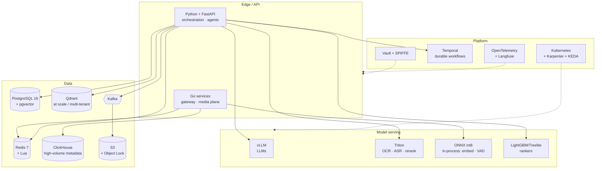

# 00 · Tech Stack — the shared substrate and where the ten systems diverge

> **Read [`00_requirements_all_systems.md`](00_requirements_all_systems.md) first.** That file fixes the
> numbers; this one fixes the *technologies*. Each system's own concrete stack lives in its
> **§2.7 Tech stack** section — this document holds the shared substrate, the places the ten systems
> genuinely disagree, and the reasoning that decides those disagreements.

---

## The four rules this document follows

1. **A technology name is not a decision.** "Postgres" is a noun; *"Postgres with `pgvector` until ~50M
   vectors, then Qdrant for namespace isolation"* is a decision. Every row below carries a **revisit-when
   threshold**, the same rule the [designs themselves follow](README.md).
2. **Boring by default.** Postgres, Redis, S3, Kafka, and Kubernetes are chosen repeatedly not because
   they're optimal but because their failure modes are *known*. Novel infrastructure in an AI system means
   debugging two unfamiliar things at once.
3. **Every added component has an operational cost that no TCO table in this set includes.** This is
   [SA-8](00_requirements_all_systems.md#shared-assumptions-register) — engineering cost is out of scope
   for the arithmetic, which means **every "just add X" is understated.** A stack of nine components needs
   someone to upgrade nine components.
4. **Managed until the arithmetic says otherwise.** Three systems in this set flipped on that arithmetic —
   [04](04_llm_inference_platform/README.md) says *don't* self-host LLMs at moderate utilization,
   [05](05_document_intelligence/README.md) says *do* self-host OCR (~107× cheaper), and
   [08](08_realtime_voice_assistant/README.md)/[10](10_enterprise_agent_platform/README.md) reach the same
   verdict for ASR and guardrails at scale. **The pattern is in §"When self-hosting flips" below** — it's
   the most transferable thing on this page.

---

## The shared substrate

Nine of the ten systems run on the same base. Divergence is the exception and is called out per system.

### Language and runtime

| Layer | Choice | Rejected | Why | Revisit when |
|---|---|---|---|---|
| **Orchestration / agent logic** | **Python 3.12, async, FastAPI + Pydantic** | Node/TypeScript | The LLM ecosystem is Python-first; Pydantic gives schema validation that doubles as the API contract | Never for this workload |
| **Latency-critical proxies** | **Go** — [09](09_multi_provider_llm_platform/README.md) gateway, [08](08_realtime_voice_assistant/README.md) media plane | Python | A 30 ms p95 budget cannot absorb GC pauses and GIL contention. **This is the one place the language choice is load-bearing** | Never below ~50 ms budgets |
| **Hard real-time / DSP** | **Rust** — audio frame handling, AEC glue | Go | Frame-level audio work at 20 ms cadence wants no GC at all | Only if Go proves adequate under load |
| Internal RPC on hot paths | **gRPC + protobuf** | REST/JSON | Serialization cost matters at 2k+ RPS; typed contracts matter across 30 teams | — |
| External API | **REST + JSON, SSE for streaming** | gRPC-web | Every consumer already speaks it | — |

> **The Python/Go split is not a preference, it's a budget consequence.** [09](09_multi_provider_llm_platform/README.md)
> needs p95 < 30 ms of *pure overhead* and [08](08_realtime_voice_assistant/README.md) needs 150 ms
> barge-in; Python's tail latency under load is a material fraction of both. Everywhere the budget is in
> seconds, Python wins on ecosystem.

### Data stores

| Need | Choice | Rejected | Why | Revisit when |
|---|---|---|---|---|
| **Primary OLTP** | **PostgreSQL 16** — partitioned, JSONB, partial indexes | MySQL, DynamoDB | Partial indexes carry real design weight here ([01's `WHERE embed_version = 2`](01_production_rag_system/03_lld.md#31-data-models)), and JSONB avoids a schema migration per payload change | Write volume exceeds ~50k TPS on one primary |
| **Counters, locks, budgets** | **Redis 7** (Cluster where sharded), **Lua for atomicity** | Postgres rows | [09's governance script](09_multi_provider_llm_platform/03_lld.md#governance-in-one-atomic-redis-round-trip) needs one atomic round trip in 3 ms | — |
| **Objects** — documents, audio, bodies | **S3** (+ Object Lock where WORM is required) | Filesystem/NFS | Lifecycle policies *are* the retention design in [05](05_document_intelligence/README.md), [09](09_multi_provider_llm_platform/README.md), [10](10_enterprise_agent_platform/README.md) | — |
| **High-volume metadata / analytics** | **ClickHouse** | Postgres | [09](09_multi_provider_llm_platform/README.md) writes 173M rows/day of request metadata; Postgres is the wrong shape for that scan pattern | Below ~10M rows/day, stay on Postgres |
| **Durable event backbone** | **Kafka** | RabbitMQ, SQS | Replay is the feature: [01](01_production_rag_system/README.md) re-embeds, [06](06_recommendation_system/README.md) rebuilds features, [05](05_document_intelligence/README.md) reprocesses | Below ~1k events/s with no replay need, SQS is less to operate |
| **Vectors** | **`pgvector` → Qdrant** | Pinecone-first | One less system until scale demands it; see the threshold below | **~50M vectors, or when per-tenant namespace isolation is required** |

**The `pgvector` → Qdrant threshold is the most reused decision in the set**, and it has two independent
triggers rather than one. Volume (~50M vectors, where HNSW build times and memory stop fitting comfortably
alongside OLTP) is the obvious one. **Namespace isolation is the one that usually fires first** — in
[10](10_enterprise_agent_platform/README.md), 200 tenants each needing an enforced boundary is an
architectural need at any volume, not a performance one.

### Model serving and ML runtime

| Need | Choice | Rejected | Why | Revisit when |
|---|---|---|---|---|
| **LLM serving (self-hosted)** | **vLLM** on Kubernetes | Triton, TGI, raw Transformers | PagedAttention is the reason [04's KV-cache math](04_llm_inference_platform/README.md) works at all | — |
| **Non-LLM model serving** | **Triton Inference Server** — OCR, rerankers, ASR | vLLM | Fixed-shape batching suits fixed-shape models; Triton's dynamic batcher is built for it | — |
| **In-process small models** | **ONNX Runtime, int8** — MiniLM embedder, Silero VAD | Torch in-process | [09's semantic cache needs a ~4 ms embed](09_multi_provider_llm_platform/README.md); a hosted call is 20–40 ms and blows the whole budget | — |
| **Gradient-boosted trees** | **LightGBM**, served via **Treelite/ONNX** | A neural ranker | [06 needs 0.06 ms/candidate](06_recommendation_system/README.md) across 216B scorings/day | Latency budget triples, or features become truly sequential |
| **Embeddings** | Hosted API by default; **self-hosted BGE/E5 on Triton at volume** | Always self-host | Below high volume, a hosted embedding API is cheaper than a GPU's idle time | Sustained utilization > ~60% |

### Platform, delivery, observability

| Need | Choice | Rejected | Why | Revisit when |
|---|---|---|---|---|
| Compute | **Kubernetes** + **Karpenter** | Serverless (Lambda) | Cold starts and 15-minute ceilings are disqualifying for GPU serving and long agent loops | — |
| Autoscaling | **KEDA on queue depth** | HPA on CPU | [04's central autoscaling finding](04_llm_inference_platform/README.md): GPU serving is not CPU-bound, so CPU-based scaling is blind | Never |
| IaC / delivery | **Terraform** + **ArgoCD** (GitOps) | Helm-by-hand, CDK | [10](10_enterprise_agent_platform/README.md) needs agent definitions *and* policy to be reviewable commits | — |
| **Durable workflows** | **Temporal** — [05](05_document_intelligence/README.md) pipelines, [10](10_enterprise_agent_platform/README.md) approvals, [03](03_multi_agent_system/README.md) DAGs | Celery, Airflow, hand-rolled state machines | Human approval steps can pause for *days*. Temporal makes that a first-class wait rather than a cron scanning a table | Below ~10 workflow types with no human waits, Arq/Celery is less to run |
| Simple background queues | **Arq** (Redis-backed) | Temporal for everything | Not every async job needs durable execution semantics | — |
| Metrics / traces | **OpenTelemetry** → Prometheus + Grafana + Tempo | Vendor agent per system | One instrumentation vocabulary across ten systems | — |
| **LLM-specific tracing** | **Langfuse** (self-hosted) | Generic APM only | Per-call token counts, prompt versions, and cost must be first-class dimensions, not log lines | — |
| Secrets / workload identity | **Vault** + **SPIFFE/SPIRE** | Env vars, long-lived keys | [09's key custody](09_multi_provider_llm_platform/README.md) and [10's token exchange](10_enterprise_agent_platform/README.md) both need short-lived, rotatable credentials | Never |

---

## Where the systems genuinely diverge

The interesting part. Same-sounding need, different technology, because a *number* differs.

| Need | Divergence | Driven by |
|---|---|---|
| **Vector store** | `pgvector` in [01](01_production_rag_system/README.md)/[02](02_customer_support_agent/README.md) · **Qdrant** in [10](10_enterprise_agent_platform/README.md) · **FAISS/ScaNN in-process** in [06](06_recommendation_system/README.md) | Volume, tenant isolation, and whether retrieval is a service call or a 5 ms in-process step |
| **Cache** | Redis exact-match in [01](01_production_rag_system/README.md) · Redis + **in-process ONNX embedder** in [09](09_multi_provider_llm_platform/README.md) | A 30 ms total budget cannot contain a network embedding call |
| **Queue** | Kafka in [01](01_production_rag_system/README.md)/[05](05_document_intelligence/README.md)/[06](06_recommendation_system/README.md) · **Temporal** in [10](10_enterprise_agent_platform/README.md) · **Redis + Lua CAS** in [03](03_multi_agent_system/README.md) | Replay vs. durable human waits vs. compare-and-set on shared state |
| **Model tier** | Frontier permitted in [01](01_production_rag_system/README.md)/[02](02_customer_support_agent/README.md) · **small-tier forced** in [08](08_realtime_voice_assistant/README.md) | [08's 900 ms frontier TTFT exceeds its whole 800 ms budget](08_realtime_voice_assistant/README.md) — physics, not cost |
| **Language** | Python everywhere · **Go** in [09](09_multi_provider_llm_platform/README.md)/[08](08_realtime_voice_assistant/README.md) | 30 ms and 150 ms budgets don't absorb GC tails |
| **Analytics store** | Postgres in most · **ClickHouse** in [09](09_multi_provider_llm_platform/README.md) | 173M metadata rows/day |
| **Policy engine** | In-code in [02](02_customer_support_agent/README.md) · **OPA/Cedar** in [10](10_enterprise_agent_platform/README.md) | One team's agent vs. 200 tenants' declarative policy that must be diffable |
| **Audit store** | Postgres + S3 in most · **S3 Object Lock (compliance mode)** in [10](10_enterprise_agent_platform/README.md) | 7-year tamper-evident retention is a property of the *medium*, not of grants |

---

## When self-hosting flips — the transferable pattern

Four systems in this set reach opposite verdicts on the same question, and the difference is not the
model — it's **utilization × shape variance**.

| System | Verdict | Why |
|---|---|---|
| [**04** LLM serving](04_llm_inference_platform/README.md) | ❌ **Don't self-host** — ~10× worse | KV cache caps concurrency, so a GPU sits underused at realistic load. Variable sequence lengths make packing poor |
| [**05** OCR](05_document_intelligence/README.md) | ✅ **Self-host** — ~107× cheaper | Fixed-shape model, batchable, near-constant utilization at volume |
| [**08** ASR at 10×](08_realtime_voice_assistant/README.md) | ✅ Self-host | Same shape as 05: small fixed model, steady stream |
| [**10** Guardrails at 100×](10_enterprise_agent_platform/README.md) | ✅ Self-host | ~$1.2M/month of hosted calls at constant utilization and fixed prompt shape |

```
Self-hosting wins when:   utilization > ~60%  AND  input shape is near-constant
Self-hosting loses when:  bursty traffic, variable sequence length, or KV-cache-bound concurrency
```

> **The question is never "is self-hosting cheaper?"** It's *"can this workload keep a GPU busy at a
> predictable shape?"* LLM serving usually can't; OCR, ASR, embeddings, and guardrail classifiers usually
> can. **That's why 04 and 05 disagree while both being right.**

---

## What the stack costs to operate

The number no TCO table in this set includes ([SA-8](00_requirements_all_systems.md#shared-assumptions-register)).

| Component count | Realistic ops load | Implication |
|---|---|---|
| Postgres + Redis + S3 | ~0.5 engineer | The floor. Nearly every system needs this |
| \+ Kafka | +0.5 | Rebalancing, retention, consumer lag are ongoing work |
| \+ Kubernetes with GPUs | +1.0 | Driver/CUDA/node-pool churn is continuous, not one-time |
| \+ Temporal | +0.3 | Worth it where human waits exist; overhead where they don't |
| \+ ClickHouse | +0.3 | Only justified above ~10M rows/day |
| \+ vLLM self-hosting | +1.0 | **On top of the compute cost that [04](04_llm_inference_platform/README.md) already found unfavourable** |

**The practical reading:** a "cheap" self-hosted option that adds a GPU Kubernetes pool and vLLM is
~2 engineers of standing cost — roughly $400k/year fully loaded. **That exceeds the token savings in
several of these systems**, which is exactly why [04's verdict](04_llm_inference_platform/README.md) holds
even when someone re-runs the GPU-hour arithmetic and finds a better number.

---

## The stack at a glance



---

## Per-system stacks

Each system's concrete choices, with rejected alternatives and revisit thresholds, live in its own HLD:

| System | Section | Its defining stack choice |
|---|---|---|
| [01 RAG](01_production_rag_system/02_hld.md#27-tech-stack) | §2.7 | `pgvector` partial index as a correctness boundary |
| [02 Support agent](02_customer_support_agent/02_hld.md#27-tech-stack) | §2.7 | Temporal for approval-gated actions |
| [03 Multi-agent](03_multi_agent_system/02_hld.md#27-tech-stack) | §2.7 | Redis Lua CAS blackboard — **not** a message bus |
| [04 Inference](04_llm_inference_platform/02_hld.md#27-tech-stack) | §2.7 | vLLM + KEDA on queue depth, not CPU |
| [05 Doc intelligence](05_document_intelligence/02_hld.md#27-tech-stack) | §2.7 | Self-hosted PaddleOCR on Triton |
| [06 RecSys](06_recommendation_system/02_hld.md#27-tech-stack) | §2.7 | Feast + Treelite — **no LLM in the path** |
| [07 Eval platform](07_llm_evaluation_platform/02_hld.md#27-tech-stack) | §2.7 | Judge cache in Redis, keyed on judge version |
| [08 Voice](08_realtime_voice_assistant/02_hld.md#27-tech-stack) | §2.7 | LiveKit + Go media plane; ONNX VAD in-process |
| [09 Gateway](09_multi_provider_llm_platform/02_hld.md#27-tech-stack) | §2.7 | Go + one Redis Lua call + in-process ONNX embedder |
| [10 Agent platform](10_enterprise_agent_platform/02_hld.md#27-tech-stack) | §2.7 | Keycloak RFC 8693 token exchange + S3 Object Lock |

---

## How to use this in an interview

**Don't lead with the stack.** Requirements, then architecture, then technology — naming Kafka before
establishing that replay is needed is the same failure as drawing boxes before writing SLOs.

When asked *"what would you build it with?"*, three moves work:

1. **Name the choice with its threshold.** *"pgvector until ~50M vectors or until per-tenant isolation is
   required — then Qdrant."*
2. **Point at the number that decides it**, not at a preference. *"Go for the gateway because p95 < 30 ms of
   pure overhead doesn't absorb GC tails; Python everywhere the budget is in seconds."*
3. **Volunteer the operational cost.** *"Self-hosting adds a GPU node pool and vLLM — about two engineers of
   standing cost, which is more than the token savings at this volume."* That last one is the answer most
   candidates never give, and it's the one that reads as production experience.

[← All systems](README.md) · [Requirements contract](00_requirements_all_systems.md)
