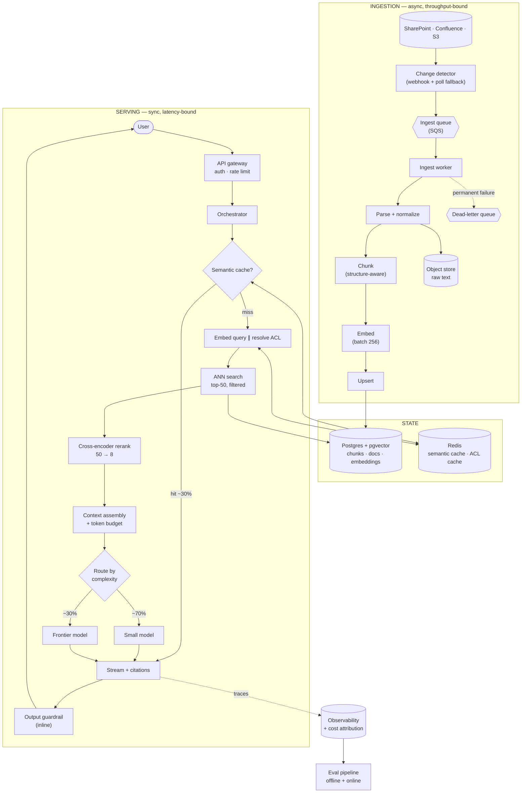

# 02 · High-Level Design — Production RAG System

> **Phase 2 of 4** · [← Requirements](01_requirements.md) · [LLD →](03_lld.md)
> The HLD says *what* the system is made of and *why those parts*. The [LLD](03_lld.md) proves it could actually be built.

---

## 2.1 Architecture

Two paths with **completely different characteristics**, which is why they're drawn and scaled
separately. Conflating them is the most common structural mistake in RAG design.

| | Ingestion path | Serving path |
|---|---|---|
| Trigger | Source change / backfill | User query |
| Bound by | **Throughput** | **Latency** |
| Failure tolerance | Retry freely; minutes of delay fine | Every ms is user-visible |
| Scaling signal | Queue depth | Request concurrency |
| Sizing driver | One-time backfill + reindex | Peak QPS |

**Trust boundary:** everything inside `SRV` runs with the *caller's* identity. Retrieved chunk text
crossing from `DATA` into `ASM` is **untrusted data, never instructions** — see
[§4.1](04_production_and_interview.md#41-ai-specific-concerns).

---

## 2.2 Component choices

**The most important table in this document.** *Rejected alternative* and *Revisit when* are what
make these decisions rather than a shopping list — and "revisit when" is what turns an opinion into
an engineering threshold.

### Retrieval tier

| Concern | Choice | Why | Rejected alternative (and why not) | Revisit when |
|---|---|---|---|---|
| **Vector store** | **Postgres + pgvector** | Already operated in-house; ACLs and metadata live in the same transaction as vectors, so filtered search needs no cross-system join; 115 GB index fits one large instance | **Pinecone/Weaviate** — a second datastore to operate and pay for, and crucially **metadata filtering becomes a cross-system problem**, which is exactly what [FR-4](01_requirements.md#12-functional-requirements) can't afford | > ~50M vectors *after* quantization, or per-tenant namespace isolation becomes a hard requirement, or write throughput exceeds what one primary can absorb |
| **ANN index** | **HNSW** | Best recall/latency at this scale; graph traversal supports predicate pushdown | **IVFFlat** — cheaper to build, ~3× slower at equal recall. **Exact (brute force)** — 80M × 1,024 dims per query is ~330 GB of reads; arithmetically impossible in 120 ms | Index build time becomes the bottleneck (HNSW builds are slow) → consider IVF for faster rebuilds |
| **Quantization** | **int8** | 327 GB → 82 GB for ~1–2% recall loss ([§1.6](01_requirements.md#16-capacity--cost-estimation)); the alternative is a materially more expensive instance class | **float32** — correct below ~10M vectors where 16 GB vs 4 GB is immaterial. **binary/1-bit** — too much recall loss for a citation-critical system | Recall@20 measures below 0.90 and quantization is the identified cause |
| **Embedding model** | Hosted, 1,024-dim | Managed, no GPU ops; 1,024 dims balances quality vs. memory | **Self-hosted** — GPU ops for marginal gain. **3,072-dim** — 3× memory for a few points of recall | Data residency forbids third-party embedding, or recall plateaus below target |
| **Reranker** | **Cross-encoder** (bge-reranker class) | +~12 points precision@5 over ANN ordering; 180 ms for 50 pairs | **LLM-as-reranker** — ~4× cost, ~3× latency for ~2 further points. **No reranker** — surrenders the precision that citations depend on | TTFT budget tightens below ~1 s (the 180 ms stops fitting), or a bi-encoder closes the gap |

**Why a cross-encoder beats the retriever it re-scores.** The retriever is a **bi-encoder**: query and
document are embedded *independently*, so the vector for a chunk is computed without ever seeing the
query. That's what makes it indexable and fast — you precompute 80M vectors once. A **cross-encoder**
feeds query and chunk *together* through the model, so attention runs across both and it can judge
actual relevance rather than geometric proximity. The price is that it can't be precomputed: cost is
linear in candidates, which is precisely why it runs on 50 and not 80M.

> **Mental model:** the retriever is a librarian who finds the right shelf from a card index; the
> reranker actually opens each of the 50 books and reads the relevant page.
>
> *Where the analogy breaks:* the reranker doesn't "understand" the query — it scores a
> (query, passage) pair against patterns learned from relevance-labelled training data, and it
> inherits that data's biases. It will confidently mis-rank domain language it has never seen.

### Generation tier

| Concern | Choice | Why | Rejected alternative | Revisit when |
|---|---|---|---|---|
| **LLM** | Hosted, **two tiers with routing** | ~70% of queries don't need frontier reasoning; routing is the single largest cost lever ([§1.6](01_requirements.md#16-capacity--cost-estimation)) | **Single frontier model** — simpler but ~5× the cost. **Single small model** — cheaper but fails hard on multi-hop questions | Small-tier quality measures below target on the golden set, or a mid tier becomes available |
| **Router** | Heuristic + small-model classifier | Cheap (~$0.0001/query) and explainable; a wrong route degrades to "slightly worse answer," not an error | **LLM router on the frontier tier** — the router costs as much as the answer, defeating the purpose | Misroute rate exceeds ~10% on the eval set |
| **Streaming** | SSE | Simple, HTTP-native, proxies cleanly; TTFT is the metric that matters | **WebSocket** — bidirectional capability we don't need, more infrastructure. **Non-streaming** — makes a 6 s answer feel like 6 s instead of 1 s | Client needs mid-stream cancellation or bidirectional control |

### Caching tier

| Concern | Choice | Why | Rejected alternative | Revisit when |
|---|---|---|---|---|
| **Semantic cache** | Redis + small vector index, cosine ≥ 0.95 | ~27× latency win and −30% cost on hits ([§1.5](01_requirements.md#15-latency-budget)) | **Exact-match cache only** — near-zero hit rate on natural language. **No cache** — forfeits the largest latency and second-largest cost lever | Hit rate measures below ~10% (then it's complexity for nothing) |
| **Prompt caching** | Provider-side, static prefix | 1,200 of 1,800 input tokens are a constant system prompt | **Nothing** — pays full rate for identical tokens on every request | Provider drops support, or the prompt stops being stable |

> **⚠️ Important Note — the semantic cache is a correctness risk, not just an optimization.** Two
> different users may ask a similar-sounding question but have **different document permissions**. A
> naive cache keyed on query-embedding alone would serve user B an answer synthesized from documents
> only user A can see — a **permission leak through the cache**. The cache key must therefore include
> an ACL-scope identity, which necessarily lowers the hit rate. **Getting this wrong is a security
> incident that looks like a performance optimization**; see [§3.6](03_lld.md#36-edge-cases--correctness).

### Ingestion tier

| Concern | Choice | Why | Rejected alternative | Revisit when |
|---|---|---|---|---|
| **Queue** | SQS (managed) | At-least-once delivery + DLQ; ingestion is idempotent so at-least-once is sufficient | **Kafka** — real ordering/replay semantics we don't need at 1.2 docs/s steady state | Need ordered per-document processing or a replayable log for reprocessing |
| **Chunking** | Structure-aware, ~750 tokens, 100 overlap | Respects headings/paragraphs so chunks are semantically whole; sized to fit 8 chunks in the context budget | **Fixed-size** — splits mid-sentence, measurably worse recall. **Semantic chunking** — better quality, ~10× ingest cost, revisit if recall demands it | Recall@20 < 0.90 with chunking identified as the cause |
| **Change detection** | Webhook + **poll fallback** | Webhooks give the 5-min freshness SLA; polling catches missed webhooks | **Poll only** — can't hit 5 min at 10M docs. **Webhook only** — silent gaps whenever a webhook is dropped | — |

**Why a poll fallback is non-negotiable.** Webhooks are fire-and-forget from systems you don't
control. A dropped webhook produces a document that is **permanently stale with no error anywhere** —
the worst failure class, because nothing alerts. A daily reconciliation poll comparing source
`modified_at` against indexed `source_modified_at` bounds staleness at 24 h even when webhooks fail
silently.

---

## 2.3 Data flow

### Serving path, hop by hop

1. **Client → API gateway.** JWT verified against cached JWKS. `tenant_id` and `user_id` are read
   **from the token, never the request body** — the single most important line in the flow, since
   trusting a body-supplied tenant is instant cross-tenant compromise.
2. **Gateway → Orchestrator.** Rate limit checked per tenant (protects shared retrieval capacity from
   one noisy tenant).
3. **Semantic cache lookup.** Query embedded against the small cache index, keyed by
   `(query_embedding, acl_scope_hash, corpus_version)`. On hit ≥ 0.95 cosine → stream the cached answer
   and stop. **~30% of traffic terminates here in ~50 ms.**
4. **Parallel: embed query ∥ resolve ACL.** Independent, ~60 ms each, so run concurrently. ACL
   resolution returns a filter expression (group IDs + explicit grants) from the Redis ACL cache.
5. **ANN search, top-50.** HNSW over pgvector with `tenant_id = $1 AND embed_version = $2 AND acl_group = ANY($3)`
   as predicates **inside** the search. Filtering after the fact both leaks and destroys recall
   ([§1.3](01_requirements.md#13-non-functional-requirements)).
6. **Rerank 50 → 8.** Cross-encoder scores each (query, chunk) pair; keep the top 8.
7. **Context assembly.** Pack chunks under a hard token budget, newest-and-highest-scored first, with
   stable `[1]`-style markers the model is instructed to cite. Neighbouring chunks from the same
   document are merged to restore continuity broken by chunking.
8. **Route.** Classifier picks small vs frontier tier on query complexity.
9. **Generate + stream.** Tokens stream to the client as produced; citation events are emitted
   alongside text so the UI can render footnotes progressively.
10. **Output guardrail, inline.** Scans the stream for PII and policy violations; can truncate
    mid-stream but cannot retroactively prevent an already-sent token.
11. **Trace + cache write.** Full trace (prompt, chunk IDs, tokens, cost, model version, latency
    per stage) written **asynchronously** — never on the request path. Answer written to the semantic
    cache under the same composite key.

### Ingestion path, hop by hop

1. **Change detected** (webhook, or reconciliation poll) → message enqueued with `document_id` and
   `source_version`.
2. **Worker claims message.** Fetches the document; computes a **content hash**. If the hash matches
   the stored one, **acknowledge and stop** — this alone eliminates most redundant work, because
   source systems fire change events for metadata-only edits.
3. **Parse → normalized text + structure** (headings, tables, page numbers preserved as metadata for
   citation targeting).
4. **Chunk** structure-aware, ~750 tokens with 100 overlap.
5. **Embed** in batches of 256 (batching matters here; it doesn't on the single-query read path).
6. **Upsert transactionally**: delete prior chunks for the document, insert new ones, update the
   document row's `content_hash` and `indexed_at`. One transaction, so a crash mid-upsert cannot leave
   a document half-indexed.
7. **Invalidate** semantic-cache entries whose `corpus_version` predates this change.
8. **Permanent failure → DLQ** with the error and attempt count. DLQ depth is an alert, not a
   dashboard nobody reads.

---

## 2.4 NFR mapping

Every NFR mapped to the mechanism that actually delivers it. Without this table the NFR list is
decoration.

| NFR | Target | Delivered by |
|---|---|---|
| TTFT p95 < 1.5 s | 1.5 s | Latency budget [§1.5](01_requirements.md#15-latency-budget) · streaming · semantic cache · parallel embed∥ACL · overlapped output guardrail |
| E2E p95 < 6 s | 6 s | Output token cap (250) · streaming |
| 50 QPS sustained / 200 peak | — | Stateless orchestrator behind an autoscaler · pgvector read replicas · reranker autoscaled on queue depth |
| Availability 99.9% | 43 min/mo | Multi-AZ · stateless services · **provider fallback chain** · degraded modes (§2.5) |
| Recall@20 ≥ 0.90 | — | Structure-aware chunking · overlap · top-50 candidates · int8 recall verified in CI |
| Groundedness ≥ 0.95 | — | Retrieved-context-only prompt · **refusal path** · groundedness metric gating deploys |
| Citation accuracy ≥ 0.90 | — | Stable chunk markers in context · citation validated against actual chunk IDs post-generation |
| Cost ≤ target | — | Prompt caching · semantic cache · model routing · context trimming · output cap · **per-tenant budget caps** |
| Freshness < 5 min | — | Webhook-driven ingest + poll reconciliation · content-hash short-circuit |
| Deletion < 15 min | — | Transactional chunk delete · cache invalidation by `corpus_version` · object-store purge |
| Tenant/ACL isolation | zero leaks | `tenant_id` from token only · filters **inside** the ANN query · ACL scope in the cache key · 500-case ACL suite in CI |
| PII not egressed | — | Redaction before provider call · zero-retention endpoints |

---

## 2.5 Failure modes & blast radius

**Volunteer these unprompted.** For AI systems, *graceful degradation beats hard failure* almost
always — a slightly worse answer is better than an error page, provided the user is told.

| # | Failure | Detection | Blast radius | Mitigation & degraded mode |
|---|---|---|---|---|
| **F1** | **LLM provider 5xx / timeout** | Error rate, TTFT p99 | **All queries** | Retry once with jitter → **fallback provider** → extractive answer from top chunk + honest banner ("summarization unavailable; here is the most relevant passage"). Never a blank error |
| **F2** | LLM provider rate limit (429) | 429 rate | All queries | Token-bucket client-side shaping · queue with backpressure · shed to small tier · surface a wait estimate |
| **F3** | **Mixed embedding versions in one index** | Recall drop in CI; **no runtime error** | **All retrieval — silent** | `embed_version` in the index predicate; blue/green reindex; **never** write a new version into a live index. *The most dangerous failure here — see below* |
| **F4** | pgvector primary saturated | p99 search latency, connection pool | All queries | Read replicas for search · per-tenant rate limits · degrade to keyword (`tsvector`) search with a quality banner |
| **F5** | Reranker overloaded | Queue depth, p99 | All queries | Autoscale on queue depth · **skip rerank** and use ANN top-8 directly (lose ~12 pts precision, keep the service up) |
| **F6** | Semantic cache poisoned (bad answer cached) | Thumbs-down clustering on one key | Everyone hitting that key | Version cache keys by prompt+model version · targeted invalidation API · TTL ceiling (24 h) so nothing is cached forever |
| **F7** | **ACL cache stale after permission revocation** | Reconciliation job diff | **One user, potentially unauthorized reads** | Short TTL (5 min) · **event-driven invalidation on permission change** · fail-closed if the ACL cache is unavailable — deny rather than serve unfiltered |
| **F8** | Ingestion DLQ filling | DLQ depth alert | Some documents stale | Alert with the failing doc IDs · replay after fix · **staleness is visible in the UI** ("indexed 3 days ago") rather than silent |
| **F9** | Embedding provider outage | Ingest + query error rate | New ingests stop; **queries fail** (no query embedding) | Queue absorbs ingest delay · for queries: fall back to keyword search · consider a small self-hosted embedding model purely as a fallback |
| **F10** | Guardrail service down | Health check | All queries | **Explicit policy decision**: fail-open (serve unguarded, log loudly) for an internal tool over an internal corpus; fail-closed for anything customer-facing. **Document which, and why** |

**On F3, because it's the one I'd raise unprompted.** Cosine similarity between vectors from two
different embedding models is *meaningless* — not merely less accurate, but arbitrary. If a reindex
writes model-v2 vectors into an index still serving model-v1 vectors, retrieval quality collapses and
**nothing throws an error**: the query succeeds, returns 50 chunks, and the answer is grounded in
irrelevant text. The only signals are a recall drop in evaluation and user complaints. Three controls,
all required: `embed_version` as a mandatory index predicate, blue/green index cutover, and a
recall-regression gate in CI that would catch it before traffic does.

**On F10, because "add guardrails" is usually where designs stop thinking.** Fail-open vs fail-closed
is a *product* decision that engineers must force someone to make explicitly. Fail-open risks serving
unfiltered output; fail-closed risks a full outage when a non-critical dependency wobbles. There is
no universally correct answer — but there *is* a universally wrong one, which is not deciding and
letting the behaviour fall out of whatever the HTTP client does on timeout.

---

## 2.6 Scale plan

### What breaks first at 10× (500 QPS, 100M docs / 800M chunks)

| # | Bottleneck | Why it breaks | Change |
|---|---|---|---|
| 1 | **pgvector single primary** | 800M chunks × int8 ≈ 820 GB + graph overhead ≈ 1.1 TB — exceeds single-instance RAM | **Shard by tenant** across instances; route by `tenant_id`. Tenant-sharding is natural here because queries are always tenant-scoped, so no scatter-gather is needed |
| 2 | Reranker GPU capacity | 500 QPS × 50 pairs = 25k pairs/s | Horizontal GPU pool · dynamic batching · consider a distilled/smaller reranker |
| 3 | **HNSW index build time** | Rebuilding 800M vectors is a multi-day job | Per-shard rebuilds (parallel + independently cutover-able) · consider IVF for faster builds · treat reindex as a rolling operation |
| 4 | Embedding throughput for backfill | 800M chunks | Parallel embedder fleet · accept a multi-day backfill window · **plan it, don't discover it** |
| 5 | Cost | 10× traffic on a model already 12× over budget | Routing/caching are already applied — this becomes a **business conversation**, not an engineering one ([§1.6](01_requirements.md#16-capacity--cost-estimation)) |

### What breaks at 100× (5k QPS, 1B docs)

At this point it is a **different system**, and saying so is more honest than pretending the same
architecture stretches:

| Concern | Change |
|---|---|
| Retrieval | Purpose-built distributed vector DB (Vespa/Milvus class) — pgvector is past its sweet spot; the reasons that justified it (co-located metadata, one less system) no longer outweigh sharding pain |
| Serving | Multi-region active-active, geo-routed; regional index replicas |
| Generation | Self-hosting becomes genuinely viable — at this volume utilization exceeds 80% and reserved GPU pricing applies, which is exactly the condition [`../04`](../00_requirements_all_systems.md#4-llm-inference-platform) identifies as flipping the build-vs-buy conclusion |
| Ingestion | Kafka replaces SQS (replay + ordering now genuinely needed); stream processing rather than per-document workers |
| Caching | Multi-tier: local in-process → regional Redis → global |
| Org | Retrieval, generation, and ingestion become separately-owned services with contracts between them |

### What does *not* need to change

Worth stating explicitly — knowing which decisions are durable is as useful as knowing which break:

- **Two-stage retrieval** (cheap recall → expensive rerank). This is scale-invariant; it's the only
  arithmetically viable shape at any size.
- **Filters inside the ANN query.** A correctness property, not a performance optimization.
- **`embed_version` in every predicate.** More important at scale, not less.
- **Async trace writes.** Never on the request path, at any scale.

---

## 2.7 Tech stack

> Shared substrate and the reasoning behind it: [`../00_tech_stack.md`](../00_tech_stack.md). This section
> carries only what is **specific to this system**.

| Layer | Choice | Rejected | Why | Revisit when |
|---|---|---|---|---|
| **Vector store** | **PostgreSQL 16 + `pgvector`**, HNSW, partial index on `embed_version` | Pinecone / Weaviate from day one | One less system to operate, and **the partial index is a correctness boundary, not an optimization** — it makes serving from a half-finished re-embed structurally impossible | **~50M vectors**, or when per-tenant namespace isolation is needed (see [10](../10_enterprise_agent_platform/README.md)) |
| Vector store at scale | **Qdrant** | Milvus, Vespa | Namespace isolation and quantization without operating a cluster of components | If hybrid lexical+vector ranking becomes primary, Vespa wins |
| **Lexical half of hybrid** | **Postgres FTS (`tsvector`)** | Elasticsearch | BM25-quality lexical scoring without a second cluster while both halves live in one store | Lexical relevance tuning becomes a workstream of its own |
| Embeddings | Hosted API, **`embed_version` pinned in the row** | Self-hosted from the start | Below ~60% sustained GPU utilization a hosted call is cheaper than idle time ([§self-hosting](../00_tech_stack.md#when-self-hosting-flips--the-transferable-pattern)) | Sustained utilization > 60%, then BGE/E5 on Triton |
| **Reranker** | **BGE-reranker cross-encoder on Triton**, int8, dynamic batching | Hosted rerank API | Fixed shape, ~180 ms for 50 docs ([SA-6](../00_requirements_all_systems.md#shared-assumptions-register)) — exactly the workload where self-hosting wins | Rerank drops from the pipeline for latency |
| **Ingestion** | **Kafka** → Python workers → Postgres | Direct writes, cron batches | **Replay is the feature.** A re-embed is a topic replay, not a bespoke backfill script | Below ~1k docs/s with no replay need |
| Chunking / parsing | **unstructured.io** + custom splitters | LangChain loaders | Table and heading fidelity matters more than breadth of format support | — |
| **Cache** | **Redis 7** — exact-match on `(tenant, query_hash, embed_version, prompt_version)` | Semantic cache in v1 | Exact-match is 25–30% hit rate ([SA-3](../00_requirements_all_systems.md#shared-assumptions-register)) at ~2 ms and zero false-hit risk | Measured miss patterns justify the false-hit risk |
| Orchestration | Python 3.12 async, FastAPI + Pydantic | LangChain as the framework | Retrieval logic here is ~300 lines; a framework adds indirection over code we must own anyway | — |
| Observability | OpenTelemetry + **Langfuse** | APM alone | Per-query token cost and `embed_version` must be trace dimensions, not log strings | — |

**The defining choice is `pgvector` with a partial index, and it is chosen for correctness rather than
cost.** `WHERE embed_version = 2` on the index means a query physically cannot see rows from an
in-progress re-embed. In a dedicated vector database the same guarantee needs a second collection plus an
atomic alias swap — achievable, but it lives in application code where it can be forgotten. **Here the
database refuses.**

**What would move this to Qdrant is isolation, not volume.** The 50M-vector threshold is real, but in
practice multi-tenancy fires first: the moment 200 tenants each need an enforced boundary
([10](../10_enterprise_agent_platform/README.md)), a namespace-native store stops being optional.

---

**Next:** [03_lld.md →](03_lld.md) — schemas with index justifications, API contracts, retrieval and context-assembly algorithms, sequence diagrams including failure paths, the ingestion state machine, and edge cases.
