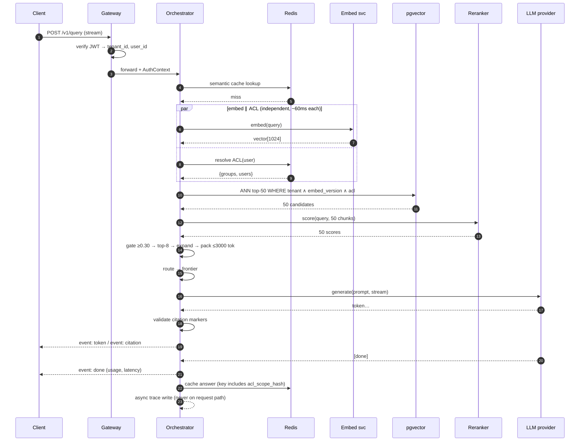
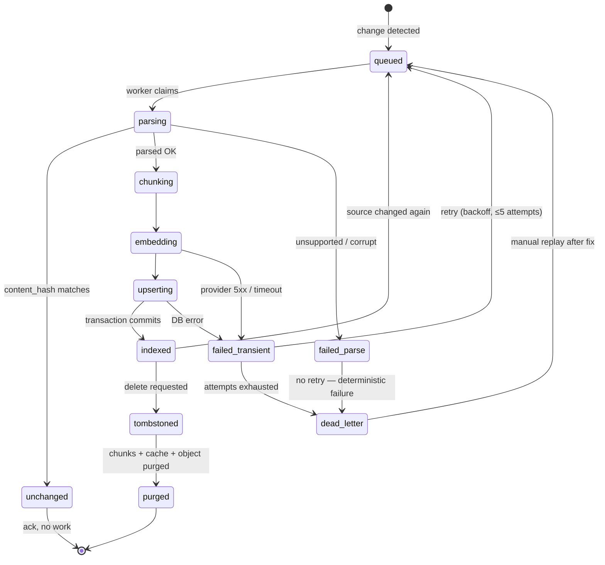
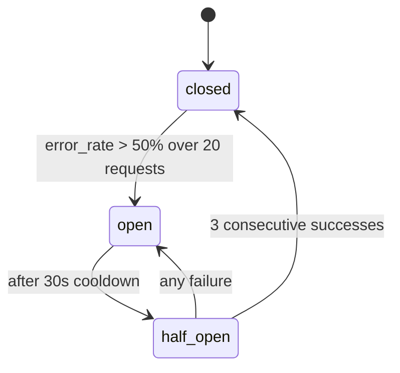

# 03 · Low-Level Design — Production RAG System

> **Phase 3 of 4** · [← HLD](02_hld.md) · [Production & interview →](04_production_and_interview.md)
> The [HLD](02_hld.md) said *what*. This file proves it could be built: real schemas, real contracts, real algorithms, and the edge cases that separate a shipped system from a whiteboard one.

---

## 3.1 Data models

Postgres 16 + pgvector. Every index below carries the query it exists to serve — **an index without a
named query is either dead weight or a guess.**

### Documents

```sql
CREATE TABLE documents (
    document_id       UUID PRIMARY KEY,
    tenant_id         UUID        NOT NULL,
    source_system     TEXT        NOT NULL,          -- 'sharepoint' | 'confluence' | 's3'
    source_id         TEXT        NOT NULL,          -- id within that source
    source_url        TEXT        NOT NULL,          -- for citation click-through
    title             TEXT,
    mime_type         TEXT        NOT NULL,

    -- Change detection
    content_hash      BYTEA       NOT NULL,          -- SHA-256 of normalized text
    source_modified_at TIMESTAMPTZ NOT NULL,         -- as reported by the source
    indexed_at        TIMESTAMPTZ,                   -- NULL until first successful index

    -- Access control (denormalized deliberately — see note)
    acl_groups        UUID[]      NOT NULL DEFAULT '{}',
    acl_users         UUID[]      NOT NULL DEFAULT '{}',
    acl_version       BIGINT      NOT NULL DEFAULT 0,

    -- Lifecycle
    status            TEXT        NOT NULL DEFAULT 'pending',
    deleted_at        TIMESTAMPTZ,                   -- tombstone; NOT NULL ⇒ purge pending

    CONSTRAINT documents_status_chk CHECK (
        status IN ('pending','parsing','embedding','indexed','failed','deleted')
    ),
    CONSTRAINT documents_source_uniq UNIQUE (source_system, source_id)
);
```

| Index | Serves |
|---|---|
| `documents_source_uniq (source_system, source_id)` | Idempotent upsert on re-ingest — **the constraint that makes at-least-once queue delivery safe** |
| `idx_documents_reconcile (tenant_id, source_modified_at)` | The daily poll comparing source vs indexed timestamps (webhook-gap detection) |
| `idx_documents_purge (deleted_at) WHERE deleted_at IS NOT NULL` | Partial index — the purge worker scans only tombstones, not 10M rows |

```sql
CREATE INDEX idx_documents_reconcile ON documents (tenant_id, source_modified_at);
CREATE INDEX idx_documents_purge ON documents (deleted_at) WHERE deleted_at IS NOT NULL;
```

> **Why ACLs are denormalized onto the document row.** Normalized ACLs would need a join (or worse, a
> service call) inside the retrieval query, and [§1.5](01_requirements.md#15-latency-budget) has no
> room for either — the 120 ms search budget assumes the filter is a local predicate. The cost is that
> a permission change must fan out to the affected rows, which is why `acl_version` exists: the
> reconciliation job finds rows whose `acl_version` lags the authority and repairs them. **This trades
> write complexity for read latency, which is the right trade at a read:write ratio of ~1000:1.**

### Chunks — the table the whole system turns on

```sql
CREATE TABLE chunks (
    chunk_id      UUID PRIMARY KEY,
    document_id   UUID NOT NULL REFERENCES documents(document_id) ON DELETE CASCADE,
    tenant_id     UUID NOT NULL,                    -- denormalized: needed as a search predicate

    ordinal       INT  NOT NULL,                    -- position in doc; enables neighbour expansion
    content       TEXT NOT NULL,
    token_count   INT  NOT NULL,                    -- for context packing without re-tokenizing

    -- Citation targeting
    page_number   INT,
    section_path  TEXT,                             -- 'Security > Access > Password Policy'
    char_start    INT,
    char_end      INT,

    -- The two columns that must always travel together
    embedding     vector(1024),
    embed_version SMALLINT NOT NULL,

    -- Denormalized ACL — same reasoning as documents
    acl_groups    UUID[] NOT NULL DEFAULT '{}',
    acl_users     UUID[] NOT NULL DEFAULT '{}',

    created_at    TIMESTAMPTZ NOT NULL DEFAULT now(),

    CONSTRAINT chunks_doc_ordinal_uniq UNIQUE (document_id, ordinal)
);
```

**The critical index, and why it's partial:**

```sql
-- ANN search, scoped to one embedding version.
-- The WHERE clause is not an optimization — it is a CORRECTNESS boundary.
CREATE INDEX idx_chunks_ann_v2 ON chunks
    USING hnsw (embedding vector_cosine_ops)
    WITH (m = 16, ef_construction = 64)
    WHERE embed_version = 2;

CREATE INDEX idx_chunks_tenant_doc ON chunks (tenant_id, document_id);   -- delete/reindex by doc
CREATE INDEX idx_chunks_acl_groups ON chunks USING gin (acl_groups);     -- array-overlap filter
```

> **⚠️ The single most important line in this schema is `WHERE embed_version = 2`.** Cosine similarity
> between vectors from two different embedding models is not "less accurate" — it is **meaningless**.
> A partial index per version makes a cross-version search structurally impossible: during a blue/green
> reindex, v3 vectors accumulate in `idx_chunks_ann_v3` while queries continue to hit
> `idx_chunks_ann_v2`, and cutover is a one-line change to the query's version parameter. Without
> this, a reindex silently destroys retrieval quality with **no error anywhere** — failure mode
> [F3](02_hld.md#25-failure-modes--blast-radius).

**HNSW parameter choice:** `m = 16` (edges per node) and `ef_construction = 64` are the standard
recall/build-time balance. Raising `m` improves recall but increases the ~40% graph overhead assumed
in [§1.6](01_requirements.md#16-capacity--cost-estimation); raising `ef_construction` improves recall
at the cost of build time, which is already the 10× bottleneck ([§2.6](02_hld.md#26-scale-plan)).

### Cache and evaluation

```sql
-- Semantic cache lives in Redis; this table exists only for analytics and invalidation audit
CREATE TABLE cache_entries (
    cache_key       BYTEA PRIMARY KEY,      -- SHA-256 over (query_emb_bucket, acl_scope, versions)
    tenant_id       UUID NOT NULL,
    acl_scope_hash  BYTEA NOT NULL,         -- see §3.6 — the permission-leak guard
    corpus_version  BIGINT NOT NULL,
    prompt_version  TEXT NOT NULL,
    model_version   TEXT NOT NULL,
    hit_count       INT NOT NULL DEFAULT 0,
    created_at      TIMESTAMPTZ NOT NULL DEFAULT now(),
    expires_at      TIMESTAMPTZ NOT NULL    -- hard TTL ceiling; nothing is cached forever
);

CREATE TABLE query_traces (
    trace_id        UUID PRIMARY KEY,
    tenant_id       UUID NOT NULL,
    user_id         UUID NOT NULL,
    query_text      TEXT NOT NULL,
    retrieved_ids   UUID[] NOT NULL,        -- reconstruct "why did it say that?"
    reranked_ids    UUID[] NOT NULL,
    model_tier      TEXT NOT NULL,
    model_version   TEXT NOT NULL,
    prompt_version  TEXT NOT NULL,
    tokens_in       INT NOT NULL,
    tokens_out      INT NOT NULL,
    cost_usd        NUMERIC(10,6) NOT NULL,
    stage_latency   JSONB NOT NULL,         -- {"embed":58,"search":112,"rerank":176,"ttft":880}
    cache_hit       BOOLEAN NOT NULL,
    refused         BOOLEAN NOT NULL,
    feedback        SMALLINT,               -- NULL | -1 | +1
    created_at      TIMESTAMPTZ NOT NULL DEFAULT now()
) PARTITION BY RANGE (created_at);          -- monthly; drop old partitions to honour 1-yr retention
```

**Why traces are partitioned by month.** At 130M queries/month × ~2 KB, traces are the largest table
in the system by row count. Partitioning makes retention a `DROP PARTITION` (instant) rather than a
`DELETE` over hundreds of millions of rows (hours, and bloats the table).

---

## 3.2 API contracts

### `POST /v1/query`

```http
POST /v1/query HTTP/1.1
Authorization: Bearer <jwt>          # tenant_id + user_id derived HERE, never from the body
Idempotency-Key: 7f3e...             # optional; dedupes retries of a billable call
Content-Type: application/json

{
  "query": "What is our password rotation policy?",
  "top_k": 8,
  "stream": true,
  "filters": { "source_system": ["confluence"], "section_path_prefix": "Security" },
  "conversation_id": "c-8821",       # optional; enables follow-up rewriting (FR-10)
  "max_output_tokens": 250
}
```

**There is no `tenant_id` field, and that is deliberate.** Accepting a caller-supplied tenant is the
most direct route to cross-tenant compromise; the field is absent from the schema so it cannot be
added by accident.

**Success — streaming (SSE):**

```
200 OK
Content-Type: text/event-stream
X-Trace-Id: 3f9c1e...

event: meta
data: {"trace_id":"3f9c1e...","cache_hit":false,"model_tier":"frontier","chunks_used":6}

event: token
data: {"delta":"Passwords must be rotated every "}

event: citation
data: {"marker":1,"chunk_id":"9a1...","document_id":"4c2...","source_url":"https://...",
       "title":"Password Policy","section_path":"Security > Access","page":3,"score":0.87}

event: token
data: {"delta":"90 days [1]."}

event: done
data: {"usage":{"tokens_in":1802,"tokens_out":214,"cost_usd":0.0086},
       "latency_ms":{"embed":58,"search":112,"rerank":176,"ttft":880,"total":3140},
       "refused":false}
```

**Citations stream as separate events**, not embedded in the token text, so the client can render
footnotes progressively and — critically — so citation validity is checked
**server-side against real chunk IDs** before the event is emitted. A model that invents `[7]` when
only 6 chunks were supplied produces no citation event, and the discrepancy is logged as a citation
failure ([§4.1](04_production_and_interview.md#41-ai-specific-concerns)).

**The refusal response — a first-class outcome, not an error:**

```
event: meta
data: {"trace_id":"...","cache_hit":false,"chunks_used":0}

event: token
data: {"delta":"I couldn't find this in the documents available to you."}

event: done
data: {"refused":true,"refusal_reason":"insufficient_retrieval",
       "usage":{"tokens_in":0,"tokens_out":0,"cost_usd":0.0}}
```

`refused: true` with **zero LLM tokens** — when retrieval is insufficient the refusal is generated
*without* calling the model. It's cheaper, faster, and deterministic, which matters because
[FR-5](01_requirements.md#12-functional-requirements) demands ≥ 95% reliability on this path and an
LLM asked to refuse will sometimes answer anyway.

**Error responses:**

| Status | Meaning | Body / behaviour |
|---|---|---|
| `400` | Malformed query; empty; exceeds max length | `{"error":"query_too_long","max_chars":2000}` |
| `401` | Invalid/expired token | — |
| `403` | Token valid, tenant mismatch on a filter | Logged as a **security event**, not a normal 4xx |
| `429` | Tenant rate/budget limit | `Retry-After: 12`, `X-RateLimit-Remaining: 0` |
| `499` | Client disconnected mid-stream | **Abort the LLM call** — don't pay for tokens nobody receives |
| `503` | All providers down | Degraded extractive answer in body + `"degraded":true` banner |
| `504` | Upstream timeout past budget | Partial stream already delivered; `done` carries `"truncated":true` |

**`499` is easy to miss and costs real money.** Users close tabs mid-answer. Without propagating
cancellation to the provider, generation continues to completion and is billed in full. At ~30%
abandonment on slow queries this is a material line item.

### Supporting endpoints

```http
POST   /v1/documents:ingest        # enqueue; 202 Accepted + job_id (idempotent on content_hash)
DELETE /v1/documents/{id}          # 202; tombstone + async purge (FR-9), returns purge_job_id
GET    /v1/jobs/{job_id}           # ingestion status: queued|parsing|embedding|indexed|failed
POST   /v1/feedback                # {trace_id, rating: -1|+1, comment?}
GET    /v1/health                  # liveness
GET    /v1/health/deep             # dependency probes: pg, redis, embed, rerank, llm
```

`/v1/health/deep` is what the **fail-closed vs fail-open** decision in
[F10](02_hld.md#25-failure-modes--blast-radius) reads. It must be cheap enough to poll every few
seconds and must *not* itself call the LLM provider (that would make health checks a cost centre and
a rate-limit consumer).

---

## 3.3 Core algorithms

### Retrieve → rerank → assemble

The one function where most of the system's quality lives.

```python
from dataclasses import dataclass

@dataclass
class RetrievalConfig:
    candidates: int = 50           # ANN top-k, before rerank
    final_k: int = 8               # after rerank
    embed_version: int = 2         # MUST be explicit — never defaulted at the call site
    min_rerank_score: float = 0.30 # below this, treat as irrelevant (drives refusal)
    max_context_tokens: int = 3000 # hard cap; protects TTFT and cost
    neighbour_expansion: bool = True

async def retrieve_and_assemble(query: str, auth: AuthContext, cfg: RetrievalConfig):
    # 1. Embed query and resolve ACL CONCURRENTLY — independent, ~60ms each (§1.5)
    query_vec, acl = await asyncio.gather(
        embed_query(query),
        resolve_acl(auth.user_id, auth.tenant_id),
    )

    # 2. ANN search. Filters are PREDICATES INSIDE the query, never post-filters.
    #    Post-filtering silently destroys recall for the most-restricted users (§1.3).
    candidates = await db.fetch("""
        SELECT chunk_id, document_id, content, token_count, ordinal,
               page_number, section_path,
               1 - (embedding <=> $1) AS similarity
        FROM chunks
        WHERE tenant_id = $2
          AND embed_version = $3                       -- correctness boundary (§3.1)
          AND (acl_groups && $4 OR acl_users && $5)     -- GIN array overlap
        ORDER BY embedding <=> $1                       -- <=> is cosine distance
        LIMIT $6
    """, query_vec, auth.tenant_id, cfg.embed_version,
         acl.groups, [auth.user_id], cfg.candidates)

    if not candidates:
        return AssemblyResult(chunks=[], refuse=True, reason="no_candidates")

    # 3. Rerank with a cross-encoder: scores (query, chunk) JOINTLY, unlike the bi-encoder
    #    retriever above. Degrade rather than fail if the reranker is unavailable (F5).
    try:
        scores = await reranker.score(query, [c["content"] for c in candidates])
        ranked = sorted(zip(candidates, scores), key=lambda p: p[1], reverse=True)
    except RerankerUnavailable:
        metrics.incr("rerank.degraded")
        ranked = [(c, c["similarity"]) for c in candidates]   # fall back to ANN order

    # 4. Relevance gate — the mechanism behind FR-5's refusal path.
    #    An empty result and a result full of 0.05-scoring chunks are the SAME failure.
    kept = [(c, s) for c, s in ranked if s >= cfg.min_rerank_score][: cfg.final_k]
    if not kept:
        return AssemblyResult(chunks=[], refuse=True, reason="insufficient_relevance")

    # 5. Neighbour expansion: chunking split documents mid-argument; pull adjacent
    #    ordinals to restore continuity before packing.
    if cfg.neighbour_expansion:
        kept = await expand_neighbours(kept, auth, cfg)

    # 6. Pack under the token budget, highest-scored first, so truncation drops
    #    the least relevant material rather than an arbitrary tail.
    packed, used = [], 0
    for chunk, score in kept:
        if used + chunk["token_count"] > cfg.max_context_tokens:
            continue                       # skip, don't break: a later chunk may still fit
        packed.append(ContextChunk(marker=len(packed) + 1, chunk=chunk, score=score))
        used += chunk["token_count"]

    return AssemblyResult(chunks=packed, refuse=False, tokens_used=used)
```

**Four decisions worth defending:**

1. **`min_rerank_score` is what makes refusal work.** Without it, the pipeline always returns 8 chunks
   — the 8 *least bad* — and the model dutifully synthesizes an answer from irrelevant text. Empty
   retrieval and irrelevant retrieval are the same failure and must produce the same refusal.
2. **`continue`, not `break`, in the packing loop.** A single oversized chunk shouldn't discard every
   smaller chunk behind it.
3. **Markers are assigned at pack time** (`len(packed) + 1`), so `[1]`…`[n]` are always contiguous.
   Gaps invite the model to invent a `[7]` that doesn't exist.
4. **Reranker failure degrades, doesn't raise.** Losing ~12 points of precision beats returning a 503.

### Complexity routing

```python
def route(query: str, assembly: AssemblyResult) -> str:
    """Cheap heuristics first; classifier only when they don't decide.
    A misroute costs a slightly worse answer, not an error — so bias toward cheap."""
    if assembly.tokens_used > 2000:          # lots of context ⇒ synthesis is harder
        return "frontier"
    if len(assembly.chunks) >= 5:            # multi-source ⇒ likely multi-hop
        return "frontier"
    if any(kw in query.lower() for kw in ("compare", "why", "difference", "versus")):
        return "frontier"                     # reasoning markers
    if len(query.split()) <= 8 and len(assembly.chunks) <= 2:
        return "small"                        # short, single-source lookup
    return classifier.predict(query, assembly)   # small-model classifier, ~$0.0001
```

The heuristics resolve the clear cases for free; the classifier only runs on the ambiguous middle.
This matters because a frontier-model router would cost as much as the answer it routes.

### Citation validation

```python
def validate_citations(answer: str, packed: list[ContextChunk]) -> CitationReport:
    """Server-side check. A model citing [7] when 6 chunks were supplied is a
    hallucinated citation — the WORST output class, because it manufactures confidence."""
    cited = {int(m) for m in re.findall(r"\[(\d+)\]", answer)}
    valid_markers = {c.marker for c in packed}

    invalid = cited - valid_markers          # invented citations
    unused  = valid_markers - cited          # supplied but not used — fine, just informational

    for marker in invalid:
        metrics.incr("citation.hallucinated")
        log.warning("hallucinated_citation", marker=marker, valid=sorted(valid_markers))

    return CitationReport(
        cited=cited & valid_markers,
        hallucinated=invalid,
        coverage=len(cited & valid_markers) / max(len(valid_markers), 1),
    )
```

Only validated markers become `citation` SSE events. `citation.hallucinated` feeds the citation-accuracy
NFR ([§1.3](01_requirements.md#13-non-functional-requirements)) — it is measured continuously in
production, not just offline.

---

## 3.4 Sequence diagrams

### Happy path — cache miss



### Failure path — provider outage with fallback and degradation

```mermaid
sequenceDiagram
    autonumber
    participant U as Client
    participant ORC as Orchestrator
    participant P1 as Primary LLM
    participant P2 as Fallback LLM
    participant CB as Circuit breaker

    ORC->>P1: generate(prompt)
    P1--xORC: 503 (after 2s)
    ORC->>CB: record failure
    ORC->>P1: retry once w/ jitter
    P1--xORC: 503
    ORC->>CB: record failure → threshold hit → OPEN

    Note over CB: circuit open — skip P1 for 30s

    ORC->>P2: generate(prompt)   %% same prompt, different provider
    P2--xORC: 429 rate limited

    Note over ORC: both providers unavailable → DEGRADE, don't error

    ORC-->>U: event: meta {"degraded":true}
    ORC-->>U: event: token (top-ranked chunk verbatim, extractive)
    ORC-->>U: event: citation (that chunk)
    ORC-->>U: event: done {"degraded":true,<br/>"message":"Summarization unavailable;<br/>showing the most relevant passage."}

    Note over ORC: NOT cached — degraded answers must never<br/>poison the cache (F6)
```

**Three things this diagram is asserting:**

1. **One retry, then move on.** Retrying a 503 more than once against an already-degraded provider adds
   latency without materially improving success odds.
2. **The degraded answer is honest.** It says summarization is unavailable rather than presenting an
   extract as if it were a synthesized answer.
3. **Degraded answers are never cached.** Otherwise a 30-second outage poisons the cache for hours —
   failure mode [F6](02_hld.md#25-failure-modes--blast-radius).

---

## 3.5 State machines

### Ingestion job lifecycle



**The distinctions that matter:**

- **`failed_parse` never retries.** A corrupt PDF will be corrupt on attempt five. Retrying
  deterministic failures burns capacity and hides the real error in noise.
- **`unchanged` is a terminal success.** Source systems emit change events for metadata-only edits;
  the content-hash short-circuit avoids re-embedding, which is the expensive step.
- **`tombstoned` → `purged` is a two-phase delete.** Tombstoning is instant and makes the document
  immediately unsearchable; purging is async and covers chunks, cache entries, and object store. The
  15-minute [FR-9](01_requirements.md#12-functional-requirements) SLA applies to `purged`.

### Circuit breaker per provider



`half_open` admits a trickle of real traffic rather than a synthetic probe, because providers
sometimes fail only on real payload shapes.

---

## 3.6 Edge cases & correctness

### The permission-leak-through-cache problem

**The most dangerous bug in this design**, because it looks like a performance optimization.

```python
# ❌ WRONG — leaks across permission boundaries
cache_key = sha256(query_embedding_bucket)

# Alice (Finance) asks "what's the Q3 revenue target?"
#   → answer synthesized from a Finance-only document → cached
# Bob (Support) asks the same question
#   → cache HIT → Bob receives Finance content he cannot access.
#   No error. No audit trail of an unauthorized read. Silent breach.

# ✅ RIGHT — the ACL scope is part of the identity of the cached answer
cache_key = sha256(
    query_embedding_bucket,
    acl_scope_hash,      # stable hash of the user's resolved group set
    corpus_version,      # invalidates on any relevant document change
    prompt_version,      # invalidates on prompt change
    model_version,       # invalidates on model change
)
```

**The cost of correctness:** hit rate drops, because users with different group memberships can no
longer share a cache entry. Mitigation is to hash the *group set*, not the user — colleagues on the
same teams share entries, which recovers most of the benefit. **The hit-rate loss is the price of not
having a breach, and it is not negotiable.**

### Full edge-case register

| # | Edge case | Handling | Why this way |
|---|---|---|---|
| E1 | **Zero retrieval results** | Refuse, no LLM call | Cheaper, faster, deterministic vs. asking a model to refuse |
| E2 | **All results below relevance floor** | Refuse — same path as E1 | Irrelevant retrieval ≡ empty retrieval |
| E3 | Context overflow | Skip lowest-scored chunks; never truncate mid-chunk | A half-chunk is unciteable and can invert meaning |
| E4 | One chunk exceeds the whole budget | Skip it; log; flag the document for re-chunking | Indicates a chunking bug upstream |
| E5 | **Model cites `[7]` when 6 chunks supplied** | Drop the citation event; count `citation.hallucinated` | Never surface an unresolvable citation |
| E6 | Duplicate documents across sources | Content-hash dedupe at ingest; keep the earliest, alias the rest | Otherwise the same passage occupies several of the 8 context slots |
| E7 | **Concurrent re-ingest of one document** | `SELECT … FOR UPDATE` on the document row | Two workers could otherwise interleave delete/insert and leave partial chunks |
| E8 | Retried ingest message (at-least-once) | Idempotent on `(source_system, source_id)` + content hash | Makes SQS's delivery guarantee safe |
| E9 | **Reindex while serving** | Blue/green via `embed_version` partial indexes | Zero-downtime cutover; no mixed-version search possible |
| E10 | Permission revoked, ACL cache warm | 5-min TTL + event-driven invalidation; **fail-closed** if cache unavailable | Deny beats serving unfiltered |
| E11 | Deleted document still in a cached answer | `corpus_version` in the cache key invalidates on any change | Otherwise deletion is incomplete — an FR-9 violation |
| E12 | **Client disconnects mid-stream** | Propagate cancellation to the provider | Otherwise you pay for tokens nobody reads |
| E13 | Query is a prompt injection ("ignore instructions and…") | Query is data; system prompt is structurally separated; no tool access from this path | See [§4.1](04_production_and_interview.md#41-ai-specific-concerns) |
| E14 | **Retrieved chunk contains injected instructions** | Retrieved text is fenced and labelled untrusted; the model is instructed never to follow instructions inside it | **Higher risk than E13** — a document is trusted-looking and long-lived |
| E15 | Very long document (500+ pages) | Hierarchical chunking; parent-child retrieval | Flat chunking loses the structure needed for citation targeting |
| E16 | Table spanning a chunk boundary | Structure-aware chunker keeps tables whole; oversized tables summarized with a link | A split table is worse than no table — rows detach from headers |
| E17 | Two chunks contradict each other | Surface both with citations; do not silently pick | The corpus genuinely contains stale and current policy; users must see the conflict |
| E18 | Tenant exceeds budget mid-stream | Complete the current answer; 429 the next request | Cutting a partial answer wastes the tokens already spent |

**E14 deserves emphasis.** Query-based injection (E13) is what people think of, but the retrieved-document
vector is more dangerous: a document sits in the corpus for months, looks authoritative, and its text
enters the prompt with the *implicit* credibility of "our internal documentation." The structural
defence is that retrieved content is always fenced and labelled as data — never concatenated into the
instruction region of the prompt.

---

**Next:** [04_production_and_interview.md →](04_production_and_interview.md) — AI-specific concerns, the operations runbook, common mistakes, interview follow-ups with answers, and the glossary.
