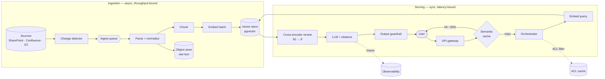

# 01 — Production-Grade RAG System

> **Prompt:** Design a production-grade RAG system — document ingestion, chunking, embeddings, vector DB, retrieval, reranking, LLM, citations, evaluation, caching, scaling.

---

## The three-sentence compression

*Rehearse this before opening any other file. It is the opening answer.*

1. **The choice that matters most:** a **two-stage retrieval pipeline** — cheap ANN recall over 80M chunks, then a cross-encoder rerank of the top 50 down to 8 — because retrieval quality is the hard ceiling on the entire system, and the generator cannot recover information that was never fetched.
2. **The alternative I rejected:** a single-stage ANN retrieval with a larger `top_k` fed straight to the LLM — it costs less latency but gives up ~12 points of precision@5, and precision is what citation trust depends on. I'd revisit if the TTFT budget tightened below ~1 s, where the 180 ms reranker stops fitting.
3. **The failure mode I'd volunteer:** **mixed embedding versions in one index.** Re-embedding 80M chunks takes hours; if new-model vectors land in the same index as old-model vectors, cosine similarity silently becomes meaningless and retrieval quality collapses with no error anywhere. Hence `embed_version` is part of every index predicate, and reindexing is blue/green.

---

## Architecture at a glance



---

## Key numbers

| Dimension | Value |
|---|---|
| **Scale** | 10M documents · ~80M chunks · 5k tenants |
| **TTFT** | p95 < 1.5 s (budget lands ≈ 1.33 s, ~170 ms headroom) |
| **Cache-hit path** | ≈ 50 ms — two orders of magnitude faster |
| **Throughput** | 50 QPS sustained · 200 QPS peak |
| **Quality gates** | groundedness ≥ 0.95 · citation accuracy ≥ 0.90 · recall@20 ≥ 0.90 |
| **Availability** | 99.9% (ceilinged by the LLM provider's own SLA) |
| **Index memory** | ~115 GB with int8 quantization (vs 327 GB at float32) |
| **Cost** | ⚠️ **The stated $8k/month ceiling is not achievable** — see below |

---

## The finding that matters

**The naive design is 185× over budget**, and discovering that is more valuable than any component choice:

```
130M queries/month × $0.0114/query (frontier tier) ≈ $1.48M/month   vs an $8k ceiling
```

Five levers — prompt caching, semantic caching, model routing, context trimming, shorter answers — get to **~$95k/month**. Still 12× over. The honest conclusion is that **the requirements are mutually unsatisfiable**, and three options go back to the business (raise the ceiling to ~$100k, revisit the traffic assumption, or self-host the simple tier). Full arithmetic in [§1.6](01_requirements.md#16-capacity--cost-estimation).

**Second finding:** retrieval is the ceiling. A generator cannot answer from a chunk that was never retrieved, so `recall@20 ≥ 0.90` is load-bearing in a way `groundedness` is not — groundedness can be satisfied by correctly refusing.

---

## Files

| File | Contents |
|---|---|
| **[01_requirements.md](01_requirements.md)** | Problem & users · functional requirements · quantified NFRs · non-goals · latency budget · capacity & cost arithmetic · assumptions |
| **[02_hld.md](02_hld.md)** | Architecture · component choices with rejected alternatives · data flow · NFR mapping · failure modes · 10×/100× scale plan |
| **[03_lld.md](03_lld.md)** | Schemas with index justifications · API contracts · retrieval & context-assembly algorithms · sequence diagrams · ingestion state machine · edge cases |
| **[04_production_and_interview.md](04_production_and_interview.md)** | AI-specific concerns · operations runbook · common mistakes · interview follow-ups · glossary |

**Shared front-matter:** [`../00_requirements_all_systems.md#1-production-grade-rag-system`](../00_requirements_all_systems.md#1-production-grade-rag-system) fixes the scope and NFRs this design must satisfy. The per-system requirements file adds depth rather than restating those numbers.

---

## Prerequisites

If any of these are unfamiliar, the design will read as a list of boxes:

| Concept | Why it's needed here | Covered in |
|---|---|---|
| Embeddings, cosine similarity | The basis of retrieval | [§4.5 glossary](04_production_and_interview.md#45-glossary) |
| ANN vs exact search, HNSW | Why 80M-chunk search is feasible at all | [§2.2](02_hld.md#22-component-choices) |
| Cross-encoder vs bi-encoder | Why reranking adds precision a retriever can't | [§2.2](02_hld.md#22-component-choices) |
| RAG eval metrics | recall/precision, groundedness, answer relevance | [`../../16_evals/`](../../16_evals/README.md) |
