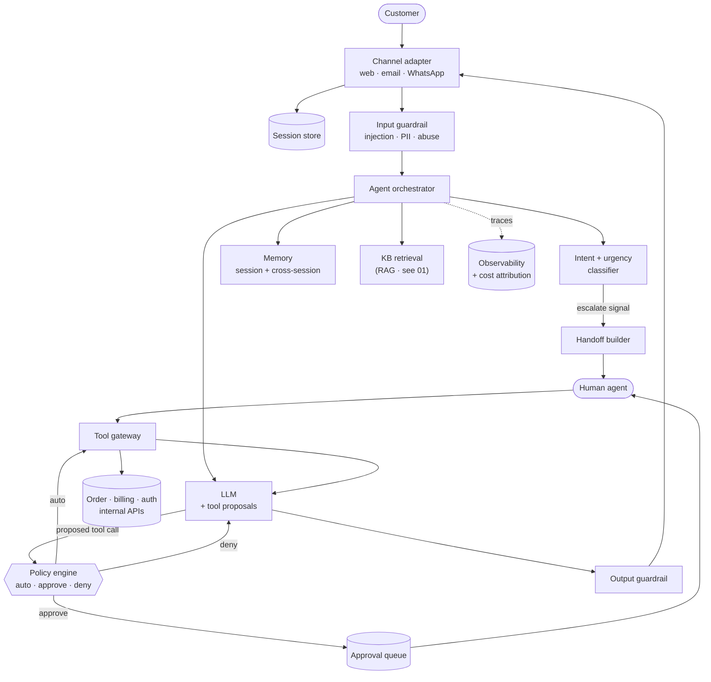

# 02 — AI-Powered Customer Support Agent

> **Prompt:** Design an AI-powered customer support agent — intent detection, tool calling, conversation memory, RAG, human handoff, guardrails, observability.

---

## The three-sentence compression

*Rehearse this before opening any other file. It is the opening answer.*

1. **The choice that matters most:** **tool privilege separation with a platform-enforced approval gate** — the agent proposes side-effecting actions but never executes them directly; a policy engine outside the agent decides whether the action auto-executes, requires human approval, or is denied. Because this agent *acts* (refunds, plan changes, credential resets), a wrong sentence is embarrassing but a wrong action is a financial and trust incident, and that asymmetry has to be structural rather than prompt-based.
2. **The alternative I rejected:** letting the agent call tools directly with the approval rule expressed in its system prompt. It's simpler and one hop faster, but a prompt is a *suggestion* — a successful injection or a plain reasoning error bypasses it, and there's no audit point. I'd revisit only for read-only tools, where I do allow direct calls.
3. **The failure mode I'd volunteer:** **silent escalation failure.** If the escalation classifier misses an angry customer or a legally-sensitive request, the agent keeps cheerfully answering while the situation compounds — and unlike a wrong answer, nobody complains to us, they churn. Hence escalation recall ≥ 0.98 is a harder target than any answer-quality metric, and I bias the classifier toward over-escalation.

---

## Architecture at a glance

**Trust boundary:** the agent runs with the *customer's* entitlements, never a service account. Tool
results and KB chunks entering the prompt are **untrusted data, never instructions**.

---

## Key numbers

| Dimension | Value |
|---|---|
| **Volume** | 20k conversations/day · ~60% repetitive |
| **Concurrency** | 500 concurrent conversations (≈8–10 QPS to the provider) |
| **First response** | p95 < 2 s (budget lands ≈ 1.76 s, ~240 ms headroom) |
| **Tool round trip** | p95 < 3 s *added* |
| **Deflection** | ≥ 50% resolved without a human — the business case |
| **Escalation recall** | **≥ 0.98** — the hardest target in the system |
| **Wrong-action rate** | < 0.1% of side-effecting calls |
| **Availability** | 99.95% |
| **Cost** | ≈ $0.039/conversation vs a $0.15 ceiling ✅ · ~$23.4k/month |

---

## The findings that matter

**1. Cost is not the constraint here — capacity is.** At ~$0.039/conversation the design sits
comfortably inside its $0.15 ceiling, and the avoided human handling cost is ~$1.2M/yr. But 500
concurrent conversations produce only ~8–10 QPS to the model, so **the binding constraints are
provider rate limits and internal tool-API capacity**, not token spend. That inverts the optimization
priority relative to [01](../01_production_rag_system/README.md), where cost dominated everything.

**2. The error costs are asymmetric, and the design must reflect that.** Three failure classes with
wildly different severity:

| Failure | Cost | Design response |
|---|---|---|
| Wrong answer | Annoying; user re-asks | Standard RAG quality gates |
| **Missed escalation** | Silent churn — nobody reports it | Escalation recall ≥ 0.98; bias toward over-escalating |
| **Wrong side-effecting action** | Financial + trust incident | Approval gate outside the agent; < 0.1% target |

Treating these as one "accuracy" number would under-protect the two that actually hurt.

**3. Prompt injection is materially more dangerous than in [01](../01_production_rag_system/README.md).**
There, a successful injection could distort an answer. Here it could **issue a refund** — and the
injection vector is wider, because customer-supplied text is adversarial by default.

---

## Files

| File | Contents |
|---|---|
| **[01_requirements.md](01_requirements.md)** | Problem & users · functional requirements · quantified NFRs · non-goals · latency budget · capacity & cost · assumptions |
| **[02_hld.md](02_hld.md)** | Architecture · component choices with rejected alternatives · data flow · NFR mapping · failure modes · 10×/100× scale plan |
| **[03_lld.md](03_lld.md)** | Schemas · API contracts · agent loop with budget caps · policy engine · sequence diagrams · conversation state machine · edge cases |
| **[04_production_and_interview.md](04_production_and_interview.md)** | AI-specific concerns · operations runbook · common mistakes · interview follow-ups · glossary |

**Shared front-matter:** [`../00_requirements_all_systems.md#2-ai-powered-customer-support-agent`](../00_requirements_all_systems.md#2-ai-powered-customer-support-agent) fixes scope and NFRs.

---

## Relationship to the other designs

| Depends on / relates to | How |
|---|---|
| [01 — RAG system](../01_production_rag_system/README.md) | The KB-answering path **is** a RAG pipeline. This design consumes it rather than restating it; read 01 first |
| [03 — Multi-agent](../00_requirements_all_systems.md#3-multi-agent-ai-system) | Deliberately **single-agent**. §2.2 explains why multi-agent isn't justified here |
| [09 — Gateway](../00_requirements_all_systems.md#9-multi-provider-llm-platform) | Provider fallback and rate-limit handling belong there, not reimplemented here |
| [10 — Enterprise platform](../00_requirements_all_systems.md#10-enterprise-ai-agent-platform) | Generalizes this design's tool/approval/audit model to any agent |
