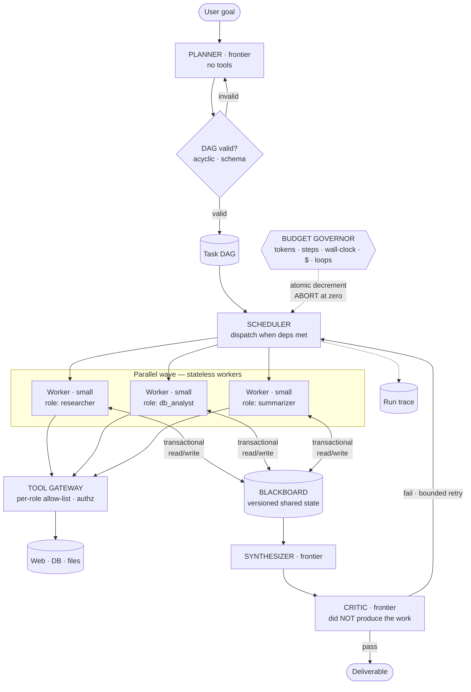

# 02 · High-Level Design — Multi-Agent System

> **Phase 2 of 4** · [← Requirements](01_requirements.md) · [LLD →](03_lld.md)

---

## 2.1 Architecture

Four roles, deliberately asymmetric in both model tier and privilege:

| Role | Tier | Count/run | Privilege | Why it exists |
|---|---|---|---|---|
| **Planner** | Frontier | 1 | No tools | Decomposition is the hard reasoning step |
| **Worker** | Small | ≤ 10 | **Narrow, per-role allow-list** | Bounded, well-specified execution |
| **Synthesizer** | Frontier | 1 | Read blackboard only | Compiling across subtasks needs reasoning |
| **Critic** | Frontier | 1 | Read blackboard only | Independent verification — must not have produced the work |

**Two structural properties worth naming:**

1. **The planner has no tools.** It only produces a plan. A planner that could also act would blur the
   boundary that makes the DAG auditable before any work happens.
2. **The budget governor gates the *scheduler*, not the workers.** A worker mid-execution cannot be
   trusted to police its own spend; the enforcement point is where work is *dispatched*.

---

## 2.2 Component choices

### Coordination — the decision that defines the system

| Concern | Choice | Why | Rejected alternative (and why not) | Revisit when |
|---|---|---|---|---|
| **Agent communication** | **Transactional blackboard** (versioned shared state) | Bounded cost, deterministic termination, replayable audit trail. Workers read what they need and write structured results | **Free-form agent-to-agent chat** — quadratic token growth, context drift, no deterministic termination, nothing to audit. *This is the version people picture and it's the trap* | Never for this task class |
| **Concurrency control** | **Optimistic (version-per-key, CAS writes)** | Writes are rare relative to reads and mostly to *different* keys; contention is low | **Pessimistic locking** — workers block each other and forfeit the parallelism we're paying for | Write contention on shared keys becomes common |
| **Plan representation** | **Explicit validated DAG** | Enables parallelism; dependencies inspectable before execution | **Implicit plan in the planner's head** (ReAct-style continuation) — unauditable, unparallelizable, unbounded | — |
| **Replanning** | Bounded — max 2 per run, **budget not extended** | Genuine new information should be usable; unbounded replanning is unbounded cost | **Unbounded replanning** — the single fastest way to an unbounded bill | — |

**Why the blackboard beats message-passing, concretely.** With *n* agents needing to share findings,
free-form chat trends toward O(n²) messages, and each message re-injects prior context — so token cost
grows super-linearly in agents. A blackboard is O(n) writes and O(n) reads, each read fetching only the
keys that agent needs. For 10 agents that's the difference between ~90 context-carrying exchanges and
~20 targeted operations.

> **Mental model:** the blackboard is a **shared job file in a filing cabinet** — contractors write
> findings in, read what they need out, and never need to be in a room together.
>
> *Where the analogy breaks:* a filing cabinet has no concurrency semantics. The blackboard needs
> versioned compare-and-set writes, because two workers finishing simultaneously and both updating a
> summary key would silently lose one result — the classic lost-update bug, and the reason
> [FR-4](01_requirements.md#execution) says "no lost updates" rather than just "shared state."

### Control

| Concern | Choice | Why | Rejected alternative | Revisit when |
|---|---|---|---|---|
| **Budget enforcement** | Governor gating dispatch; **atomic decrement** | Central, race-free, cannot be bypassed by a worker | **Per-agent self-limiting** — an agent that miscounts or is confused simply doesn't stop | Never |
| **Cap set** | **Five caps**: tokens, steps, wall-clock, dollars, loop-detection | They fail differently — see [§1.6](01_requirements.md#enforcement-mechanisms--all-required) | **Dollar cap only** — misses cheap-but-endless cycles | Never |
| **Model tiers** | Workers small; planner/synth/critic frontier | 6× cost reduction for adequate quality on bounded subtasks | **All frontier** — $0.94 vs $0.15/run. **All small** — planning quality collapses | Small-tier subtask success drops below target |
| Tool authorization | Gateway enforces **per-role allow-list** | Least privilege becomes enforceable per role — a real multi-agent dividend | **Union of all tools** — every agent gets every capability; the security benefit evaporates | Never |
| Side-effecting actions | Human approval via [02](../02_customer_support_agent/03_lld.md#the-policy-engine)'s policy engine | Reuse rather than reinvent | Bespoke gate here — divergent behaviour across products | — |

### Verification

| Concern | Choice | Why | Rejected alternative | Revisit when |
|---|---|---|---|---|
| **Critic independence** | Separate agent, **read-only blackboard**, did not produce the work | A producer re-reading its own output shares its blind spots | **Self-critique by the synthesizer** — cheaper, catches materially less | — |
| Critic trigger | **Conditional** on subtask confidence, not always-on | Recovers ~20 s of the fixed overhead capping speedup ([§1.5](01_requirements.md#15-latency-budget)) | Always-on — safer, but the overhead is what breaks the speedup NFR | Critic catch rate proves high enough to justify always-on |
| Critic authority | **Annotate + bounded retry**, not unconditional block | An always-blocking critic can prevent delivery entirely | **Hard block** — risks never returning anything ([Q3](01_requirements.md#open-questions)) | Product decides ([Q3](01_requirements.md#open-questions)) |

**Critic independence is the whole value.** A synthesizer asked to check its own memo tends to confirm
it — the same context that produced an error makes the error look correct. A critic reading only the
blackboard evidence and the final claims can find the claim that no gathered evidence supports.

---

## 2.3 Data flow

### A run, end to end

1. **Goal submitted.** Run row created; budget allocated (tokens, $5 ceiling, 50 steps, 10-min
   deadline).
2. **Planner call** (frontier, no tools) → proposed DAG: subtasks with `role`, `inputs`,
   `depends_on`, `expected_output_schema`.
3. **Validation** — deterministic: acyclicity, schema conformance, subtask count ≤ 10, every role
   known. **Invalid → one replan attempt, then abort.** A cycle here is an infinite loop with a bill.
4. **Scheduler loop.** Repeat until DAG complete or a cap trips:
   - Ask the **governor** for permission (atomic decrement). Denied → abort with partials.
   - Select all subtasks whose dependencies are satisfied → dispatch **in parallel**.
5. **Worker executes.** Reads only its declared blackboard inputs; calls tools **only from its role's
   allow-list**; writes a structured result via compare-and-set.
6. **Failure handling.** Transient → retry ≤ 2 with backoff, *without* restarting the run. Permanent →
   mark failed; the DAG continues if downstream subtasks can proceed without it.
7. **Synthesis** once all reachable subtasks terminate. Reads the blackboard, produces the deliverable
   **with per-claim attribution to the producing subtask**.
8. **Critic** (if triggered): reads blackboard evidence + deliverable, flags unsupported claims.
   Bounded retry of affected subtasks, or annotate and deliver.
9. **Return** deliverable + run trace + cost. Partial results returned if a cap tripped
   ([Q1](01_requirements.md#open-questions)).

**Step 3 is the cheapest high-value step in the system** — deterministic validation costing ~50 ms that
prevents the most expensive failure mode.

---

## 2.4 NFR mapping

| NFR | Target | Delivered by |
|---|---|---|
| E2E p95 < 5 min | 5 min | Parallel waves · small-tier workers (faster) · conditional critic |
| **Parallel speedup ≥ 2×** *(relaxed from 3× — see [§1.5](01_requirements.md#the-speedup-that-justifies-the-architecture))* | 2× | DAG-driven scheduling · stateless workers · dispatch < 100 ms |
| Cost ≤ $2.00, abort $5.00 | — | Tier split ($0.15/run) · five caps · loop detection |
| Step cap ≤ 50 | 50 | Governor atomic counter |
| Task success ≥ 0.80 | — | Structured subtask schemas · retry · critic |
| **Plan determinism** | — | Single planner call, fixed prompt, `temperature=0`, pinned model version |
| State isolation | no lost updates | Versioned CAS writes on the blackboard |
| Availability 99.9% | — | Async · idempotent subtask retry · run resumable from the blackboard |
| Least privilege | — | Per-role tool allow-lists enforced at the gateway |
| Full traceability | — | Plan, every step, tool call, cost, and governor decision recorded |

---

## 2.5 Failure modes & blast radius

| # | Failure | Detection | Blast radius | Mitigation & degraded mode |
|---|---|---|---|---|
| **F1** | **Planner emits a cyclic DAG** | Deterministic validation | One run | Reject → one replan → abort. **Never execute an unvalidated plan** |
| **F2** | **Replanning loop** | Replan counter | One run, **unbounded cost if uncapped** | Max 2 replans; **budget is not extended by a replan** |
| **F3** | Worker stuck retrying one approach | Loop detection `(agent, tool, args_hash)` × 3 | One subtask | Mark failed; continue the DAG; report in the trace |
| **F4** | **Lost update on the blackboard** | Version mismatch on CAS | **Silent data loss** | Optimistic concurrency; retry-on-conflict; **never last-write-wins on a shared key** |
| **F5** | One subtask fails permanently | Subtask status | Downstream subtasks | Continue reachable work; synthesize partials; **state the gap in the deliverable** |
| **F6** | **Provider rate limit during a parallel wave** | 429 rate | The whole wave | Client-side shaping · stagger dispatch within a wave · exponential backoff. *Burstiness is the real capacity risk ([§1.6](01_requirements.md#throughput))* |
| **F7** | Wall-clock cap hit mid-wave | Deadline | One run | Abort in-flight; synthesize whatever completed; label the output partial |
| **F8** | Critic always fails the deliverable | Critic pass rate | All runs — **nothing ever delivers** | Bounded retries then annotate-and-deliver; alert on pass rate < 50% |
| **F9** | Worker exceeds its tool allow-list | Gateway rejection | Attempted call, **blocked** | Gateway is authoritative; rejection is a security signal, not a bug to route around |
| **F10** | **Injected content in a fetched page redirects an agent** | Anomalous tool calls; gateway denials | One subtask | Fetched content is **untrusted data**; allow-lists bound the damage; side effects need approval |
| **F11** | Blackboard unavailable | Health check | All in-flight runs | Runs pause and resume — the blackboard *is* the run state, so nothing is lost |
| **F12** | Two subtasks reach contradictory conclusions | Synthesizer detects conflict | One deliverable | **Surface both with attribution**; do not silently pick ([Q2](01_requirements.md#open-questions)) |

**On F2, because it's the one I'd volunteer.** Every other failure here is bounded by something. A
replanning loop is the one that can spend arbitrarily much: the planner replans, work proceeds, new
information triggers another replan, and each cycle looks locally reasonable. The controls are a hard
replan cap **and** the rule that **a replan does not extend the budget** — without that second rule, a
replan cap alone still permits a run to consume the full budget twice over.

**On F4, because it's silent.** Two workers finishing simultaneously and both updating a shared summary
key will, under last-write-wins, lose one result with no error. The run completes, the deliverable is
missing a competitor, and nothing anywhere indicates a problem. Versioned CAS writes turn that into a
retryable conflict.

---

## 2.6 Scale plan

### 10× (5,000 runs/day, 200 concurrent runs)

| # | Bottleneck | Why | Change |
|---|---|---|---|
| 1 | **Provider rate limits** | 200 concurrent runs × 5-wide waves ⇒ 1,000-call bursts | Multi-provider routing via [09](../00_requirements_all_systems.md#9-multi-provider-llm-platform) · global dispatch shaping · **queue waves rather than firing them** |
| 2 | **Blackboard write contention** | More concurrent runs on shared keys | Partition by `run_id` (runs never share state) · move hot aggregates to per-worker keys merged at synthesis |
| 3 | Scheduler | Central dispatch loop | Shard schedulers by `run_id`; the DAG is per-run so no coordination needed |
| 4 | Cost | ~$750/day | Comfortable; keep per-tenant attribution |
| 5 | Frontier-tier capacity | 5k runs × 4 frontier calls = 20k/day | Conditional critic reduces this ~25% |

**Bottleneck 1 is inherent to the architecture.** Parallel waves *are* synchronized bursts — the thing
that buys speedup is the thing that trips rate limiters. Fixing it means deliberately staggering
dispatch within a wave, which trades a little wall-clock for a lot of reliability.

### 100× (50,000 runs/day)

| Concern | Change |
|---|---|
| Planning | Cache plans for recurring goal *shapes*; a planner call per run stops being justifiable |
| Workers | Dedicated pools per role, autoscaled on queue depth |
| Blackboard | Purpose-built store (partitioned KV with CAS) rather than a general database |
| Scheduling | Distributed workflow engine (Temporal-class) rather than a bespoke loop |
| Critic | Sampled rather than conditional — statistical quality assurance |
| Org | Planner, execution, and verification become separately-owned services |

### What does *not* change

- **Validate the DAG before executing it.** Cheapest high-value step at any scale.
- **The governor gates dispatch**, never self-policing agents.
- **Five caps, not one.**
- **Blackboard over free-form chat.**
- **The critic never produced the work it reviews.**
- **A replan does not extend the budget.**

---

## 2.7 Tech stack

> Shared substrate and the reasoning behind it: [`../00_tech_stack.md`](../00_tech_stack.md). This section
> carries only what is **specific to this system**.

| Layer | Choice | Rejected | Why | Revisit when |
|---|---|---|---|---|
| **Shared state** | **Redis 7 with Lua compare-and-set** on a blackboard | Free-form agent-to-agent chat | Chat is `O(n²)` messages and unbounded token cost. **CAS on a structured blackboard makes concurrent writes safe and the state auditable** | Never — this is the design |
| **DAG execution** | **Temporal** — one workflow per plan, activities per subtask | Airflow, Prefect | The DAG is generated per request, not scheduled. Airflow's model is inverted for this | Plans become static and few |
| **Budget enforcement** | **Redis Lua** — steps, tokens, wall-clock, dollars, depth in one atomic check | Per-agent self-limiting | Cost is multiplicative; a limit an agent enforces on itself is a suggestion | Never |
| Worker tier | **Small-tier models for executors**, frontier for the planner only | Frontier throughout | The cost explosion is in the fan-out, not the plan ([§1.6](01_requirements.md#16-capacity--cost-estimation)) | Executor quality proves inadequate on measurement |
| Message transport | **Temporal activities**, not a broker | Kafka between agents | Agents don't need durable pub/sub; they need typed calls with retries and timeouts | Agents become long-lived services rather than per-request activities |
| Trace store | **PostgreSQL** + OpenTelemetry spans, one trace per plan | Logs | Debugging a 10-subtask DAG without a trace tree is guesswork | — |
| Result assembly | Deterministic reducer in Python, **LLM synthesis only at the end** | An LLM merging at every join | Every merge is a multiplicative cost, and most merges are structural | — |
| Framework | **Plain Python + Temporal SDK** | CrewAI / AutoGen / LangGraph | The orchestration logic *is* the product here — the budget caps and CAS semantics are exactly what a framework abstracts away | Prototyping only |

**Rejecting agent-to-agent chat is the whole architecture, and Redis Lua is how it's enforced.** Free-form
messaging looks flexible and produces `O(n²)` traffic where every message is billed tokens, with no
serialization point to audit. A blackboard with compare-and-set gives one place where state changes, one
place to log, and a real answer to two agents writing the same key.

**The framework rejection is deliberate and worth stating plainly.** CrewAI and AutoGen abstract
orchestration; orchestration is what this system exists to get right. **The five budget caps and the CAS
protocol are not incidental plumbing — they're the reason the design is safe**, and handing them to a
framework means owning the failure without owning the code.

---

**Next:** [03_lld.md →](03_lld.md) — DAG and blackboard schemas, the scheduler and governor algorithms, sequence diagrams including a tripped cap, run/task state machines, and edge cases.
